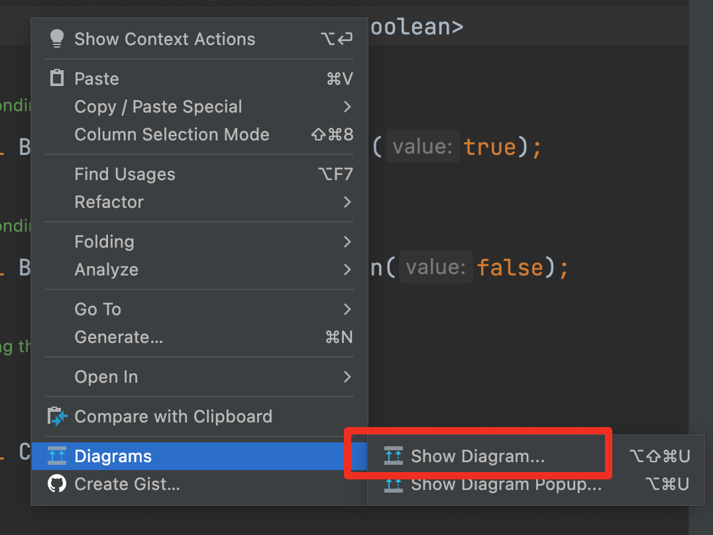

# 包装类

1. 针对八种基本定义相应的引用类型——包装类

2. 有了类的特点，就可以调用类中的方法


| 基本数据类型 | 包装类    |
| ------------ | --------- |
| boolean      | Boolean   |
| char         | Character |
| byte         | Byte      |
| short        | Short     |
| int          | Integer   |
| long         | Long      |
| float        | Float     |
| double       | Double    |


## 查看关系图

查看关系图

（代码界面ctrl+b / cmd+b )



### Boolean


### Character


### Byte/Long/Integer/Short/Double/Float


## 包装类和基本数据类型的转换

1. jdk5之前的手动装箱和拆箱方式，装箱：基本类型->包装类型，反之，拆箱
2. jdk5及之后，自动装箱和拆箱
3. 自动装箱底层调用的是valueOf方法，比如Integer.valueOf()


### 装箱和拆箱

```JAVA
//演示int 到 Integer的装箱和拆箱
//jdk5之前
//手动装箱
int n1 = 100;
Integer integer = new Integer(n1);
Integer integer1 = Integer.valueOf(n1);

//手动拆箱
//Integer 到 int
int i = integer.intValue();

//jdk5后，自动装箱
int n2 = 200;
Integer integer2 = n2; //底层使用的是 Integer.valueOf();
//自动拆箱
int n3 = integer2;//底层使用的还是integer2.intValue();
```


注意一个小细节

```JAVA
Object obj1 = true ? new Integer(1) : new Double(2.0);
Object obj2;
if(true){
	obj2 = new Integer(1);
}else{
	obj2 = new Double(2.0);
}
```

注意 第一个obj1 是 Double类的1.0，因为三元运算符是一个整体，返回值也是唯一类型

第二个obj2 是 Int类的1 因为if里都是单独的语句，分别叫计算


### 转String

```Java
Integer i = 100
String str1 = i + ""; // 方法1
String str2 = i.toString();
String str3 = String.valueOf(i);
```


### String转包装类

```JAVA
String str4 = "1234";
Integer i2 = Integer.parseInt(str4); // 自动装箱
Integer i3 = new Integer(str4); // 构造器
```


## 常用方法

点击这个可看到所有方法


**Integer和Character常用的**

| 方法名                      | 作用           |
| --------------------------- | -------------- |
| Integer.MIN_VALUE           | 返回最小值     |
| Integer.MAX_VALUE           | 返回最大值     |
| Character.isDigit('a')      | 判断是不是数字 |
| Character.isLetter('a')     | 判断是不是字母 |
| Character.isUpperCase('a')  | 判断是不是大写 |
| Character.isLowerCase('a')  | 判断是不是小写 |
| Character.isWhitespace('a') | 判断是不是空格 |
| Character.toUpperCase('a')  | 转大写         |
| Character.toLowerCase('a')  | 转小写         |


# Integer创建机制

```JAVA
Integer i = new Integer(1);
Integer j = new Integer(1);
System.out.println(i == j); //false 因为不是同一个对象

Integer m = 1; //valueOf(1)自动装箱
Integer n = 1;
System.out.println(m == n); //看下图 因为valueOf是在缓存里直接取，返回true

Integer x = 1; //valueOf(1)自动装箱
Integer y = 1;
System.out.println(x == y); //看下图 因为超过了缓存，返回new的对象，所以返回false
```

**这里就要看valueOf的源码**

```JAVA
/*
		Returns an Integer instance representing the specified int value. If a new Integer instance is not required, this method should generally be used in preference to the constructor Integer(int), as this method is likely to yield significantly better space and time performance by caching frequently requested values. This method will always cache values in the range -128 to 127, inclusive, and may cache other values outside of this range.
		返回一个代表指定int值的Integer实例。如果不需要一个新的Integer实例，通常应该优先使用这个方法而不是构造函数Integer(int)，因为这个方法通过缓存经常被请求的值，可能会产生明显更好的空间和时间性能。这个方法将始终缓存-128到127（包括）范围内的值，并可能缓存这个范围以外的其他值。
		*/

public static Integer valueOf(int i) {
        if (i >= IntegerCache.low && i <= IntegerCache.high)
            return IntegerCache.cache[i + (-IntegerCache.low)];
        return new Integer(i);
    }
```

这个缓存在类加载的时候就创建好了

只要有基本数据类型，==判断的就是值是否相等，如下所示

```JAVA
Integer i11 = 127
int i12 = 127
System.out.println(i11 == i12) //返回true
  
Integer i13 = 128
int i14 = 128
System.out.println(i13 == i14) //返回true
```

