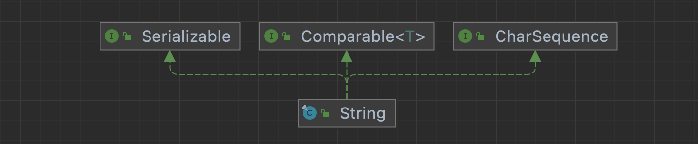
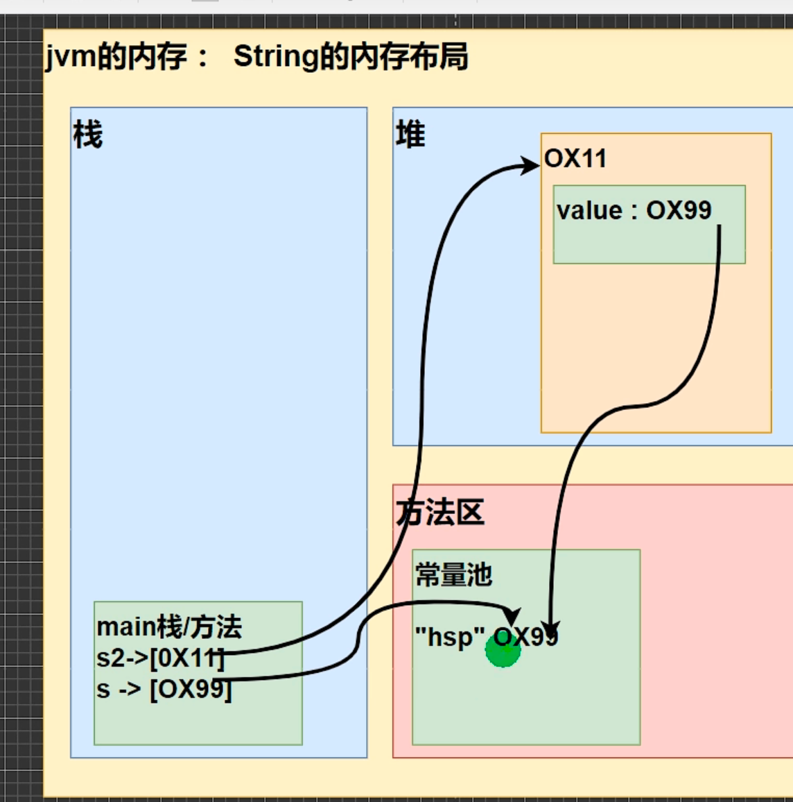
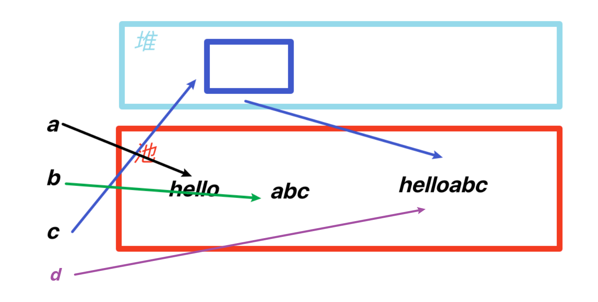
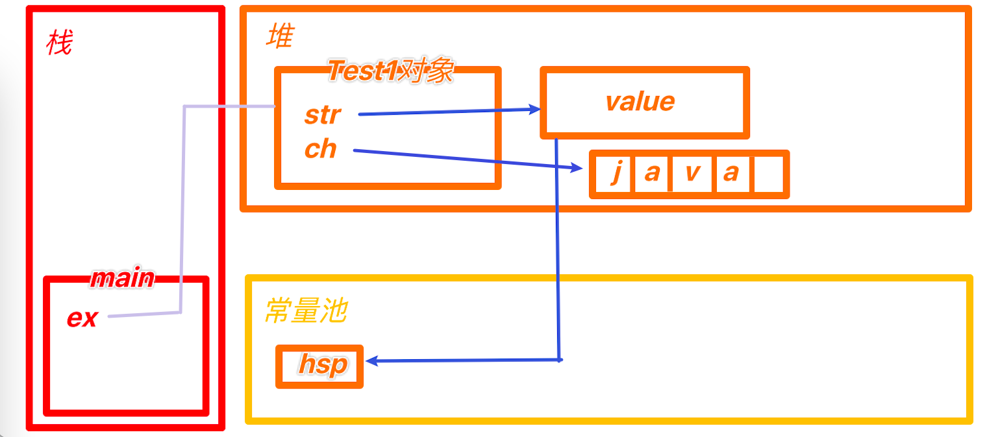
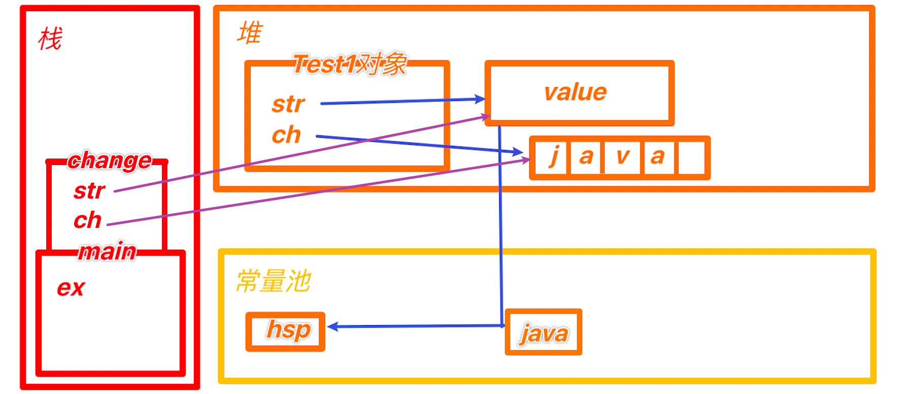
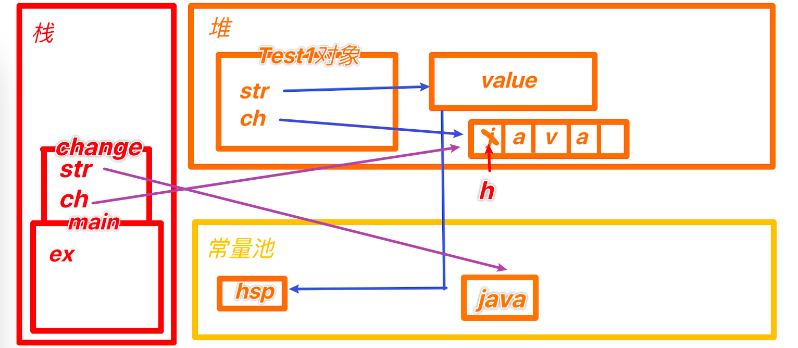
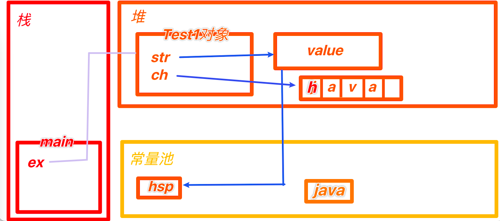

# String类

## 理解

1. String对象用于保存字符串，也就是一组字符序列
2. 字符串常量对象是用双引号括起的字符序列
3. 字符串的字符使用Unicode字符编码，一个字符占两个字节
4. 有很多构造器，实现了构造器的重载

5. String类实现了 Serializable 说明可以串行化
6. String类实现了 Comparable 说明可以比较
7. String类是个final类，不能被其他类继承
8. String有属性，private final char value[] 用于存储字符串内容
9. 一定要注意：value是一个final类型，一旦被赋值就不能被更改（指向存储空间地址唯一，单独的内容改变允许的）


## 常用构造器

```Java
String s1 = new String();
String s2 = new String(String original);
String s3 = new String(char[] a);
String s4 = new String(char[] a, int startIndex, int count);
String s5 = new String(byte[] b);
```


## 结构



继承

Serializable：可串行化的，有利于在网络上传输

Comparable：可比较大小

CharSequence：字符序列


# String构造的两种方式

```JAVA
String s = "hsp" // 第一种
String s2 = new String("hsp"); // 第二种
```

第一种方式：先从常量池查看是否有hsp数据空间，如果有，直接指向。如果没有则重新创建，然后指向，s最终指向的是常量池的空间地址

第二种方式：现在堆中创建空间，里面维护了value属性，指向常量池hsp空间，如果常量池没有，则重新创建，如果有，则通过value直接指向



## String.intern()

```Java
String a = "hsp"; // a指向常量池的hsp
String b = new String("hsp"); // 指向堆中的对象，对象的value再指向常量池
System.out.println(a.equals(b)); //比较字符串内容，为true
System.out.println(a == b); //一个指常量池，一个指堆的对象，地址不一样 false
System.out.println(a==b.intern()); // b.intern()返回b的value中指向的常量池 true
System.out.println(b==b.intern()); // 一个指向堆的对象，一个指向常量池字符串 false
```


# 字符串特性

## **案例1**

```
String a = "hello" + "abc"
```

创建了几个对象？

答案：创建了1个对象，编译器会优化，直接生成"helloabc"。


**分析**

1. 编译器不傻，会做一个优化，判断创建的常量池对象，是否有引用指向。
2. String a = "hello" + "abc" => String a = "helloabc"


## **案例2**

```
String a = "hello";
String b = "abc";
String c = a+b;
```

创建了几个对象？

答案：三个


**分析**

String c = a + b通过源码分析：

1. 先new StringBuilder。 StringBuilder sb = StringBuilder();

2. 执行 sb.append("hello");  return
3. 再执行 sb.append("abc"); return
4. sb.toString() 会把之前的 返回一个字符串返回给 c

5. 最终c 指向堆中的一个对象String, String的value[] 指向池中的 "helloabc"

   

也就是说 如果再执行

```
String a = "hello";
String b = "abc";
String c = a+b;
String d = "helloabc"；
System.out.print(c == d);
```

输出的结果为false




**总结规则：**

String c1 = "ab" + "cd" 常量相加，看的是池

String c1 = a + b  变量相加，看的是堆


## 综合案例

```java
public class Test1{
	String str = new String("hsp");
  final char[] ch = {'j', 'a', 'v', 'a'}
  public void change(String str, char ch[]){
    str = "java";
    ch[0] = 'h';
  }
  
  public static void main(String[] args){
    Test1 ex = new Test1();
    ex.change(ex.str, ex.ch);
    System.out.print(ex.str + " and " );
    System.out.println(ex.ch);
  }
}
```

1. Test1 ex = new Test1();



2. ex.change(ex.str, ex.ch)



3. 进入ex方法：

    str = "java"; //一旦重新赋值 指向就会发生变化 注意 这里的str是方法体里的形参str，不是对象里的
    ch[0] = 'h'; // ch是引用类型



4. 方法返回，出栈



    System.out.print(ex.str + " and " );
    System.out.println(ex.ch);

输出 hsp and hava


# String类的常见方法

| 方法             | 作用                                                         |
| ---------------- | ------------------------------------------------------------ |
| equals           | 区分大小写，判断内容是否相等                                 |
| equalslgnoreCase | 忽略大小写，判断内容是否相等                                 |
| length           | 获取字符个数。字符串长度                                     |
| indexOf          | 获取字符在字符串中第1次出现的索引，索引从0开始，找不到返回-1 |
| lastIndexOf      | 获取字符在字符串中最后1次出现的索引，索引从0开始，找不到返回-1 |
| substring        | 截取指定范围的子串                                           |
| trim             | 去前后空格                                                   |
| charAt           | 获取某索引处的字符，注意不能使用Str(index)的方式             |
| toUpperCase      | 字符串全转换成大写                                           |
| toLowerCase      | 字符串全转换成小写                                           |
| concat           | 拼接字符串                                                   |
| replace          | 替换字符串中的内容，并返回                                   |
| split            | 分隔字符串，指定分隔符                                       |
| compareTo        | 比较字符串大小，按照字典顺序。两者不等长，返回前减后长度差。等长返回最后一个字符askII差值。完全相等返回0。 |
| toCharArray      | 转成字符数组 String -> Char[]                                |
| format           | 格式化字符串                                                 |


## **format用法案例**

```Java
String name = "john";
int age = 18;
double score = 98.3/3;
char gender = '男';
String info = String.format("我的姓名是%s，我的年龄是%d，我的成绩是%.d2f，性别是%c，希望大家稀饭我", name, score, gender);
```

%s %d %.2f %c 称为占位符，占位符由后面的变量替换

| 占位符 | 替换类型                                      |
| ------ | --------------------------------------------- |
| %s     | 字符串                                        |
| %d     | 整数                                          |
| %.2f   | 小数，保留小数点后2位，并且进行四舍五入的处理 |
| %c     | 字符类型                                      |


