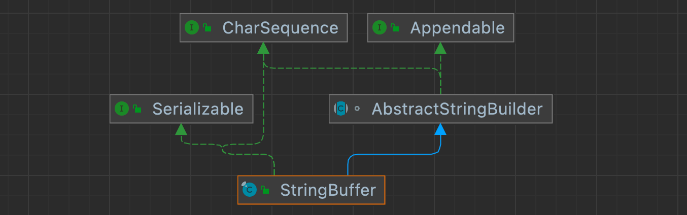
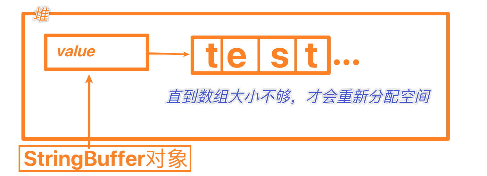
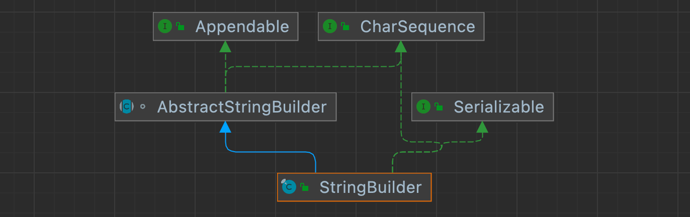

# StringBuffer

​		String类是保存字符串常量的，每次更新都要重新开辟空间，效率较低。因此java设计者还提供了StringBuilder和StringBuffer来增强String的功能

​		java.lang.StringBuffer代表可变字符序列，可以对字符串内容进行增删

​		很多方法与String相同，但StringBuffer是可变长度的

## 结构



1. StringBuffer的直接父类是AbstractStringBuilder
2. StringBuffer实现了Serializable接口，StringBuffer对象可以串行化
3. StringBuffer的父类AbstractStringBuilder有属性char[] value，存放字符，不是final类型的，因此存放在堆中。
4. StringBuffer是final类的，因此不能被继承。
5. 因为StringBuffer字符序列是存在char[] value 所以在变化的时候（增加或删除），不用每次都更换地址或重新创建新的对象，所以效率高于String


**String VS StringBuffer**

1. String保存的是字符串常量，里面的值不可更改，每次String类的更新实际上就是更改地址，效率低下

2. StringBuffer的更新实际上可以更新内容，不用更新地址，效率较高，有缓冲机制

   


## 构造器

| 构造方法                          | 使用                                                     |
| --------------------------------- | -------------------------------------------------------- |
| StringBuffer ()                   | 构造一个不带字符的缓冲区，初始大小为16                   |
| StringBuffer ( CharSequence seq ) | 构造一个字符串缓冲区，它包含指定的CharSequence相同的字符 |
| StringBuffer ( int capacity )     | 构造一个不带字符的缓冲区，大小为capacity                 |
| StringBuffer ( String str )       | 构造一个字符串缓冲区，大小为str字符串长度+16             |


## Str和StrBuffer互相转换

1. String -> StringBuffer

   ```JAVA
   String str = "HelloTom";
   //1.使用构造器，返回的才是strBuffer对象
   StringBuffer stringBuffer = new StringBuffer(str); 
   //2.使用无参构造器，并使用append进行添加
   StringBuffer stringBuffer1 = new StringBuffer();
   stringBuffer1.append(str);
   ```

2. StringBuffer -> String

   ```Java
   StringBuffer stringBuffer = new StringBuffer("test"); 
   //1.使用自带toString方法
   String s = stringBuffer.toString();
   //2.使用构造器来搞定
   String s1 = new String(stringBuffer)
   ```


## 常用方法

| 方法名     | 作用                                         |
| ---------- | -------------------------------------------- |
| append()   | 追加字符串，返回还是StringBuffer             |
| toString() | 把当前内容 创建新字符串返回                  |
| delete()   | 删除字符 前闭后开                            |
| replace()  | 替换索引 前闭后开范围内的字符，为新的字符    |
| indexOf()  | 查找指定子串在字符串中第一次出现的索引       |
| insert()   | 在索引的位置插入一段字符串，索引之后部分后移 |
| length()   | 返回长度                                     |


## 特性

```Java
String str = null;
//1.
StringBuffer sb = new StringBuffer();
sb.append(str);  //看源码发现，底层调用的是AbstractStringBuilderd的AppendNull方法
System.Out.println(sb); //输出"null";
//2.
StringBuffer sb1 = new StringBuffer(str); //直接抛出空指针异常，因为无法获取str的长度
```


# StringBuilder

1. 一个可变的字符序列，此类提供一个与StringBuffer兼容的API，但不保证同步（不是线程安全）。该类用作StringBuffer的一个简易替换，用在字符串缓冲区被单个线程使用的时候。如果可能，建议优先采用该类，因为在大部分情况下，他比StringBuffer快。

2. 在String Builder上的主要操作是append和insert方法，可重载这些方法，以接收任意类型的数据。


## 结构




## 源码剖析

1. StringBuilder的直接父类是AbstractStringBuilder
2. StringBuilder实现了Serializable接口，StringBuilder对象可以串行化，可以网络传输，也可以保存到文件
3. StringBuilder的父类AbstractStringBuilder有属性char[] value，存放字符，不是final类型的，因此存放在堆中。
4. StringBuilder是final类的，因此不能被继承。
5. StringBuilder的所有方法没有做互斥的处理，即没有synchronized关键词，因此在单线程的情况下使用。


## 对比

1. StingBuilder和StringBuffer类似，均可代表可变的字符序列，而且方法也一样。

2. String：可变字符序列，效率低，但是**复用率高**

3. StringBuffer：可变字符序列，效率高（增删），**多线程**，

4. StringBuilder：可变字符序列，**效率最高**，线程不安全

5. String注意事项：如果对String做大量修改，不要使用String。因为会有大量残留副本留在内存中。如果修改很少可用，比如配置信息。

   

