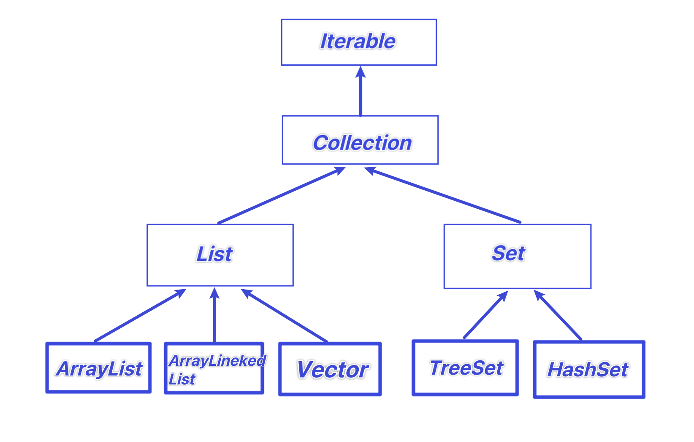
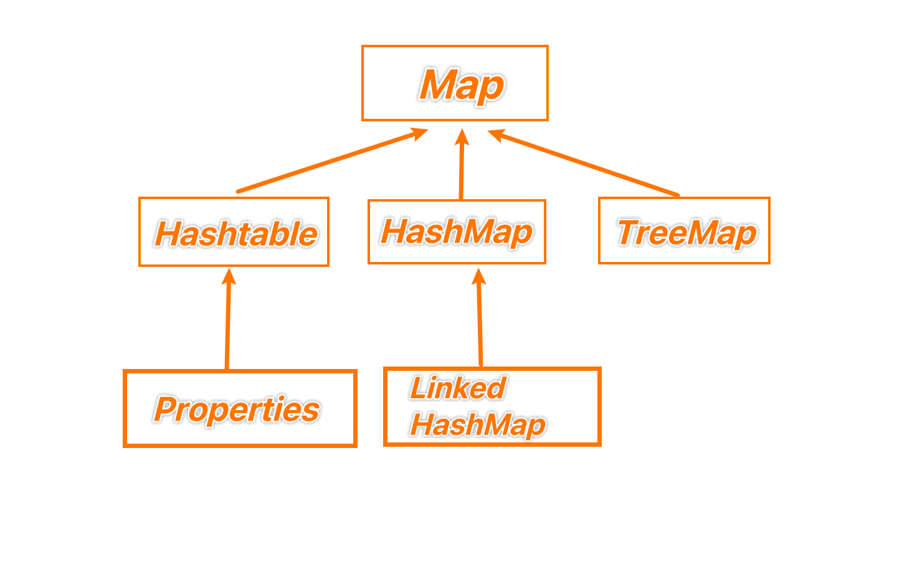

# 集合

## 好处

先看看数组的不足吧家人们

1. 长度开始时必须指定，而且一旦指定，不能更改
2. 保存的必须为同一类型的元素
3. 使用数组进行增加元素比较麻烦（超出数组添加的话，先新创数组，再拷贝数组）


集合的好处

1. 可以动态保存任何多个对象，比较方便
2. 提供了一系列方便的操作对象的方法
3. 使用集合添加，删除新元素非常简单


## 框架体系

1. 集合主要分两组：单列集合、双列集合
2. Collection接口有两个重要的子接口：List和Set，他们的实现子类都是单列的集合
3. Map接口实现子类 是双列集合，存放的是K- V对
4. 下面那两张图要记住

### 单列集合



### 双列集合




# Collection

## 特点

Collection接口实现类的特点

```
public interface Collection<E> extends Iterable<E>
```


1. collection实现子类可以存放多个元素
2. 有些Collection的实现类，可以存放重复的元素，有些不可以
3. 有些Collection的实现类，有些是有序的，有些不是有序的
4. Collection接口没有直接的实现子类，是通过它的子接口Set和List来实现的


# List

## 常用方法

| 方法        | 作用                                     |
| ----------- | ---------------------------------------- |
| add         | 添加单个元素                             |
| remove      | 删除指定元素                             |
| set         | 修改指定元素                             |
| contains    | 查找元素是否存在                         |
| size        | 获取元素个数                             |
| isEmpty     | 判断是否为空                             |
| clear       | 清空                                     |
| addAll      | 添加多个元素（传入另一个list）           |
| containsAll | 查找多个元素是否都存在（传入另一个list） |
| removeAll   | 删除多个元素（传入另一个list）           |


## 案例

```Java
List list = new ArrayList();
list.add("jack");
list.add(10);
list.add(true);
System.out.println(list)
```


## 遍历方式

1. 迭代器

```
Iterator iterator = list.iterator();
while(iterator.hasNext()){
	Object next = iterator.next();
	System.out.println(next);
}
```


2. 增强for

```
for(Object o : col){

}
```


3. 普通for

```
for（int i = 0 ; i < list.size() ; i++){
	Object object = list.get(i);
	System.out.println(object);
}
```


# ArrayList底层结构

## 注意事项

1. 可以添加null值，并且可以添加多个
2. ArrayList底层是由数组实现的
3. ArrayList基本等同于Vector，除了ArrayList是线程不安全的（执行效率高）。多线程情况下不建议使用ArrayList


## 底层机制

1. ArrayList中维护了一个Object类型的数组elementData

   transient Object[] elementData;   (transient:表示该属性不会被序列化)

2. 当创建ArrayList对象时，如果使用无参数构造器，初始elementData容量为0，第1次添加，则扩容elementData为10，再次扩容，会扩容为1.5倍

3. 如果使用的是指定大小的构造器，则初始elementData容量为指定大小，如果需要扩容，则直接扩容1.5倍

 

**上源码**

```Java
1. public boolean add(E e) {
  ensureCapacityInternal(size + 1);  // 在此检查是否需要扩容 跳转2
  elementData[size++] = e; //添加元素
  return true;
}

2. private void ensureExplicitCapacity(int minCapacity) {
  modCount++;

  // overflow-conscious code
  if (minCapacity - elementData.length > 0) //最小需要容量和实际大小判断
    grow(minCapacity); // 容量不足，进行扩容，跳3
}

 3. private void grow(int minCapacity) {
   // overflow-conscious code
   int oldCapacity = elementData.length; //此时长度
   int newCapacity = oldCapacity + (oldCapacity >> 1); //计算新长度=老长度+老长度/2，也就是1.5倍
   if (newCapacity - minCapacity < 0) //如果新值比老值小，无需扩容，新值还是改为老值
     newCapacity = minCapacity;
   if (newCapacity - MAX_ARRAY_SIZE > 0)//如果新值大于数组最大大小，走hugeCapacity 跳转4
     newCapacity = hugeCapacity(minCapacity);
   // minCapacity is usually close to size, so this is a win:
   elementData = Arrays.copyOf(elementData, newCapacity);  //扩容使用的是Arrays.copyof，保证原数据，增加空间
 }

4. private static int hugeCapacity(int minCapacity) {
  if (minCapacity < 0) // overflow 最小值是否小于0，报错
    throw new OutOfMemoryError();
  return (minCapacity > MAX_ARRAY_SIZE) ? //如果最小值比数组最大值常量要大，直接返回Integer最大值
    Integer.MAX_VALUE :
  MAX_ARRAY_SIZE;
}
```

初始elementData容量为0，第1次添加，则扩容elementData为10

DEFAULTCAPACITY_EMPTY_ELEMENTDATA = {}

DEFAULT_CAPACITY = 10

```Java
private static int calculateCapacity(Object[] elementData, int minCapacity) {
  if (elementData == DEFAULTCAPACITY_EMPTY_ELEMENTDATA) {
    return Math.max(DEFAULT_CAPACITY, minCapacity);
  }
  return minCapacity;
}
```


# Vector底层结构

1. Vector底层也是一个对象数组

   protected Object[] elementData

2. Vector是线程同步的，即线程安全，vector类的操作方法带有synchronized

3. 在开发中，如果考虑线程安全，优先使用Vector


## 底层机制

1. new Vector() 默认参数为10
2. 


## 与ArrayList的比较

|           | 底层结构 | 版本   | 线程安全(同步)效率 | 扩容倍数                               |
| --------- | -------- | ------ | ------------------ | -------------------------------------- |
| ArrayList | 可变数组 | jdk1.2 | 不安全，效率高     | 如果有参数1.5倍。如果无参先10后1.5倍扩 |
| Vector    | 可变数组 | jdk1.0 | 安全，效率不高     | 如果有参数2倍。如果是无参先10后2倍扩   |


# LinkedList

1. LinkedList底层实现了双向链表和双端队列特点
2. 可以添加任意元素，包括null
3. 线程不安全，没有实现同步


## 底层机制

| 字段  | 类型     | 解释     |
| ----- | -------- | -------- |
| size  | int      | 元素大小 |
| first | Node\<E> | 头节点   |
| last  | Node\<E> | 尾节点   |


1. LinkedList底层维护了一个双向链表
2. LinkedList中维护了两个属性first和last分别指向首节点和尾节点
3. 每个节点Node对象 维护了prev、next、item三个属性
4. 所以LinkedList的元素的添加和删除，不是通过数组完成的，相对来说效率较高
5. 模拟一个简单的双向链表


## 方法

| 方法名 | 作用                    |
| ------ | ----------------------- |
| add    | 添加元素                |
| remove | 删除元素                |
| set    | 传入位置与新值 修改元素 |
| get    | 获得元素                |


## 源码分析

1. LinkedList linked list = new LinkedList();

2. 这时linkedList属性的first和last都是null

3. 执行 添加 

   ```JAVA
   public boolean add(E e){
   	linkLast(e);
   	return true;
   }
   ```

   

4. 将新的节点，加入到双向链表的最后

   ```JAVA
   void linkLast(E e){
     final Node<E> l = last; //此节点的前一个节点
     final Node<E> newNode = new Node<>(l, e, null); //创建新节点
     last = newNode;  //最后一个节点指向自己
     if(l == null){ //如果此节点的前一个节点为空
       first = newNode; // 头节点，首节点指向自己
     }else{
       l.next = newNode;// 不是头节点，上一个节点的下一个指向自己
     }
     size++; +
     modCount++;//计数器
       
   }
   ```

   First = newNode last = newNode   newNode = {prev = null, next = null}
   
   

5. 删除节点

   ```Java
   E unlink(Node<E> x) {
     // assert x != null;
     final E element = x.item;
     final Node<E> next = x.next; //当前节点的下一个节点
     final Node<E> prev = x.prev; //当前节点上一个节点
   
     if (prev == null) { //如果我没前节点
       first = next; //下一个节点作为第一个
     } else {
       prev.next = next; //上一个节点的下一个 变成我的下一个
       x.prev = null;  //我的上一个节点置空
     }
   
     if (next == null) { //如果我没后节点
       last = prev;  //我的前一个作为最后一个节点
     } else {
       next.prev = prev;  //下一个节点的前节点 改成我的前节点
       x.next = null;  //我的下一个节点置空
     }
   
     x.item = null;  //当前节点内容清空，方便垃圾回收
     size--;
     modCount++;
     return element;
   }
   ```


# 如何选择

|            | 底层结构 | 增删的效率        | 改查的效率 |
| ---------- | -------- | ----------------- | ---------- |
| ArrayList  | 可变数组 | 较低/数组扩容     | 较高       |
| LinkedList | 双向链表 | 较高/通过链表追加 | 较低       |

1. 如果改查的操作多，选择ArrayList
2. 如果增删的操作多，选择LinkedList
3. 一般来说，程序中绝大部分都是查询，因此大部分时间选用ArrayList
