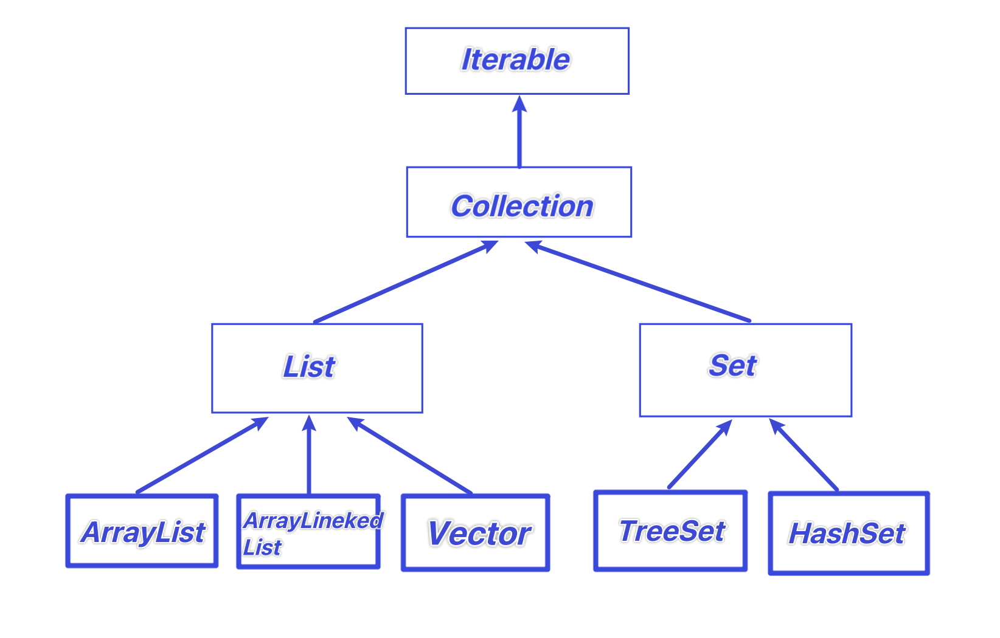
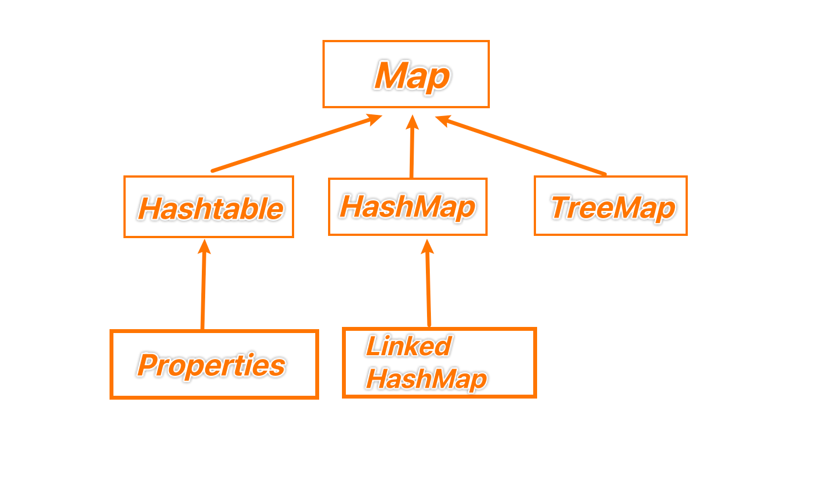

# 集合

## 好处

先看看数组的不足吧家人们

1. 长度开始时必须指定，而且一旦指定，不能更改
2. 保存的必须为同一类型的元素
3. 使用数组进行增加元素比较麻烦（超出数组添加的话，先新创数组，再拷贝数组）


集合的好处

1. 可以动态保存任何多个对象，比较方便
2. 提供了一系列方便的操作对象的方法
3. 使用集合添加，删除新元素非常简单


## 框架体系

1. 集合主要分两组：单列集合、双列集合
2. Collection接口有两个重要的子接口：List和Set，他们的实现子类都是单列的集合
3. Map接口实现子类 是双列集合，存放的是K- V对
4. 下面那两张图要记住

### 单列集合



### 双列集合




# Collection

## 特点

Collection接口实现类的特点

```
public interface Collection<E> extends Iterable<E>
```


1. collection实现子类可以存放多个元素
2. 有些Collection的实现类，可以存放重复的元素，有些不可以
3. 有些Collection的实现类，有些是有序的，有些不是有序的
4. Collection接口没有直接的实现子类，是通过它的子接口Set和List来实现的


## 常用方法

| 方法        | 作用                                     |
| ----------- | ---------------------------------------- |
| add         | 添加单个元素                             |
| remove      | 删除指定元素                             |
| contains    | 查找元素是否存在                         |
| size        | 获取元素个数                             |
| isEmpty     | 判断是否为空                             |
| clear       | 清空                                     |
| addAll      | 添加多个元素（传入另一个list）           |
| containsAll | 查找多个元素是否都存在（传入另一个list） |
| removeAll   | 删除多个元素（传入另一个list）           |


## 案例

```Java
List list = new ArrayList();
list.add("jack");
list.add(10);
list.add(true);
System.out.println(list)
```


​	


