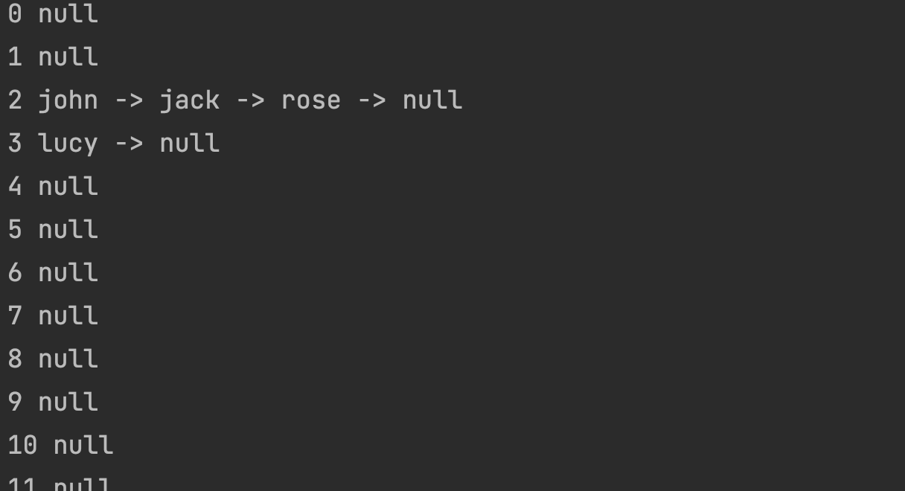
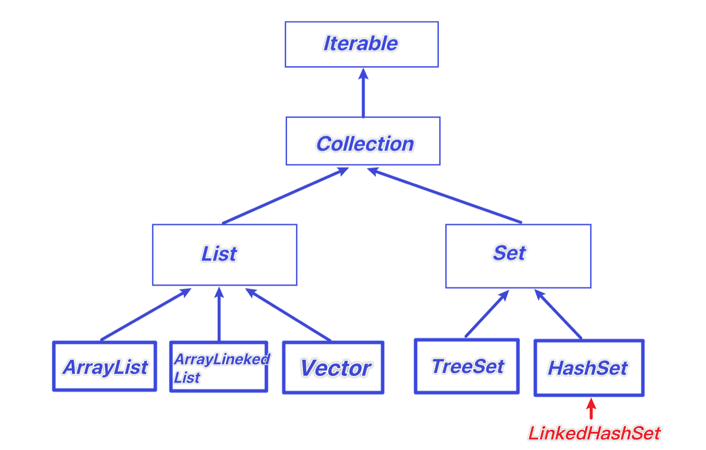

# Set接口

1. 无序（添加和取出顺序不一致），没有索引。

2. 不允许重复元素，所以最多包含一个null

3. JDK API中Set实现类有

   AbstractSet, ConcurrentSkipListSet, CopyOnWriteArraySet, EnumSet, **HashSet**, JobStateReasons, LinkedHashSet, **TreeSet**

4. 取出的顺序虽然不是添加的顺序，但他是固定的


## 常用方法

和List一样，Set接口也是Collection的子接口，因此常用方法和Collection接口一样

| 方法     | 作用             |
| -------- | ---------------- |
| add      | 添加单个元素     |
| remove   | 删除指定元素     |
| set      | 修改指定元素     |
| contains | 查找元素是否存在 |
| size     | 获取元素个数     |
| isEmpty  | 判断是否为空     |
| clear    | 清空             |


## 遍历方式

和Collection的遍历方式一样，因为Set接口是Collection接口的子接口,但是不能通过索引处理

1. 可以使用迭代器

   ```Java
   Iterator iterator = set.iterator();
   while (iterator.hasNext()){
   	Object obj = iterator.next();
     System.out.printn("o=" + obj);
   }
   ```

   

2. 增强for

   ```Java
   for (Object o : set){
   	System.out.printn("o=" + o);
   }
   ```


# HashSet

1. 构造器看出来，其实是HashMap

   ```Java
   public HashSet() {
       map = new HashMap<>();
   }
   ```

2. 可以存放null值，但是只能放一个
3. hashSet不保证元素是有序的，取决于hash后，再确定索引的结果
4. 再执行add后，会返回boolean,添加成功返回true（在set中原本不存在），否则false


## 特性

```java
public static void main(String[] args) {
    HashSet<Dog> set = new HashSet<Dog>();
    set.add(new Dog("1111"));
    set.add(new Dog("1111"));
}

class Dog{
    String name;

    public Dog(String name) {
        this.name = name;
    }
}
```

此时可以添加两个Dog，因为是不同的对象。


```Java
public static void main(String[] args) {
        HashSet<String> set = new HashSet<String>();
        set.add(new String("newnew1"));
        set.add(new String("newnew1"));
}
```

此时虽然String为两个不同对象，但仍然不能加入两个同串String


**很重要：为什么会发生这种事？HashSet加入的底层机制有关（通过调用equals比较是否相同)**


## **模拟存储结构**

HashSet底层是HashMap，HashMap底层是数组+链表+红黑树

（数组做Hash索引，索引到位后用链表或红黑树存储）

```Java
public class HashSetStructure {
    public static void main(String[] args) {
        //1. 创建一个数组，数组类型是Node[]
        //2. 有些人，直接把Node[]称之为table
        Node[] table = new Node[16];
        //3. 创建节点
        Node john = new Node("john", null);
        table[2] = john;

        Node jack = new Node("jack", null);
        john.next = jack; //将jack节点挂载到john后

        Node rose = new Node("rose", null);
        jack.next = rose; //将rose节点挂载jack后
        //[2]john -> jack -> rose

        Node lucy = new Node("lucy", null);
        table[3] = lucy;

      	//输出结构
        int i = 0;
        for (Node node : table) {
            Node p = node;
            System.out.print(String.valueOf(i++) + " ");
            while(p != null){
                System.out.print(p.item + " -> ");
                p = p.next;

            }
            System.out.println("null");
        }
        //System.out.println(table);

    }
}

class Node{ //代表节点，存储数据，可以指向下一个节点，从而形成链表
    Object item; //存放数据
    Node next;  //指向下一个节点

    public Node(Object item, Node next) {
        this.item = item;
        this.next = next;
    }
}
```




## **扩容机制**

1. HashSet底层是HashMap
2. 添加一个元素时，先得到hash值 ( 可重写hashCode() )  转换成索引值
3. 找到存储数据表table，看这个索引是否存放到有元素
4. 如果没有，直接加入
5. 如果有，**调用equals比较**（可重写），如果相同，就放弃添加，如果不相同，则添加到最后
6. 在Java8中，如果一条链表的**元素个数到达TREEIFY_THRESHOLD**（默认是8），并且**table的大小 >= MIN_TREEIFY_CAPACITY**（默认64），就会转换成**红黑树**


## 源码解读

1. 执行HashSet()

   ```JAVA
   public HashSet() {
       map = new HashMap<>();
   }
   ```

2. 执行add()

   PRESENT = static final Object PRESENT = new Object()

   ```JAVA
   public boolean add(E e) {
           return map.put(e, PRESENT)==null;
       }
   ```

3. 执行put()

   k = "text" v = PRESENT

   ```JAVA
    public V put(K key, V value) {
           return putVal(hash(key), key, value, false, true);
       }
   ```

4. 执行hash(key)

   hashCode是Object的方法，每个对象都有 不完全等价于hashCode，还有算法的

   16 = 二进制1111，hashCode按位与，得到四位hash值

   ```Java
   static final int hash(Object key) {
           int h;
           return (key == null) ? 0 : (h = key.hashCode()) ^ (h >>> 16);
       }
   ```

5. putVal(hash, key, value, false, true);

   ```Java
   final V putVal(int hash, K key, V value, boolean onlyIfAbsent,boolean evict) {
     Node<K,V>[] tab; Node<K,V> p; int n, i; //定义了辅助变量
   	//开始判断table表是否有创建
     if ((tab = table) == null || (n = tab.length) == 0) //HashMap的table字段 存放的是Node[]
       n = (tab = resize()).length; //如果数组长度为0，resize重新获得大小为16的数组。n为其长度
     
     /*
       1. 根据key得到hash，去计算key应该存放到table表的索引位置 并把位置的对象赋值给p。 
       2. 判断p是否为null 
       	2.1 如果p==null 表示还没创建元素，就创建一个Node(key="text", value=PRESENT) 
       	2.2 就放在该位置table[i]挂上Node，作为链表头
       	2.3 跳到最下面
       */
     
     //开始插入元素
     if ((p = tab[i = (n - 1) & hash]) == null)  //(n - 1) & hash 计算hash值。并判断此位置是否已有元素
       //================判断：该位置已存在链表头================
       tab[i] = newNode(hash, key, value, null); //为空，直接把元素放进来
     else {
       //================判断：该位置不存在链表头，开始接链================
       Node<K,V> e; K k; //定义了辅助变量
       if (p.hash == hash && ((k = p.key) == key || (key != null && key.equals(k)))) //如果当前索引对象（链头元素）KEY的hash值相同，并且，Key的值也相同。或者。key不为空 且 内容相同(equals比较)。
         e = p; //你就是同一个对象，就不能加入
       
       else if (p instanceof TreeNode) //判断p是不是一颗红黑树
         e = ((TreeNode<K,V>)p).putTreeVal(this, tab, hash, key, value);//是红黑树，用putTreeVal进行加
       
       else { //以上两个分支都不满足，认为是一个链表
         /*1. 依次和该链表的每一个元素比较后，都不相同 说明添加的元素没有重复，则加入到该链表最后
         		 注意，把元素添加到链表后，立即判断，
         		 该链表是否已经有8个节点 调用treeifyBin对当前链表进行树化。
         		 在转换成红黑树前，还进行一个判断，能不能通过数组扩容（最大会一直扩容到64），后重新hash
         		 解决长度问题，不行才进行树化
         		 （可看treeifyBin源码）
         		
         	2. 依次和该链表的每一个元素比较过程中，发现有相同情况，直接break
         
         */
         for (int binCount = 0; ; ++binCount) { //用for死循环，根链表各个元素循环比较是否相同
           
           if ((e = p.next) == null) { //比较到链表尾巴了 （next == null）
             p.next = newNode(hash, key, value, null); //直接扔新元素到链表尾部
             if (binCount >= TREEIFY_THRESHOLD - 1) //添加完看看要不要变成红黑树 判断到阈值没
               treeifyBin(tab, hash);
             break; 
           }
           if (e.hash == hash && ((k = e.key) == key || (key != null && key.equals(k)))) //有相同，直接break （这里的判断方法和判断链表头是否相同的语句一样）
             break;
           p = e; //p指向e的时候，下一个语句e指向e.next。所以p和e是邻居关系
         }
       }
       
       if (e != null) { // existing mapping for key 已经存在这key值
         V oldValue = e.value; //获取旧值
         if (!onlyIfAbsent || oldValue == null)   //onlyIfAbsent为false 或 旧值为空 进行替换
           e.value = value; //替换value
         afterNodeAccess(e);
         return oldValue;
       }
     }
     // ======================最下面===================
     ++modCount; //修改一次
     //size就是我们加入的每一个节点，不管是作链头还是接在链后面
     if (++size > threshold) //现在大小是否超过数组扩容阈值
       resize(); // 进行扩容
     afterNodeInsertion(evict); //HashMap留给子类实现的。 HashMap这里是空方法，可忽略
     return null; //返回空代表成功，返回旧值代表失败
   }
   ```


6. resize()

   代码太复杂。简述一下：

   1. 第一次添加时，table扩容到16，临界值为( 0.75 * 表总元素数 ) 也就是12 （0.75叫加载因子常量 LoadFactor)

   1. 检测数组已占据的空间是否到达临界值（0.75 * 表总元素数 ），如果表总元素数为16，临界值为12。到达则扩大空间，扩容到原来大小的2倍（16 * 2=32），临界值也继续更新（0.75 * 32）
   2. 为什么要设置临界值？防止突然多线程同时写入，导致溢出。

7. treeifyBin()

   在Java8中，如果一条链表的元素个数到达TREEIFY_THRESHOLD(默认是8)，并且table>=MIN_TREEIFY_CAPACITY(默认64)， 就会进行树化（红黑树），否则仍然采用数组扩容机制


## 案例

假设我们Employee类对象，如果有相同的名字和年龄，就视为一个人

这样就要重写equals。但只重写equals还不够

因为我们需要将相同名字和年龄返回相同的哈希值，只有相同的hash才会去检查是否相同，所以还要重写getHash

```Java
import java.util.HashSet;
import java.util.Objects;
import java.util.Set;

public class HashSetExercise {
    public static void main(String[] args) {
        Set<Employee> set = new HashSet<Employee>();
        set.add(new Employee("张三", 24));
        set.add(new Employee("张三", 23));
        set.add(new Employee("张三", 24));

        for (Employee employee : set) {
            System.out.println(employee);
        }
    }
}

class Employee{
    private String name;
    private int age;

    public Employee(String name, int age) {
        this.name = name;
        this.age = age;
    }

    public String getName() {
        return name;
    }

    public int getAge() {
        return age;
    }

    @Override
    public boolean equals(Object o) {
        Employee e = (Employee) o;
        if(this.getName().equals(e.getName()) && this.getAge() == e.getAge()){
            return true;
        }else{
            return false;
        }

    }

    @Override
    public int hashCode() {
        return Objects.hash(name, age);
    }

    @Override
    public String toString() {
        return "Employee{" +
                "name='" + name + '\'' +
                ", age=" + age +
                '}';
    }
}
```

此时输出

```
Employee{name='张三', age=23}
Employee{name='张三', age=24}

Process finished with exit code 0
```


# LinkedHashSet

## 特性



1. LinkedHashSet是HashSet的子类
2. LinkedHashSet底层是一个LinkedhashMap（HashMap的子类），底层维护了一个数组+双向链表
3. LinkedHashSet根据元素的hashCode值来决定元素的存储位置，同时**使用链表维护元素的次序**，是的元素看起来是**以插入顺序保存**的
4. LinkedHashSet不允许添加重复元素


## 存储结构

1. 在LinkedHashSet中维护了一个hash表和双向链表（LinkedHashSet有head和tail）
2. 每一个节点有pre和next属性，这样可以形成双向链表
3. 在添加一个元素时，先求hash值，再求索引。确定该元素在hashtable的位置，然后将添加的元素加入双向链表（如果已存在，则不添加）
4. 这样的话，我们遍历LinkedHashSet也能确保插入顺序和遍历顺序一致


1. 添加第一次时，直接将table扩容到16，存放的节点类型时LinkedHashMap$Entry

2. 数组是HashMap$Node[] 存放的数据是 LinkedHashMap$Entry类型 （HashMap$Node是LinkedHashMap$Entry的父类，体现了多态）

   ```JAVA
   static class Entry<K,V> extends HashMap.Node<K,V>{
   	Entry<K,V> before, after;
   	Entry(int hash, K key, V value, Node<K, V> next){
   		super(hash, key, value ,next);
   	}
   }
   ```

   

# TreeSet

## 特性

最大的特点：可以排序


1. 当使用无参构造器，创建TreeSet时，仍然是无序的

   ```JAVA
   TreeSet treeSet = new TreeSet();
   
   treeSet.add("jack");
   treeSet.add("tom");
   treeSet.add("sp");
   treeSet.add("a");
   
   //output : [a, jack, sp, tom]
   ```

2. 希望添加元素，按照字符串长度来排序（长度相等无法加入）

3. 使用TreeSet提供的一个构造器，可以传入一个比较器(匿名内部类)并指定排序规则

   ```JAVA
    TreeSet treeSet = new TreeSet(new Comparator() {
      @Override
      public int compare(Object o1, Object o2) {
        //进行字符串自带规则比较
        return ((String)o1).length()-((String)o2).length();
      }
    });
   
   treeSet.add("jack");
   treeSet.add("tom");
   treeSet.add("sp");
   treeSet.add("a");
   
   System.out.println(treeSet);
   
   //output：
   ```

   

## 源码解读

1. 构造器把传入的比较器对象 调用的是TreeMap的构造器

   ```Java
   public TreeSet(Comparator<? super E> comparator) {
       this(new TreeMap<>(comparator));
   }
   ```

   ```Java
   public TreeMap(Comparator<? super K> comparator) {
       this.comparator = comparator;
   }
   ```

2. 添加元素的put方法

   ```JAVA
   public V put(K key, V value) {
       // 。。。 省略前。。。
       Comparator<? super K> cpr = comparator; //我们的匿名内部类对象，动态绑定
       if (cpr != null) {
           do {
               parent = t;
               cmp = cpr.compare(key, t.key);
               if (cmp < 0)
                   t = t.left;
               else if (cmp > 0)
                   t = t.right;
               else //如果相等 即返回0，这个Key就加入不了了
                   return t.setValue(value);
           } while (t != null);
       }
      // 。。。 省略后。。。
   }
   ```

