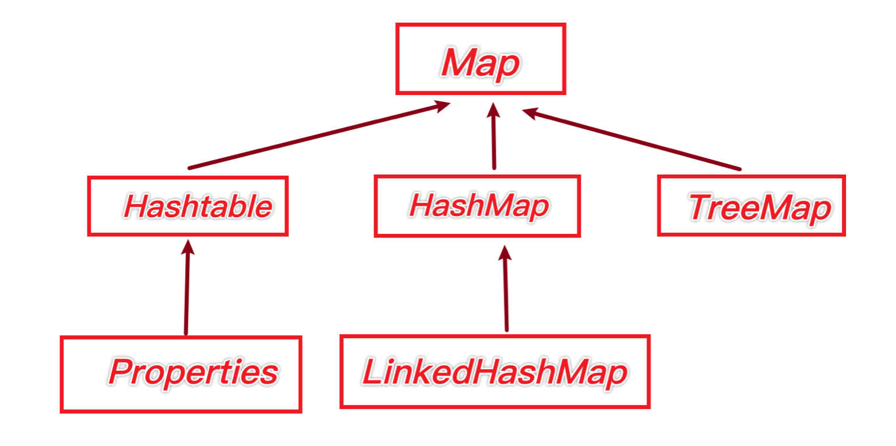
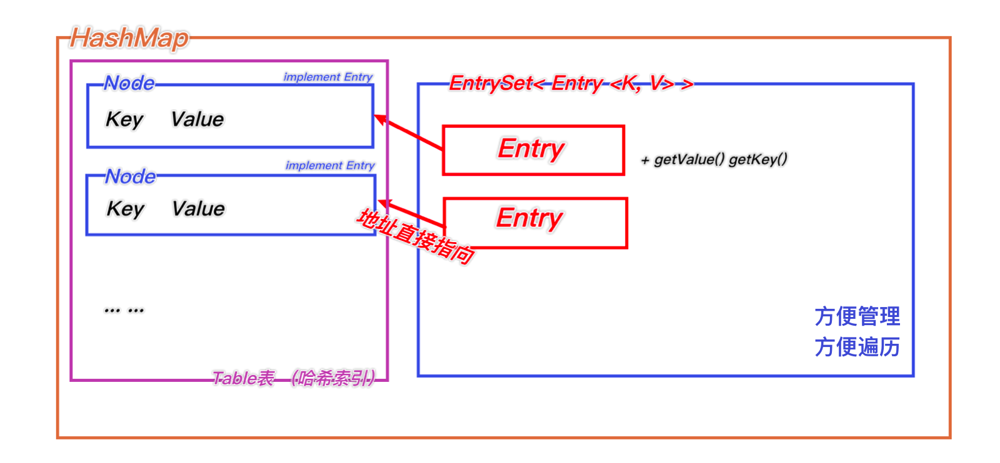
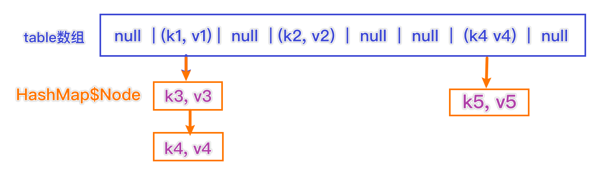

# Map接口

## 结构



## 特点

Map接口实现类特点：

1. Map用于保存具有映射关系的数据 Key-Value（双列元素）

   ```
   Map map = new HashMap();
   map.put("no1", "张三");
   map.put("no2", "李四");
   ```

   

2. Map中的key和value可以是任何引用类型，会封装到HashMap$Node对象中

3. Map中的Key不允许重复，原因和HashSet一样，前面分析过源码。如果第二次put一个新key，相当于替换
4. Map中的value允许重复

5. Map中的Key可以为Null， value也可以为Null，但是Key为Null只能有一个。Value可以有多个

6. 常用String类作为Map的Key

7. key和Value之间是单向一对一的关系，经常使用Key找到相应的Value（通过put方法传入key，会返回对应的Value）

8. Map存放数据的key-value示意图，一对k-v时放在一个HashMap$Node中的，又因为Node实现了Entry接口，有些书上说k-v就是一堆entry

   ```Java
   static class Node<K,V> implements Map.Entry<K,V> {
       final int hash;
       final K key;
       V value;
       Node<K,V> next;
   
       Node(int hash, K key, V value, Node<K,V> next) {
           this.hash = hash;
           this.key = key;
           this.value = value;
           this.next = next;
       }
   
       public final K getKey()        { return key; }
       public final V getValue()      { return value; }
       public final String toString() { return key + "=" + value; }
   
       public final int hashCode() {
           return Objects.hashCode(key) ^ Objects.hashCode(value);
       }
   
       public final V setValue(V newValue) {
           V oldValue = value;
           value = newValue;
           return oldValue;
       }
   
       public final boolean equals(Object o) {
           if (o == this)
               return true;
           if (o instanceof Map.Entry) {
               Map.Entry<?,?> e = (Map.Entry<?,?>)o;
               if (Objects.equals(key, e.getKey()) &&
                   Objects.equals(value, e.getValue()))
                   return true;
           }
           return false;
       }
   }
   ```


## 源码分析

1. k-v最后时HashMap$Node node = newNode(hash, key, value, null);

2. k-v为了方便程序员遍历，还会创建EntrySet集合，该集合存放的元素类型Entry，而一个Entry对象就有k， v EntrySet<Entry<K, V>>, 即transient Set<Map.Entry<K, V>> entrySet

3. 在entryset中，定义的类型是Map.Entry，但实际上存放的还是HashMap$Node

   这是因为HashMap$Node<K, V> implement Map.Entry<K, V>

4. 这样当把HashMap$Node对象存放到EntrySet方便遍历，因为Entry提供了两个重要方法：getKey和getValue

5. 

   

   

   

## 常用方法

| 方法名      | 作用                |
| ----------- | ------------------- |
| remove      | 根据key删除映射关系 |
| get         | 根据key获取一个值   |
| size        | 获取元素个数        |
| isEmpty     | 判断个数是否为0     |
| clear       | 清除                |
| containsKey | 查找key是否存在     |


## 遍历方法

1. 取KeySet

   ```JAVA
   Set keys = map.keySet(); //先取出所有的key的Set
   //1.迭代器
   Iterator iterator = keys.iterator(); //set可以通过迭代器循环
   while(iterator.hasNext());{
   	Object key = iterator.next();
   	Object value = map.get(key);
   	System.out.println(key + ":" + value);
   }
   
   //2. 增强for(最简单的)
   for(Object key:keys){
   	System.out.println(key + " :: " + map.get(key));
   }
   ```

2. 取Values

   ```Java
   Collection values = map.values();
   //1. 增强for
   for(Object value : values){
     System.out.println()
   }
   //2. 迭代器
   Iterator iterator = values.iterator(); //set可以通过迭代器循环
   while(iterator.hasNext());{
     Object value = iterator.next();
     System.out.println(iterator);
   }
   ```

3. 普通for

   ```Java
   Set entrys=map.entrySet(); //获取entrySet
   //1. 增强for
   for(Object entry : entrys){ 
   	Object key = e.getKey();
   	Object value = e.getValue();
   	System.out.println(key + " :: " + map.get(key));
   }
   
   //2. 迭代器
   Iterator iterator1 = entrySet.iterator();
   while(iterator1.hasNext());{
     MapEntry value = iterator1.next();
     Object key = iterator1.getKey();
     Object value = iterator1.getValue();
     System.out.println(iterator);
   }
   ```

   

# HashMap

1. Map接口的常用实现类 HashMap、Hashtable 和 Properties
2. HashMap是Map接口使用频率最高的实现类
3. HashMap是以key-Val对的方式来存储数据
4. key不能重复，但是值可以重复，允许null值
5. 如果添加相同的key，会覆盖原来的key-val，等同于修改
6. 不保证映射的顺序，因为底层是以hash表的方式来存储的 （jdk8的hashMap底层 数组+链表+红黑树）
7. HashMap没有实现同步，因此是线程不安全的，没有Synchronized


## 源码分析




1. (k,v )是一个Node实现了Map.Entry<k, v>
2. Jdk7.0 的hashmap底层实现了 数组+链表 、 jdk8.0实现了 数组+链表+红黑树


## 扩容机制

1. HashMap底层维护了Node类型的数组table，默认为null

2. 当创建对象时，将加载因子 loadfactor 初始化为0.75

3. 当添加k-v时，通过key的哈希值得到在table的索引。然后判断在该索引处是否有元素。如果没有元素则直接添加。如果该索引有元素，继续判断元素的key和准备加入的key是否相等

   如果相等，直接替换val

   如果不相等，需要判断时树结构还是链表结构，做出相应处理。

   如果容量不够，需要扩容

4. 第1次添加，需要扩容table容量为16，临界值为12 （16*0.75）

5. 以后再扩容，需要扩容table容量为原来的两倍，临界值为原来的的2倍

6. Java8中，如果一条链表的元素超过TREEIEFY_THRESHOLD(默认8)，并且table的大小 >= MIN_TREEIFY_CAPACITY 默认64  就会进行树化


# Hashtable

## 特性

1. 存放的元素是键值对，即K-V
2. hashtable的键和值都**不能为null**，否则会抛出NullPointerException
3. hashtable使用方法基本上和HashMap一样
4. hashtable是**线程安全的**（Synchronized），hashmap是线程不安全的


## 底层

1. 底层有数组，Hashtable$Entry[] 初始化大小为 11

2. 临界值 threshold = 8 = 11 * 0.75

3. 扩容：按照自己的扩容机制来进行即可

   执行方法：addEntry（hash， key， value，index ） 添加K-V封装到Entry

   ```Java
   private void addEntry(int hash, K key, V value, int index) {
       modCount++;
   
       Entry<?,?> tab[] = table;
       if (count >= threshold) { //是否满足临界值
           // Rehash the table if the threshold is exceeded
           rehash(); //扩容
   
           tab = table;
           hash = key.hashCode();
           index = (hash & 0x7FFFFFFF) % tab.length;
       }
   
       // Creates the new entry.
       @SuppressWarnings("unchecked")
       Entry<K,V> e = (Entry<K,V>) tab[index];
       tab[index] = new Entry<>(hash, key, value, e);
       count++;
   }
   ```

   ```Java
   protected void rehash() {
           int oldCapacity = table.length;
           Entry<?,?>[] oldMap = table; //存储原表
   
           // overflow-conscious code
           int newCapacity = (oldCapacity << 1) + 1;  //新容量=原容量*2+1
           if (newCapacity - MAX_ARRAY_SIZE > 0) {
               if (oldCapacity == MAX_ARRAY_SIZE  //旧的表直接是最大尺寸了
                   // Keep running with MAX_ARRAY_SIZE buckets
                   return;  //直接返回
               newCapacity = MAX_ARRAY_SIZE; 
           }
           Entry<?,?>[] newMap = new Entry<?,?>[newCapacity]; //真扩容，按照新大小创建表
   
           modCount++;
           threshold = (int)Math.min(newCapacity * loadFactor, MAX_ARRAY_SIZE + 1);
           table = newMap;
   
           for (int i = oldCapacity ; i-- > 0 ;) {
               for (Entry<K,V> old = (Entry<K,V>)oldMap[i] ; old != null ; ) {
                   Entry<K,V> e = old;
                   old = old.next;
   
                   int index = (e.hash & 0x7FFFFFFF) % newCapacity;
                   e.next = (Entry<K,V>)newMap[index];
                   newMap[index] = e;
               }
           }
       }
   ```

   新容量=原容量*2+1


## 对比

|           | 版本 | 线程安全 | 效率 | 允许NullK&V |
| --------- | ---- | -------- | ---- | ----------- |
| HashMap   | 1.2  | 不安全   | 高   | 可以        |
| Hashtable | 1.0  | 安全     | 较低 | 不可以      |


## 子类Properties

1. 类继承自Hashtable类并且实现了Map接口，也是使用一种键值对的形式来保存数据
2. 他的使用特点和Hashtable类似
3. Properties还可以用于从xxx.properties 文件中，加载数据到Properties对象，并进行读取和修改
4. 工作后 xxx.properties 通常用于作为配置文件，这个知识点再IO流举例


```Java
Properties properties = new Properties();
properties.put("name", "jack");
String name = properties.get("name");  //获取
properties.put("name", "naive"); //修改
properties.remmove("name"); //d删除


```


# TreeMap

## 特性

1. 使用默认构造器，创建是无序的
2. 传入比较器(匿名内部类)并指定排序规则

```JAVA
TreeMap<String, String> treeMap = new TreeMap<String, String>(new Comparator<String>() {
    @Override
    public int compare(String o1, String o2) {
        return o1.compareTo(o2);
    }
});
treeMap.put("jack", "杰克");
treeMap.put("tom", "汤姆");
treeMap.put("kristina", "克莉丝缇娜");
treeMap.put("smith", "史密斯");

System.out.println(treeMap);
```


## 源码解读

1. 构造器，把传入的实现了Comparator接口的匿名内部类（对象）传给TreeMap的comparator

   ```
   public TreeMap(Comparator<? super K> comparator) {
       this.comparator = comparator;
   }
   ```

   

2. 调用put方法

   第一次添加 把k-v封装到Entry对象，放入root

   ```Java
   public V put(K key, V value) {
           Entry<K,V> t = root;
           if (t == null) {
               compare(key, key); // type (and possibly null) check 检查是否是空值
   
               root = new Entry<>(key, value, null);
               size = 1;
               modCount++;
               return null;
           }
   ```

3. 之后添加

   ```Java
   Comparator<? super K> cpr = comparator;
           if (cpr != null) {
               do { //遍历所有key，给当前的key找到适当的位置
                   parent = t;
                   cmp = cpr.compare(key, t.key); //动态绑定到匿名内部类的compare方法
                   if (cmp < 0)
                       t = t.left;
                   else if (cmp > 0)
                       t = t.right;
                   else  //如果遍历过程中，发现准备添加的key和当前已有的key是相等的，就不添加
                       return t.setValue(value); //直接返回
               } while (t != null);
           }
   ```

   

​		


