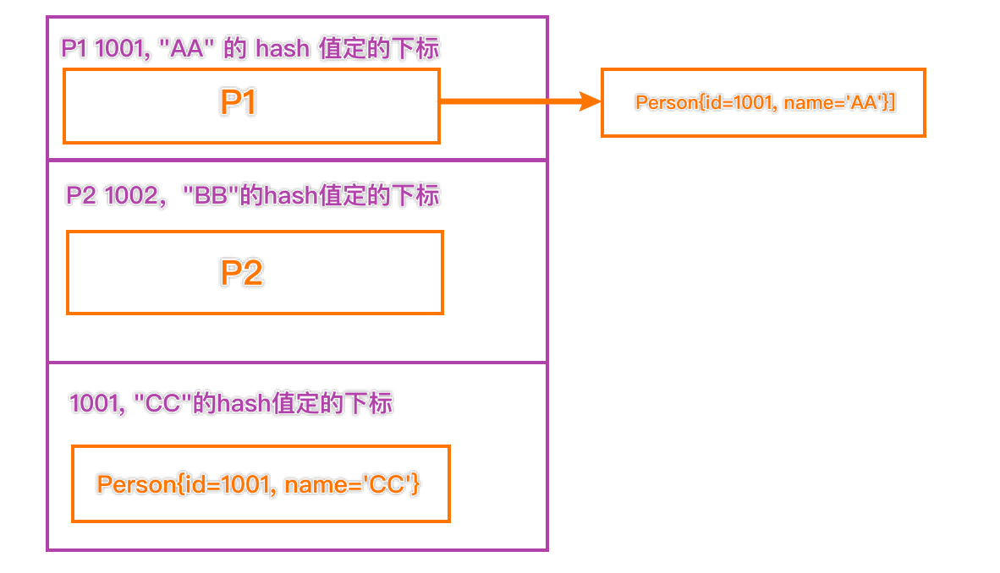

# 如何选择集合实现类

存储的类型？一组对象 还是 一组KV对？

## 一组对象：Collection接口

### 允许重复：List

增删多：LinkedList 底层维护了一个双向链表

改查多：ArrayList 底层维护Object类型的可变数组

### 不允许重复：Set

无序：HashSet 底层是HashMap，维护了一个哈希表

排序：TreeSet

插入和取出顺序一致：LinkedHashSet 维护数组+双向链表


## 一组KV对：Map

K无序：HashMap 底层是Hash表 数组+链表+红黑树

K排序：TreeMap

K插入和取出顺序一致：LinkedHashMap

读取文件：Properties


# Collections工具类

java.util.Collections

1. collections是一个操作Set、List、Map等集合的工具类
2. collections中提供了一系列静态的方法对集合元素进行排序、查询和修改等操作


## 排序操作

| 方法名                 | 作用                                           |
| ---------------------- | ---------------------------------------------- |
| reverse(list)          | 反转List中元素的顺序                           |
| shuffle(list)          | 对List集合元素进行随机排序                     |
| sort(List)             | 根据元素的自然顺序指定List集合元素按升顺排序   |
| sort(List, Comparator) | 根据指定Comparator产生的顺序对List元素进行排序 |
| swap(List, int, int)   | 将指定list集合中的i处元素和j处元素进行交换     |


## 查找替换

| 方法名                                                      | 作用                                               |
| ----------------------------------------------------------- | -------------------------------------------------- |
| Object max(Collection)                                      | 根据元素的自然排序，返回给定集合中最大元素         |
| Object max(Collection, Comparator)                          | 根据Comparator指定的顺序，返回给定集合中最大的元素 |
| Object min(Collection)                                      | 最小                                               |
| Object min(Collection, Comparator)                          | 给定Comparator返回最小                             |
| int frequency(Collection Object)                            | 返回指定集合中指定元素的出现次数                   |
| void copy(List dest, List src)                              | 将src中的内容复制到dest中                          |
| Boolean replaceAll(List list, Object oldVal, Object newVal) | 使用新值替换List对象的所有旧值                     |


# HashSet和TreeSet分别如何去重？

1. HashSet：hashCode + equals，底层先通过存入对象，进行运算得到一个hash值，通过hash值得到对应的索引，如果发现table索引所在的位置，没有数据，就直接存放。如果有数据，就进行equals比较，如果比较后，不相同，就加入，否则不加入。
2. TreeSet：如果传入了一个Comparator匿名对象，就使用实现Compare去重，如果方法返回0，就认为是相同的元素，不添加。如果没有传入有一个Comparator对象，就以添加对象实现的Comparable接口的compareTo去重。


Q：下面的代码会不会报错？

```
TreeSet treeSet = new TreeSet();
treeSet.add(new Person()); 

class Person{

}
```

​		会报错。因为没有定义compareTo接口，所以强转成Comparable调用compareTo。但是没有实现这个接口，所以会报错，强转错误 ClassCastException


# 关于hashCode的一些问题

```Java
HashSet set = new HashSet();
Person p1 = new Person(1001, "AA");
Person p2 = new Person(1002, "BB");
set.add(p1);
set.add(p2);
p1.name = "CC"; //此时，将p1的名字更改，hashCode会重新计算
set.remove(p1); //此时会定位<1001, CC>定位的哈希值，但是链表里原先挂的是<1001, AA>定位的哈希的位置，链表对于不上，无法删除
System.out.println(set); //[Person{id=1002, name='BB'}, Person{id=1001, name='CC'}]
set.add(new Person(1001, "CC")); //可以添加，链表里根本没有1001和CC的hash定的下标，直接存到个新的链表里
System.out.println(set);//[Person{id=1002, name='BB'}, Person{id=1001, name='CC'}, Person{id=1001, name='CC'}]
set.add(new Person(1001, "AA"));
System.out.println(set);//[Person{id=1002, name='BB'}, Person{id=1001, name='CC'}, Person{id=1001, name='CC'}, Person{id=1001, name='AA'}]
```




