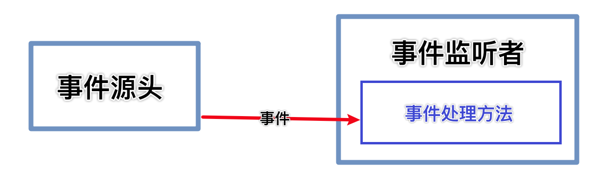

# 事件处理机制

​		Java事件处理机制是采取“委派事件模型”。当事件发生时，产生事件的对象，会把此信息传递给事件的监听者处理，这里所说的信息实际上就是java.awt.event事件类库里某个类所创建的对象，把它称为“事件的对象”。

## 事件源

事件源时一个产生事件的对象，比如按钮、窗口等

## 事件

事件就是承载事件源状态改变时的对象，比如当键盘事件、鼠标事件、窗口事件等等，会生成一个事件对象

该对象保存着当前事件很多信息，比如KeyEvent对象有含有被按下对象的Code值，

java.awt.event包和javax.swing.event包中定义了各种事件类型

## 事件监听接口

1. 当事件源产生一个事件时，可以传送给事件监听者处理
2. 事件监听者实际上就是一个类，该类实现了某个事件监听器接口，比如前面我们案例中的MyPanle就是一个类，它实现了KeyListener接口，它就可以作为一个事件监听者，对接收到的事件进行处理 
3. 事件监听器接口有多种，不同的事件监听器接口可以监听不同的事件，一个类可以实现多个监听接口
4. 这些接口在java.awt.event包和javax.swing.event包中定义，

