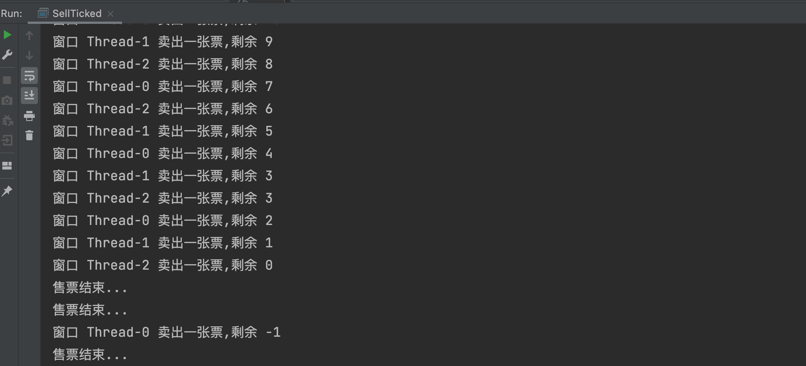

# 相关概念

## 程序

为了完成任务，用某种语言编写的一组指令的集合，简单的来说，就是我们写的代码


## 进程

1. 进程指的是运行中的程序，比如使用的QQ，就启动了一个进程，操作系统就会为该进程分配内存空间。
2. 进程是程序的一次执行过程，或是正在运行一个程序。   动态过程指的是 它有自身的产生、存在和消亡的过程。


## 线程

1. 线程由进程创建，是进程的一个实体
2. 一个进程可以拥有多个线程（比如下载软件同时下载多个文件）


### 单线程

同一时刻，只允许执行一个线程


### 多线程

同一个时刻，可以执行多个线程


## 并发和并行


并发：同一个时刻，多个任务交替执行，造成一种“貌似同时”的错觉，简单的说，单核cpu实现的多任务就是并发


并行：同一个时刻，多个任务同时执行，多核cpu可以实现并行


并发和并行可以同时进行


## 查看cpu个数接口

```Java
Runtime runtime = Runtime.getRuntime();
int cupNums = runtime.avaliableProcessors();
System.out.println("当前CPU个数为" + cupNums);
```


# 线程使用

## Thread类图


# 继承Thread创建线程

## 创建线程

1. 当一个类使用了Thread类，该类就可以当作线程使用

2. 我们会重写run方法，写上自己的业务代码
3. run Thread 类 实现了Runnable 接口的 run方法


```java
public class Threaduse {
    public static void main(String[] args) {
        Cat cat = new Cat("小强");
        cat.start(); //会自动调用run方法
        Cat cat1 = new Cat("小刘");
        cat1.start(); //会自动调用run方法
      	System.out.println("主线程执行完毕");
    }

}


class Cat extends Thread {
    String name;

    Cat(String name){
        this.name = name;
    }

    @Override
    public void run() {
        int times = 0;
        while (times <= 8){
            System.out.println(name + " _ " + (++times) + "喵喵，我是一只小猫咪");
            try {
                Thread.sleep(1000);
            } catch (InterruptedException e) {
                e.printStackTrace();
            }
        }
    }
}
```


输出：


如果在main里直接调用run方法，会在主线程里执行，因为就是一个普通的方法，没有执行一个新线程，会串行化执行

需要调用start才会开启一个线程


## 创建线程源码

start方法

```Java
public synchronized void start() {
    /**
     * This method is not invoked for the main method thread or "system"
     * group threads created/set up by the VM. Any new functionality added
     * to this method in the future may have to also be added to the VM.
     *
     * A zero status value corresponds to state "NEW".
     */
    if (threadStatus != 0)
        throw new IllegalThreadStateException();

    /* Notify the group that this thread is about to be started
     * so that it can be added to the group's list of threads
     * and the group's unstarted count can be decremented. */
    group.add(this);

    boolean started = false;
    try {
        start0(); //真正实现了多线程的方法
        started = true;
    } finally {
        try {
            if (!started) {
                group.threadStartFailed(this);
            }
        } catch (Throwable ignore) {
            /* do nothing. If start0 threw a Throwable then
              it will be passed up the call stack */
        }
    }
}
```

```Java
private native void start0();

    /**
     * If this thread was constructed using a separate
     * <code>Runnable</code> run object, then that
     * <code>Runnable</code> object's <code>run</code> method is called;
     * otherwise, this method does nothing and returns.
     * <p>
     * Subclasses of <code>Thread</code> should override this method.
     *
     * @see     #start()
     * @see     #stop()
     * @see     #Thread(ThreadGroup, Runnable, String)
     */
    @Override
    public void run() {
        if (target != null) {
            target.run();
        }
    }
```


1. start0() 是本地方法，是JVM调用，底层是C/C++实现的

   真正实现多线程的效果，是start0方法。是native方法，底层的方法

2. start()方法是调用start0()方法后，该线程并不会立马执行，只是线程变成了可运行状态。具体什么时候执行，取决于CPU，由CPU统一调度。操作系统有自己的一套算法。


# 实现Runnable创建线程

1. Java是单继承的，在某些情况下一个类可能已经继承了某个父类，这是在用继承Thread类方法来创建线程显然不可能
2. Java设计者提供了另外一个方法来创建线程，就是通过实现runnable接口来创建线程


## 创建线程

```Java
public class Runnable_ {
    public static void main(String[] args) {
        Dog dog = new Dog();
        Thread thread = new Thread(dog);
        thread.start();
        Thread thread2 = new Thread(dog);
        thread2.start();
        System.out.println("执行完毕");

    }
}

class Dog implements Runnable{

    @Override
    public void run() {
        int count = 0;
        while(true){
            System.out.println((++count) +  "小狗汪汪叫...hi");

            try{
                Thread.sleep(1000);
            }catch (InterruptedException e){
                e.printStackTrace();
            }
        }
    }
}
```


## 实现原理（静态代理）

```JAVA
//线程代理类，模拟了一个极简的Thread
class ThreadProxy implements Runnable{ //可以看成Thread类
    private Runnable target = null; //设置了个属性，类型是Runnable

    @Override
    public void run() {
        if(target != null){
            target.run(); //动态绑定
        }
    }

    public ThreadProxy(Runnable target){
        this.target = target;
    }

    public void start(){
        start0(); //这个方法时真正实现可多线程方法
    }

    public void start0(){
        run();
    }
}
```

这个模拟的类 实现了Runnable的run

如果被代理的类有内容 我们就执行被代理类的run代码

前提是被代理的类要实现Runnable接口，才能被传进来 such as

```JAVA
public class Runnable_ {
    public static void main(String[] args) {
        Tiger tiger = new Tiger();
      	new ThreadProxy(tiger).start();

    }
}

class Tiger extends Animals implements Runnable{
	@Override
	public void run() {
			System.out.println("老虎嗷嗷叫");
	}
}
```


## Thread vs Runnable

1. 从java的设计来看，通过继承Thread或者实现Runnable接口来创建线程本质上没有区别，从jdk帮助文档我们可以看到Thread类本身就实现了Runnable接口

2. 实现Runnable接口方式更加适合多个线程共享一个资源的情况，并且避免了单继承的限制。

   ```Java
   T3 t3 = new T3("hello");
   Thread thread01 = new Thread(t3);
   Thread thread02 = new Thread(t3);
   thread01.start();
   thread02.start(); //两个线程都执行了t3的run方法，同时执行一个对象，共享资源。
   ```

   

# 线程终止

1. 当线程完成任务后，会自动退出

2. 还可以通过使用变量来控制run方法退出的方式停止线程，即通知方式

   ```Java
   public class ThreadExit {
       public static void main(String[] args) throws InterruptedException {
           T t = new T();
           t.start();
   
           //如果希望主线程控制t线程的退出，则修改loop即可。
           Thread.sleep(500);
           t.setLoop(false); //让t1退出run方法，从而终止t1线程 -> 通知方式
   
       }
   }
   
   class T extends Thread {
       private int count = 0;
       //设置一个控制变量
       private boolean loop = true;
   
       public void setLoop(boolean loop) {
           this.loop = loop;
       }
   
       @Override
       public void run() {
           while (loop) {
               try {
                   Thread.sleep(50);
               } catch (InterruptedException e) {
                   e.printStackTrace();
               }
   
               System.out.println(count++);
           }
   
       }
   }
   ```


# 线程常用方法

| 方法名      | 作用                                                         |
| ----------- | ------------------------------------------------------------ |
| setName     | 设置线程名称                                                 |
| getName     | 返回该线程名称                                               |
| start       | 使用该线程开始执行，虚拟机底层调用start0方法                 |
| run         | 调用线程对象run方法                                          |
| setPriority | 更改线程的优先级                                             |
| getPriority | 获取线程的优先级                                             |
| sleep       | 在指定的毫秒树内让当前正在执行的进程休眠                     |
| Interrupt   | 中断进程                                                     |
| yield       | 线程的礼让，让别的线程先执行。能不能让出来，不好说。因为根据内核态资源是否紧张进行调度 |
| join        | 线程的插队，有先执行插入线程的所有任务，再执行原来的线程（例如有两个线程T1和T2，T1主动调用T2的join，表示先执行完T2的任务再回来执行T1的任务） |

1. start底层会创建新线程，调用run，run就是一个简单的方法调用，不会启动线程

2. 线程优先级范围

3. interrupt 中断线程，但是并没有真正的中断线程，所以一般用于中断在休眠(Thread.sleep)的线程

   捕获到一个中断异常

   

4. sleep线程的静态方法，使用当前线程休眠

5. 关于join的一个例子

   ```Java
   public class ThreadJoin {
       public static void main(String[] args) throws InterruptedException {
           T1 t1 = new T1();
           t1.start();
           for (int i = 0; i < 10; i++) {
               Thread.sleep(1000);
               if(i == 5){
                   System.out.println("Main停止执行，T1先行");
                   t1.join();
                   System.out.println("T1执行完毕，Main再执行");
               }
               System.out.println("Main正在执行 - " + i);
           }
       }
   }
   
   class T1 extends Thread{
       @Override
       public void run() {
           for (int i = 0; i < 10; i++) {
               try {
                   Thread.sleep(1000);
               } catch (InterruptedException e) {
                   e.printStackTrace();
               }
               System.out.println("T1正在执行 - "+ i);
           }
       }
   }
   
   ```

   


# 用户线程和守护线程

## 概念

1. 用户线程：也叫工作线程，当线程的任务执行完成或通知方式结束。
2. 守护线程：一般是为工作线程服务的，当所有的用户线程结束，守护线程自动结束。
3. 常见的守护线程：垃圾回收机制


语法：Thread.setDaemon(true);

## 案例

```JAVA
public class ThreadDeamon {
    public static void main(String[] args) throws InterruptedException {
        MyDeamonThread myDeamonThread = new MyDeamonThread();
        myDeamonThread.setDaemon(true);
        //如果我们希望，子线程在主线程退出时就退出
        //应该设置成守护线程
        myDeamonThread.start();

        for (int i = 0; i < 5; i++) {
            System.out.println("主线程在执行");
            Thread.sleep(1000);
        }
        System.out.println("主线程退出");
    }
}

class MyDeamonThread extends Thread{
    @Override
    public void run() {
        while (true) { //守护线程是死循环 会一直执行
            try {
                Thread.sleep(500);
            } catch (InterruptedException e) {
                e.printStackTrace();
            }
            System.out.println("守护线程正在执行");
        }
    }
}
```


# 线程生命周期

## 线程状态

线程状态，线程可处于以下状态之一(官方文档的六种状态)

| 状态          | 说明                                                       |
| ------------- | ---------------------------------------------------------- |
| NEW           | 尚未启动的线程处于此状态                                   |
| RUNNABLE      | 在Java虚拟机中执行的线程处于此状态                         |
| BLOCKED       | 被阻塞等待监视器锁定的线程处于此状态                       |
| WAITING       | 正在等待另一个线程执行特定动作的线程处于此状态             |
| TIMED_WAITING | 正在等待另一个线程执行动作达到指定等待时间的线程处于此状态 |
| TERMINATED    | 已退出的线程处于此状态                                     |

Runnable是否运行 取决于调度器的状态

通过getState可查看线程的状态

## 图解


# 线程同步机制Synchronized

## 概念

1. 在多线程编程，一些敏感数据不允许被多个线程同时访问，此时就使用同步访问技术，保证数据在任何时刻，最多只有一个线程访问，保证数据的完整性
2. 也可以这样理解，线程同步，即当有一个线程在对内存进行操作时，其他线程都不可以对这个内存地址进行操作，直到该线程完成操作，其他线程才能对该内存地址进行操作。
3. 有一个线程访问同步数据，会先上锁，访问完后，才会解锁。如果等待的线程已经上锁，则会等待线程


## 如何实现

1. 同步代码块

   ```
   synchronized(对象){ // 得到对象的锁，才能操作同步代码。这里的对象是任意一个对象的锁，但是一定要所有线程都是同一个对象
   	// 需要被同步代码
   }
   ```

   

2. synchoronized还可以放在方法声明中，表示整个方法为同步方法

   ```
   public synchronized void m(String name){
   	//需要被同步的代码
   }
   ```

   

## 方法锁案例

如果不使用线程同步，会出现数据脏读问题：

因为可能几个线程同时执行if语句，此时还是满足条件的

但是在if之后很有可能马上数值就进行了更改

```JAVA
public class SellTicked {
    public static void main(String[] args) {
        SellTicked03 sellTicked03 = new SellTicked03();
        new Thread(sellTicked03).start();
        new Thread(sellTicked03).start();
        new Thread(sellTicked03).start();


    }
}


class SellTicked03 implements Runnable{
    private int ticketNum = 100;  //多个线程共享ticketNum
    @Override
    public void run() {
        while(true){
            if(ticketNum <= 0){
                System.out.println("售票结束...");
                break;
            }else{
                try {
                    Thread.sleep(50);
                    System.out.println("窗口 " + Thread.currentThread().getName() + " 卖出一张票,剩余 " + --ticketNum);
                } catch (InterruptedException e) {
                    e.printStackTrace();
                }
            }


        }
    }
}
```





使用线程同步：

在只允许一个线程执行的方法 添加上 synchronized

但是不能直接在run方法加，这样同一个对象，只能跑一个run方法，那又变成单线程了。

所以要把判断语句拎出来，另开一个方法，添加上synchronized

```JAVA
public class SellTicked {
    public static void main(String[] args) {
        SellTicked03 sellTicked03 = new SellTicked03();
        new Thread(sellTicked03).start();
        new Thread(sellTicked03).start();
        new Thread(sellTicked03).start();
    }
}

class SellTicked03 implements Runnable{
    private int ticketNum = 100;  //多个线程共享ticketNum
    private boolean loop = true;

    private synchronized void sell() {

        if(ticketNum <= 0){
            System.out.println("售票结束...");
            loop = false;
        }else{
            --ticketNum;
            System.out.println("窗口 " + Thread.currentThread().getName() + " 卖出一张票,剩余 " + ticketNum);

        }
    }

    @Override
    public void run() {
        while(loop){
            try{
                Thread.sleep(5);
            }catch (InterruptedException e){
                e.printStackTrace();
            }
            sell();
        }
    }
}
```


## 代码块锁

```JAVA
private /*synchronized*/ void sell() {
    synchronized (this){ //当前对象上锁
    if(ticketNum <= 0){
        System.out.println("售票结束...");
        loop = false;
    }else{
        --ticketNum;
        System.out.println("窗口 " + Thread.currentThread().getName() + " 卖出一张票,剩余 " + ticketNum);

    }}
}
```


## 原理

一开始时，Run方法上会有一把锁

T1 T2 T3会争夺这把锁

一旦被争夺到，其他的线程无法进入，抢到的进程可一开门，修改数据

当该执行的方法执行完时，锁会放回原处

T1 T2 T3会再次争夺


注意：有重复拿锁的概率，因为Synchronize是非公平锁


## 互斥锁

1. Java语言中，引入了对象互斥锁的概念，来保证共享数据操作的完整性

2. 每个对象都对应于一个可称为 “互斥锁”的标记，这个标记用来保证在任一时刻，只能有一个线程访问该对象

3. 关键字Synchronized来与对象的互斥锁联系，当某个对象用Synchronized修饰时，表明该对象在任一时刻只能由一个线程访问

4. 同步的局限性：导致程序的执行效率降低

5. 同步方法（非静态的）的锁可以是this，也可以是其他对象（要求是同一个对象）【锁加在当前对象的】

   ```
   1. public void m2(){
   		synchronized (this){ //锁在此对象上
   		   xxxxx
   		}
   }
   
   2. Object o = new Object;
   public void m2(){
   		synchronized (o){ //锁在其他对象上
   		   xxxxx
   		}
   }
   ```

   

6. 同步方法（静态的）的锁是当前类本身【锁加在类里】

   ```
   1. public synchronized stativ void m1() 的锁事加在这个静态对象的class对象里
   2. public static void m2(){
   		synchronized (ClassName.class){ //静态方法不能直接用this
   		   xxxxx
   		}
   }
   ```

   


**使用细节**

1. 同步方法如果没有使用static修饰：默认锁对象为this

2. 如果方法使用static修饰，默认锁对象：当前类.class

3. 实现的落地步骤

   需要先分析上锁的代码

   选择同步代码块或同步方法（推荐优先选择同步代码块）

   要求多个线程的锁对象为同一个即可！


# 线程的死锁

多个线程都占用了对方锁资源，但不肯相让，导致了死锁

死锁模拟代码：

```JAVA
/**
 * 模拟线程死锁
 */
public class DeadLock_ {
    public static void main(String[] args) {
        DeadLockDemo A = new DeadLockDemo(true);
        DeadLockDemo B = new DeadLockDemo(false);
        A.setName("A线程");
        B.setName("B线程");
        A.start();
        B.start();

    }
}

class DeadLockDemo extends Thread{
    static Object o1 = new Object();
    static Object o2 = new Object();
    boolean flag;

    public DeadLockDemo(boolean flag) {
        this.flag = flag;
    }

    @Override
    public void run(){
        // 下面业务逻辑分析
        // 1. 如果flag为 T，线程A 就会先得到/持有o1对象锁， 接下来想去持有o2 对象锁
        // 2. 如果线程A得不到 o2 对象锁，就会Blocked
        // 3. 如果flag为 F，线程B 就会先得到/持有o2对象锁，接下来想去持有o1 对象锁
        // 4. 如果线程B得不到 o1 对象锁，就会Blocked
        // 如果A对象拿到o1 但还没拿到o2 ，此时B线程拿到o2 但还没拿到o1 就会形成一个经典的死锁
        if(flag) {
            synchronized (o1){ // 对象互斥锁，下面是同步代码
                System.out.println(Thread.currentThread().getName() + " 进入1");
                synchronized (o2){
                    System.out.println(Thread.currentThread().getName() + " 进入2");
                }
            }
        }else {
            synchronized (o2) {
                System.out.println(Thread.currentThread().getName() + " 进入3");
                synchronized (o1) {
                    System.out.println(Thread.currentThread().getName() + " 进入4");
                }
            }
        }
    }
}
```

此时运行，会卡住


# 释放锁

## 会主动释放锁的操作

1. 当前线程在同步代码块、同步方法，执行结束，会自动释放锁
2. 当前线程在同步代码块、同步方法中遇到break、return
3. 当前线程在同步代码块、同步方法中出现了未处理的Error或者Exception，导致异常结束
4. 当前线程在同步代码块、同步方法中执行了线程对象的wait方法，当前线程暂停，并释放锁

## 不会释放锁

1. 线程执行同步代码块、同步方法时，程序调用Thread.sleep() \ Thread.yield()方法，暂停当前线程，不会释放锁
2. 线程执行同步代码块时，其他线程调用了该线程的suspend()方法将该线程挂起，该线程不会释放锁【该方法已过时】

