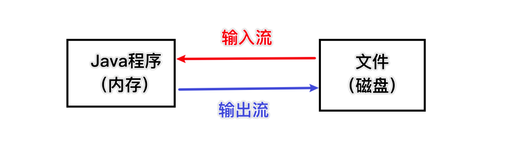
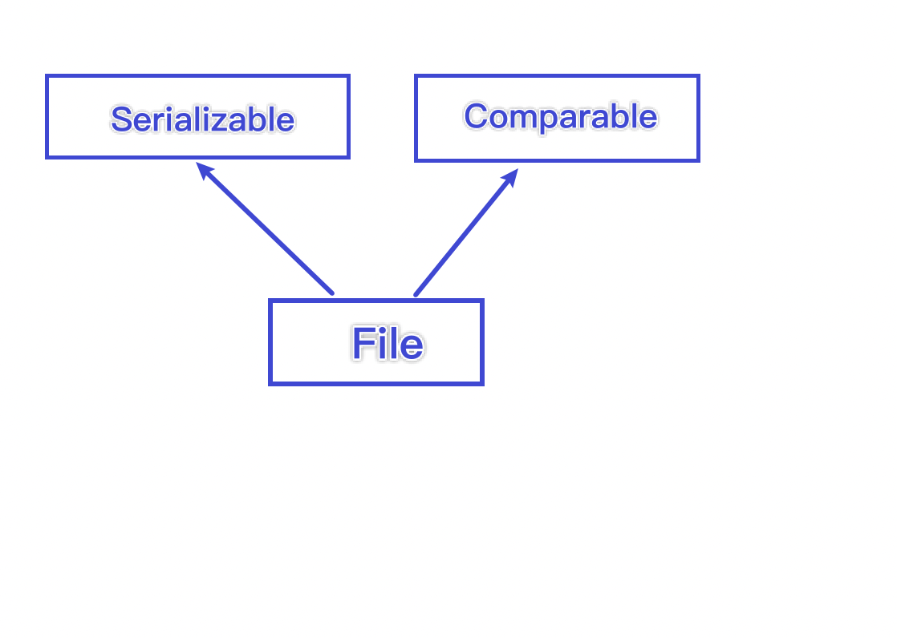

# 文件流

文件在程序中是以流的形式来操作的



# 常用的文件操作




## 相关构造器和方法

| 方法名                                | 作用                      |
| ------------------------------------- | ------------------------- |
| new File(String pathname)             | 根据路径构建一个File对象  |
| new File(File parent, String child)   | 根据父目录文件+子路径构建 |
| new File(String parent, String child) | 根据父目录+子路径构建     |

只有执行了createNewFile方法，才会在磁盘上创建该文件


### 案例

1. new File(String pathname) 根据路径构建一个File对象

   ```java
   public static void create01() {
       String filePath = "/Users/chenyonglin/IdeaProjects/hspEdu/File_/src/main/Files/01.txt";
       File file = new File(filePath);
   
       try {
           file.createNewFile();
           System.out.println("文件创建成功");
       } catch (IOException e) {
           e.printStackTrace();
       }
   }
   ```

2. new File(File parent, String child) 根据父目录文件+子路径构建一个File对象

   ```Java
   public static void create02() {
           File parentFile = new File("/Users/chenyonglin/IdeaProjects/hspEdu/File_/src/main/Files/");
           String fileName = "02.txt";
           File file2 = new File(parentFile , fileName);
   
           try {
               file2.createNewFile();
               System.out.println("文件创建成功");
           } catch (IOException e) {
               e.printStackTrace();
           }
       }
   ```

3. new File(String parent, String child)

   ```JAVA
   public static void create03() {
       String parentFileName = "/Users/chenyonglin/IdeaProjects/hspEdu/File_/src/main/Files/";
       String fileName = "03.txt";
       File file3 = new File(parentFileName , fileName);
   
       try {
           file3.createNewFile();
           System.out.println("文件创建成功");
       } catch (IOException e) {
           e.printStackTrace();
       }
   }
   ```

   

## 获取文件相关信息

| 方法                   | 作用                         |
| ---------------------- | ---------------------------- |
| file.getName()         | 获取文件名                   |
| file.getAbsolutePath() | 获取绝对路径                 |
| file.getParent()       | 得到文件父级目录             |
| file.length()          | 获取文件大小（根据字节统计） |
| file.exists()          | 文件是否存在                 |
| file.isFile()          | 是不是一个文件               |
| file.isDirectory       | 是不是一个目录               |
| ...                    | ...                          |


## 删除文件/目录

在java编程中，目录也被当作成文件，所以仍然适用于相应的方法

```JAVA
public static void m1(){
    String filePath = "/Users/chenyonglin/IdeaProjects/hspEdu/File_/src/main/Files/03.txt";
    File file = new File(filePath);
    if(file.exists()){
        boolean delete = file.delete();
        System.out.println(delete ? "删除成功" : "删除失败");
    }else{
        System.out.println("文件不存在");
    }
}
```


## 创建目录

**创建单级目录**:mkdir

```JAVA
public static void m2(){
    String directoryPath = "/Users/chenyonglin/IdeaProjects/hspEdu/File_/src/main/Files/direct2";
    File file = new File(directoryPath);
    if(file.exists()){
        System.out.println("目录已存在");
    }else{
        boolean result = file.mkdir();
        System.out.println(result ? "创建成功" : "创建失败");
    }
}
```


**创建多级目录**:mkdirs

```JAVA
public static void m2(){
    String directoryPath = "/Users/chenyonglin/IdeaProjects/hspEdu/File_/src/main/Files/direct2/1/2";
    File file = new File(directoryPath);
    if(file.exists()){
        System.out.println("目录已存在");
    }else{
        boolean result = file.mkdirs();
        System.out.println(result ? "创建成功" : "创建失败");
    }
}
```

# IO流简介

1. IO是Input Output的缩写，IO技术是非常实用的技术，用于处理数据传输，如读写文件，网络传输等

2. Java程序中，对于数据的输入 输出以 流stream的方式进行

3. java.io 包下提供了各种流类和接口，用以获取不同种类的数据，并通过方法输入或输出数据

4. 输入input:读取外部数据(磁盘 、 光盘、数据库、网络等) 到 内存中

5. 输出，将内存里的数据，输出到磁盘、光盘等存储数据中

   

## 流的分类

按操作数据单位的不同分为：字节流 (8bit) 、字符流(按字符对应几个字节)

按数据流的流向不同分为：输入流、输出流

按流的角色不同分为：字节流，处理流/包装流


| （抽象基类） | 字节流       | 字符流 |
| ------------ | ------------ | ------ |
| 输入流       | InputStream  | Reader |
| 输出流       | OutputStream | Writer |


1. Java的IO流共涉及40多个类，实际上非常规则，都是从如上四个抽象基类派生的
2. 由这四个类派生出来的子类名称都是以其父类名称作为子类名的后缀


## 流和文件的关系


文件和文件之间，中间传输的对象，就是流。流携带了文件的部分。

可以理解为，输入流/输出流是快递小哥，文件里面的数据 就像物品。

