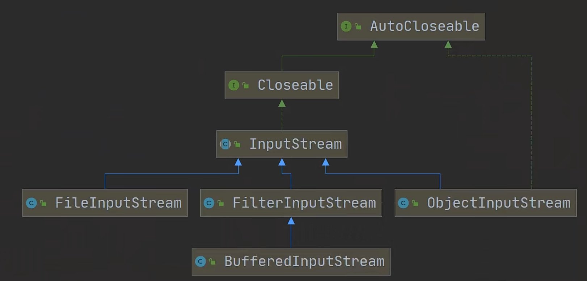
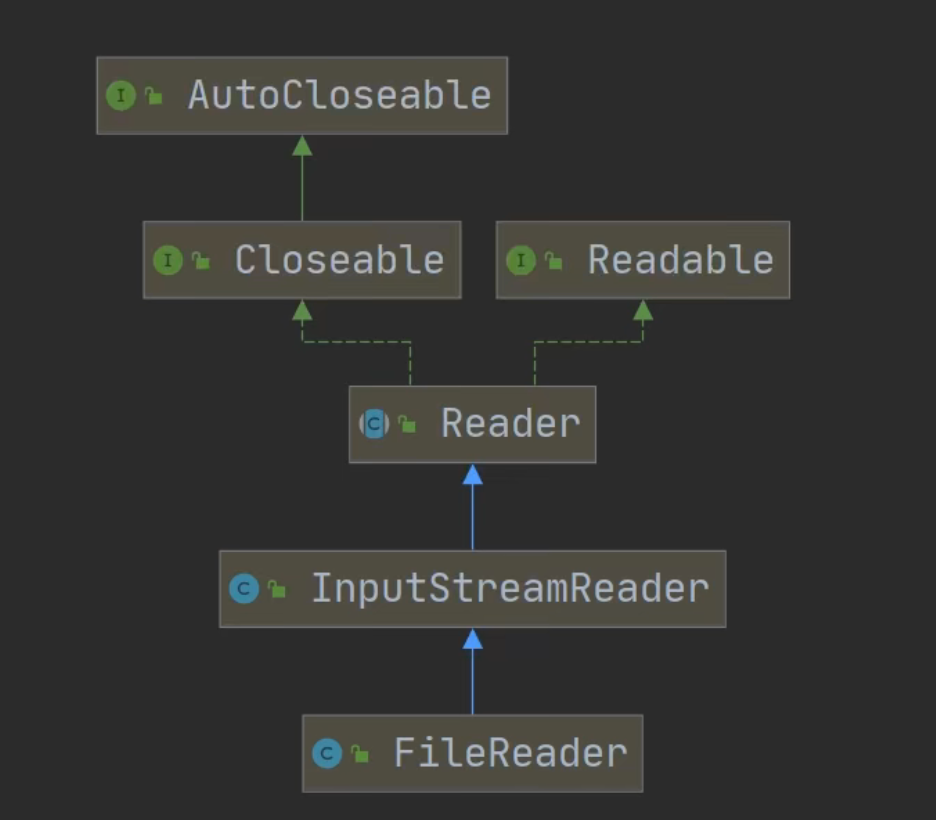
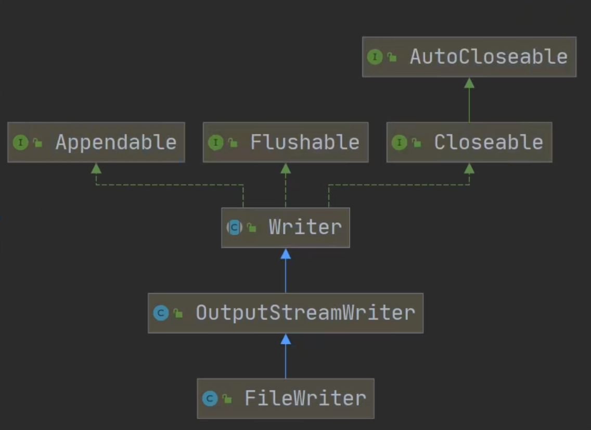

# InputStream字节输入流



## 构造方法

| 方法名                                | 作用                                                  |
| ------------------------------------- | ----------------------------------------------------- |
| FileInputStream(File file)            | 通过打开一个到实际文件的链接来创建一个FileInputStream |
| FileInputStream(FileDescriptor fdobj) | 通过文件描述符创建一个FileInputStream                 |
| FileInputStream(String name)          | 通过路径名指定文件，作用一样                          |


## 方法

| 方法名         | 作用                                                         |
| -------------- | ------------------------------------------------------------ |
| close()        | 关闭文件输入流，释放系统资源                                 |
| read()         | 从输入流读取一个字节的数据，如果没有输入可用，此方法将阻止。返回-1读取完毕 |
| read(byte[] b) | 从输入流读取最多b.length字节的数据到字节数组，此方法将阻止。返回-1读取完毕 |

其他方法可以看文档


## 案例

read()

```JAVA
public static void readFile01(){
        String filePath = "/Users/chenyonglin/IdeaProjects/hspEdu/Stream_/src/main/resources/test.txt";
        FileInputStream fileInputStream = null;

        try {
            fileInputStream = new FileInputStream(filePath);
            int readData;
            while((readData = fileInputStream.read()) != -1){
                System.out.println((char)readData);
            }
        } catch (IOException e) {
            e.printStackTrace();
        }finally {
            //关闭文件流
            try {
                fileInputStream.close();
            } catch (IOException e) {
                e.printStackTrace();
            }
        }
    }
}
```


使用read(byte[] b)提高效率 此时读取8个字节字符。读取正常返回实际读取的字节数

```JAVA
 fileInputStream = new FileInputStream(filePath);
 int readLen;
 byte[] buf = new byte[8];
 while((readLen = fileInputStream.read(buf)) != -1){
		 System.out.println(new String(buf, 0, readLen));
 }
```


# OutputStream字节输出流

## 构造方法

| 方法名                                      | 作用                                                         |
| ------------------------------------------- | ------------------------------------------------------------ |
| FileOutputStream(File file)                 | 创建文件输出流以写入由指定的File对象表示的文件               |
| FileOutputStream(File file, boolean append) | 创建文件输出流以写入由指定的File表示的文件，如果append=true 追加到末尾 |


## 方法

| 方法名                             | 作用                                                     |
| ---------------------------------- | -------------------------------------------------------- |
| close()                            | 关闭文件输出流，释放系统资源                             |
| write(byte[] b)                    | 将b.length个字节从指定的字节数组写入到此输出流           |
| write(byte[] b， int off, int len) | 将len字节从位于偏移量off的指定字节数组写入到此文件输出流 |
| write(int b)                       | 将指定的字节写入到此文件输出流                           |

其他方法可以看文档


1. fileOutputStream = new FileOutputStream(filePath);创建方式，写入内容时会覆盖原来的内容
2. 如果要追加的方式


## 案例

```Java
public static void writeFile() {
    String filePath = "/Users/chenyonglin/IdeaProjects/hspEdu/Stream_/src/main/resources/output.txt";
    FileOutputStream fileOutputStream = null;

    try {
        fileOutputStream = new FileOutputStream(filePath);
        String str = "helloworld";
        fileOutputStream.write(str.getBytes());

    } catch (IOException e) {
        e.printStackTrace();
    } finally {
        try {
            fileOutputStream.close();
        } catch (IOException e) {
            e.printStackTrace();
        }
    }

}
```

## 应用：文件拷贝

```Java
public static void copyFile(String from, String to){
    FileInputStream fileInputStream = null;
    FileOutputStream fileOutputStream = null;
    try {

        fileInputStream = new FileInputStream(from);
        fileOutputStream= new FileOutputStream(to);

        int readLen;
        byte[] text = new byte[8];
        while((readLen = fileInputStream.read(text)) != -1){
            //读取到后，就写入到文件， 通过fileOutputStream
            fileOutputStream.write(text, 0, readLen);
        }
        System.out.println("拷贝OK");


    } catch (IOException e) {
        e.printStackTrace();
    } finally {

        try {
            if(fileInputStream != null){
                fileInputStream.close();
            }
            if(fileOutputStream != null){
                fileOutputStream.close();
            }
        } catch (IOException e) {
            e.printStackTrace();
        }
    }

}
```


# FileReader



## 构造方法

| 方法名                      | 作用 |
| --------------------------- | ---- |
| FileReader(File file)       |      |
| FileReader(String pathName) |      |


## 相关方法

| 方法名       | 作用                                                         |
| ------------ | ------------------------------------------------------------ |
| read()       | 每次读取单个字符，返回该字符，文件末尾返回-1                 |
| read(char[]) | 批量读取多个字符到数组，返回读取到的字符数，如果到文件末尾返回-1 |
|              |                                                              |
|              |                                                              |
|              |                                                              |
|              |                                                              |


## 案例

单个字符读取

```JAVA
public static void main(String[] args) {
    String path = "/Users/chenyonglin/IdeaProjects/hspEdu/Stream_/src/main/resources/output.txt";
    FileReader fileReader = null;
    int data = ' ';
    try {
        fileReader = new FileReader(path);
        while((data = fileReader.read()) != -1){
            System.out.print((char)data);
        }
    } catch (IOException e) {
        e.printStackTrace();
    } finally {
        if(fileReader != null){
            try {
                fileReader.close();
            } catch (IOException e) {
                e.printStackTrace();
            }
        }
    }

}
```

多个字符读取

```JAVA
public static void main(String[] args) {
    String path = "/Users/chenyonglin/IdeaProjects/hspEdu/Stream_/src/main/resources/output.txt";
    FileReader fileReader = null;
    char[] text = new char[8];
    int readLen = 0;
    try {
        fileReader = new FileReader(path);
        while((readLen = fileReader.read(text)) != -1){
            System.out.print(new String(text, 0, readLen));
        }
    } catch (IOException e) {
        e.printStackTrace();
    } finally {
        if(fileReader != null){
            try {
                fileReader.close();
            } catch (IOException e) {
                e.printStackTrace();
            }
        }
    }

}
```

# FileWriter



## 构造方法

| 方法名                            | 作用     |
| --------------------------------- | -------- |
| FileWriter(File file)             | 覆盖模式 |
| FileWriter(String pathName)       | 覆盖模式 |
| FileWriter(File file, true)       | 追加模式 |
| FileWriter(String pathName, true) | 追加模式 |


## 相关方法

| 方法名                  | 作用                   |
| ----------------------- | ---------------------- |
| write(int)              | 写入单个字符           |
| write(char[])           | 写入指定数组           |
| write(char[], off, len) | 写入指定数组的指定部分 |
| write(string)           | 写入整个字符串         |
| weite(string, off, len) | 写入字符串的指定部分   |


## 案例

```JAVA
public static void main(String[] args) {
    String path = "/Users/chenyonglin/IdeaProjects/hspEdu/Stream_/src/main/resources/output3.txt";
    FileWriter fileWriter = null;

    try {
        fileWriter = new FileWriter(path); //默认是覆盖写入
        fileWriter.write("遇见风雨，定见彩虹");
    } catch (IOException e) {
        e.printStackTrace();
    } finally {
        if( fileWriter != null ){
            try {
                fileWriter.close();
            } catch (IOException e) {
                e.printStackTrace();
            }
        }
    }
}
```


