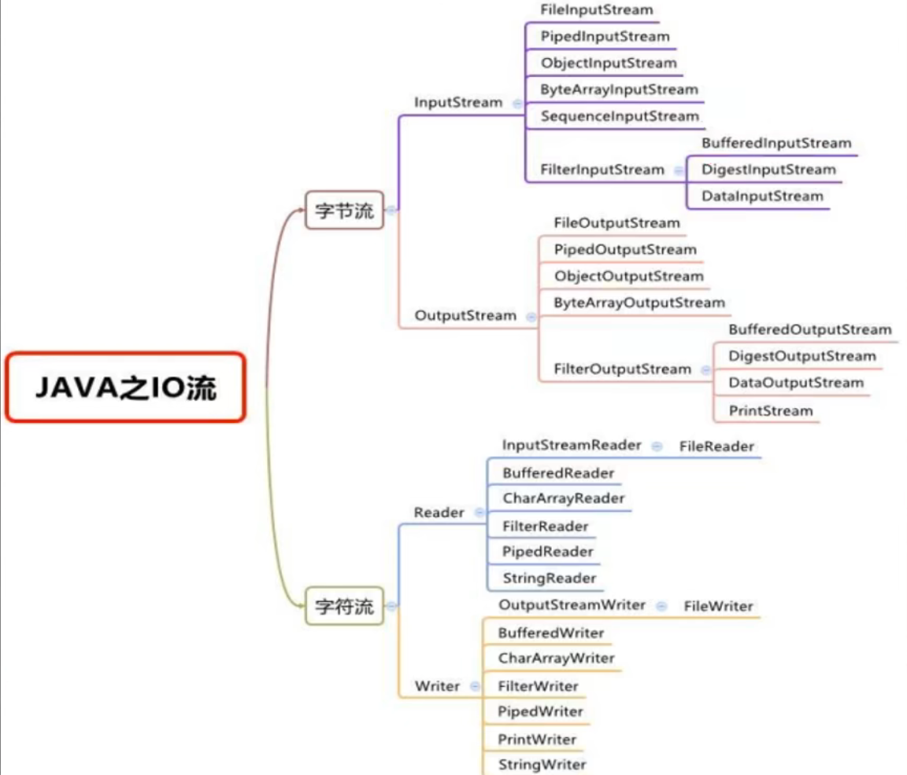
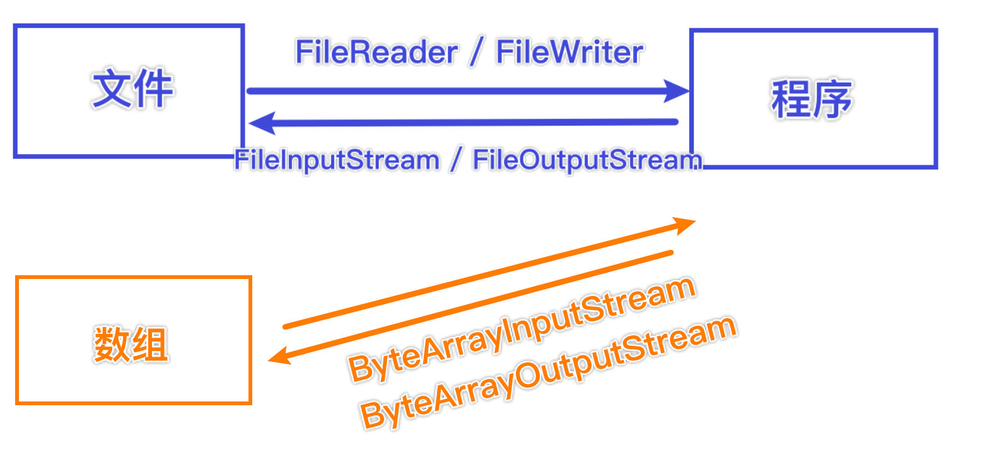
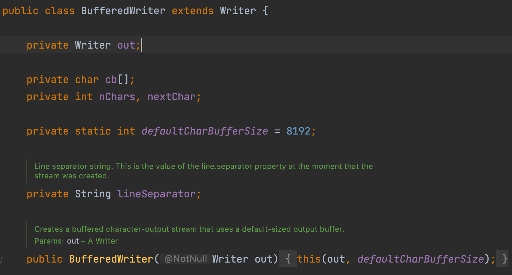
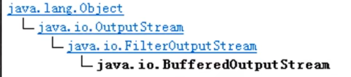
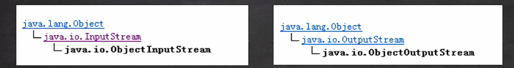
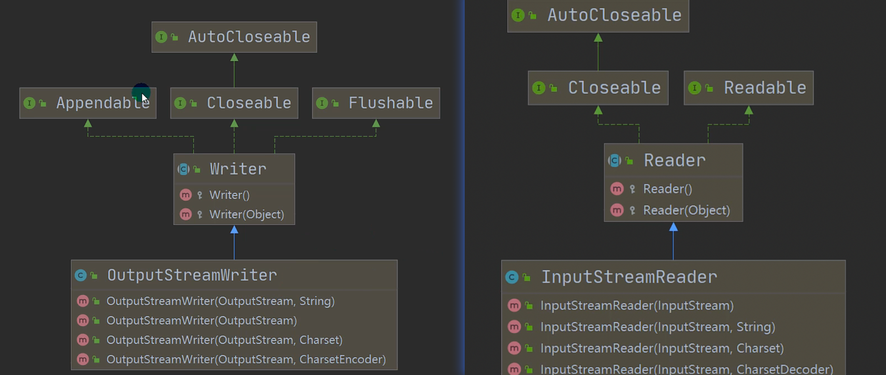
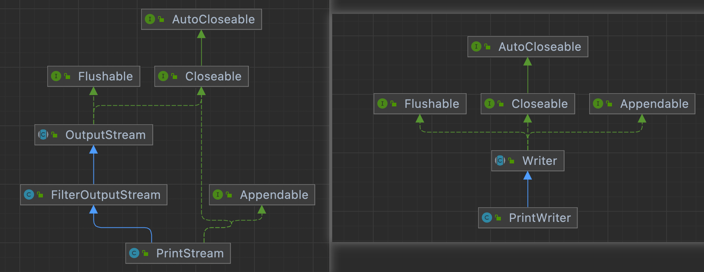
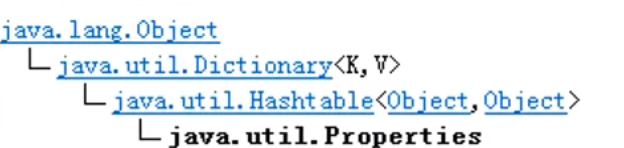

# 节点流和处理流



## 节点流一览

| 分类       | 字节输入流           | 字节输出流            | 字符输入流      | 字符输出流      |
| ---------- | -------------------- | --------------------- | --------------- | --------------- |
| 抽象基类   | InputStream          | OutputStream          | Reader          | Writer          |
| 访问文件   | FileInputStream      | FileOutputStream      | FileReader      | FileWriter      |
| 访问数组   | ByteArrayInputStream | ByteArrayOutputStream | CharArrayReader | CharArrayWriter |
| 访问管道   | PipedInputStream     | PipedOutputStream     | PipedReader     | PipedWriter     |
| 访问字符串 |                      |                       | StringReader    | StringWriter    |

## 处理流一览

| 分类     | 字节输入流          | 字节输出流           | 字符输入流        | 字符输出流         |
| -------- | ------------------- | -------------------- | ----------------- | ------------------ |
| 抽象基类 | InputStream         | OutputStream         | Reader            | Writer             |
| 缓冲流   | BufferedInputStream | BufferedOutputStream | BufferedReader    | BufferedWriter     |
| 转换流   |                     |                      | InputStreamReader | OutputStreamWriter |
| 对象流   | ObjectInputStream   | ObjectOutputStream   |                   |                    |

| 抽象基类   | FilterInputStream   | FilterOutputStream | FilterReader   | FilterWriter |
| ---------- | ------------------- | ------------------ | -------------- | ------------ |
| 打印流     |                     | PrintStream        |                | PrintWriter  |
| 推回输入流 | PushbackInputStream |                    | PushbackReader |              |
| 特殊流     | DataInputStream     | DataOutputStream   |                |              |


## 原理

1. 节点流可以从一个特定的数据源读写数据，比如FileReader、FileWriter

   

   

数据源：就是存放数据的地方


2. 处理流（也叫包装流）是连接在已存在的流之上，为程序提供更为强大的读写功能，比如BufferedReader，BufferedWriter

   

   处理流解决了节点流不够灵活的问题

   BufferedReader类中，有属性Reader

   BufferedWriter类中，有属性Writer 即可以**封装一个节点流**

   该节点流可以是任意的，只要是Reader/Writer的子类即可




## 区别和联系

1. 节点流是底层流/低级流，直接根数据源相接
2. 处理流（包装流）包装节点流，既可以消除不同节点流的实现差异，也可以提供更方便的方法来完成输入输出
3. 处理流 也叫包装流 对节点流进行包装，使用了修饰器设计模式，**不会直接与数据源相连**（只是调用）


处理流的功能主要体现在以下方面：

1. 性能的提高：主要以增加缓冲的方式来提高输入输出的效率
2. 操作的便捷：处理流可能提供了一系列便捷的方法来一次输入输出大批量的数据，使得操作更加灵活方便


## 原理模拟

```JAVA
public abstract class Reader_ { //抽象类
    public void readFile(){

    }
    public void readString(){

    }
}

public class FileReader_ extends Reader_{
    public void readFile(){
        System.out.println("对文件进行读取");
    }
}

public class StringReader_ extends Reader_{
    public void readString(){
        System.out.println("对字符串进行读取");
    }
}


public class BufferedReader_ extends Reader_{
    private Reader_ reader_; //属性是reader类型

    public BufferedReader_(Reader_ reader_) { //接收Reader子类的对象
        this.reader_ = reader_;
    }

    //让方法更加灵活，多次读取文件
    public void readFiles(int num){
        for(int i = 0 ; i < num ; i++){
            reader_.readFile();
        }
    }

    public void readString(int num){
        for(int i = 0 ; i < num ; i++){
            reader_.readString();
        }
    }
}

```

```JAVA
public class Test_ {
    public static void main(String[] args) {
        BufferedReader_ bufferedReader_ = new BufferedReader_(new FileReader_());
        bufferedReader_.readFiles(10);

        //希望通过BufferedReader 多次读取字符串
        BufferedReader_ bufferedReader2_ = new BufferedReader_(new StringReader_());
        bufferedReader2_.readString(5);
    }


}
```


# BufferedReader / Writer

属于字符流，是按照字符来读取数据的

关闭时，只需要关闭外层流即可.底层会自动调用节点流的close

## Reader案例

```JAVA
String filePath = "/Users/chenyonglin/IdeaProjects/hspEdu/Stream_/src/main/resources/test.txt";
BufferedReader bufferedReader = new BufferedReader(new FileReader(filePath)); 
//读取
String line;
//说明
//按行读取文件，当返回空时，文件读取完毕
while((line = bufferedReader.readLine()) != null){
  System.out.println(line);
}
bufferedReader.close();
```


## Writer案例

```JAVA
String filePath = "/Users/chenyonglin/IdeaProjects/hspEdu/Stream_/src/main/resources/output2020.txt";
BufferedWriter bufferedWriter = new BufferedWriter(new FileWriter(filePath));//覆盖方式
							 bufferedWriter = new BufferedWriter(new FileWriter(filePath, true));// 追加方式
bufferedWriter.write("泥嚎，Macau");
bufferedWriter.newLine(); // 插入一个和系统相关换行符
bufferedWriter.write("泥嚎，Macau");
bufferedWriter.write("泥嚎，Macau");

//说明：关闭外层流即可
bufferedWriter.close();
```


## 拷贝案例

```JAVA
String srcFilePath = "/Users/chenyonglin/IdeaProjects/hspEdu/Stream_/src/main/resources/output2020.txt";
String destFilePath = "/Users/chenyonglin/IdeaProjects/hspEdu/Stream_/src/main/resources/output2020Copy.txt";

BufferedReader br = null;
BufferedWriter bw = null;

try{
    br = new BufferedReader(new FileReader(srcFilePath));
    bw = new BufferedWriter(new FileWriter(destFilePath));
    String line;
    while((line = br.readLine()) != null){
        bw.write(line);
        bw.newLine();
    }

}catch (IOException e){
    e.printStackTrace();
} finally {
    try {
        if(br != null) br.close();
        if(bw != null) bw.close();
    } catch (IOException e) {
        e.printStackTrace();
    }
}
```


## 注意

Buffered是按照字符操作 不要去操作二进制文件，会导致文件损坏


# Buffered Input / Output Stream



BufferedOutputStream 是字节流，实现缓冲的输出流，可以将多个字节写入底层输出流中，而不必对每次字节写入调用底层系统


## 拷贝案例

```JAVA
String srcFilePath = "/Users/chenyonglin/IdeaProjects/hspEdu/Stream_/src/main/resources/pic.jpg";
String destFilePath = "/Users/chenyonglin/IdeaProjects/hspEdu/Stream_/src/main/resources/dest.jpg";

//创建BufferedOutputStream BufferedInputStream
BufferedInputStream bis = null;
BufferedOutputStream bos = null;

try {
    int readLen = 0;
    byte[] buff = new byte[1024];
    bis = new BufferedInputStream(new FileInputStream(srcFilePath));
    bos = new BufferedOutputStream(new FileOutputStream(destFilePath));
    while ((readLen = bis.read(buff)) != -1) {
        bos.write(buff, 0, readLen);
    }

} catch (IOException e) {
    e.printStackTrace();
} finally {
    try {
        if(bis != null) bis.close();
        if(bos != null) bos.close();
    } catch (IOException e) {
        e.printStackTrace();
    }
}
```


# 对象流Object Inout / Output Stream

解决了保存值 和 数据类型的问题

就是能够将基本数据类型或对象进行序列化和反序列化


1. 将程序里的值和数据类型保存为文件 -> 序列化

2. 将保存在文件里的数据重新恢复成程序里的值和数据类型 -> 反序列化

3. 需要在某个对象支持序列化机制，必须让其类时可序列化的。为了让某个类时可序列化的。该类必须实现如下两个接口之一:

   Serializable （标记接口，没有方法）

   Externalizable （该接口有方法需要实现，因此我们一般实现上面的接口）




1. 提供了对基本类型或对象类型的序列化和反序列化的方法
2. ObjectOutputStream 提供序列化功能
3. ObjectInputStream提供反序列化功能


## 序列化案例

```Java
public class ObjectOutputStream_ {
    public static void main(String[] args) throws IOException {
        String filePath = "/Users/chenyonglin/IdeaProjects/hspEdu/Stream_/src/main/resources/data.dat";
        //序列化后保存的文件不是纯文本的，而是按照它的格式来保存的，所以后缀没有关系

        ObjectOutputStream oos = new ObjectOutputStream(new FileOutputStream(filePath));

        //序列化到文件
        oos.write(100); //int -> Integer 实现了 Serializable
        oos.writeBoolean(true); // boolean -> Boolean 实现了 Serializable
        oos.writeChar('H'); //char -> Character 实现了 Serializable
        oos.writeDouble(9.5); //double -> Double 实现了 Serializable

        oos.writeObject(new Dog("旺财", 6));

        oos.close();
    }
}

//如果需要序列化某个类的对象，必须实现接口
class Dog implements Serializable {
    private String name;
    private int age;

    public Dog(String name, int age) {
        this.name = name;
        this.age = age;
    }
}
```


## 反序列化案例

```JAVA
public class ObjectInputStream_ {
    public static void main(String[] args) throws IOException, ClassNotFoundException {
        String filePath = "/Users/chenyonglin/IdeaProjects/hspEdu/Stream_/src/main/resources/data.dat";

        ObjectInputStream ois = new ObjectInputStream(new FileInputStream(filePath));

        //1. 读取的顺序需要和你保存数据的顺序一致
        int i = ois.readInt();
        System.out.println(i);

        boolean b = ois.readBoolean();
        System.out.println(b);

        char c = ois.readChar();
        System.out.println(c);

        double v = ois.readDouble();
        System.out.println(v);

        //1 如果我们希望调用Dog方法，我们需要向下转型
        //2 需要我们将Dog类定义，拷贝到可以引用的位置
        Dog o = (Dog) ois.readObject();
        System.out.println(o);

        ois.close();
    }
}
```


## 注意事项

1. 读写顺序要一致
2. 要求序列化或反序列化需要实现Serializable
3. 序列化类中建议添加serialVersionUID 序列化版本号，可以提高版本兼容性
4. 序列化对象时，默认将里面所有属性都要要求序列化，如果不想被序列化，则可以添加transient或static关键字。
5. 序列化对象时，要求里面属性类型也要实现序列化接口
6. 序列化具备可继承性，也就是某个类已经实现了序列化，则它的所有子类也默认实现了序列化


# 标准输入输出流

|            |          | 类型        | 默认设备 |
| ---------- | -------- | ----------- | -------- |
| System.in  | 标准输入 | InputStream | 键盘     |
| System.out | 标准输出 | PrintStream | 显示器   |

## System.in

System类的public final static InputStream in = null

System.in 编译类型 InputStream 运行类型 BufferedInputStream
表示的是标准输入 ： 键盘

## System.out

System类的public final static PrintStream out = null
System.out 编译类型 PrintStream 运行类型 PrintStream
表示的是标准输入 ： 显示器

# 转换流 Input/Output Stream Reader/Writer

把字节流 指定一个编码方式 转换成 字符流



其中 InputStreamReader(InputStream, Charset) 可以传入一个InputStream对象，而且可以指定编码方式


1. InputStreamReader:  Reader的子类，可以将InputStream(字节流)包装成(转换)Reader(字符流)
2. OutputStreamWriter:  Writer的子类，可以将OutputStream(字节流)包装成Writer(字符流)
3. 当处理纯文本数据时，如果使用字符流效率更高，并且可以有效解决中文问题，所以建议将字节流转换成字符流
4. 可以在使用时指定编码格式


## 读取案例 

字节输入流--（指定编码）-->字符输入流

```Java
//将字节流转换成字符流 并指定编码
String filePath = "";
// 指定编码gbk
InputStreamReader isr = new InputStreamReader(new FileInputStream(filePath), "gbk");
// 把InputStreamReader 传入 BufferedReader
BufferedReader br = new BufferedReader(isr);
// 读取
String s = br.readLine();
br.close();
```

字节输出流--（指定编码）-->字符输出流

```JAVA
String filePath = "/Users/chenyonglin/IdeaProjects/hspEdu/Stream_/src/main/resources/luanma.txt";
OutputStreamWriter osw = new OutputStreamWriter(new FileOutputStream(filePath), "gbk");
osw.write("乱码");
osw.close();
System.out.println("按照gbk编码保存文件");
```


# 打印流 PrintStream/Writer



## PrintStream案例

```JAVA
//字节打印流
PrintStream out = System.out; // System.out就是一个字节打印流
out.print("Hello"); //默认情况下，PrintStream输出数据的位置是StdOut，也就是显示器

//因为print底层使用的是write方法，也可以直接使用write方法输出
out.write("哦吼吼吼哦吼".getBytes());

out.close();

//我们可以去修改打印流输出的位置/设备
System.setOut(new PrintStream("/Users/chenyonglin/IdeaProjects/hspEdu/Stream_/src/main/resources/out.txt"));
//将输出位置更改了
System.out.println("输出到外边去了");
```


# 配置文件 Properties




1. 专门用于读写配置文件的集合类

   配置文件格式：

   键=值

2. 注意：键值对不需要有空格，值不需要引号一起来。默认类型是String

3. 常见方法

   | 方法                     | 作用                                                         |
   | ------------------------ | ------------------------------------------------------------ |
   | load                     | 加载配置文件的键值对到Properties对象                         |
   | list                     | 将数据显示到指定设备                                         |
   | getProperties(key)       | 根据键获取值                                                 |
   | setProperties(key,value) | 设置键值对到Properties对象                                   |
   | store                    | 将Properties中的键值对存储到配置文件，在idea中，保存信息到配置文件，如果含有中文，将保存为Unicode编码 |

4. Properties的父类是Hashtable

## 读取案例

```java
//1.创建Properties对象
Properties properties = new Properties();
//2.加载指定配置文件
properties.load(new FileReader("src/main/java/preperties/mysql.properties"));
//3.把k-v显示控制台
properties.list(System.out);
//4.根据Key获取对应的值
String user = properties.getProperty("user");
String pwd = properties.getProperty("pwd");
System.out.println("用户名：" + user);
System.out.println("密码是：" + pwd);
```


## 写入案例

```java
Properties properties = new Properties();
properties.setProperty("charset", "utf8");
properties.setProperty("user","tom");
properties.setProperty("pwd","abc111");
properties.setProperty("user", "汤姆"); //当文件已经有键值对，进行修改
properties.store(new FileOutputStream("src/main/java/preperties/mysql.properties"), "comments");
System.out.println("保存配置文件成功");
```


