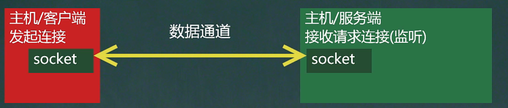
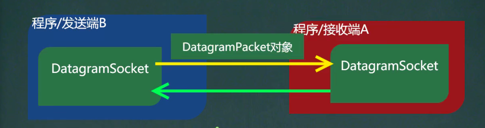

# InetAddress类


```JAVA
//1. 获取本机的InetAddress对象
InetAddress localHost = InetAddress.getLocalHost();
System.out.println(localHost); //100days-PC/192.168.10.33

//2. 根据指定主机名 获取 InetAddress对象
InetAddress host1 = InetAddress.getByName("192.168.10.33");
System.out.println(host1);//100days-PC/192.168.10.33

//3. 根据域名返回InetAddress对象
InetAddress host2 = InetAddress.getByName("www.baidu.com");
System.out.println(host2); //www.baidu.com/183.232.231.172

//4. 通过InetAddress对象，获取对应的地址
String hostAddress = host2.getHostAddress();
System.out.println(hostAddress); //183.232.231.172

//5. 通过InetAddress对象，获取对应的主机名、或者域名
String hostName = host2.getHostName();
System.out.println(hostName); //www.baidu.com
```


# Socket套接字




1. 套接字 开发网络应用程序被广泛采用，以至于成为事实上的标准
2. 通信的**两端都要有Socket对象**，是两台机器间通信的断点
3. 网络通信其实就是Socket间的通信
4. Socket允许程序把网络连接当成一个流，数据在两个Socket间通过IO传输。 
5. 一般主动发起通信的应用程序属客户端，等待通信请求的为服务端


主机/客户端：

当我们需要通讯时

1.socket.getOutputStream() //输出数据

2.socket.getInputStream() //读取数据


主机/服务端：

接受请求连接(监听)：

1.socket.getOutputStream() //输出数据

2.socket.getInputStream() //读取数据


# Socket的两种编程之TCP

**TCP网络通信编程 - 可靠**

## 简介

1. 基于客户端-服务端的网络通信
2. 底层使用的是TCP-IP协议
3. 应用场景举例：客户端发送数据，服务端接受并显示控制台
4. 基于Socket的TCP编程


## 字节流案例


### 客户端单方发送服务端例

**主机、客户端（发起连接者）**


1. 连接服务器（ip，端口）
2. 连接上后，生成Socket，通过socket.getOutputStream()
3. 通过输出流，写入数据到 数据通道


```java
package socket;

import java.io.IOException;
import java.io.OutputStream;
import java.net.InetAddress;
import java.net.Socket;
import java.net.UnknownHostException;

public class SocketTCP01Client {
    public static void main(String[] args) throws IOException {
        //1. 连上客户端 (连接本机的9999端口) 如果连接成功，返回socket对象
        Socket socket = new Socket(InetAddress.getLocalHost(), 9999);

        System.out.println("服务器端socket = " + socket.getClass());
        //2. 连接上后，生成Socket，通过返回socket.getOutputStream();
        //  得到 和 socket对象关联的输出流对象
        OutputStream outputStream = socket.getOutputStream();
        //3. 通过数据流，写数据到数据通道
        outputStream.write("Hello, I am Client!".getBytes());

        //4. 关闭流和socket 必须关闭
        outputStream.close();
        socket.close();
        System.out.println("客户端已退出！");
    }
}
```


**主机、服务端（接收请求连接 监听）**

1. 在本机的9999端口监听，等待连接
2. 当没有客户端连接9999端口时，程序会阻塞，等待连接
3. 通过socket.getInputStream() 读取客户端写入到数据通道的数据，显示


```java
package socket;

import java.io.IOException;
import java.io.InputStream;
import java.net.ServerSocket;
import java.net.Socket;

public class SocketTCP01Server {
    public static void main(String[] args) throws IOException {
        //1. 在本机 9999端口监听,要求9999端口 没有被占用
        ServerSocket serverSocket = new ServerSocket(9999);
        System.out.println("服务端在9999端口监听，等待连接");

        //2. 当没有客户端连接9999端口时，程序会阻塞，等待连接
        // 如果有客户端连接，则会返回socket对象，程序继续
        // serverSocket可以通过accept()方法 返回多个Socket[多个客户端连接服务器来进行并发]
        Socket socket = serverSocket.accept();
        System.out.println("socket =" + socket.getClass());

        //3. 通过socket.getInputStream(), 读取客户端写入到数据通道的数据，显示
        InputStream inputStream = socket.getInputStream();

        //4. IO读取
        byte[] buf = new byte[1024];
        int readLen = 0;
        while((readLen = inputStream.read(buf)) != -1){
            System.out.println(new String(buf, 0, readLen));
        }

        //5. 关闭流和socket
        inputStream.close();
        socket.close();
        System.out.println("服务器已退出");

    }
}
```


### 客户方发送完服务端响应案例

Server

```java
package socket;

import java.io.IOException;
import java.io.InputStream;
import java.io.OutputStream;
import java.net.ServerSocket;
import java.net.Socket;

public class SocketTCP01Server {
    public static void main(String[] args) throws IOException {
        //1. 在本机 9999端口监听,要求9999端口 没有被占用
        ServerSocket serverSocket = new ServerSocket(9999);
        System.out.println("服务端在9999端口监听，等待连接");

        //2. 当没有客户端连接9999端口时，程序会阻塞，等待连接
        // 如果有客户端连接，则会返回socket对象，程序继续
        // serverSocket可以通过accept()方法 返回多个Socket[多个客户端连接服务器来进行并发]
        Socket socket = serverSocket.accept();
        System.out.println("socket =" + socket.getClass());

        //3. 通过socket.getInputStream(), 读取客户端写入到数据通道的数据，显示
        InputStream inputStream = socket.getInputStream();

        //4. IO读取
        byte[] buf = new byte[1024];
        int readLen = 0;
        while((readLen = inputStream.read(buf)) != -1){
            System.out.println(new String(buf, 0, readLen));
        }


        //5. 获取socket相关联的输出流
        OutputStream outputStream = socket.getOutputStream();
        outputStream.write("hello Client! , I am Server!".getBytes());
        socket.shutdownOutput(); //设置写入结束标记

        //5. 关闭流和socket
        inputStream.close();
        outputStream.close();
        socket.close();
        System.out.println("服务器已退出");

    }
}
```


Client

```java
package socket;

import java.io.IOException;
import java.io.InputStream;
import java.io.OutputStream;
import java.net.InetAddress;
import java.net.Socket;
import java.net.UnknownHostException;

public class SocketTCP01Client {
    public static void main(String[] args) throws IOException {
        //1. 连上客户端 (连接本机的9999端口) 如果连接成功，返回socket对象
        Socket socket = new Socket(InetAddress.getLocalHost(), 9999);

        System.out.println("服务器端socket = " + socket.getClass());
        //2. 连接上后，生成Socket，通过返回socket.getOutputStream();
        //  得到 和 socket对象关联的输出流对象
        OutputStream outputStream = socket.getOutputStream();
        //3. 通过数据流，写数据到数据通道
        outputStream.write("Hello, I am Client!".getBytes());
        socket.shutdownOutput(); //设置输出结束标记


        //4. 获取信息
        InputStream inputStream = socket.getInputStream();
        byte[] buf = new byte[1024];
        int readLen = 0;
        while((readLen = inputStream.read(buf)) != -1){
            System.out.println(new String(buf, 0, readLen));
        }


        //6. 关闭流和socket 必须关闭
        outputStream.close();
        inputStream.close();
        socket.close();
        System.out.println("客户端已退出！");
    }
}
```


## 字符流案例

### 客户端

1. socket.getOutputStream()
2. 将OutputStream -> Writer
3. 这里需要使用转换流 OutputStreamWriter 字节流

```JAVA
package socket;

import java.io.*;
import java.net.InetAddress;
import java.net.Socket;

public class SocketTCP03Client {
    public static void main(String[] args) throws IOException {
        //1. 连上客户端 (连接本机的9999端口) 如果连接成功，返回socket对象
        Socket socket = new Socket(InetAddress.getLocalHost(), 9999);

        System.out.println("服务器端socket = " + socket.getClass());
        //2. 连接上后，生成Socket，通过返回socket.getOutputStream();
        //  得到 和 socket对象关联的输出流对象
        OutputStream outputStream = socket.getOutputStream();
        //3. 通过数据流，写数据到数据通道 使用字符流
        BufferedWriter bufferedWriter = new BufferedWriter(new OutputStreamWriter(outputStream));
        bufferedWriter.write("From Client : hello, server!");
        bufferedWriter.newLine(); // 插入一个换行符，表示写入内容结束，注意，要求对方使用readLine() 读取
        bufferedWriter.flush(); //如果使用字符流，需要手动刷新，否则数据不会写入通道


        //4. 获取信息
        InputStream inputStream = socket.getInputStream();
        BufferedReader bufferedReader = new BufferedReader(new InputStreamReader(inputStream));
        String s = bufferedReader.readLine();
        System.out.println(s);


        //6. 关闭流和socket 必须关闭
        outputStream.close();
        inputStream.close();
        socket.close();
        System.out.println("客户端已退出！");
    }
}

```


### 服务端

1. socket.getInputStream()
2. 将InputStream -> Reader
3. 使用转换流InputStreamReader 
4. 设置写入结束标记，writer.newLine() //换行符


```java
package socket;

import java.io.*;
import java.net.ServerSocket;
import java.net.Socket;

public class SocketTCP03Server {
    public static void main(String[] args) throws IOException {
        //1. 在本机 9999端口监听,要求9999端口 没有被占用
        ServerSocket serverSocket = new ServerSocket(9999);
        System.out.println("服务端在9999端口监听，等待连接");

        //2. 当没有客户端连接9999端口时，程序会阻塞，等待连接
        // 如果有客户端连接，则会返回socket对象，程序继续
        // serverSocket可以通过accept()方法 返回多个Socket[多个客户端连接服务器来进行并发]
        Socket socket = serverSocket.accept();
        System.out.println("socket =" + socket.getClass());

        //3. 通过socket.getInputStream(), 读取客户端写入到数据通道的数据，显示
        InputStream inputStream = socket.getInputStream();

        //4. IO读取, 使用字符流，将inputStream转换成字符流
        BufferedReader bufferedReader = new BufferedReader(new InputStreamReader(inputStream));
        String s = bufferedReader.readLine();
        System.out.println(s);

        //5. 获取socket相关联的输出流
        OutputStream outputStream = socket.getOutputStream();
        // 使用字符输出流的方式回复信息
        BufferedWriter bufferedWriter = new BufferedWriter(new OutputStreamWriter(outputStream));
        bufferedWriter.write("From Server : hello Client! , I am Server!");
        bufferedWriter.newLine();
        bufferedWriter.flush();

        //5. 关闭流和socket
        inputStream.close();
        outputStream.close();
        socket.close();
        System.out.println("服务器已退出");
    }
}
```


## 文件拷贝案例

将客户端的图片，通过网络上传到服务器，服务器回复消息

1. 客户端将磁盘上的图片转换成文件字节数组
2. 将文件字节数组 通过 字节流的方式 发送给服务端
3. 服务端获取数据，并存放为字节数组后，存放到本地文件
4. 服务端同时回复已收到消息给客户端
5. 客户端等待服务端回复并打印


### 服务端

```java
package upload;

import java.io.*;
import java.net.ServerSocket;
import java.net.Socket;

public class TCPFileUploadServer {
    public static void main(String[] args) throws Exception {
        //1. 服务端在本机监听8888端口
        ServerSocket serverSocket = new ServerSocket(8888);
        System.out.println("服务端在8888端口监听");
        //2. 等待连接
        Socket socket = serverSocket.accept();

        //3. 读取客户端发送的数据
        BufferedInputStream bis = new BufferedInputStream(socket.getInputStream());
        byte[] bytes = StreamUtils.streamToByteArray(bis);

        //4. 将得到的bytes写出到文件
        String outputPath = "src/output.jpg";
        BufferedOutputStream bos = new BufferedOutputStream(new FileOutputStream(outputPath));
        bos.write(bytes);

        //5. 回复客户端
        BufferedWriter bufferedWriter = new BufferedWriter(new OutputStreamWriter(socket.getOutputStream()));
        bufferedWriter.write("Server ： 已成功收到文件");
        bufferedWriter.newLine();
        bufferedWriter.flush();

        bufferedWriter.close();


        //关闭其他资源
        bos.close();
        bis.close();
        socket.close();


    }
}
```


### 客户端

```java
package upload;

import java.io.*;
import java.net.InetAddress;
import java.net.Socket;
import java.net.UnknownHostException;

public class TCPFileUploadClient {
    public static void main(String[] args) throws Exception {
        //客户端连接8888, 得到socket对象
        Socket socket = new Socket(InetAddress.getLocalHost(), 8888);
        //写入到输入流
        String filePath = "src/main/java/upload/1.jpg";
        BufferedInputStream bis = new BufferedInputStream(new FileInputStream(filePath));
        byte[] bytes = StreamUtils.streamToByteArray(bis); //通过工具类 获取到图片内容(自定义的工具类)

        //通过socket获取到一个输出流，将bytes数据发送给服务端
        BufferedOutputStream bos = new BufferedOutputStream(socket.getOutputStream());
        bos.write(bytes);  // 将文件对应的字节数组的内容，写入到数据通道
        bis.close();
        socket.shutdownOutput(); //设置写入数据结束标记

        //等待服务器回复
        InputStream inputStream = socket.getInputStream();
        BufferedReader bufferedReader = new BufferedReader(new InputStreamReader(inputStream));
        System.out.println(bufferedReader.readLine());
        inputStream.close();

        bos.close();
        socket.close();


    }
}
```


# TCP之netstat指令

1. netstat -an 可以查看当前主机网络情况，包括端口**监听情况和网络连接情况**

2. netstat -an | more 可以分页显示

3. 要求在dos控制台下

说明：

Listening表示某个端口在监听

如果有一个外部程序连接到该端口，就会显示一条连接

可以输入ctrl + c推出程序


# TCP之客户端端口

当客户端连接到服务端后，实际上**客户端也是通过一个端口和服务端进行通讯**，这个端口是TCP/IP来分配的，是不确定的，随机的


# 

# UDP网络通信编程

## 简介

1. 类DatagramSocket和DatagramPacket实现了UDP协议网络程序
2. UDP数据报一定能够安全送到目的地，也不能确定什么时候可以抵达
3. DatagramPacket对象封装了UDP数据报，在数据报中包含了发送端ip地址和端口号以及接收端ip地址和端口号
4. UDP协议中的每个数据报都给出了完整的地址信息，因此无需建立发送方和接收方的连接



说明：

1. 没有明确的客户端和服务端，演变成数据的发送端和接收端
2. 接收数据和发送数据是通过DatagramSocket对象完成
3. 将数据封装到Datagrampacket对象 装包
4. 当接收到Datagrampacket对象，需要进行拆包，取出数据
5. datagramsocket可以指定在哪个端口接收数据

## 案例

1. 核心的两个类、对象DatagramSocket和DatagramPacket
2. 建立发送端，接收端
3. 建立数据包
4. 调用DatagramSocket的发送、接收方法
5. 关闭DatagramSocket

**UDPReceiverA**

```java
package udp;
import java.io.IOException;
import java.net.DatagramPacket;
import java.net.DatagramSocket;
import java.net.InetAddress;
import java.net.SocketException;
import java.nio.charset.StandardCharsets;

public class UDPReceiverA {
    public static void main(String[] args) throws IOException {
        //1. 创建一个DatagramSocket对象，准备在9999接收数据
        DatagramSocket socket = new DatagramSocket(9999);

        //2. 构建一个DatagramPacket对象，准备接收数据
        byte[] buf = new byte[1024];
        DatagramPacket packet = new DatagramPacket(buf, buf.length);

        //3. 调用接收方法 将通过网络接收到的DatagramPacket对象，填充到packet对象
        //当有数据包发送到本机的9999端口时，就会接收到数据，如果没有数据包发送，就会阻塞等待
        socket.receive(packet);

        //4. 可以把packet进行拆包，取出数据，并显示
        int length = packet.getLength(); //实际接收到的数据长度
        byte[] data = packet.getData();// 接收到的数据
        String s = new String(data, 0, length);
        System.out.println(s);

        //5. 发送回应数据
        byte[] datas = "A: 好的，收到，明天一定到".getBytes();
        DatagramPacket datagramPacket = new DatagramPacket(datas, datas.length, InetAddress.getLocalHost(), 9998);
        socket.send(datagramPacket);

        //6. 关闭资源
        socket.close();

    }
}
```

**UDPSenderB**

```java
package udp;

import java.io.IOException;
import java.net.*;

public class UDPSenderB {
    public static void main(String[] args) throws IOException {
        //1. 创建DatagramSocket对象，准备发送和接收数据
        DatagramSocket socket = new DatagramSocket(9998);

        //2. 将需要发送的数据，封装到 DatagramPacket对象
        byte[] data = "B：hello 明天吃火锅".getBytes();


        DatagramPacket packet = new DatagramPacket(data, data.length, InetAddress.getLocalHost(), 9999);

        //3. 发送资源
        socket.send(packet);

        //4. 等待接收
        byte[] datas = new byte[1024];
        DatagramPacket datagramPacket = new DatagramPacket(datas, datas.length);
        socket.receive(datagramPacket); //阻塞等待
        int len = datagramPacket.getLength();
        String s = new String(datas, 0, len);
        System.out.println(s);

        //5. 关闭资源
        socket.close();
        System.out.println("B端退出");
    }
}
```
