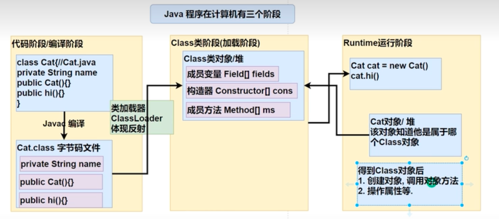

# 反射机制

## 需求引出功能

1. 根据配置文件指定信息，创建配置文件路径的对象，并且调用其方法hi

2. 这样的需求在学习框架时特别多，即通过外部文件配置，在不修改源码的情况下来控制程序，也符合设计模式的ocp原则（不修改代码，扩容功能）

   

   ```java
   import java.io.FileInputStream;
   import java.io.IOException;
   import java.lang.reflect.InvocationTargetException;
   import java.lang.reflect.Method;
   import java.util.Properties;
   
   public class test {
       public static void main(String[] args) throws ClassNotFoundException, InstantiationException, IllegalAccessException, IOException, NoSuchMethodException, InvocationTargetException {
           String path = "src/main/java/1.dat";
           Properties properties = new Properties();
           properties.load(new FileInputStream(path));
           //读取配置项
           String classfullpath = properties.getProperty("classfullpath");
           String methodName = properties.getProperty("method");
           //获取到类
           Class cls = Class.forName(classfullpath);
           Object o = cls.newInstance();
           //在反射中，能把方法视为对象
           Method method = cls.getMethod(methodName);
           //通过method(方法对象)调用say方法
           method.invoke(o);
   
       }
   }
   ```

```
classfullpath=Cat
method=say
```

```JAVA
public class Cat {
    public void say(){
        System.out.println("hiiiii");
    }
}
```


## 介绍

1. 反射机制允许程序在执行期借助于Reflaction API取得任何类的内部信息(比如成员变量，构造器，成员方法等)，并能操作对象的属性及方法，反射在设计模式和框架底层都会用得到。
2. 加载完类后，在堆中就产生了一个Class类型的对象（一个类只有一个Class对象），这个对象包含了完整的类结构信息。通过这个对象得到类的结构。这个对象就像一面镜子，透过这个镜子看到累的结构。所以称为反射。




## 反射机制用处

1. 在运行时判断任意一个对象所属的类
2. 在运行时构造任意一个类的对象
3. 在运行时得到任意一个类所具有的成员变量和方法
4. 在运行时调用任意一个对象的成员变量和方法
5. 生成动态代理


## 反射相关的主要类

1. java.lang.Class 代表一个类，Class对象表示某个类加载后在堆中的对象
2. java.lang.reflect.Method 代表类的方法
3. java.lang.reflect.Field 代表类的成员变量
4. java.lang.reflect.Constructor 代表类的构造方法


**使用例**

```java
Field nameField = cls.getField("age"); //注意 getField 不能得到私有的属性
System.out.println(nameField.get(o));

Constructor constructor = cls.getConstructor(); //返回无参构造器
System.out.println(constructor);

Constructor constructor1 = cls.getConstructor(Integer.class); //传入形参的class对象,返回有参构造器
System.out.println(constructor1);
```

## 

## 优缺点

1. 优点：可以动态的创建和使用对象（也是框架核心底层），使用灵活，没有反射机制，框架就失去了底层支撑
2. 缺点：使用反射基本是解释执行，对执行速度有影响


## 反射执行速度优化

1. Method和Field Comstructor对象都有setAcessible方法
2. setAccessible作用是启动和禁用访问安全检查的开关
3. 参数值为true表示，反射的对象在使用时取消访问检查，提高反射的效率，参数值为false表示反射的对象执行访问检查


