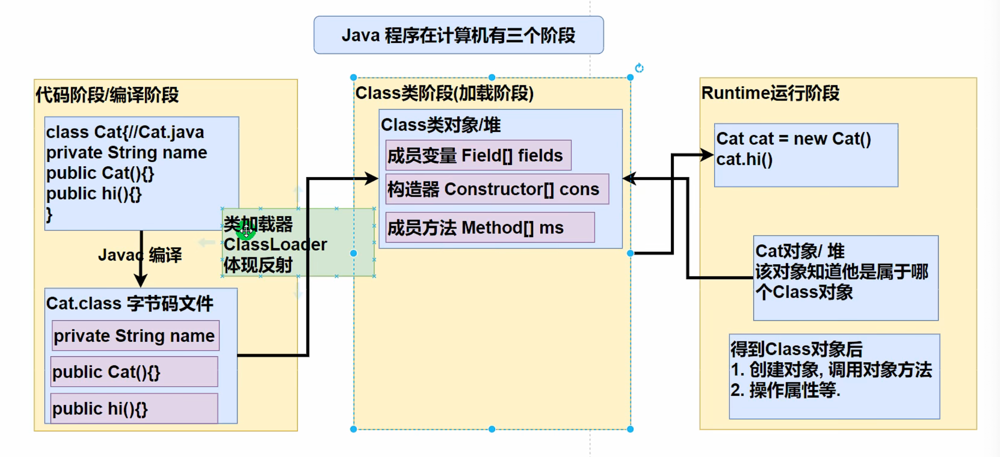
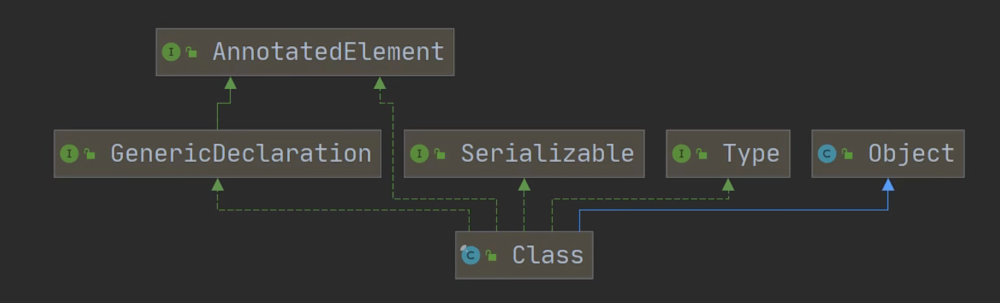

# 反射机制

## 需求引出功能

1. 根据配置文件指定信息，创建配置文件路径的对象，并且调用其方法hi

2. 这样的需求在学习框架时特别多，即通过外部文件配置，在不修改源码的情况下来控制程序，也符合设计模式的ocp原则（不修改代码，扩容功能）

   

   ```java
   import java.io.FileInputStream;
   import java.io.IOException;
   import java.lang.reflect.InvocationTargetException;
   import java.lang.reflect.Method;
   import java.util.Properties;
   
   public class test {
       public static void main(String[] args) throws ClassNotFoundException, InstantiationException, IllegalAccessException, IOException, NoSuchMethodException, InvocationTargetException {
           String path = "src/main/java/1.dat";
           Properties properties = new Properties();
           properties.load(new FileInputStream(path));
           //读取配置项
           String classfullpath = properties.getProperty("classfullpath");
           String methodName = properties.getProperty("method");
           //获取到类
           Class cls = Class.forName(classfullpath);
           Object o = cls.newInstance();
           //在反射中，能把方法视为对象
           Method method = cls.getMethod(methodName);
           //通过method(方法对象)调用say方法
           method.invoke(o);
   
       }
   }
   ```

```
classfullpath=Cat
method=say
```

```JAVA
public class Cat {
    public void say(){
        System.out.println("hiiiii");
    }
}
```


## 介绍

1. 反射机制允许程序在执行期借助于Reflaction API取得任何类的内部信息(比如成员变量，构造器，成员方法等)，并能操作对象的属性及方法，反射在设计模式和框架底层都会用得到。
2. 加载完类后，在堆中就产生了一个Class类型的对象（一个类只有一个Class对象），这个对象包含了完整的类结构信息。通过这个对象得到类的结构。这个对象就像一面镜子，透过这个镜子看到累的结构。所以称为反射。




## 反射机制用处

1. 在运行时判断任意一个对象所属的类
2. 在运行时构造任意一个类的对象
3. 在运行时得到任意一个类所具有的成员变量和方法
4. 在运行时调用任意一个对象的成员变量和方法
5. 生成动态代理


## 反射相关的主要类

1. java.lang.Class 代表一个类，Class对象表示某个类加载后在堆中的对象
2. java.lang.reflect.Method 代表类的方法
3. java.lang.reflect.Field 代表类的成员变量
4. java.lang.reflect.Constructor 代表类的构造方法


**使用例**

```java
Field nameField = cls.getField("age"); //注意 getField 不能得到私有的属性
System.out.println(nameField.get(o));

Constructor constructor = cls.getConstructor(); //返回无参构造器
System.out.println(constructor);

Constructor constructor1 = cls.getConstructor(Integer.class); //传入形参的class对象,返回有参构造器
System.out.println(constructor1);
```

## 

## 优缺点

1. 优点：可以动态的创建和使用对象（也是框架核心底层），使用灵活，没有反射机制，框架就失去了底层支撑
2. 缺点：使用反射基本是解释执行，对执行速度有影响


## 反射执行速度优化

1. Method和Field Comstructor对象都有setAcessible方法
2. setAccessible作用是启动和禁用访问安全检查的开关
3. 参数值为true表示，反射的对象在使用时取消访问检查，提高反射的效率，参数值为false表示反射的对象执行访问检查


# Class

## 类图



1. Class也是类，因此继承Object类

2. Class类对象不是new出来的，而是系统构建的

   1. 传统new对象：new Dog()    -> 使用了loadClass类进行类装载这个类的Class对象
   2. 反射方式：Class aClass = Class.forName("com.test.Dog")  -> 还是使用了loadClass类进行类装载这个类的Class对象

3. 对于某个类的Class类对象，在内存中只有一份，因为类只加载一次

4. 每个类的实例都会记得自己由哪一个Class实例所生成

5. 通过Class对象可以完整地得到一个类的完整结构，通过一系列API

6. Class对象是存放在堆的

7. 类的字节二进制码，是放在方法区的，有的地方称为类的元数据

   

## 相关方法

| 方法名                            | 作用                                                         |
| --------------------------------- | ------------------------------------------------------------ |
| static Class forName(String name) | 返回指定类名的Class对象                                      |
| Object newInstance()              | 调用缺省构造函数，返回该Class对象的一个实例                  |
| getName()                         | 返回此Class对象所表示的实体 ( 类、接口、数组类、基本类型等 ) 名称 |
| Class getSuperClass()             | 返回当前Class对象的父类的Class对象                           |
| Class[] getInterfaces()           | 获取当前Class对象的借口                                      |
| ClassLoader getClassLoader()      | 返回一个包含某些Constructor对象的数组                        |
| Field[] getDeclaredFields()       | 返回Field对象的一个数组                                      |
| Method getMethod                  | 返回一个Method对象，此对象的形参类型为paramType              |


```java
package com.chyl;

import java.lang.reflect.Field;

public class ClassExample {
    public static void main(String[] args) throws ClassNotFoundException, InstantiationException, IllegalAccessException, NoSuchFieldException {
        String classAllPath = "com.chyl.Dog";
        Class<?> aClass = Class.forName(classAllPath);  //<?> 表示不确定的Java类型
        // 输出cls
        System.out.println(aClass);  //显示aClass对象是哪个类的Class对象
        System.out.println(aClass.getClass());  //显示运行类型 -> java.lang.Class
        System.out.println(aClass.getPackage().getName());  //显示包名
        System.out.println(aClass.getName());  //得到全类名

        //通过aclass获得对象
        Dog dog = (Dog)aClass.newInstance();
        System.out.println(dog);

        //通过反射获取属性
        Field name = aClass.getField("name");
        System.out.println(name.get(dog));

        //通过反射给属性赋值
        name.set(dog, "二狗");
        System.out.println(name.get(dog));

        //通过遍历获得所有的属性（字段） 的名字
        System.out.println("通过遍历获得所有的属性（字段） 的名字");
        Field[] fields = aClass.getFields();
        for (Field field : fields) {
            System.out.println(field.getName());
        }

    }
}
```


## 得到Class对象的各种方式

1. 前提：已经一个类的全类名，且在该路径下，可以通过Class类的静态方法forName() 获取，可能抛出ClassNotFoundException

   ```
   Class cls1 = Class.forName("java.lang.Cat");
   ```

   应用场景：多用于配置文件，读取类全路径名，加载类

2. 前提：若已知具体的类，通过类的class获取，该方式最为安全可靠，程序性能最高的

   ```
   System.out.println(Car.class);
   ```

   应用场景：用于参数传递

3. 已知某个类的实例，调用该实例的getClass()方法获取Class对象（直接获取运行类型）

   ```
   Class class = carObj.getClass();
   ```

   应用场景：有对象实例

4. 通过类加载器 来获取到类的Class对象

   ```java
   //1. 先得到类加载器
   ClassLoader classLoader = car.getClass().getClassLoader();
   //2. 通过类加载器得到Class对象
   Class cls4 = classLoader.loadClass("java.lang.Cat");
   System.out.println(cls4);
   ```

5. 基本数据类型

   ```
   Class cls = 基本数据类型.class
   ```

6. 基本数据类型对应的包装类

   ```
   Class cls = 包装类.TYPE
   ```

   

## 哪些类型有Class对象

1. 外部类、成员内部类、静态内部类、局部内部类、匿名内部类
2. interface：接口
3. 数组
4. enum：枚举
5. annotation：注解
6. 基本数据类型
7. void


# 类加载

## 是什么

反射机制是java实现动态语言的关键，也就是通过反射实现类动态加载

1. 静态加载：编译时加载相关的类，如果没有则报错，依赖性太强（有错编译器直接报错）
2. 动态加载：运行时加载需要的类，如果运行时不用该类，则不报错，降低了依赖性（有错执行的时候才会异常）


## 类加载时期

1. 当创建对象时
2. 当子类被加载时
3. 调用类中的静态成员时
4. 通过反射


**一、编译阶段**

Java源码 进行编译，生成字节码文件


**二、类加载阶段**

字节码文件 运行

1. **加载 Loading**

   ​	将类的class文件读入内存，并且为之创建一个Class对象，此过程由类加载器完成。

   

2. **连接 Linking（验证、准备、解析）**

   ​	验证：对文件的安全性进行校验

   ​	准备：对静态变量进行默认初始化并且分配空间

   ​	解析：将符号引用转成字节引用

​		此阶段将类的二进制数据合并到JRE中

3. **初始化 Initialization** 

   ​	JVM负责对类进行初始化，这里主要指的是静态成员

   ​	开始真正的定义Java中的静态代码


类加载完毕后 内存布局情况：

方法区：类的字节码二进制数据

堆区：根据方法区的二进制数据生成类的Class对象


## 类加载的三个阶段

### 加载阶段

​		JVM在该阶段的主要目的是将字节码从不同的数据源（可能是class文件、也可能是jar包，甚至是网络）转化为二进制字节流加载到内存中，并生成一个代表类的Class对象


### 连接阶段

**1.验证**

1. 目的是确保Class文件的字节流中包含的信息符合当前的虚拟机要求，并且不会危害虚拟机自身的安全
2. 包括：文件格式验证（是否以魔数oxcafebabe开头）、元数据验证、字节码验证和符号引用验证
3. 可以考虑使用-Xverify:none参数来关闭大部分的类验证措施，缩短虚拟机类加载的时间


**2.准备**

​		JVM会在该阶段对静态变量，分配内存并默认初始化（对应数据类型的默认初始值，如0、0L、null、false等）。这些变量所使用的内存都在方法区中进行区分分配

``` java
class A {
	public int n1 = 10;
  // n1是实例属性，不是静态变量，在准备阶段不会分配内存
	public static int n2 = 20;
  // n2是静态变量，分配内存 n2 是默认初始化0，而不是20
	public static final int n3 = 30;
  // n3是static final 是常量，他和静态变量不一样，因为一旦赋值就不变了 n3=30
}
```


**3.解析**

虚拟机将常量池内的符号引用替换为直接引用（真正的内存地址）的过程


### 初始化阶段

1. 到初始化阶段，才真正开始执行类中定义的Java程序代码，此阶段是执行\<clinit>() 方法的过程
2. \<clinit>() 方法是由编译器按语句在源文件中出现的顺序，依次自动收集类中的所有静态变量的赋值动作和静态代码块中的语句，并进行合并
3. 虚拟机会保证一个类的\<clinit>() 方法在多线程环境中被正确地加锁、同步，如果多个线程同时去初始化一个类，那么只有一个线程去执行这个类的\<clinit>() 方法，其他线程都需要阻塞等待，直到活动线程执行\<clinit>() 方法完毕。（正因为这个特性，所以整个内存中每个类只有一个class对象）

