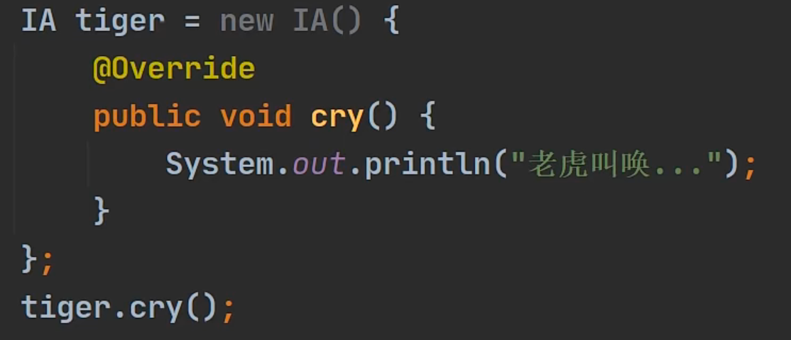
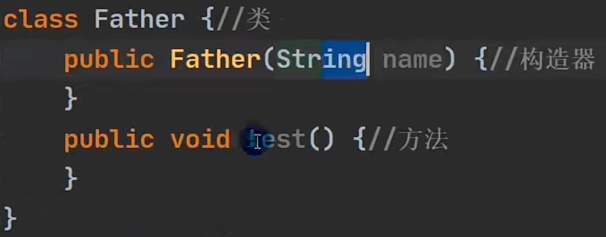
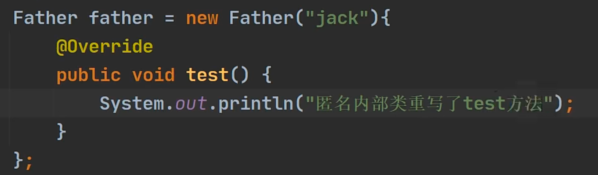

# 内部类

## 是什么

一个类的内部又完整地嵌套了另一个类结构，被嵌套的类叫做内部类，嵌套的其他类叫做外部类

是类的第五大成员

> 属性 方法 构造器 代码块 内部类 

内部类的特点是可以直接访问其私有属性


## 基本语法

private class xxx{ //外部其他类

}

class Outer{ // 外部类

​	class Inner{ // 内部类

​	}

}


## 内部类的分类

1.定义在外部类的局部位置上（比如方法内）

​	局部内部类

​	匿名的内部类


2.定义在外部类的成员位置上

​	成员内部类

​	静态内部类


### 局部内部类

1.一般定义在外部类的**方法或代码块**中

class outer{

​	public void m1(){

​		class inner{

​			//这就是局部内部类

​		}

​	}

}


2.可以直接访问外部类的所有成员，包含私有的，因为本质上都是在外部类里面的

3.不能添加访问修饰符，因为它的地位就是局部变量，局部变量是不能使用修饰符的。但是可以用final修饰，因为局部变量不能使用修饰符，也就是不能被别人继承

4.作用域仅仅**在定义它的方法或者代码块中**

5.局部内部类可以直接访问外部类的成员

6.外部类在方法中可以创建内部类的对象实例，然后调用方法即可

**7.本质上还是一个类**

8.外部其他类 不能访问局部内部类，就像全局变量不能访问局部变量

9.如果外部类与内部类成员重名了，遵循就近原则，如果想访问外部类的对象，则使用**外部类名.this.成员访问**

原因：因为外部成员不是静态的，所以要加this，（外部类名.this 本质上是 外部类的一个对象，哪个对象调用了这个方法，那么 外部类名.this 就是那个对象)


### 匿名内部类 （重要）

解读：

1.本质仍然是一个类

2.仍然是一个内部类

3.是一个匿名的，该类没有名字

4.同时还是一个对象


#### **基于接口**

有一个接口叫IA

我想使用IA接口，并创建对象

传统方式是写一个类，实现接口，创建对象

但是这个类只使用一次，这是否有点浪费

那么可以使用匿名内部类来开发




此处 编译类型是IA，运行类型是匿名内部类

匿名内部类，看底层，其实是

class xxx implements IA{ **//xxx = 外部类名字+$1 系统自动分配的名字**，可以用getclass查看

​	@Override

​	public void cry(){

​		.....

​	}

}


jdk底层，创建完匿名内部类后，立即 马上 就创建了一个实例，并且把地址返回


（在堆里 新建有一个对象实例的名字是 外部类名字+$1）


匿名内部类使用一次就不能再使用了,但是承接地址的对象可以反复使用（上图的tiger

#### **基于类**





1.编译类型：Father

2.运行类型：Outer$02（内部类所在外部类的名字）

3.底层会创建匿名内部类

4.同时也返回了匿名内部类的对象

5.如果类本身是抽象类，那一定要实现所有抽象方法


#### 使用细节

1.匿名内部类语法较为奇特，因为匿名内部类即是一个类的定义，同时本身又是一个对象，因此从语法来看，它既有定义类的特征，也有创建对象的特征。因此可以直接调用匿名内部类的方法。

2.可以访问外部类的所有成员，包括私有的

3.不能添加访问修饰符，因为它的地位就是一个局部变量

4.作用域仅在代码块中，且仅能使用一次

5.外部其他类 不能访问 内部类

6.外部类和内部类成员重名时，匿名内部类访问遵循就近原则（访问外部可以使用 外部类名.this.成员）


#### 应用场景

可以直接当做实参传送

```Java
package com.hspedu.innerclass.exercise2;

public class InnerClassExercise02 {
    public static void main(String[] args) {
        CallPhone cp = new CallPhone();
        cp.AlarmClock(new Bell() {
            @Override
            public void ring() {
                System.out.println("懒猪起床了");
                System.out.println(getClass());
            }
        });
        cp.AlarmClock(new Bell() {
            @Override
            public void ring() {
                System.out.println("小伙伴上课了");
                System.out.println(getClass());
            }
        });
    }

}

interface Bell{
    void ring();
}

class CallPhone{
    public void AlarmClock(Bell bell){
        bell.ring();
    }
}
```

输出如下

> 懒猪起床了
> class com.hspedu.innerclass.exercise2.InnerClassExercise02$1
> 小伙伴上课了
> class com.hspedu.innerclass.exercise2.InnerClassExercise02$2


### 成员内部类

#### 案例

```java
package com.hspedu.innerclass.menberinner;

public class MemberInner {
    public static void main(String[] args) {
        Cat cat = new Cat();
        cat.Test();
    }
}

class Cat{
    private int a = 10;
    private class CatInner{
        void say(){
            System.out.println("hello , a is " + a);
        }
    }

    public void Test(){
        CatInner catInner = new CatInner();
        catInner.say();
    }
}
```

输出：hello , a is 10


#### 使用细节

1.定义在外部类的成员位置上

2.可以直接访问外部类的所有成员，包含私有的

3.可以添加任意的访问修饰符，因为它的地位就是一个成员

4.作用域：为整个类体

5.成员内部类 直接访问 外部类成员

6.外部类 访问成员内部类：创建成员内部类的对象，然后使用相关属性或方法

7.外部其他类，使用成员内部类的两种方式：

​	01.外部类对象.new 内部类对象()      [相当于是把 new 内部类对象() 作为 外部类对象的一个成员]

​	02.在外部类中，编写一个方法，返回一个inner的对象实例

8.如果成员内部类的成员和外部类重名，遵循就近原则。可以通过外部类.this.成员名 访问外部类成员


### 静态内部类

1.放在外部类的成员位置

2.使用static修饰

3.可以直接访问外部类的所有静态成员，包含私有的，但不能直接访问非静态成员

4.可以添加任意访问修饰符，因为地位就是一个成员

5.作用域：同其他的成员，为整个类体

6.外部其他类访问静态内部类 两种方式

​	01.  new 外部类.静态内部类()  [前提是要满足访问权限～]

​	02.  外部类().获取静态内部类对象方法()；[这里需要通过一个方法(非静态方法)来返回静态内部类的实例]

​	03.  外部类.获取静态内部类对象方法()；[这里需要通过一个方法(静态方法)来返回静态内部类的实例]

7.如果外部类和静态内部类的成员重名时，静态内部类访问的时候，默认遵循就近原则。如果想访问外部类成员，则可以使用（外部类名.成员)去访问


成员内部类和静态内部类是放在外部类的成员位置，本质就是一个成员