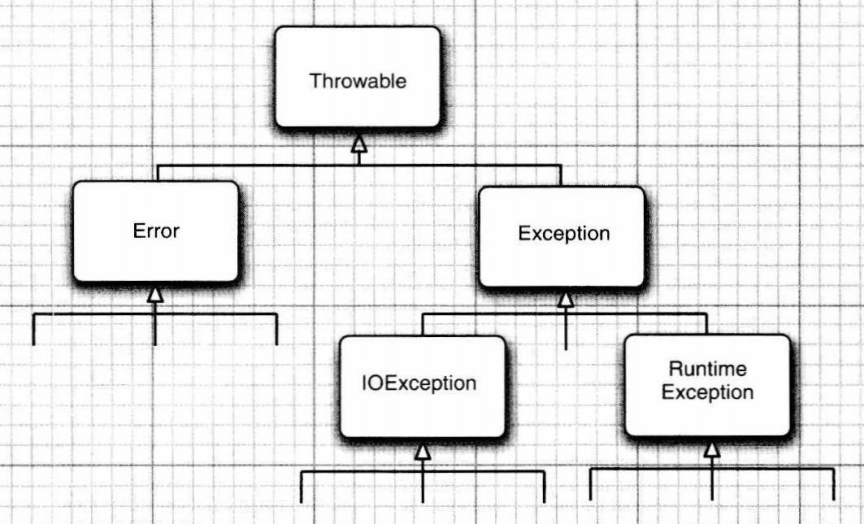

# 处理错误

## 如何出现

​		在Java运行期间可能会出现错误，由于文件包含错误信息、使用了无效的数组下标、使用一个没有赋值的对象造成等。


## 如何处理

​		用户期望在出现错误信息的时候，程序可以采取合理的行为，程序应该


1. 返回到一种安全状态，并能够让用户执行其他命令

2. 允许用户保存所有工作的结果，以妥善的方式终止程序


​		异常处理的任务就是将控制权从产生错误的地方转移到能够处理这些情况的错误处理器

​		对于方法中的错误，传统的做法是返回一个特殊的错误码，由调用方法分析。但是并不是所有的情况都能够返回错误码，所以在Java中，**如果某个方法不能够采用正常的途径完成他的任务，可以通过另一个路径退出方法。**


## 抛出异常

​		在异常的情况了下，方法并不返回任何值，而是**抛出一个封装了错误信息的对象**，这种方法会立即退出，并不会返回正常值。此外，也不会从调用这个方法的代码继续执行，取而代之的是，**异常处理机制开始搜索能够处理这种异常情况的异常处理器**。


# 异常分类

## Throwable

​		异常对象都是派生于Throwable类的一个类实例，如果内置的异常类不能满足需求，还可以自定义异常类。



所有的异常都是Throwable继承而来，下一层立即分解为两个分支，Error和Exception


## Error

Error：描述了Java运行时系统内部错误和资源耗尽错误。程序不该抛出这种类型的对象。出现了这种错误，除了通知用户，并终止程序外，几乎无能为力。


## Exception

​		Exception又有两个分支，一个分支派生于Runtime Exception，另一个分支包括其他异常。


Runtime Exception：由编程错误导致的异常

I/OException：程序本身无问题，但由于其他问题导致的异常属于其他异常


派生于RuntimeException的异常包括以下问题：

1. 数组的强制类型转换
2. 数组访问越界
3. 访问null指针


不是派生于RuntimeException的异常包括：

1. 试图超越文件末尾继续读取数据
2. 试图打开一个不存在的文件
3. 试图根据指定字符串找class对象，但这个字符串表示的类并不存在


​		所以说，出现RuntimeException，一定是你的问题，要么检测数组是否越界，要么是否为null来避免此类异常的发生。


## 非检查型/检查型异常

​		**派生于Error类或RuntimeException类的所有异常称为非检查型unchecked异常**，所有其他的异常称为检查型checked异常，编译器将会检查你是否为所有的检查型异常提供了异常处理器。


# 声明检查型异常

​		如果遇到了无法处理的情况，Java方法可以抛出异常。

​		方法不仅要告诉编译器将要返回什么值，还要告诉编译器可能发生错误，要在方法的首部指出这个方法可能抛出的异常

​		例如：下面是标准类库中FileInputStream类的一个构造器声明

```
public FileInputStream(String name) throw FileNotFoundExeception
```

​		这个声明表示这个构造器将根据指定的string参数产生一个FileInputStream对象，但也有可能出错而抛出一个FileNotFoundException对象。如果真的抛出了一个异常对象，运行时系统开始搜索知道如何处理FileInputStream对象的异常处理器。


## 什么时候会抛出异常

​		在自己编写方法时，不必声明这个方法可能抛出的所有异常，至于什么时候需要在方法中用throws子句声明异常，以及要用throws语句声明什么异常，需要记住在遇到下面4种情况时会抛出异常

1. 调用了一个抛出检查型异常的方法，例如FileInputStream构造器。
2. 检查到一个错误，并利用throw语句抛出一个检查型异常
3. 程序出现错误，例如 a[-1]=0会抛出一个非检查型异常
4. Java虚拟机或运行库出现内部错误

​		如果出现前两种情况，必须告诉调用这个方法的程序员有可能抛出异常，为什么？因为抛出任何一个抛出异常的方法都有可能是死亡陷阱，如果没有处理器捕获这个异常，当前执行的线程就会终止。


## 声明

**单个异常抛出**

​		有一些java方法包含对外提供的类中，对于这些方法，应该通过方法首部异常规范(exception specification)声明这个方法可能抛出异常

```Java
class MyAnimation
{
	...
	public Image loadImage(String s) throws IOException
  {
    ...
  }
}
```

**多个异常抛出**

​		如果一个方法可能抛出多个检查型异常类型，那么就要在方法的首部列出所有的异常类。每个异常类之间用逗号可开

```Java
class MyAnimation
{
	...
	public Image loadImage(String s) throws FileNotFoundException, EOFException
  {
    ...
  }
}
```

**不该抛出内部错误**

​		但是，我们不用去声明Java的内部错误，即从Error继承的异常。任何程序代码都有可能抛出那些异常，而我们对此完全无法控制。

```JAVA
class MyAnimation
{
	...
	public Image loadImage(String s) throws ArrayIndexOutOfBoundsException // 错误的写法
  {
    ...
  }
}
```

​		这些运行时错误完全在我们的控制之中。如果担心数组下标错误，就应该花时间修正这些错误，而不是声明这些错误有可能发生。

​		**一个方法必须声明所有可能抛出的检查型异常**，而非检查型异常要么在你的控制之外(Error)，要么从一开始就应该避免的情况所导致(RuntimeException)。如果你的方法没有声明可能发生的检查型异常，编译器就会发出一个错误消息。

​		当然，不只是声明异常，还可以捕获异常。这样就不会从这个方法抛出这个异常。下面的章节将会讲述。


## 关于超类和子类的抛异常

​		如果在子类中 override 了超类的一个方法，子类方法声明的检查型异常不能比超类方法中声明的异常更通用（子类方法可以抛出更特定的异常，或者根本不抛出任何异常）。特别需要声明的是，如果超类方法没有抛出任何检查型异常，子类也不能抛出任何检查型异常。

​		如果类方法中和声明它会抛出一个异常，而这个异常是某个特定类的实例，那么这个方法抛出的异常可能属于这个类，也可能属于这个类的任意一个子类。例如FileInputStream构造器声明有可能抛出一个IOException异常，在这种情况下，你并不知道具体是哪种IOException异常。它既有可能是IOException异常，也可能是其某个子类的对象，例如FileNotFoundException


# 如何抛出异常

案例：

​		假设一个名为readData的方法正在读取一个文件，文件首部包含以下信息，承诺文件长度为1024个字符：

Content-length：1024

​		然而在读到733个字符之后文件就结束了，希望能够抛出异常。

​	

​	1.首先解决要抛出什么异常。阅读文档发现 IOException下的EOFException异常描述的是：输入过程中意外遇到了EOF。这就是我们要抛出的异常。

有两种抛出的方法：

```
throw new EOFException();
// or
var e = new EOFException;
throw e;
```

将代码放在一起，就是

```Java
String readData(Scanner in) throws EOFException{
  	...
    while(...){
      if(!in.hasNext())
      {
        if(n<len) throw new EOFException();
      }
      ...
    }
  return s;
}
```

EOFException类还有一个带一个字符串的参数构造器，可以这么写：

```
String gripe = "Content-length:" + len + ," Received:" + n;
throw new EOFException(gripe);
```

也就是说，如果有一个异常类能够满足需求，抛出这个异常很容易，只需要：

1. 找到一个合适的异常类
2. 创建这个类的一个对象
3. 将方法抛出

一旦方法抛出了异常，这个方法就不会返回到调用者，不必操心建立一个默认的返回值或错误码


# 创建异常类

​		自定义异常类需要定义一个派生于Exception的类，或者派生于它的某个子类，例如IOException。习惯做法是，自定义的这个类应该包含两个构造器，一个是默认构造器，另一个是包含了描述信息的构造器。

```java
class FileFormatException extends IOException
{
  public FileFormatException() {}
  public FileFormatException(String gripe) {}
  {
    super(gripe);
  }
}
```

使用自定义异常类：

```Java
String readData(BufferrReader in) throws FileFormatException{
  	...
    while(...){
      if(ch == -1)
      {
        if(n<len) throw new FileFormatException();
      }
      ...
    }
  return s;
}
```

