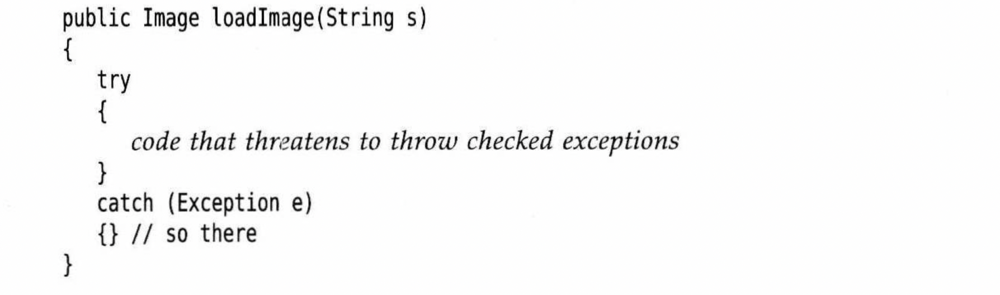
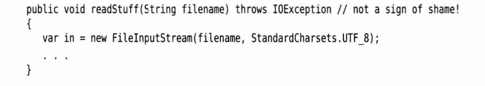

# 捕获异常

## 捕获异常

​	如果发生了某个异常，但是没有在任何方法捕获这个异常，程序就会终止，并在控制台上打印消息，其中包括这个异常的类型和一个堆栈轨迹。

​	想要捕获一个异常，需要设置try/catch语句块

```java
try{
  code;
  morecode;
  morecode;
}catch (ExceptionType e){
  handler for this type;
}
```

如果try语句块中的任何代码抛出了catch语句中指定的一个异常类，那么

1. 程序将跳过try语句块的其余代码。

2. 程序将执行catch语句中的处理器代码。


如果try语句块中的代码没有抛出任何异常，那么程序将跳过catch子句。

如果方法中的任何代码抛出了catch子句中没有声明的一个异常类型，那么这个方法就会立即退出（或者它的调用者为这种类型异常提供了catch子句）。


## 案例

```java
public void read(String filename){
  try{
    var in = new FileInputStream(filename);
    int b;
    while((b = in.read()) != -1){
      process input
    }
  }catch(IOException exception){
    exception.printStackTrace();
  }
}
```

​		try子句中的大部分代码为读取并处理字节，直到遇到文件结束符为止。正如Java API看到的那样，read方法有可能抛出一个IOException异常。在这种情况下，跳出整个while循环，并进入catch子句，生成堆栈轨迹。

​		或者也可以什么也不做，把异常抛给调用者。如果read方法出现了错误，那就让调用者去关心这个问题

```java
public void read(String filename) throws IOException{
  var in = new FileInputStream(filename);
  int b;
  while((b = in.read()) != -1){
    process input
  }
}
```

​		请记住，编译器严格地执行throws说明符，如果调用了一个抛出检查型异常的方法，就必须处理这个异常，或者继续传递这个异常。

​		我们应该处理能够处理的异常，传播不知道怎么处理的异常。

​		查看Java API文档，可以看到每个方法可能会抛出的异常，然后再决定是由自己处理，还是添加到throws列表中。对于后一种选择，将异常交给胜任的处理器进行处理比压制这个异常更好。

​		但是，这个规则也有一个例外：如果便携一个方法覆盖超类的方法，而这个超类方法没有抛出异常，你就必须捕获你的方法代码中出现的每一个检查型异常。因为不允许在子类的throws说明符中出现超类方法未列出的异常类。


# 捕获多个异常

```java
try{
	code that might throw exceptions
	
}catch (FileNotFoundException e){
	emergency action for miss files
	
}catch (UnkonwHostException e){
	emergency action for unkonw hosts
	
}catch (IOException e){
	emergency action for all other I/O problems
	
}
```

异常对象可能包含有关异常性质的信息，要想获得这个信息，可以尝试使用

```
e.getMessage()
```

得到详细的错误信息

```
e.getClass().getName()
```


​		在Java7中，同一个catch子句可以捕获多个异常类型，假设缺少文件和未知主机异常的动作是一样的，就可以合并catch子句

```java
try{
	code that might throw exceptions
}catch(FileNotFoundException | UnkonwHostException e){
	emergency action for missing files and unkonw hosts
}catch(IOException e){
	emergency action for all other I/O problems
}
```

​		注意：只有当捕获的异常类型彼此之间不存在子类关系时才需要这个特性。


# 再次抛出异常与异常链

​		可以在catch子句中抛出一个异常，通常希望改变异常类型的时候可以这么做。如果开发了一个供其他程序员使用的子系统，可以使用一个子系统故障的异常类型。例如ServletException就是这样一个异常类型的例子，执行一个servelt的代码可能不想知道发生错误的细节原因，但希望明确地知道servlet是否有问题。

```Java
try{
	access the database
}catch (SQLExceotion e){
	throw new ServletException("database error:" + e.getMessage());
}
```

​		在这里，构造ServeltException时提供了异常的消息文本。

​		还有一个更好的处理方法，可以把原始异常设置为新异常的“原因”；

```Java
try{
	access the database
}catch (SQLExceotion original){
	var e = new ServletException("database error");
  e,initCause(original);
  throw e;
}
```

捕获到这个异常，可以用这个语句获取原始异常

Throwable orginal = caughtException.getCause();

强烈推荐使用这种包装技术，这样可以在子系统中抛出高层异常，而且不会丢失原始异常的细节。


有时你只想记录一个异常，再将它重新抛出，而不做任何改变

```Java
try{
	access the database
}catch(Exception e){
	logger.log(level, meesage, e);
	throw e;
}
```

在Java7之前，这种方法存在一个问题，假设这个代码在以下方法中

public void updateRecord() throws SQLException

Java编译器查看catch中的throw语句，然后查看e的类型，会指出这个方法可以抛出任何Exception而不只是SQLException。现在这个问题已经得到改进。编译器会跟踪到e来自try块。假设这个try块中仅有的检查类型异常是SQLException实例，另外，假设e在catch块中未改变，将外围方法声明为throw SQLException就是合法的。


# finally子句

​		不管是否有异常被捕获，finally子句中的代码都会执行，在下面的实例中，所有情况下程序都将关闭输入流

```Java
var in = new FileInputStream(..);
try{
	//1
	code that might throw exceptions
	//2
}catch(IOException e){
	//3
	show error message
	//4
}finally{
	//5
	in.close();
}
//6
```

1. 代码没有抛出异常，这种情况下，先执行try全部代码，再执行finally全部代码，执行顺序为 1、2、5、6
2. 代码抛出一个异常，并在catch中捕获，将执行try所有代码，直到抛异常为止，此时跳过try语句剩余代码，转去执行匹配的catch语句中的代码，最后执行finally。执行顺序为1、3、4、5、6
3. 代码抛出一个异常，在catch中捕获再二次抛出异常，异常会抛回这个方法的调用者。执行顺序为1、3、5

4. 代码抛出异常，但catch没有捕获异常。将执行try所有代码，直到抛异常为止，此时跳过try语句剩余代码，然后执行finally，执行顺序为1、5


​		当然，try语句可以只有finally语句，这样，无论是否有错误捕获，都会执行finally语句。如果真的遇到异常，异常会被重新抛出，并且由其他catch语句捕获

```Java
try{
	code that might throw exceptions
}finally{
	in.close();
}
```

**嵌套try：**

```Java
InputStream in = ...
try{
	try{
    code that might throw exceptions
  }finally{
    in.close()
  }
}catch(IOException e){
	show error message
}
```

​	内层try语句只有一个职责，确保关闭输入流。外层try语句也只有一个职责，那就算确保报告出现错误。这种防范不仅清楚，而且功能句更强：能够报告finally子句中出现的错误。


温馨提示：

​		finally子句体主要用于清理资源，请不要把改变控制流的语句(return , throw , break, continue)放在finally语句中。


# Try-with-Resource语句

```java
open a resource
 try{
   work with the resource
 }finally{
   close the resource
 }
```

​		假设资源属于一个实现了AutoCloseable结构的类，Java7 为这种代码模式提供了一个很有用的快捷方式

AutoCloseable接口有一个方法

```
void close() throws Exception()
```

​		Try-with-resoucrse语句(带资源的try语句)的最简形式为

```Java
try(Rources res = ...){
	work with res
{
```

​		try块退出时，回自动调用res.close()

案例：

```Java
try(var in = new Scanner(new FileInputStream("usr/share/dict/words"), StandardCharsets.UTF_8))
{
  while(in.hasNext()){
    sout(in.next());
  }
}
```

这个块正常退出，或者存在一个异常，都会调用in.close()方法，好像使用了finally块一样。


**还可以指定多个资源**：

```java
try(var in = new Scanner(new FileInputStream("usr/share/dict/words"), StandardCharsets.UTF_8);
   var out = new PrintWriter("out.txt", StandardCharsets.UTF_8))
{
  while(in.hasNext()){
    out.println(in.next().toUpperCase());
  }
}
```

​		无论这个块如何退出，in和out都会关闭。


在Java9中，可以在try首部中提供之前声明的事实最终变量

```Java
Public static void printAll(String[] lines, PrintWriter out)
{
	try(out) {
		for (String line : lines)
			out.println(line);
	}
}
```

​		此时，如果try语句抛出一个异常，而且close方法也抛出一个异常，这就会带来一个难题，如果是try-with-resource语句会将原来的异常重新抛出，而close的异常就会被抑制。这些异常将自动捕获，并由addSupperesed方法增加到原来的异常。如果对这些异常感兴趣，可以调用getSupperessed方法，他会生成从close方法抛出并被抑制的异常数组。


注意：try-with- resource 也可以写finally，finally将会在close之后执行。


# 分析堆栈轨迹元素

​		堆栈轨迹 是程序执行过程中某个特定点上所有挂起的方法调用的一个列表，当Java程序因为一个未捕获的异常而终止时，就会显示堆栈轨迹

​		可以调用Throwable类的printStackTrace方法访问堆栈轨迹的文本描述信息

```Java
var t = new Throwable();
var out = new StringWriter();
t.printStackTrace(new PrintWriter(out));
String description = out.toString();
```

​		一种更灵活的方法是使用StackWalker类，他会生成一个StackWalker.StackFrame实例流，其中每个实例分别描述一个栈帧，可以利用以下调用迭代处理这些栈帧

```
StackWalker walker = StackWalker.getInstance();
walker.forEach(frame -> analyze frame)
```

如果想要以懒方式处理Stream<StreamWalker.StackFrame>,可以调用

```
Walker.walk(stream -> process stream)
```


# 关于异常的一些技巧

## 异常处理不能当作测试

比如

```
if(!s.empty()) s.pop()
```

如果强制要求不论栈是否空都执行弹出操作，然后捕获EmptyStackException异常

```
try{
	s.pop();
}catch(EmptyStackException e){
	~~
}
```

测试中得知，第一种版本耗费的时间远小于第二种

所以得出结论：只在异常情况下使用异常。


## 不要过分地细化异常

有些人喜欢把每一条语句都分装在一个独立的try语句中

```Java
PrintStream out;
Stack s;

for (i=0; i< 100; i++){
	try{
		n = s.pop()
	}catch(EmptyStackException e){
		// stack was empty.
	}
	try{
		out.writeInt(n);
	}catch(IOException e){
		// problem writting to file.
	}
}
```

​		这种编程方式会导致代码急剧膨胀。有必要将整个任务包在一个try语块中，这样当任何一个任务出现问题时，就可以取消整个任务。

```
try{
	for (i=0; i< 100; i++){
		n = s.pop()
		out.writeInt(n);
		}
	}catch(EmptyStackException e){
		// stack was empty.
	}catch(IOException e){
		// problem writting to file.
	}
}
```

这样也满足了一个承诺：将正常处理与错误处理分开。


## 充分利用异常层次结构

​		不要只抛出 RuntimeException 异常。应该寻找一个适合的子类或创建自己的异常类。
​		不要只捕获 Throwable 异常，否则，这会使你的代码更难读、更难维护。
​		考虑检查型异常与非检查型异常的区别。检查型异常本来就很庞大，不要为逻辑错误抛出这些异常。(例如，反射库的做法就不正确。调用者经常需要捕获那些早已知道不可能发生的异常。
​		如果能够将一种异常转换成另一种更加适合的异常，那么不要犹豫。例如，在解析某个文件中的一个整数时，可以捕获 NumberFormatException 异常，然后将它转换成 IOException 的个子类或MySubsystemException。


## 不要压制异常

​		在Java中，往往非常希望关闭异常。如果你编写了一个方法要调用另一个方法，而那个方法有可能 100年才抛出一个异常，但是，如果没有在你的方法的throws 列表中声明这个异常，编译器就会报错。你不想把它放在 throws 列表中，因为这样一来，编译器会对调用了你的方法的所有方法报错。因此，你会将这个异常关闭：



​		现在你的代码可以通过编译了。除非出现异常，否则它也能很好地运行。但是一旦出现异常，这个异常会悄无声息地被忽略。如果你认为异常都非常重要，就应该适当地进行处理


## “苛刻”要比放任更好

**早抛出**

​		当检测到错误的时候，有些程序员对抛出异常很担心。在用无效的参数调用一个方法时，返回一个虚拟值是不是比抛出一个异常更好？例如，当栈为空时，Stack.pop 是该返回一个null，还是要抛出一个异常？我们认为：最好在出错的地方拋出一个EmptystackException 异常，这要好于以后抛出一个NullPointerException 异常。


## 不要羞于传递异常

**晚捕获**

​		很多程序员都感觉应该捕获抛出的全部异常。如果调用了一个拋出异常的方法，例如，FileInputstream构造器或 readline 方法，它们就会本能地捕获这些可能产生的异常。其实，最好继续传递这个异常，而不是自己捕获：



​		更高层的方法通常可以更好的通知用户发生了错误，或者放弃不成功的命令。