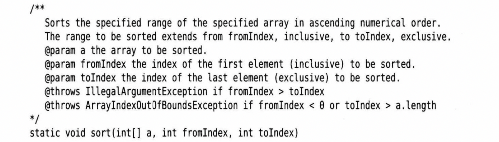

# 断言的概念

## 引出

​		假设确信某个属性符合要求，并且代码的执行依赖于这个属性。例如

```
double y = Math.sqrt(x);
```

​		你确信这里的x是一个非负数，原因是x是另外一个计算的结果，这个结果不能为负值。或者x是一个方法的参数，方法要求输入者只能提供一个正数输入。不过，你可能还想再做一个检查，不希望计算中潜入让人困惑的NaN(不是一个数)浮点值。

​		可以用异常解决这种检查

```
if (x<0) throw new IllegalArgumentException
```

​		但是即使测试完毕后，这个代码还会一直保留在程序中，如果程序有大量这种检查，程序运行起来会很慢


## 概念

​		断言机制允许在**测试期间**向代码中插入一些检查，而在生产代码中会自动删除这些检查

语法如下

```
assert condition;
```

​		如果结果为false，会抛出一个AssertionError异常

```
assert condition : expression;
```

​		如果结果为false，会抛出一个AssertionError异常，并将后面的字符串传入异常对象构造器，转换成一个消息字符串。


## 案例

要想断言x是一个非负数，只需要简单地使用

```
assert x >= 0;
```

或者将x的实际值传递给AssertionError对象，以便以后显示

```
assert x >= 0 : x;
```


# 启用和禁用断言

​		在默认情况下，断言是禁用的。可以在运行程序时用-enableassertions 或 -

ea 选项启用断言

```
java -enableassertions MyApp
```

​		需要注意的是，不必重新编译来启用或禁用断言，启用或禁用断言是类加载器的功能。禁用断言时，类加载器会去除断言代码，因此不会降低程序的执行速度。

​		也可以在某个类或整个包中启用断言

```
java -ea:MyClass -ea:com.mycompany.mylib MyApp
```

​		这条命令将为MyClass类以及com.mycompany.mylib 包和它的子包中的所有类打开断言。选项 -ea 将打开无名包中所有类的断言。

​		也可以使用-diableassertions或-da在某个特定类和包中禁用断言

```
java -ea:... -da:MyClass MyApp
```

​		有些类不是由类加载器加载，而是直接由虚拟机加载的。可以使用这些开关有选择地启用或禁用那些类中的断言

​		不过，启用和禁用断言的-ea和-da开关不能应用到那些没有类加载器的“系统类”上。对于这些系统类，需要使用-enablesystemassertions/-esa开关启用断言。


# 使用断言完成参数检查

在Java语言中，给出了3种处理系统错误的机制：

1. 抛出一个异常
2. 日志
3. 使用断言


那么什么时候需要使用断言呢：

1. 断言失败是致命的、不可恢复的错误
2. 断言检查只是在开发和测试阶段打开

​		因此，不应该使用断言向程序和其他部分通知发生了可恢复性的错误，或者，不应该利用断言与程序用户沟通问题。断言只应该用于在测试阶段确定程序内部错误的位置。


​		下面有一个十分常见的情况：检查方法的参数。是否应该使用断言来检查非法的下标值或null引用呢？

假设实现一个排序的文档



​		文档指出，如果方法中使用了错误的下标值，就会拋出一个异常。这是方法与其调用者之间约定的行为。如果实现这个方法，那就必须要遵守这个约定，拋出表示下标值有误的异常。因此，这里使用断言不太适宜。
​		是否应该断言a不是null呢？这也不太合适。这个方法的文档没有指出当a是null时应该采取什么行为。在这种情况下，调用者可以认为这个方法将会成功地返回，而不会抛出个断言错误。
​		不过，假设对这个方法的约定做一点微小的改动：


​		现在，这个方法的调用者就必须注意：对null数组调用这个方法是不合法的。这样来，就可以在这个方法的开头使用断言：
​		assert a != null;
​		计算机科学家将这种约定称为前置条件(Precondition)。最初的方法对参数没有前置条件，即承诺在任何情况下都有正确的行为。修改后的方法有一个前置条件，即a非null。如果调用者在调用这个方法时没有满足这个前置条件，断言会失败，这个方法就能“为所欲为“。事实上，由于有这个断言，当方法被非法调用时，它的行为将是难以预料的。有时候会抛出一个断言错误，有时候会产生一个null指针异常，这完全取决于类加载器的配置。


# 使用断言提供假设文档

很多程序员使用注释来提供底层假设的文档，例如

```
if (i % 3 == 0){
	...
}else if(i % 3 == 1){
	...
}else{ 	// i % 3 == 2

}
```

可以改成断言

```
if (i % 3 == 0){
	...
}else if(i % 3 == 1){
	...
}else{ 
	assert i % 3 == 2;
}
```

​		当然，如果仔细地考虑这个问题，会发现一个更有意思的内容。i%3的值会是什么？如果i是正值，那么余数肯定是0、1或2。如果i是负值，余数可以是-1和-2。因此，实际的假设是i是非负值，因此，最好是在 if语句之前使用以下断言：

```
assert i >= 0;
```

