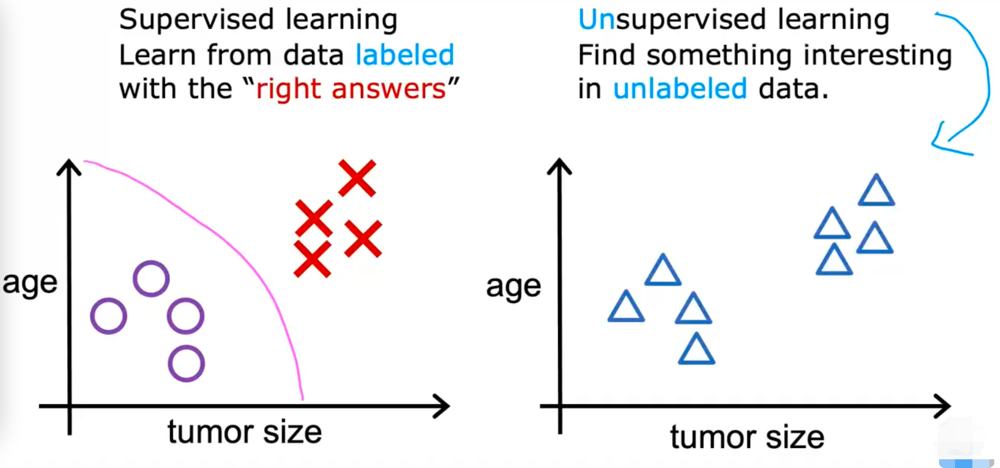
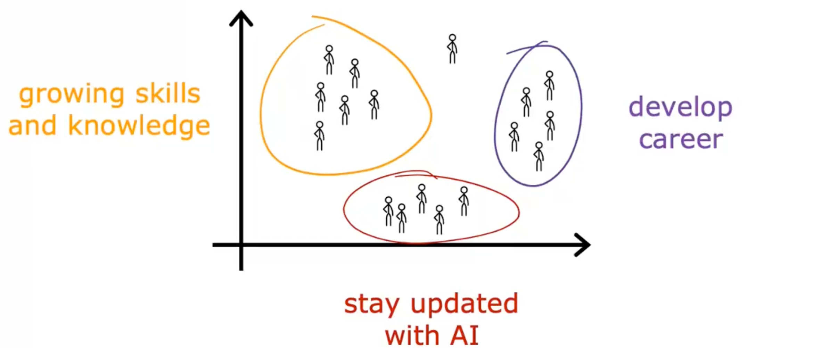

# 机器学习定义

Arthur Samuel：

Field of study that gives computers the ability to learn without being explicitly programmed.

让计算机在没有明确编程的情况下学习的研究领域

# 机器学习算法

## 监督学习 

Supervised learing

常规的监督学习是学习 输入到输出 的映射关系 的算法 x -> y

关键特征是：

主动提供数据集给算法学习，给x贴上正确的y标签

最终得到的结果是：

仅仅接收输入，无需输出标签，给出合理准确的预测或猜测

| 输入 x         | 输出 y         | 程序（映射） |
| -------------- | -------------- | ------------ |
| 邮件           | 是否为垃圾邮件 | 垃圾过滤器   |
| 音频           | 文字           | 语音识别     |
| 英语           | 西班牙语       | 机器翻译     |
| 用户信息       | 是否会点击     | 在线广告     |
| 图像、雷达信息 | 车的位置       | 自动驾驶系统 |
| 手机的图片     | 是否有缺陷     | 目视检查     |

### 回归算法

#### 房屋价格预测

已收集了房屋面积与价格的关系数据

如何预测size为750时，price为多少？

可以将数据拟合为一条直线，但这不是唯一的算法，还可以拟合曲线

不同的拟合直线或曲线，会对结果产生影响

机器学习要做的就是去选择如何拟合函数

这也是监督学习的案例

此时，已知的房屋尺寸作为输入，相对应的价格作为输入的正确标签

拿这些数据集去训练，拟合函数

最终可以预测其他房子的可能价格是多少

**这种特殊的监督学习 叫做回归**

#### 定义

回归就是从无数可能的输出中预测一个数字

### 分类算法

#### 乳腺癌预测

通过病人不同的数据，分析肿瘤是恶性还是良性的

分类算法的特征就是，输出的值为定义好的几个值。就像肿瘤是良性或者恶性。

与回归不同的是，回归的输出是在无数数字中确定一个数字作为输出

如下图所示 1代表恶性，0代表良性，横轴为肿瘤大小

分类算法要解决的问题是

在已知的数据作为基本，有一个未知结果的值作为输入，要进行预测。

就像上图的？所在的地方

当然。也有可能有两种以上的分类

#### 定义

分类算法就是预测类别，类别可能有两个或以上

它可以是非数字，比如预测猫还是狗

它可以是数字，0、1、2

输出是在有限的可能内选择一个类别，并不是所有可能的数字中寻找

#### 两个或以上输入

如果有多种类别作为输入

一个未知输入，我们需要预测结果

基于数据集，学习算法要做的是找到一些边界来区分恶性肿瘤和良性肿瘤

也是拟合一个边界线

现实中，可能会有十几种作为输入

### 总结监督学习

监督学习是找到x到y的映射关系，算法从正确答案中学习

监督学习的两种分类主要是回归 和分类

| 回归             | 分类                   |
| ---------------- | ---------------------- |
| 预测数字         | 预测类别               |
| 无限种可能的输出 | 一部分或几个可能的输出 |

## 无监督学习

Unsupervosed learing

在无监督学习中，任何的数据都与输出标签不相关（右图）

让算法自己去寻找出对群体分类有意义的维度的数据

### 聚类算法

将未标记的数据放入到不同的集群中

#### 谷歌文章分类

谷歌新闻所做的就是每天查看互联网上成千上万的新闻文章，并将相关的故事分组在一起

（这不就是B站网页端视频右边的相关视频吗？！）

聚类算法 可以机器自己定义哪些词表明某些文字属于同一类

#### DNA聚类

DNA微阵列，每一个柱状表示一个人的基因或DNA活动，每一行表示同一位置的基因

颜色显示不同个体拥有或不拥有特定基因的程度

聚类算法 将人分类成不同类别或不同类型

或者相反的，告诉你一些特征

要做的是找出在这个特征类似的个体的案例

无监督学习不会给出个体的答案

#### 顾客分类

公司具有庞大的客户信息数据库，根据这些数据，自动的将客户分成不同的市场，更有效的提供服务

市场分割 并发现几个不同的群体

### 总结无监督学习

数据只有输入x，但是没有输出y

算法需要在数据中找到一些结构或者模式之类的东西

| 算法名   | 作用                               |
| -------- | ---------------------------------- |
| 聚类算法 | 将相似的数据成组                   |
| 异常检测 | 探测不寻常的事件（用在欺诈检测等） |
| 降维     | 将大数据集压缩成一个小得多的数据集 |

## Jupyter Notebooks

一个机器学习 实验和尝试的环境

