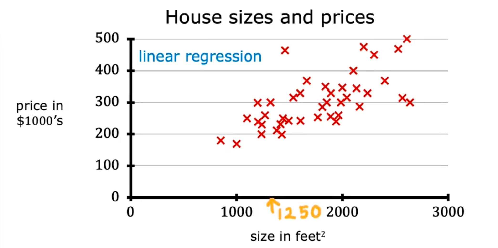
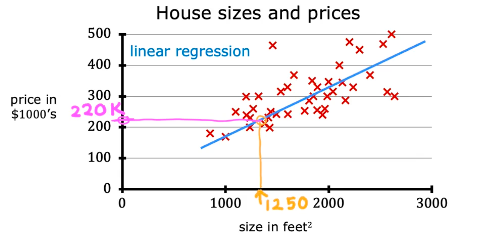
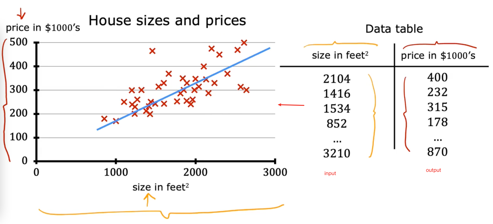
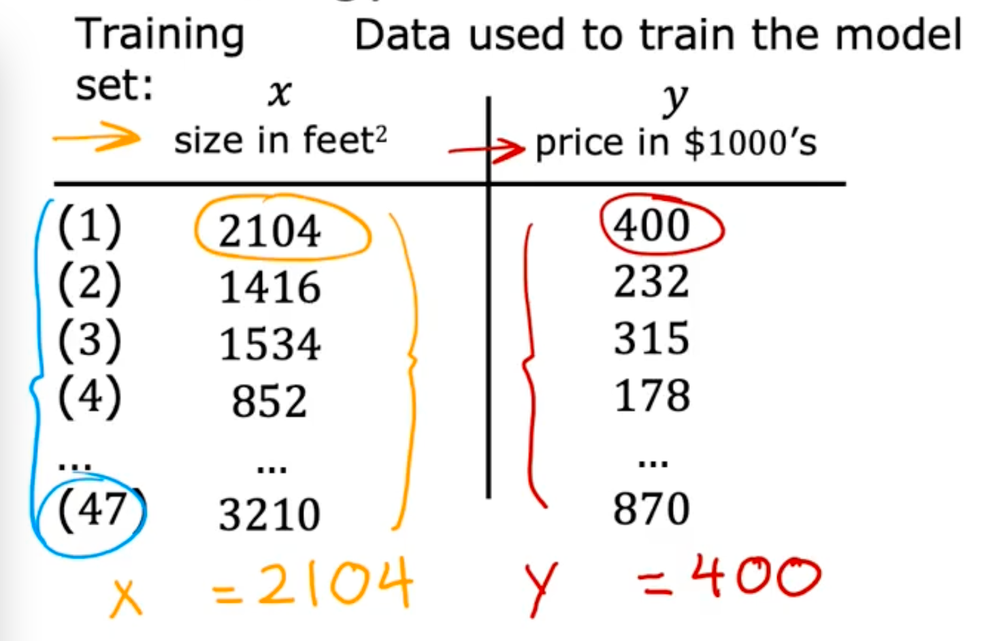
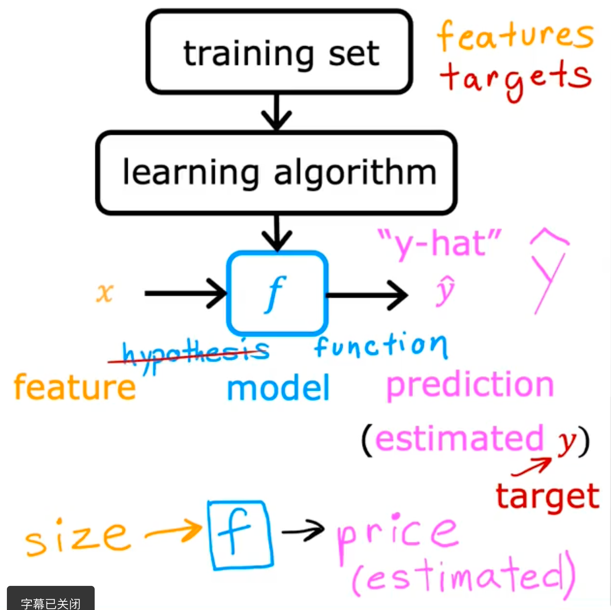
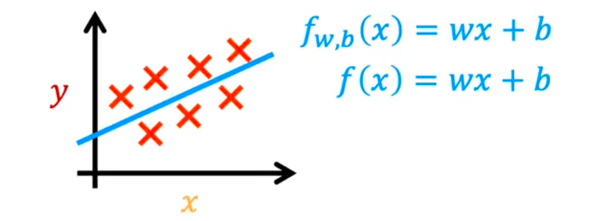

# 线性回归模型

## 案例

房屋大小和价格数据集

我们需要拟合出一条直线数据

解决仅有房屋尺寸，而预测出价格的模型

被称为回归，是因为它预测数字作为输出，并且有无数种答案

数据集：来训练模型的叫训练集

在数据表里的每一个点都对应着图中的一个叉叉

## 术语

在机器学习里

x = 输入变量/输入特征 （面积）= 2104

y = 输出变量/目标变量 （价格） = 400

m = 总训练集样本数 = 47

(x, y) = 单个训练样本 = (2104, 400)

(x^(i), y^(i) = 第i个训练样本 //（i）作为上标

## 过程

将训练集、输入特征、输出目标提供给算法

学习算法会产生一个函数（模型）f

函数f的作用是x作为输入经过它会产生一个估计值y： x -> f -> y^

一般来说 估计值叫y^ （y hat，顶上有个小帽子)

x作为特征，f作为模型，y^作为预测值

## 怎么样去计算模型f

$$
f_{w,b}(x) = wx + b
$$

因为要拟合的是直线，所以是这样的一个函数

x作为输入。通过w和b的值，计算出f

这种模式叫 线性回归

更具体的是：单变量线性回归（变量指x）

