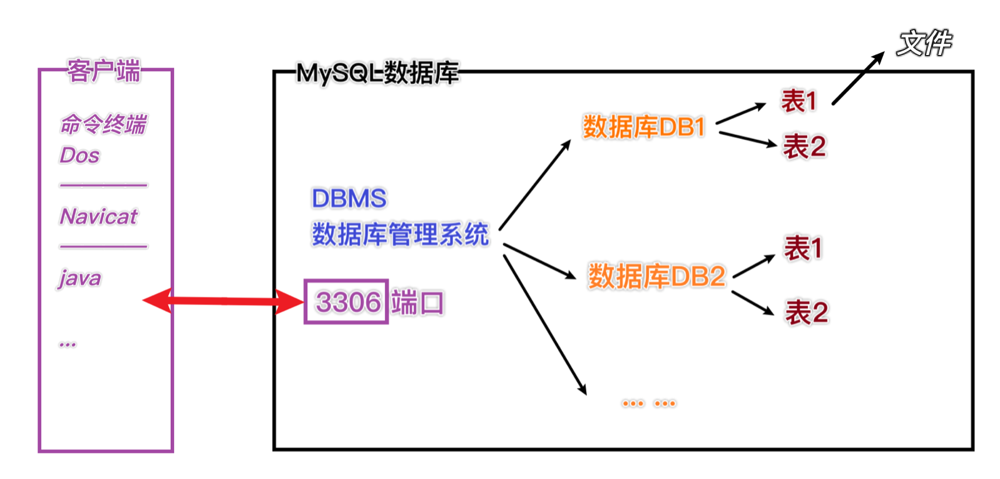

# 数据库三层结构

## 结构

1. 所谓安装Mysql数据库，就是在主机安装一个数据库管理系统（DBMS），这个管理程序可以管理多个数据库。 DBMS = database manage system

2. 一个数据库中可以创建多个表，以保存信息

3. 数据库管理系统DB MS、数据库 和 表的关系如下图所示

   

数据库-表的本质仍然是文件

## 存储方式

表的一行称之为一条记录。在Java程序中，一行记录往往使用对象来表示

## 语句分类

| 分类 | 解释         | 作用                                   |
| ---- | ------------ | -------------------------------------- |
| DDL  | 数据定义语句 | create表、库                           |
| DML  | 数据操作语句 | 增加insert、修改update、删除delete     |
| DQL  | 数据查询语句 | select                                 |
| DCL  | 数据控制语句 | 管理数据库：比如用户权限 grant、revoke |

