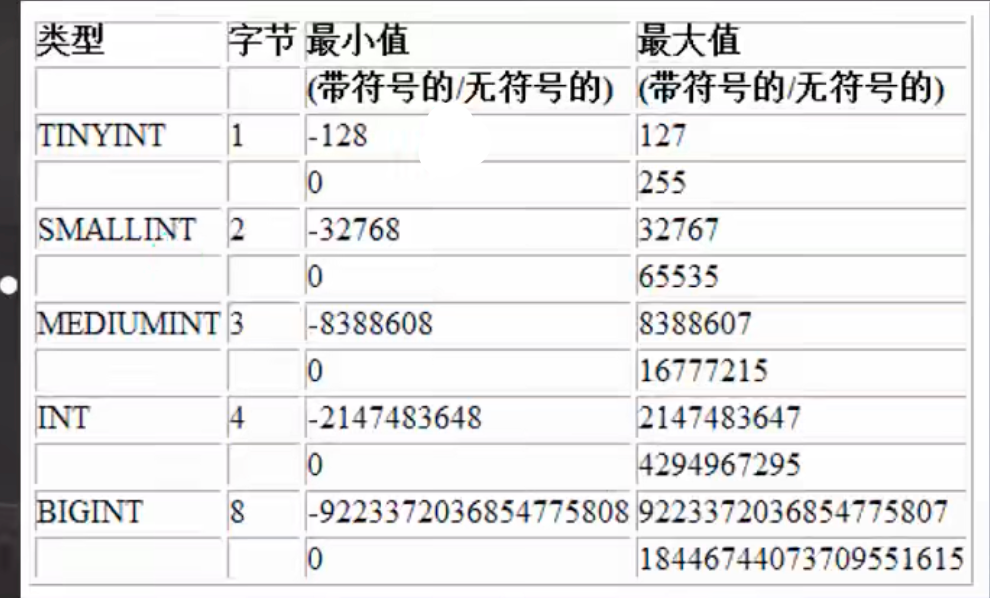

# 创建表

## 语法

```
CREATE TABLE table_name
(
		field1 datatype,
		field2 datatype,
		field3 datatype
)CHARACTER SET 字符集 collate 校对规则 engine 引擎
```

field：指定列名

datatype：指定列类型

character set：如不指定则为所在数据库字符集

collate：如不指定则为所在数据库校对规则

engine：引擎（默认InnoDB)


## 案例

```SQL
CREATE TABLE 'user'(
	id INT,
	'name' VARCHAR(255),
	'password' VARCHAR(255),
	'birthday' DATE
)	CHARACTER SET utf8 COLLATE ytf_bin ENGINE INNODB;

```


# 常用数据类型

## 数值类型

| 数据类型                     | 说明                                                |
| ---------------------------- | --------------------------------------------------- |
| BIT(M)                       | 位类型。M指定位数，默认值1，范围1-64                |
| TINYINT IUNSIGNED] 占1个字节 | 带符号的范国是-128到127。无符号0到255。默认是有符号 |
| SMALLINT [UNSIGNED] 2个字节  | 带符号是 负的2^15 到 2^15-1，无符号 0 到 2^16 -1    |
| MEDIUMINT [UNSIGNED] 3个字节 | 带符号是 负的2^23 到 2^23-1，无符号 0 到 2^24-1     |
| INT [UNSIGNED] 4个字节       | 带符号是 负的2^31 到 2^31-1，无符号 0 到 2^32-1     |
| BIGINT [UNSIGNED] 8个字节    | 带符号是 负的2^63 到 2^63-1，无符号 0 到 2^64-1     |
| FLOAT [UNSIGNED]             | 占用空间4个字节                                     |
| DOUBLE [UNSIGNED]            | 表示比float精度更大的小数,占用空间8个字节           |
| DECIMAL(M,D) [UNSIGNED]      | 定点数 M指定长度，D表示小数点的位数.                |

整形：

tinyint 1个字节

smallint 2个字节

mediumint 3个字节

**int 4个字节**

bigint 8个字节



小数类型：

float 单精度4个字节

**double 双精度8个字节**

**decimal[M,D] 大小不确定（D写成0 M写成最大 表示范围超极广）**


## 文本、二进制类型

| 数据类型                  | 说明                                       |
| ------------------------- | ------------------------------------------ |
| CHAR(size) char(20)       | 固定长度字符串 最大255                     |
| VARCHAR(size) varchar(20) | 可变长度字符串 0~65535 [即：2^16-1]        |
| BLOB LONGBLOB             | 二进制数据 BLOB O~2^16-1 LONGBLOB 0~2^32-1 |
| TEXT LONGTEXT             | 文本 Text 0~2^16 LONGTEXT O~2^32           |

文本类型：

**char 0～255**

**varchar 0-65535 [0~2^16-1]**

**text 0～2^16-1**

longtext 0~2^32-1


二进制类型：

blob 0-65535 [0~2^16-1]

longblob [0~2^32-1]


## 时间日期

| 数据类型   | 说明                                                         |
| ---------- | ------------------------------------------------------------ |
| DATE       | 日期类型(YYYY-MM-DD)                                         |
| DATETIME   | (YYYY-MM.DD HH:MM:SS).                                       |
| Time Stamp | Timestamp表示时间戳，它可用于自动记录insert、update操作的时间 |

日期类型

date 【日期 年月日】

time 【时间 时分秒】

**datetime 【年月日时分秒】**

**timestamp 【时间戳】**

year 【年】


P14