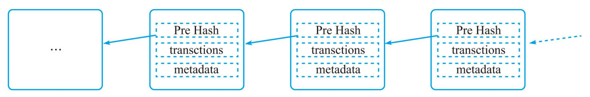
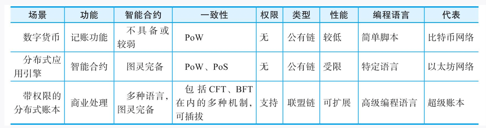
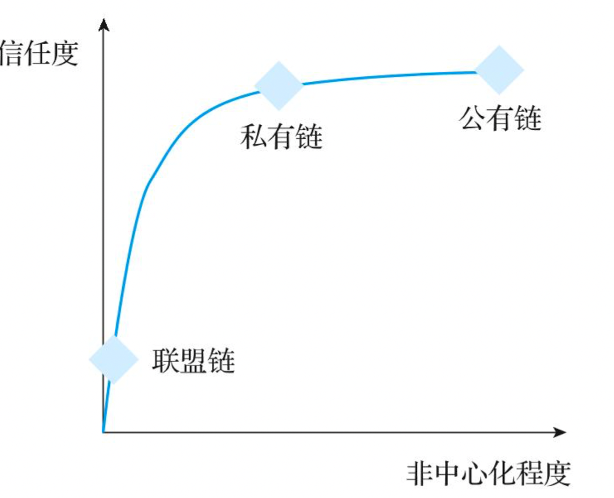

# 入门

## 是什么

类比为一种分布式数据库技术，通过维护数据块的链式结构，可以维持持续增长的、不可篡改的数据记录。

狭义上，区块链是以区块为最基本单位的链式数据结构，区块中利用数字摘要对之前的交易历史进行校验，适合分布式记账场景下防篡改和可扩展性的需求。

广义上，区块链指代基于区块链结构实现的分布式记账技术，包括分布式共识、隐私与安全保护、点对点通信技术、网络协议、智能合约等。

## 基本概念

**交易**

一次对账本的操作，导致对账本的一次改变，如添加一条转账记录

**区块**

记录一段时间内发生的所有交易和状态结果等，是对当前账本状态的一次共识

**链**

由区块按照发生顺序串联而成，是整个账本状态变化的日志记录

如果把区块链系统作为一个状态机，则每次交易意味着一次状态改变；生成的区块就是参与者对其中交易导致状态改变结果的共识。

区块链的目标是实现一个分布的数据记录账本，这个账本只允许添加，不允许删除。账本底层的基本结构是一个线性的链表。

链表由一个个“区块”串联组成），后继区块中记录前导区块的Hash（散列）值。某个区块（以及块里的交易）是否合法，可通过计算Hash值的方式进行快速检验。网络中的节点可以提议添加一个新的区块，但必须经过共识机制来对区块达成确认。

## 案例：比特币

1. 用户通过比特币客户端发起一项交易，消息广播到比特币网络中等待确认
2. 网络中的节点会将收到的等待确认请求打包一起，添加上前一个节点的hash信息，组成一个区块结构
3. 找到一个nonce串（随机串）放到区块里，使得区块结构Hash值结果满足一定条件。这个计算nonce串的过程，就叫做挖矿。查找nonce串需要一定的计算力
4. 一旦节点找到了满足的nonce串，这个区块在格式上就合法了。成为候选区块。节点将在网络中广播出去。
5. 其他节点收到候选区块进行验证，发现确实合法，就承认这个区块是个新的区块，并添加到自己维护的本地区块链结构上。大部分节点都接受了该区块后，意味着区块被网络接受，区块中所包括的交易也得到确认

​		比特币的这种基于算力（寻找nonce串）的共识机制称为工作量证明（Proof of Work，PoW）。这是因为要让Hash值结果满足一定条件，并无已知的快速启发式算法，只能对nonce值进行逐个尝试的蛮力计算。尝试的次数越多（工作量越大），算出来的概率越大。

​		通过调节对hash值结果的限制条件，比特币网络控制平均约10分钟产生一个合法区块。算出区块的节点将得到区块中所有交易的管理费和协议固定发放的奖励费（目前是12.5比特币，每四年减半）。

# 演化

比特币区块链面向转账场景，支持简单的脚本计算。我们很自然地想到，如果引入更多复杂的计算逻辑，区块链技术将能支持更多应用场景，这就是智能合约（Smart Contract）

引入智能合约后的区块链，其功能已经超越了单纯的数据记录，带有一点“智能计算”的意味，更进一步地，还可以为区块链加入权限管理、高级编程语言支持等，实现更强大的、支持更多商用场景的分布式账本系统。

# 技术分类

## 公有链

​		顾名思义，任何人都可以使用和维护，参与者多为匿名。典型的如比特币区块链和以太坊区块链，信息是完全公开的。
如果进一步引入许可机制，可以实现私有链和联盟链两种类型。

## 私有链

​		由集中管理者进行管理限制，只有内部少数人可以使用，信息不公开。一般认为与传统中心化记账系统的差异不明显。

## 联盟链

​		介于两者之间，由若干组织一起合作（如供应链机构或银行联盟等）维护一条区块链，必须具有一定权限才可以访问、使用该区块链，相关信息会得到保护，典型的有超级账本项目。

​		在架构上，现有大部分区块链在实现上都至少包括了网络层、共识层、智能合约和应用层等分层结构，联盟链实现往往还会引入额外的权限管理机制。

​		对于信任度与非中心化程度的关系，针对大部分场景都可以绘制如图所示的曲线。一般情况下，非中心化程度越高，信任度会越好。但两者的关系并非线性那么简单。随着节点数增加，前期的信任度往往会增长得较快，到了一定程度后，信任度随节点数增多并不会得到明显改善。这是因为随着成员数的增加，要实现共谋作恶的成本会呈指数级上升。

