# 平稳性检验

## 特征统计量

### 概率分布

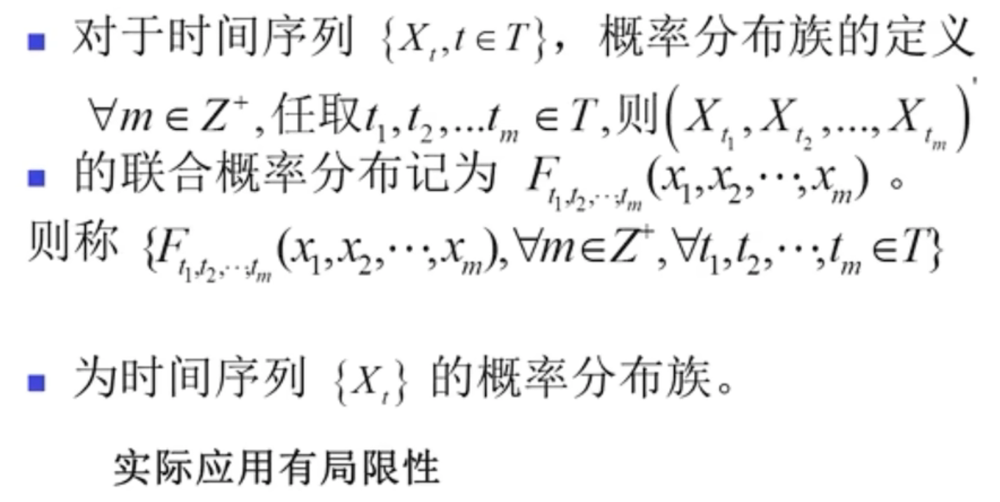

Xt = t时刻的一个时间变量

T 任意取 t1 t2 t3 tm 的随机变量

联合概率分布函数：以二维情形为例，设（X，Y）是二维随机变量，x，y是任意实数，二元函数：F(x,y)=P({X≤x∩Y≤y})=P(X≤x,Y≤y)，被称二维随机变量(X，Y)的分布函数，或称为X和Y的联合分布函数。

### 特征统计量

**均值函数**

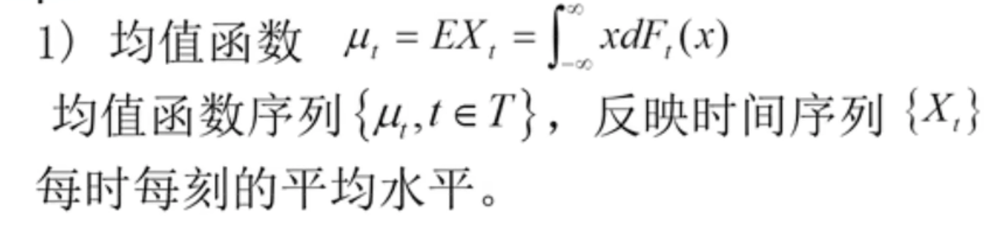

**方差函数**

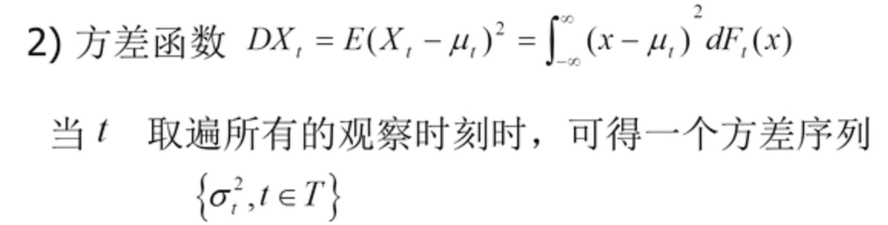

表现了t时刻偏离均值的程度

**自协方差函数和自相关系数**

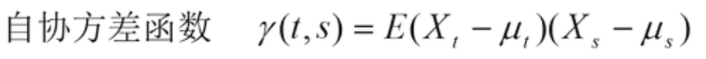

(Xt - Xt的均值) × (Xs - Xs的均值) 的结果 再取一次期望

任意的两个同样事件 在 不同的时刻 X S 的 相关关系

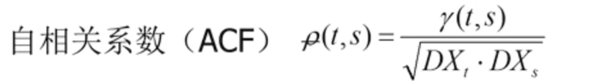

ρ t,s 表示在t时刻和s时刻之间的区别，

自协方差结果 / （ （t时刻的方差 * s时刻的方差）开根号 ）

## 平稳时间序列的定义

### 严平稳

​		严平稳是一种条件比较苛刻的平稳性定义，它认为只有当序列所有的统计性质都不会随着时间的推移而发生变化时，该序列才能被认为平稳

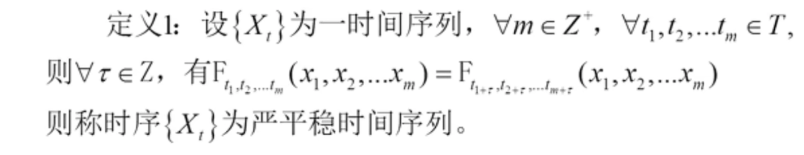

### 宽平稳

​		宽平稳是使用序列的特征统计量来定义的一种平稳性。它认为序列的统计性质主要由它的低阶矩决定，所以只要保证**序列低阶矩平稳**，就能保证序列的主要性质近似稳定

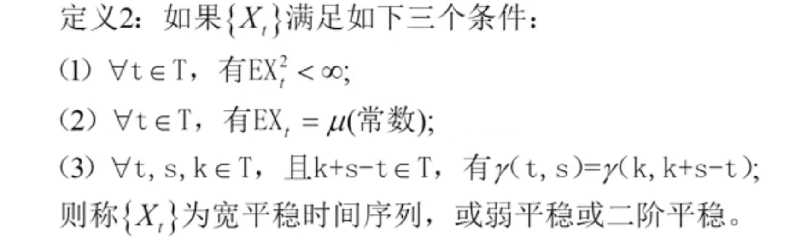

1. 期望小于无穷：这个序列的方差一定是存在的

2. 均值一定是一个常数μ

3. 两个相距为s-t时刻之间的相关关系，和任意两点相距s-t时刻相关关系，的自协方差函数是一样的。

   只要起点时刻和终点时刻，之间相差的时刻数是一样的，他们的自协相差函数就是一样的

### 一般关系

严平稳条件比宽平稳条件苛刻，通常情况下，严平稳能推出宽平稳成立，而宽平稳序列不能反推严平稳成立

但是当序列服从多元正态分布时，宽平稳可以推出严平稳

## 平稳时间序列的统计性质

### 常数均值

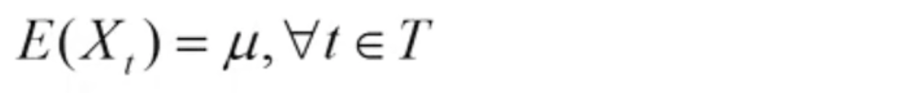

### 只依赖于时间的平移长度

**自协方差函数和自相关函数只依赖于时间的平移长度，与时间的起止点无关**

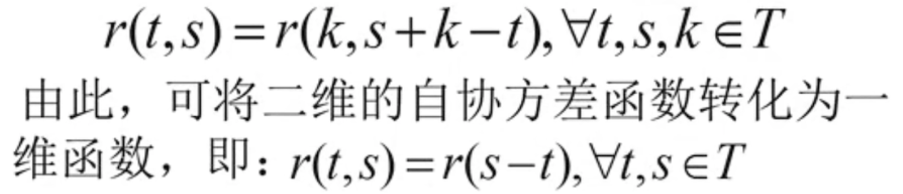

（只取决于间隔时间长度）

### 延迟K阶自协方差函数

对于平稳时间序列来说，任取一个t，与t+k有

延迟k阶自协方差函数 参数为k = t与t+k两个时刻的自协反差函数

从而能推出 常数方差的性质

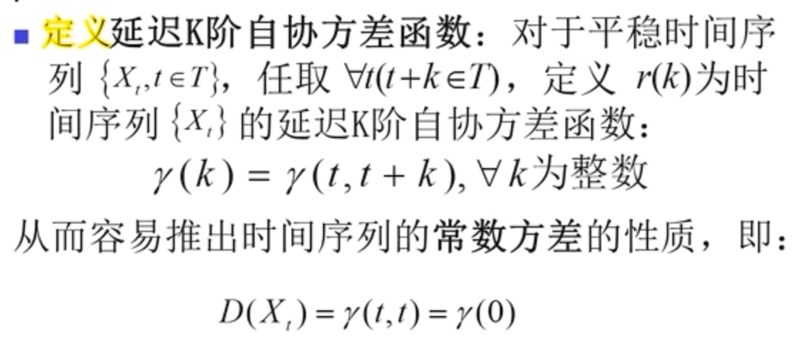

### 延迟K阶自相关系数

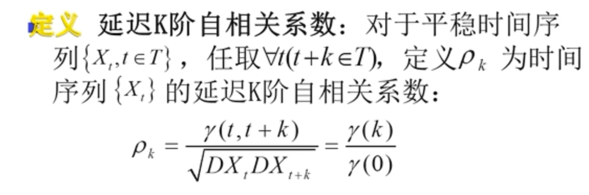

和自协先关函数的含义相同，只是在数值上差了个常数

### 自相关系数具有的三个性质

1. 规范性：ρ0 = 1 自己和自己的相关关系 等于=1 、|ρk|<= 1 k值越小，相关系数越接近1，相关性越强。越接近0，表示相关性越弱

2. 对称性： 大减小 和 小减大 的相关关系一致

3. 非负定性：矩阵的特征根都是>=0的

4. 特别性质：一个序列模型给定时，就是求出唯一的自相关系数，但不能反推

   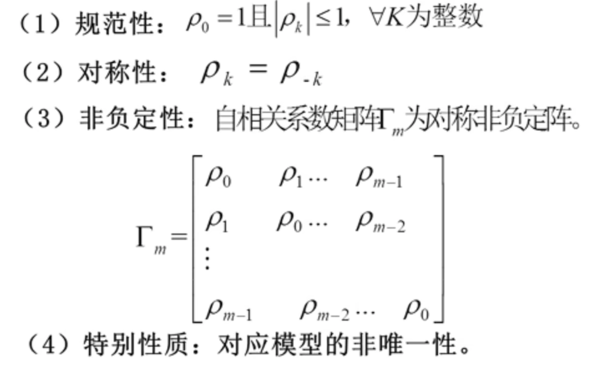

## 平稳时间序列的意义

### 传统统计的数据结构

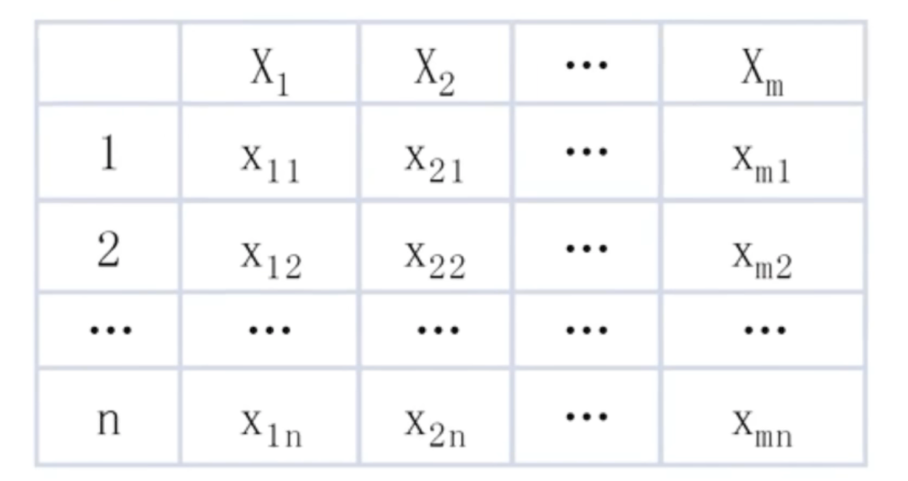

### 时间序列的数据结构

1. 任意t时刻的序列值Xt是一随机变量

2. 变量Xt在任意时刻只能获得唯一的样本观察值

   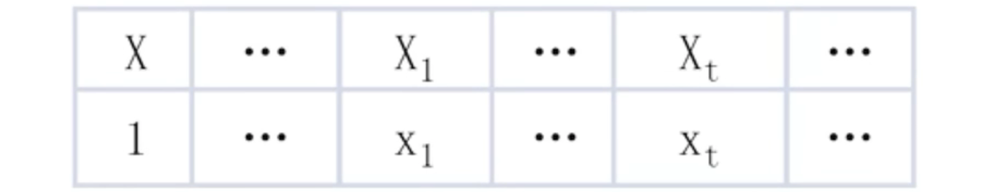

3. 缺点是样本行稀少，需要借助其他信息或辅助办法

### 平稳性的重大意义

1. 平稳序列的常数均质性是的变成了常数序列

   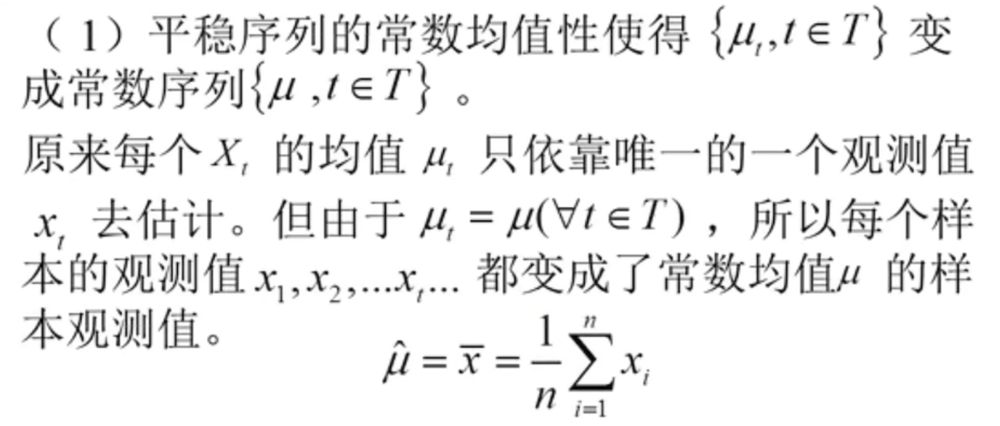

   平稳序列极大地减少了随机数量的个数，并增加了待估变量的样本容量。即极大地简化了时序分析的难度，同时也提高了对特征统计量的估计精度

## 平稳性的检验

