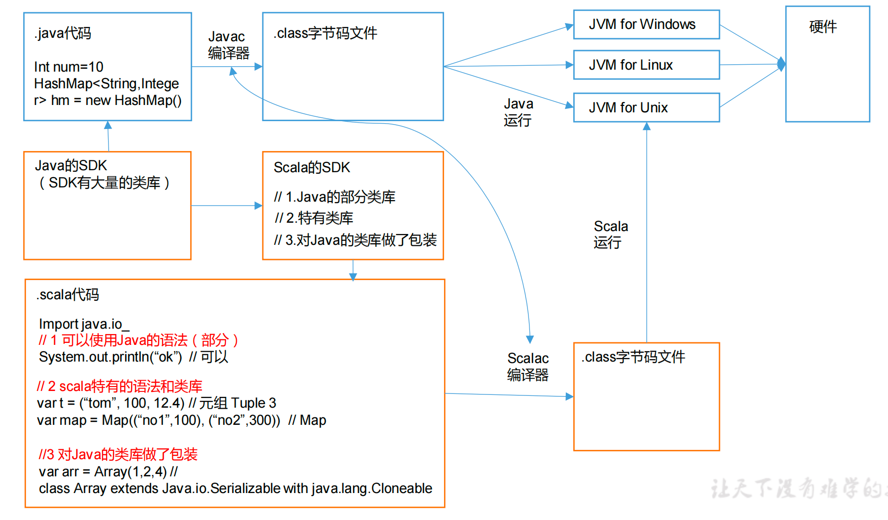
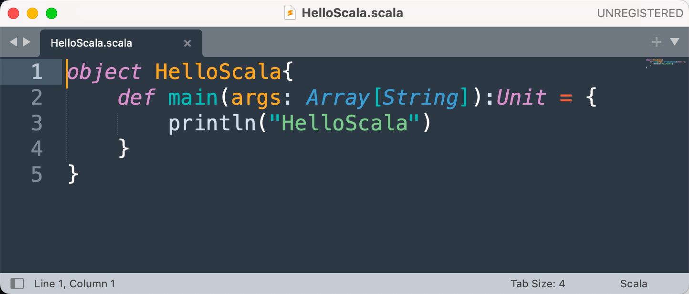

# Scala入门

## 为什么学

1. spark 新一代内存级 大数据计算框架，是大数据的重要内容
2. spark 就是用scala写的，所以为了更好的学习 spark，需要掌握scala
3. Spark的兴起，带动Scala语言的发展！


Scala之父：马丁·奥德斯基


## Java Scala JVM的关系




## 语言特点

Scala是一门以Java虚拟机（JVM）为运行环境

将 面向对象 和 函数式编程 的最佳特性结合在一起的静态类型编程语言


（静态语言需要提前编译的如：Java、c、c++等，动态语言如：js）。 


1）Scala是一门**多范式的编程语言**，Scala支持面向对象和函数式编程。

（多范式，就是多种编程方法的意思。有 面向过程、面向对象、泛型、函数式 四种程序设计方法。） 


2）Scala源代码（.scala）会被编译成Java字节码（.class）

然后运行于JVM之上，并可以调用现有的Java类库，实现两种语言的无缝对接。 


3）Scala单作为一门语言来看，非常的简洁高效**。** 


4）Scala在设计时，马丁·奥德斯基是参考了Java的设计思想，可以说Scala是源于Java，同时马丁·奥德斯基也加入了自己的思想，将函数式编程语言的特点融合到JAVA中, 因此，对于学习过Java的同学，只要在学习Scala的过程中，搞清楚Scala和Java相同点和不同点，就可以快速的掌握Scala这门语言。


# Mac M1系统下配置Scala环境

1.官网下载scala-2.12.14.tgz包

2.解压到任意目录

3.vim ~/.bash_profile 添加环境变量

```properties
# 增加以下内容,注意我和你们的用户名不同，请检查自己的路径
SCALA_HOME=/Users/chenyonglin/dev/scala-2.12.14
export PATH=$PATH:$SCALA_HOME/bin
```

```bash
# 刷新环境变量
source ~/.bash_profile
```

4.控制台输入scala 输入 print("hello world") 回车 测试

5.打开IDEA，安装Scala插件，指定scala路径即可


# HelloWorld

## 1.编写代码



Array[String] 表示String类型的数组

args是变量名

main():Unit 表示main函数返回值为空


## 2.编译

```
scalac HelloScala.scala
```

生成两个文件

HelloScala$.class

HelloScala.class


## 3.运行

```
scala HelloScala
```

