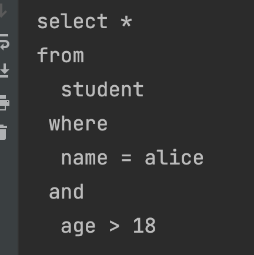
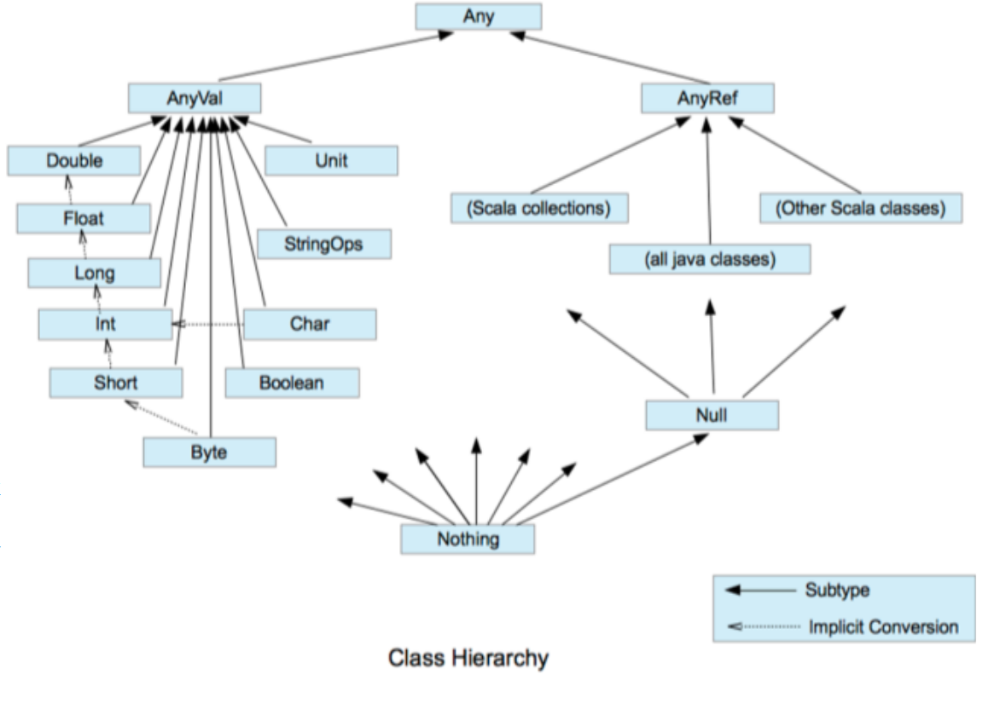
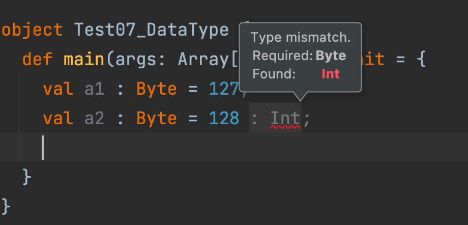

# 注释

Scala注释使用和Java完全一样


单行注释：//

多行注释：/* */

文档注释：在一个object开头写

/**

*

**/


# 代码规范

1.使用一次tab操作缩进

2.ctrl + alt + L 格式化

3.运算符两边都加一个空格

4.一行不超过80个字符


# 变量和常量

# 字符串

**1.字符串通过+拼接**

```scala
//1.通过+号连接 或 用*号将一个字符串复制多次拼接
val name : String = "alice"
val age : Int = 18
println("Name:" + name + " Age:" + age + "在sgg学习！" * 2)
```

输出：Name:alice Age:18在sgg学习！在sgg学习！


**2.printf 字符串 通过%传值**

```scala
//2.printf用法：字符串 通过%传值
printf("%d岁的%s在sgg学习", age, name)
```

输出：18岁的alice在sgg学习


**3.字符串模版（插值字符串）：通过$获取变量值**

```scala
println(s"${age}岁的${name}在sgg学习")

val num : Double = 2.3456
println(f"The Num is ${num}%2.2f") //格式化模版字符串 f指浮点 前面的2 整数长度 后面的2当前浮点保留两位
println(raw"The Num is ${num}%2.2f")  //输出字符串的源格式
```

输出：

The Num is 2.35
The Num is 2.3456%2.2f


**4.多行输出**

```scala
//三引号表示字符串，保持多行字符串的原格式输出
val sql = s"""
   |select *
   |from
   |  student
   | where
   |  name = ${name}
   | and
   |  age > ${age}
   |""".stripMargin
println(sql)
```

输出：




# 键盘输入

```scala
import scala.io.StdIn

object Test05_StdIn {
  def main(args: Array[String]): Unit = {
    //输入信息
    println("请输入您的大名：")
    val name : String = StdIn.readLine()
    println("请输入您的芳龄：")
    val age : Int = StdIn.readInt()

    println(s"欢迎${name}来到sgg学习如何驯服${age}的人")

  }
}
```


# 文件读取

```scala
import java.io.{File, PrintWriter}
import scala.io.Source

object Test06_FileIO {
  def main(args: Array[String]): Unit = {
    //1.从文件中读取数据
    Source.fromFile("/Users/chenyonglin/IdeaProjects/scala/scala_tutorial/src/main/resources/test.txt").foreach(print)

    //2.从数据写入文件 用java
    val writer = new PrintWriter(new File("/Users/chenyonglin/IdeaProjects/scala/scala_tutorial/src/main/resources/output.txt"))
    writer.write("hello Scala From Java Writer")
    writer.close()
  }
}
```


# 数据类型



1）Scala中一切数据都是对象，都是Any的子类。 

2）Scala中数据类型分为两大类：数值类型（AnyVal）、引用类型（AnyRef），不管是值类型还是引用类型都是对象。 

3）Scala数据类型仍然遵守，低精度的值类型向高精度值类型，自动转换（隐式转换） 

4）Scala中的StringOps是对Java中的String增强

5）Unit：对应Java中的void，用于方法返回值的位置，表示方法没有返回值。Unit是 一个数据类型，只有一个对象就是()。Void不是数据类型，只是一个关键字

6）Null是一个类型，只 有一个对 象就 是null。它是所有引用类型（AnyRef）的子类。 

7）Nothing，是所有数据类型的子类，主要用在一个函数没有明确返回值时使用，因为这样我们可以把抛出的返回值，返回给任何的变量或者函数。 


## 整数型 Int

| **数据类型** | **描述**                                                     |
| ------------ | ------------------------------------------------------------ |
| Byte [1]     | 8 位有符号补码整数。数值区间为 -128 到 127                   |
| Short [2]    | 16 位有符号补码整数。数值区间为 -32768 到 32767              |
| Int [4]      | 32 位有符号补码整数。数值区间为 -2147483648 到 2147483647    |
| Long [8]     | 64 位有符号补码整数。数值区间为 -9223372036854775808 到 9223372036854775807 = 2 的(64-1)次方-1 |

有符号 会占用1个字节 标记是正还是负


为啥是-128～127呢

0 000 0000 - 0 111 1111 = 0~127

1 000 0000 - 1000 0001 - 1 111 1111 = -128  -1~ -127


注意 Long需要在数字后面加L,默认类型是Int。小数默认类型是Double

```scala
val a4 = 111111111111111L
```


案例：如果超过了范围编译器也会报错




## 字符类型 Char

字符常量是单引号

```scala
val c1 : Char = 'a'
println(c1)

val c2 :Char = 97
println(c2)
//输出都是a
```

支持String 和 Char 用  +  拼接


**特殊字符**

| 字符 | 意义                    |
| ---- | ----------------------- |
| \t   | 制表符                  |
| \n   | 换行符                  |
| \\   | 转义字符\ 这样表示\自身 |
| \"   | 表示 \                  |


字符变量底层保存的是ASCII


## 布尔类型 Boolean

```scala
val isTrue : Boolean = true
```


## 空类型 Unit、Null、Nothing

| **数据类型 ** | 描述                                                         |      |
| ------------- | ------------------------------------------------------------ | ---- |
| **Unit**      | 表示无值，和其他语言中 void 等同。用作不返回任何结果的方法的结果类型。Unit 只有一个实例值，写成()。 |      |
| **Null**      | null , Null 类型只有一个实例值 null                          |      |
| **Nothing**   | Nothing 类型在 Scala 的类层级最低端；它是任何其他类型的子类型。当一个函数，我们确定没有正常的返回值，可以用 Nothing 来指定返回类型，这样有一个好处，就是我们可以把返回的值（异常）赋给其它的函数或者变量（兼容性） |      |


**Unit**

```scala
def m1() : Unit = {
  println("M1 被 调用执行")
}

val a = m1()
println("a:" + a)
```

```
M1 被 调用执行
a:()
```


源码

```java
public final class BoxedUnit implements java.io.Serializable {
    private static final long serialVersionUID = 8405543498931817370L;

    public final static BoxedUnit UNIT = new BoxedUnit();

    public final static Class<Void> TYPE = java.lang.Void.TYPE;
    
    private Object readResolve() { return UNIT; }

    private BoxedUnit() { }

    public boolean equals(java.lang.Object other) {
   return this == other;
    }

    public int hashCode() {
   return 0;
    }

    public String toString() {
   return "()";
    }
}
```


**Null**

```scala
var student = new Student(name = "alice", age = 20)
student = null
println(null)
```

```
null
```


**Nothing**

```scala
def m2(n: Int) : Int={
  if(n == 0) throw new NullPointerException
  else
  return n

}

val b = m2(0)
println(b)
```


# 类型转换

## 自动类型转换

```scala
//1.自动提升原则
val a1 : Byte = 10
val a2 : Long = 2353L
val result : Long = a1 + a2
val result11 : Int = (a1 + a2.toInt)  //强制转换

//2.低精度赋给高精度 自动转换
val a2 : Byte = 10
val b2 : Int = a2
val c2 : Byte = b2.toByte //强制转换

//3.byte short 和 char之间不会自动转换
val a3 : Byte = 10
val b3 : Char = 'a'
val c3 : Byte = b3  //报错！ 不能转换

//4.byte, short, char 可以计算，但先转换成int类型
val a4 : Byte = 12
val b4 : Short = 25
val c4 : Char = 'a'
val result4 : Int = a4 + b4 + c4
println(result4)
```


## 强制类型转换

```scala
//强制类型转换
//1.将数据 由高精度 转换为 低精度 需要用 强转
val n1 : Int = 2.5.toInt
println("n1:" + n1)

//2.强转符号 只对最近的操作数有效
val n2 : Int = (2.6.toInt + 3.7.toInt)
println(n2)
val n22 : Int = (2.6 + 3.7).toInt
println(n22)

//3.数值与String之间转换
//3.1 数值转 string
val n : Int = 27
val s : String = n + ""

//3.2 String转数值
val m : Int = "12".toInt
val f :Float = "12.3".toFloat
val f1 :Float = "12.3".toInt //酱紫会报错
```


## 经典面试题

```scala
object Test09_Problem_DataTypeConversion {
  def main(args: Array[String]): Unit = {
    val b : Int = 130
    val c : Byte = b.toByte
    println(c) // c = -126
/*
* Int类型 占据32位 130：
* 原码 0000 0000 0000 0000 0000 0000 1000 0010
* 补码 0000 0000 0000 0000 0000 0000 1000 0010
* 截取：
* 补码 1000 0010
* 源码 1111 1110
* 即-126
* */

  }
}
```