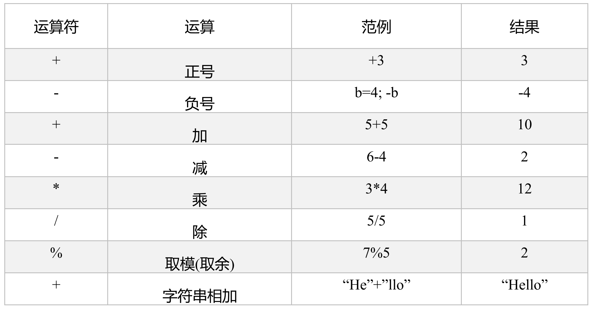
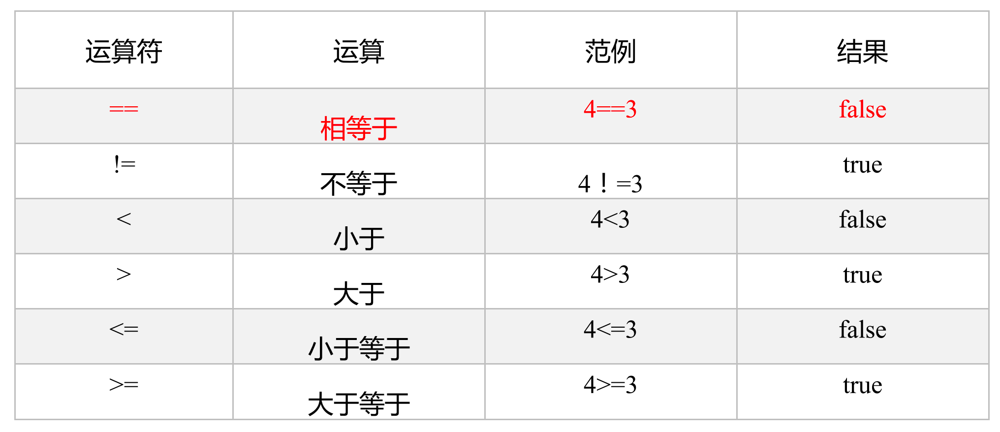
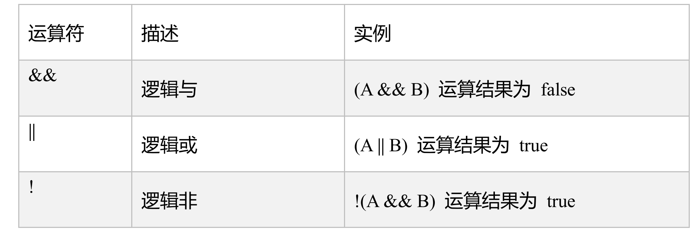
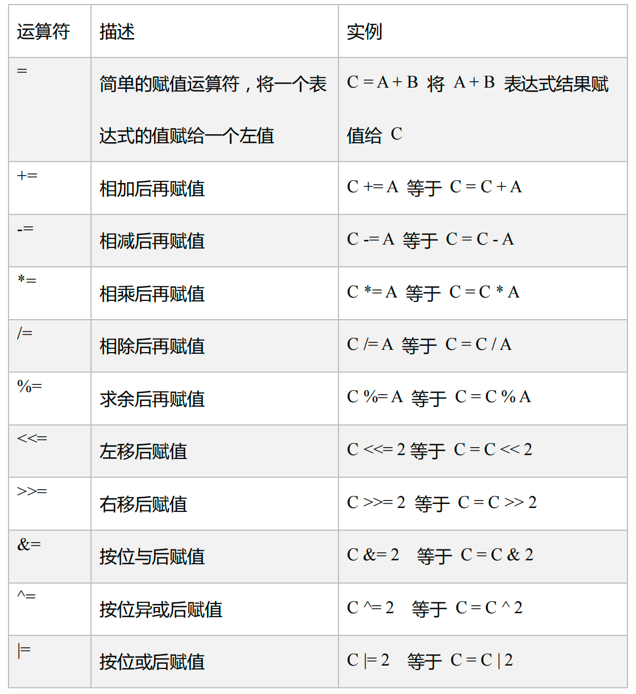
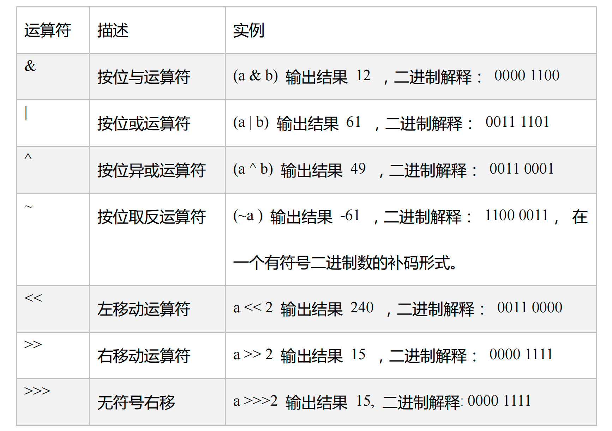

# 算数运算符



```scala
//1.算数运算符
val result1 : Int = 10 / 3
println(result1)

val result2 : Double = 10 / 3 // 这个是int/int再转double的结果
println(result2)

val result3 : Double = 10.0 / 3
println(result3.formatted("%5.2f")) //占据5位数字 保留2位小数

val result4 : Int = 10 % 3
println(result4)
```

输出

```
3
3.0
 3.33
1
```


# 关系运算符



```scala
//2.比较运算符
val s1 : String = "hello"
val s2 : String = new String("hello")

println(s1 == s2) // true scala跟java不一样，这个也是判断内容的
println(s1.equals(s2)) // true
println(s1.eq(s2)) // false 这才是判断引用地址
```


# 逻辑运算符




```scala
def m(n: Int): Int = {
  println("被调用")
  return n
}

val n = 1
println((4 > 5) && m(n) > 0)
println((4 < 5) && m(n) > 0)

//判断一个字符串是否为空
def isNotEmpty(str : String) : Boolean = {
  return str != null && !("".equals(str.trim))
}

println(isNotEmpty(null))
```

输出

```
false
被调用
true
false
```


# 赋值运算符



注意 Scala没有 ++ -- 自增 自减运算符


# 位运算符

a = 60 = 0011 1100

b = 13 = 0000 1101



左移两位 相当于 两次乘二

```scala
//5.位运算符
val a = 60
println(a << 3) // = 480
println(a >> 2) // = 15
val aa : Byte = 125
println(aa << 1) // = 250 自动转换成Int了
println(aa >> 2) // = 31 舍弃小数

val bb = -13
println(bb << 2) // 一样 x2x2
println(bb >> 2) // 一样 /2/2
```


# 运算符的本质

所谓的运算符，Scala底层都是一个对象的方法调用

任意一个数 的方法

```scala
val n1 : Int = 12
val n2 : Int = 37
println(n1.+(n2)) //一切皆对象，一切皆对象的调用
println(n1 + (n2)) //可以省略点号
println(n1 + n2)  //可以省略小括号
```

