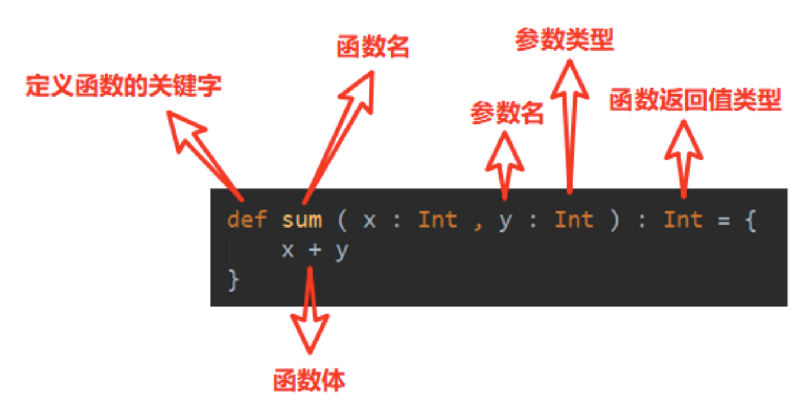
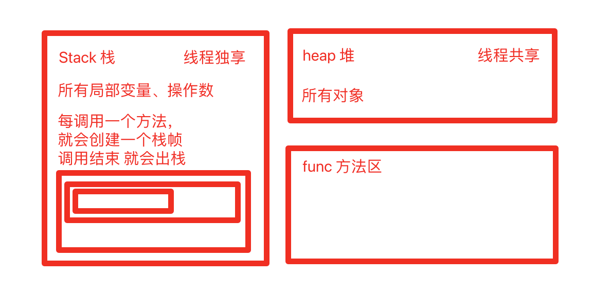
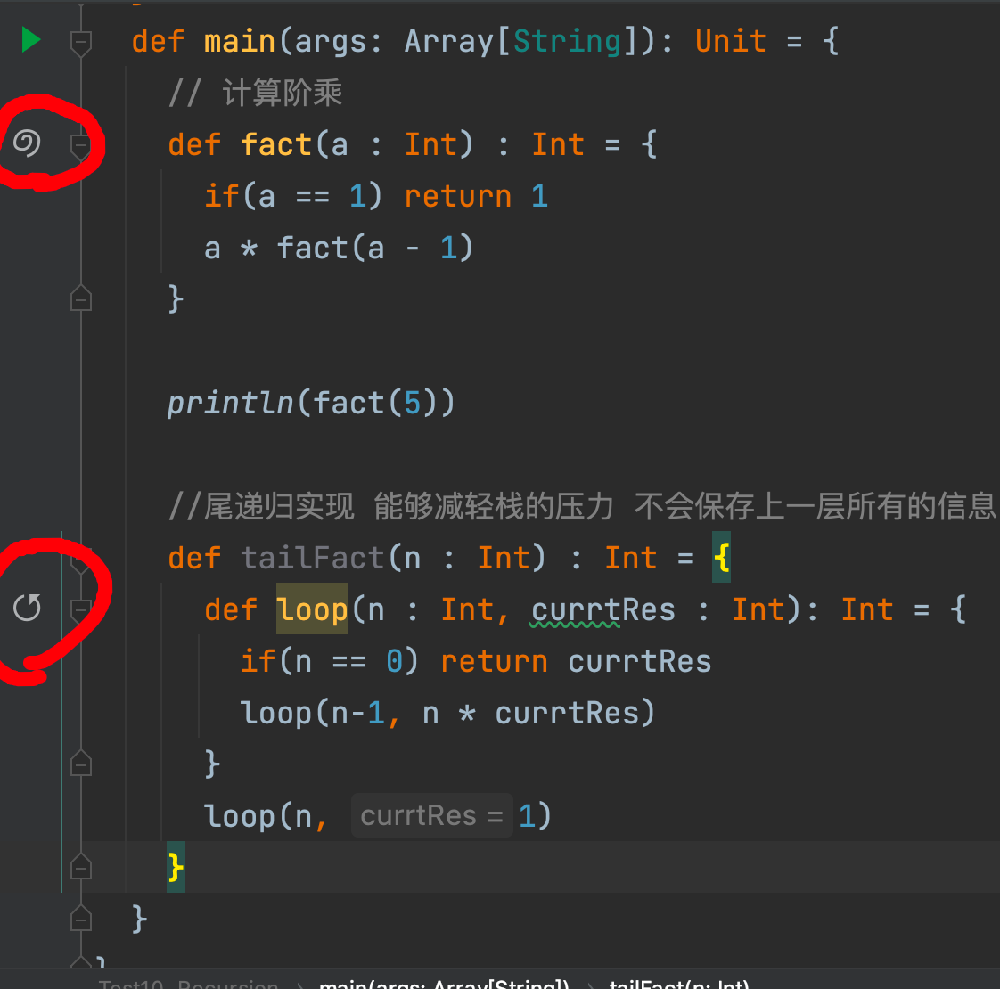

# 介绍

## 面向对象编程

Scala是一门完全面向对象编程语言，万物皆对象

对象的本质：对数据和行为进行封装


## 函数式编程

命令式编程：所有的语法都是面向计算机硬件的抽象

函数式编程：能用常量就用常量，本质是映射关系 y = f(x) 靠近数学的理解方法 得到的结果是确定性的

适合用在大数据里，并行处理


# 函数基本语法



（1）Scala 语言可以在任何的语法结构中声明任何的语法

（2）函数没有重载和重写的概念；方法可以进行重载和重写

（3）Scala 中函数可以嵌套定义


## 函数和方法区别

（1）为完成某一功能的程序语句的集合，称为函数。

（2）类中的函数称之方法。


```SCALA
package chapter05

object Test01_FunctionAndMethod {
  def main(args: Array[String]): Unit = {
    //狭义函数
    def sayHi(name : String) : Unit = {
      println("👋 我是：" + name)
    }

    sayHi("Alice")

    //调用对象方法
    Test01_FunctionAndMethod.sayHi("Alice")
  }

  //广义函数
  def sayHi(name : String) : Unit = {
    println("👋 我在外面，我是：" + name)
  }
}
```


输出

```
👋 我是：Alice
👋 我在外面，我是：Alice
```


## 函数定义

```scala
//函数1：无参 无返回值 return Unit ()
def f1() : Unit = {
  println("函数1：无参 无返回值")
}

//函数2：无参 有返回值
def f2() : Int = {
  println("函数2：无参 有返回值")
  return 12
}

//函数3：有参数 无返回值
def f3(name : String) : Unit = {
  println("函数3：有参数 无返回值" + name)
}

//函数4：有参数 有返回值
def f4(name : String) : String = {
  println("函数3：有参数 无返回值" + name)
  return "Hi~" + name
}

//函数5：多参，无返回值
def f5(name : String , name2 : String) : Unit = {
  println("函数3：有参数 无返回值" + name + name2)
}

//函数6：多参，有返回值
def f4(name : String, name2 : String) : String = {
  println("函数3：有参数 无返回值" + name)
  return "Hi~" + name + " and " +name2
}
```


## 函数参数

**可变参数**

```scala
def f1 (str : String*): Unit ={
  println(str)
}

f1("Alice")
f1("aaa", "bbb", "ccc")
```

此时输出

```
WrappedArray(Alice)
WrappedArray(aaa, bbb, ccc)
```


**多个参数，可变参数放最后**

```scala
def f2 (count : Int , str1 : String ,  str : String*): Unit ={
  println(count +str1+ str)
}

f2(1," sayhi ",   "Alice")
f2(3, " sayhi ", "aaa", "bbb", "ccc")
```

此时输出

```
1 sayhi WrappedArray(Alice)
3 sayhi WrappedArray(aaa, bbb, ccc)
```


**参数默认值，一般放在参数列表后面**

```scala
def f3 (str : String = "atguigu") : Unit = {
  println(str)
}
```

此时输出

```
atguigu
nonono
```


## 带名参数

```scala
def f4(name : String , age : Int) : Unit = {
  println(s"${age}岁的${name}在sgg学习")
}

f4("alice", 20)
f4(age = 21, name = "Bob")
```

此时输出

```
f4("alice", 20)
f4(age = 21, name = "Bob")
```


# 函数至简原则

（1）return 可以省略，Scala 会使用函数体的最后一行代码作为返回值

（2）如果函数体只有一行代码，可以省略花括号

（3）返回值类型如果能够推断出来，那么可以省略（:和返回值类型一起省略）

（4）如果有 return，则不能省略返回值类型，必须指定

（5）如果函数明确声明 unit，那么即使函数体中使用 return 关键字也不起作用

（6）Scala 如果期望是无返回值类型，可以省略等号

（7）如果函数无参，但是声明了参数列表，那么调用时，小括号，可加可不加

（8）如果函数没有参数列表，那么小括号可以省略，调用时小括号必须省略

（9）如果不关心名称，只关心逻辑处理，那么函数名（def）可以省略


```SCALA
package chapter05

object Test04_Simplify {
  def main(args: Array[String]): Unit = {
    def f0(name : String) : String = {
      name  // 1.不需要专门return 一般来说最后一行的值作为返回值
    }

    println(f0("111"))

    def f1(name : String) : String = name //2.如果代码块只有一行 可去除花括号

    def f2(name : String) = name //3.如果返回值可以推断出，则不需要写返回值类型

    //简化到这里，就简化成了一个数学上的函数，能看得出来数据的映射关系

    def f4(name : String) : String = {
      return name  //4.如果有return，不能省略返回值类型
    }

    def f5(name : String) : Unit = {
      return name//5.如果函数声明了返回值是Unit，函数体中的return关键字不起作用
    }

    def f6(name : String){  //6.如果返回值为Unit，可以省略等号
      println(name)
    }

    def f7():Unit={
      println("121")
    }

    f7 // 7.如果函数无参数，但是声明了参数列表，调用可以省略小括号

    def f8 : Unit = { //8.如果函数没有参数列表，小括号可以省略，调用时小括号必须省略
      println("333")
    }
    
    f8
    
    def f9(name : String) = {
      println(name)
    }

    (name : String) => { println(name) } //9.如果不关心名称，只关心逻辑处理，def可以省略 匿名函数
      
  }
}
```


# 匿名函数 Lambda表达式

没有名字的函数就是匿名函数。

(x:Int)=>{函数体} 

x：表示输入参数类型；Int：表示输入参数类型；函数体：表示具体代码逻辑


能把整个函数作为一个值赋给变量

```scala
val fun = (name : String) => {println(name)}  //能把整个函数作为一个值赋给变量 的 匿名函数

//定义一个函数，以函数作为输入

def f(func: String => Unit) : Unit = {
  func("nihao")
}

f(fun)
```

匿名函数的形式就是 (形参) => {方法体}


注意，这里f() 的形式参数是String =>Unit 表示一个 匿名函数 传入String 并且返回值是Unit的


## 匿名函数 至简原则

（1）参数的类型可以省略，会根据形参进行自动的推导

（2）类型省略之后，发现只有一个参数，则圆括号可以省略；其他情况：没有参数和参数超过 1 的永远不能省略圆括号。 

（3）匿名函数如果只有一行，则大括号也可以省略

（4）如果参数只出现一次，则参数省略且后面参数可以用_代替

```scala
package chapter05

object Test05_Lambda {
  def main(args: Array[String]): Unit = {

    //定义一个函数，以函数作为输入
    def f(func: String => Unit) : Unit = {
      func("nihao")
    }
    

    //匿名函数的简化原则
    //1.参数的类型可以省略，会根据形参数自动推倒
    f( (name) => {println(name)} )

    //2.如果只有一个参数，括号可省略
    f( name => {println(name)} )

    //3.如果函数体只有一行，大括号可省略
    f( x => println(x) )

    //4 如果参数只出现一次，参数省略，并用_替代
    f( println(_) )

    //5.如果可以推断出当前传入的 println是一个函数体，不是一个调用语句，就可以直接省略下划线
    f ( println )

  }
}
```


## 案例

```scala
// 实际示例：定义一个"二元运算"函数，只操作1和2两个数，但是具体运算通过参数传入

def dualFunctionOneAndTwo(fun : (Int, Int) => Int) = {
  fun(1, 2)
}

val add = (a : Int , b : Int) => a + b
val minus = (a : Int , b : Int) => a - b

println(dualFunctionOneAndTwo(add))
println(dualFunctionOneAndTwo(minus))
```

简化一下

```scala
//简化
println(dualFunctionOneAndTwo(_ + _))
println(dualFunctionOneAndTwo(_ - _))
```


# 函数高级应用

## 函数作为值进行传递

```scala
def f(n : Int) : Int = {
  println("f调用")
  n + 1
}

def fun () : Unit = println("FUN调用")

//1.函数作为值进行传递
val f1 : Int => Int = f //表示f本身这个函数
val f2 = f _ // 如果没写变量类型，可直接下划线表示是一个函数本身而不是调用
println(f1) // 输出一个饮用
println(f1(1))  // 直接调用这个函数
println(f2)
println(f2(2))

val f3 = fun _
```


## 函数作为参数进行传递

```scala
//2.函数作为参数进行传递
def dualEval(op : (Int, Int) => Int, a : Int , b : Int) : Int = {
  op(a, b)
}

def add (a : Int, b:Int) : Int = a + b
def minus (a : Int, b:Int) : Int = a - b

println(dualEval(add, 1, 2))
println(dualEval( (a, b) => a + b, 2, 3))
println(dualEval( (_ + _) , 4 , 5))
```


## 函数作为返回值返回

```SCALA
//3. 函数作为返回值返回
def f5 () : Int => Unit = {
  def f6(a : Int): Unit = println("f6调用" + a)
  f6 // 将函数直接返回
}

println(f5) // 得到的是一个函数的引用
val f66 = f5
f66(25) // 可以酱紫调用
f5()(11)  // 也可以酱紫调用
```


## 案例

1.对数组进行处理，将操作抽象出来，处理完毕后结果返回一个新的数字

```scala
val arr:Array[Int] = Array(12, 45, 75, 98)

 // 对数组进行处理，将操作抽象出来，处理完毕后结果返回一个新的数字
def arrayOperation(array: Array[Int], op :Int => Int) : Array[Int] = {
  for (elem <- array) yield op(elem)
}

//定义一个 + 1 操作
def addOne(elem : Int) : Int = {
  elem + 1
}

val newArray : Array[Int] = arrayOperation(arr, addOne)
println(newArray.mkString(",")) //每个元素逗号分割

//传入匿名函数，实现元素翻倍
val newArray2 = arrayOperation(arr, _ * 2)
println(newArray2.mkString(","))
```


2.传入Int String Char 如果等于0 "" '0'则返回false 否则返回true

使用函数嵌套写法

```SCALA
package chapter05

object Test08_Practice {
  def main(args: Array[String]): Unit = {
    def f1(a : Int) : String => (Char=>Boolean) = {
      def f2(b : String) : Char => Boolean= {
        def f3(c :Char) : Boolean = {
          if(a == 0 && b == "" && c == '0' ) false else true
        }
        f3
      }
      f2
    }

    val rt1 = f1(0)("")('0')
    println(rt1)
    val rt2 = f1(1)("123")('0')
    println(rt2)
  }
}
```


匿名函数写法(闭包)

```SCALA
def f11(a1: Int): String => (Char => Boolean) = {
  b1 => c1 => if (a1 == 0 && b1 == "" && c1 == '0') false else true
}

val r1 = f11(0)("")('0')
println(r1)
val r2 = f11(1)("123")('0')
println(r2)
```


柯里化写法

```scala
def func2(i : Int)(s : String)(c : Char):Boolean = {
	if (i == 0 && s == "" && c == '0') false else true
}
```


# 函数柯里化&闭包

## 闭包

闭包：一个函数，访问了它的外部(局部)变量的值，那么这个函数和他所处的环境，叫做闭包




因为在Scala里，每个函数都是一个对象，所以一些环境 和 一些参数 会放置在堆里

不会受栈里的因为函数退出了的影响


```scala
//0. 两个加数的场景
def add(a : Int, b : Int): Int = {
  a + b
}

//1. 考虑固定一个加数的场景
def addByFour( b : Int ) : Int = b + 4

//2. 扩展加数改变的情况
def addByFive( b : Int ) : Int = b + 5

//3. 将固定加数 作为另一个参数传入 但是是作为"第一层参数"传入 【闭包写法】

def addBy(a : Int) : Int => Int = {
  def addB1(b: Int): Int = {
    a + b
  }
  addB1
}

//闭包的使用
val addByFour4 = addBy(4) //先写第一层
println(addByFour4(5)) // 4 + 5
val addByFive5 = addBy(5) //先写第一层
println(addByFive5(4)) // 5 + 4
```


这样写 适用性会更广泛

改写为lambda表达式

```scala
def addByLambda(a : Int):Int => Int = a + _

val addByFour1 = addByLambda(4)
println(addByFour1(5)) // 4 + 5
println(addByFour1(-3)) // 4 - 3
```


## 函数柯里化

函数柯里化：把一个参数列表的多个参数，变成多个参数列表

```scala
def addByCurry(a: Int)(b : Int) : Int = a + b
println(addByCurry(12)(28))
```


# 递归

一个函数/方法在函数/方法体内又调用了本身，我们称之为递归调用

```scala
package chapter05

object Test10_Recursion {
  def main(args: Array[String]): Unit = {
    // 计算阶乘
    def fact(a : Int) : Int = {
      if(a == 1) return 1
      a * fact(a - 1)
    }

    println(fact(5))
  }
}
```

递归还是少用，因为对栈不友好，容易StackOverFlow


尾递归 会覆盖上一层的栈 减轻了stack的压力

```scala
def tailFact(n : Int) : Int = {
  @tailrec //尾递归的注解 如果不符合要求 会编译不通
  def loop(n : Int, currtRes : Int): Int = {
    if(n == 0) return currtRes
    loop(n-1, n * currtRes)
  }
  loop(n, 1)
}
```





# 控制抽象

## 传值参数

```scala
//传值参数
def f0(a : Int) : Unit = {
  println("a:" + a)
  println("a:" + a)
}

def f1() : Int = {
  println("f1调用")
  12
}

f0(f1)
```

此时输出

```
f1调用
a:12
a:12
```


## 传名参数

传递的不再是具体的值，而是代码块

```scala
//传名参数 ： 传递的不再是具体的值，而是代码块
def f2 (a : =>Int):Unit = { // =>Int表示一段代码块，并且代码块的返回值要是Int
  println("a:" + a)
  println("a:" + a)
}
f2(23)
f2( f1() )
```


此时输出

```
a:23
a:23
f1调用
a:12
f1调用
a:12
```

f1的执行次数，决定于这个传名参数，调用了几次

每调用一次就会执行一次f1

# 综合练习：自实现While循环

```SCALA
def main(args: Array[String]): Unit = {
  var n = 10
  //1.常规的while循环
  while (n >= 1){
    println(n)
    n -= 1
  }

  //2.用闭包实现一个函数，当代码块作为参数传入
  def myWhile(condition : =>Boolean) : (=>Unit)=>Unit = {
    //内层函数 需要递归调用,参数就是循环体
    def doLoop(op: =>Unit) : Unit = {
      if(condition){
        op
        myWhile(condition)(op)
      }
    }
    doLoop _
  }
  n = 10
  myWhile(n >= 1){
    println(n)
    n-=1
  }

  //3.用匿名函数实现
  def myWhile2(condition : =>Boolean) : (=>Unit)=>Unit = {
    //内层函数 需要递归调用,参数就是循环体
    op => {
      if(condition){
        op
        myWhile2(condition)(op)
      }
    }
  }

  n = 10
  myWhile2(n >= 1){
    println(n)
    n-=1
  }

  //4.用柯里化实现
  def myWhile3(condition : =>Boolean)(op: => Unit) : Unit = {
    //内层函数 需要递归调用,参数就是循环体
    if(condition){
      op
      myWhile3(condition)(op)
    }
  }

  n = 10
  myWhile3(n >= 1){
    println(n)
    n-=1
  }
}
```


# 惰性加载

当**函数返回值被声明为** **lazy** **时**，函数的**执行将被推迟**，直到我们首次对此取值，该函数才会执行。这种函数我们称之为惰性函数。


```SCALA
object Test13_LazyLoading {
  def main(args: Array[String]): Unit = {
    lazy val result : Int = sum(13, 47)

    println("1.函数调用")
    println("2.result = " + result)
  }

  def sum(a:Int, b:Int) : Int = {
    println("3.SUM调用")
    a + b
  }
}
```

输出

```
1.函数调用
3.SUM调用
2.result = 60
```


