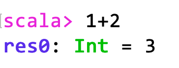
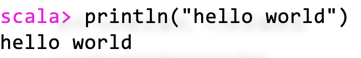
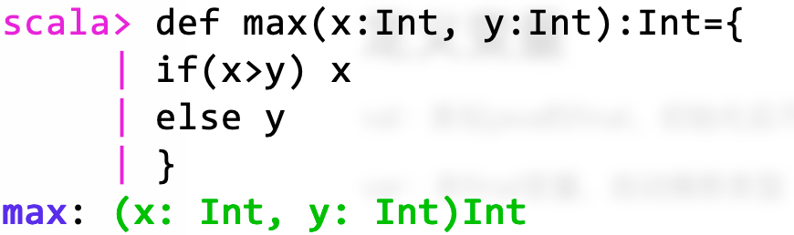
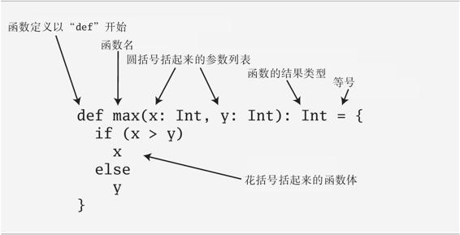
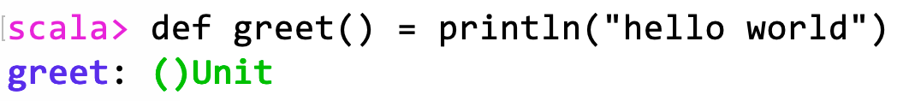
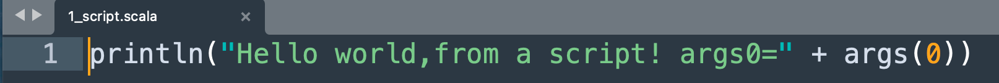
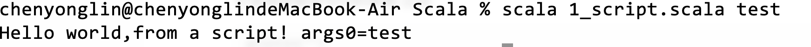
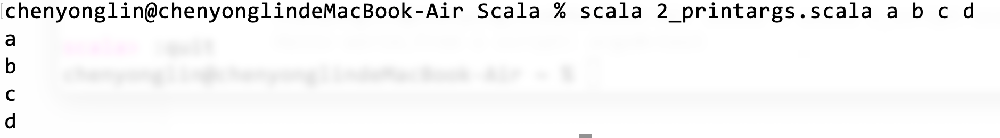
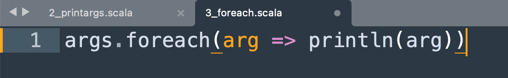

## Scala解释器

## 初见

在command输入scala，进入Scala解释器



其中 res0是变量名，Int是变量类型

res0可以在后续的代码中使用


### 打印HelloWorld



## 定义变量

val：类似java的final，初始化后不再赋值

var：非final变量，自动推断类型


显式标注类型：

```scala
val msg3:String = "Hello again,World!"
```


## 定义函数

### 有返回函数



def：函数定义开始

max：函数名，括号内为参数列表

x:Int  x为第一个参数，类型为Int（注意一定要大写）

右括号写返回值




返回值可以不写，会自动匹配返回值

花括号可以不写，如果只有一条语句


### 无返回函数



unit为java里的void


## 退出解释器

输入:quit或:q

注意有冒号


## 编写scala脚本

### 运行参数

可直接运行

```
scala hello.scala
```


可直接获取命令行的参数 比如







### While与If

```scala
var i = 0
while(i < args.length){
	println(args(i))
	i += 1 // i++和++i是无效的
}
```





### foreach和for



