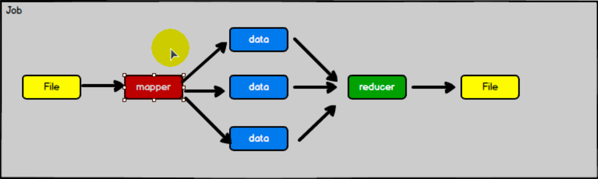

# Spark是什么

Spark是一种基于内存的快速、通用、可扩展的大数据分析计算引擎

# Spark和Hadoop

在之前的学习中，Hadoop 的 MapReduce 是大家广为熟知的计算框架，那为什么咱们还要学习新的计算框架 Spark 呢，这里就不得不提到 Spark 和 Hadoop 的关系。

## 时间节点上看

**Hadoop**

2006 年 1 月，Doug Cutting 加入 Yahoo，领导 Hadoop 的开发

2008 年 1 月，Hadoop 成为 Apache 顶级项目

2011 年 1.0 正式发布

 2012 年 3 月稳定版发布

2013 年 10 月发布 2.X (Yarn)版本

**Spark**

2009 年，Spark 诞生于伯克利大学的 AMPLab 实验室

2010 年，伯克利大学正式开源了 Spark 项目

2013 年 6 月，Spark 成为了 Apache 基金会下的项目

2014 年 2 月，Spark 以飞快的速度成为了 Apache 的顶级项目

2015 年至今，Spark 变得愈发火爆，大量的国内公司开始重点部署或者使用 Spark

## 从功能上来看

**Hadoop**

Hadoop 是由 java 语言编写的，在分布式服务器集群上存储海量数据并运行分布式分析应用的开源框架

1. 作为 Hadoop 分布式文件系统，HDFS 处于 Hadoop 生态圈的最下层，存储着所有的数据 ， 支持着 Hadoop 的 所 有 服 务 。 它 的 理 论 基 础 源 于 Google 的TheGoogleFileSystem 这篇论文，它是 GFS 的开源实现。

2. MapReduce 是一种编程模型，Hadoop 根据 Google 的 MapReduce 论文将其实现，作为 Hadoop 的分布式计算模型，是 Hadoop 的核心。基于这个框架，分布式并行程序的编写变得异常简单。综合了 HDFS 的分布式存储和 MapReduce 的分布式计算，Hadoop 在处理海量数据时，性能横向扩展变得非常容易。

3. HBase 是对 Google 的 Bigtable 的开源实现，但又和 Bigtable 存在许多不同之处。HBase 是一个基于 HDFS 的分布式数据库，擅长实时地随机读/写超大规模数据集。它也是 Hadoop 非常重要的组件。

**Spark**

Spark 是一种由 Scala 语言开发的快速、通用、可扩展的大数据分析引擎

1. Spark Core 中提供了 Spark 最基础与最核心的功能

2. Spark SQL 是 Spark 用来操作结构化数据的组件。通过 Spark SQL，用户可以使用SQL 或者 Apache Hive 版本的 SQL 方言（HQL）来查询数据。

3. Spark Streaming 是 Spark 平台上针对实时数据进行流式计算的组件，提供了丰富的处理数据流的 API。由上面的信息可以获知，Spark 出现的时间相对较晚，并且主要功能主要是用于数据计算，所以其实 Spark 一直被认为是 Hadoop 框架的升级版。

# Spark还是Hadoop？

**Hadoop适用于一次性数据计算：**

框架在处理数据的时候，会从存储设备中读取数据，进行逻辑操作，然后将处理的结果重新存储到介质中。

处理复杂逻辑，效率十分低下

上一次的计算结果 给下一次计算使用，通过磁盘IO进行

所以MR的性能被硬盘速度约束非常大

**Spark可以基于内存进行计算**：

## 比较

1. Hadoop MapReduce 由于其设计初衷并不是为了满足循环迭代式数据流处理，因此在多并行运行的数据可复用场景（如：机器学习、图挖掘算法、交互式数据挖掘算法）中存在诸多计算效率等问题。所以 Spark 应运而生，Spark 就是在传统的 MapReduce 计算框架的基础上，利用其计算过程的优化，从而大大加快了数据分析、挖掘的运行和读写速度，并将计算单元缩小到更适合并行计算和重复使用的 RDD 计算模型。 

2. 机器学习中 ALS、凸优化梯度下降等。这些都需要基于数据集或者数据集的衍生数据反复查询反复操作。MR 这种模式不太合适，即使多 MR 串行处理，性能和时间也是一个问题。数据的共享依赖于磁盘。另外一种是交互式数据挖掘，MR 显然不擅长。而Spark 所基于的 scala 语言恰恰擅长函数的处理。

3. Spark 是一个分布式数据快速分析项目。它的核心技术是弹性分布式数据集（Resilient Distributed Datasets），提供了比 MapReduce 丰富的模型，可以快速在内存中对数据集进行多次迭代，来支持复杂的数据挖掘算法和图形计算算法。

4. Spark 和Hadoop 的根本差异是多个作业之间的数据通信问题 : Spark 多个作业之间数据通信是基于内存，而 Hadoop 是基于磁盘。

5. Spark Task 的启动时间快。Spark 采用 fork 线程的方式，而 Hadoop 采用创建新的进程的方式。

6. Spark 只有在 shuffle 的时候将数据写入磁盘，而 Hadoop 中多个 MR 作业之间的数据交互都要依赖于磁盘交互

7. Spark 的缓存机制比 HDFS 的缓存机制高效

# Spark核心模块

学习路线：

1.Spark Core

2.Spark SQL

3.Spark Streaming

**Spark Core**

Spark Core 中提供了 Spark 最基础与最核心的功能，Spark 其他的功能如：Spark SQL，Spark Streaming，GraphX, MLlib 都是在 Spark Core 的基础上进行扩展的

**Spark SQL**

Spark SQL 是 Spark 用来操作结构化数据的组件。通过 Spark SQL，用户可以使用 SQL或者 Apache Hive 版本的 SQL 方言（HQL）来查询数据。

 **Spark Streaming**

Spark Streaming 是 Spark 平台上针对实时数据进行流式计算的组件，提供了丰富的处理数据流的 API。 

**Spark MLlib**

MLlib 是 Spark 提供的一个机器学习算法库。MLlib 不仅提供了模型评估、数据导入等额外的功能，还提供了一些更底层的机器学习原语。

**Spark GraphX**

GraphX 是 Spark 面向图计算提供的框架与算法库