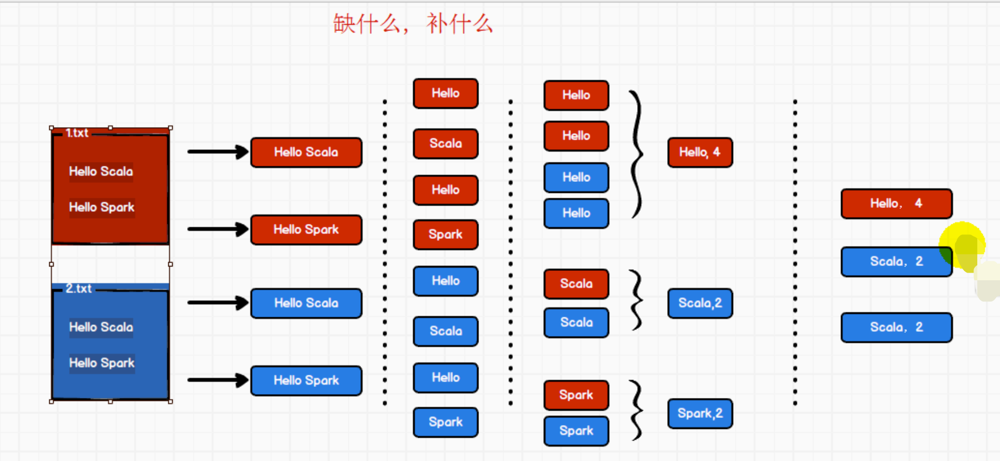

# 创建Maven项目

Spark 由 Scala 语言开发的，所以本课件接下来的开发所使用的语言也为 Scala，咱们当前使用的 Spark 版本为 3.0.0，默认采用的 Scala 编译版本为 2.12，所以后续开发时。我们依然采用这个版本。开发前请保证 IDEA 开发工具中含有 Scala 开发插件


## 添加Scala支持

请查看Scala教程里的环境搭建


## 添加依赖

```xml
		<dependencies>
        <dependency>
            <groupId>org.apache.spark</groupId>
            <artifactId>spark-core_2.12</artifactId>
            <version>3.0.0</version>
        </dependency>
    </dependencies>
    
     <build>
        <plugins>
            <!-- 该插件用于将 Scala 代码编译成 class 文件 -->
            <plugin>
                <groupId>net.alchim31.maven</groupId>
                <artifactId>scala-maven-plugin</artifactId>
                <version>3.2.2</version>
                <executions>
                    <execution>
                        <!-- 声明绑定到 maven 的 compile 阶段 -->
                        <goals>
                            <goal>testCompile</goal>
                        </goals>
                    </execution>
                </executions>
            </plugin>
            <plugin>
                <groupId>org.apache.maven.plugins</groupId>
                <artifactId>maven-assembly-plugin</artifactId>
                <version>3.1.0</version>
                <configuration>
                    <descriptorRefs>
                        <descriptorRef>jar-with-dependencies</descriptorRef>
                    </descriptorRefs>
                </configuration>
                <executions>
                    <execution>
                        <id>make-assembly</id>
                        <phase>package</phase>
                        <goals>
                            <goal>single</goal>
                        </goals>
                    </execution>
                </executions>
            </plugin>
        </plugins>
    </build>
```


# WordCount详解




## 写代码

```scala
package com.atguigu.bigdata.spark.core.wc

import org.apache.spark.rdd.RDD
import org.apache.spark.{SparkConf, SparkContext}

object Spark01_WordCount {
  def main(args: Array[String]): Unit = {
    //TODO 建立和Spark框架的连接
    //JDBC：Connection
    val sparkConf = new SparkConf().setMaster("local").setAppName("WordCount")
    val sc = new SparkContext(sparkConf)

    //TODO 执行业务操作
    //1.读取文件，获取一行一行的数据
    //  hello world
    val lines: RDD[String] = sc.textFile("datas")

    //2.将一行数据进行拆分，形成一个个单词（分词）
    //"helloworld" => hello,world,hello,world
    val words: RDD[String] = lines.flatMap(_.split(" "))

    //3.将数据根据单词进行分组，便于统计
    //(hello,hello,hello),(world,world)
    val wordGroup: RDD[(String, Iterable[String])] = words.groupBy(word => word)

    //4.对分组后的数据进行转换
    //(hello,3),(world,2)
    val wordToCount = wordGroup.map{
      case (word, list) => {
        (word, list.size)
      }
    }

    //5.将转换结果采集到控制台打印出来
    val arrays: Array[(String, Int)] = wordToCount.collect()
    arrays.foreach(println)
    
    //TODO 关闭连接
    sc.stop()
  }
}
```