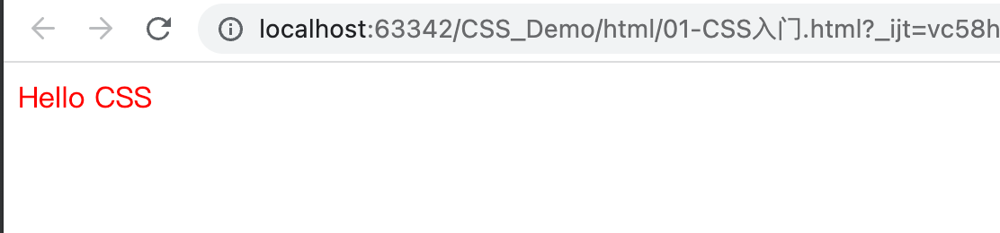

# CSS是什么

## 概念

CSS是一门语言，用于控制网页表现

CSS：Cascading Style Sheet - 层叠样式表

W3C标准：网页主要由三部分组成

​	结构：HTML

​	表现：CSS

​	行为：JavaScript

## 案例

在style里写样式，div的颜色都改为red

```html
<!DOCTYPE html>
<html lang="en">
<head>
    <meta charset="UTF-8">
    <title>Title</title>
  <style>
    div{
      color:red;
    }
  </style>
</head>
<body>
  <div>Hello CSS</div>
</body>
</html>
```





# CSS导入方式

## 内联样式

在标签内部使用style属性，属性值是css属性键值对

```html
<div style:"color:red">Hello css</div>
```

在style属性里写css的代码

这种样式和源码是耦合起来的，不利于后期维护，所以现在很少使用这种方式


## 内部样式

定义\<style>标签，在标签内部定义css样式

```html
<style type="text/css">
  div{
    color:red;
  }
</style>
```

div：选择器，意味着选择body页面下的div标签 

定义标签在\<head>里面写


## 外部样式

定义link标签，引入外部的css文件

```html
<link rel="stylesheet" href="demo.css">
```

\<link>代码在head里面写

demo.css:

```css
div{
	color:red;
}
```

一般来说 css文件存放在css的文件夹里

在里面的css文件里写css的代码


# CSS选择器

概念：选择器是选取需设置样式的元素（标签）

分类如下：

## 元素选择器

```html
元素名称{color:red;}
```

选择对应的元素名称，例如：

```html
div{color:red;}
```


## id选择器

```html
#id属性值{color:red;}
```

选择对应元素的id。例如：

```html
#name{color:red;}

<div id="name">hello css2</div>
```


## 类选择器

```html
.class属性值{color:red;}
```

选择对应的类的属性值

类可以是多个元素，但是id是唯一的

```html
.cls{color:red;}

<div class="cls">hello css3</div>
```


# CSS属性

w3school.com.cn/cssref/index.asp

有一大堆

css可以写很多属性，每个属性都是一个键值对

Java程序员不需要重点掌握