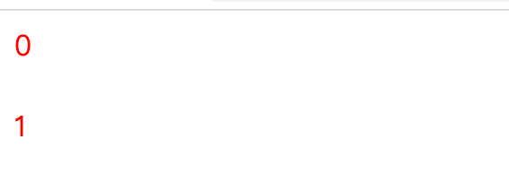
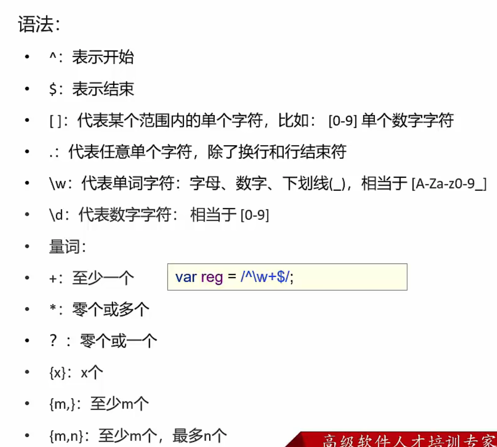

# 是什么

## 简介

JavaScript是一门跨平台，面向对象的脚本语言，来控制网页行为的，它能使网页可交互。控制网页的行为

JavaScript和Java是两个完全不同的语言，不论是概念还是设计，但是基础语法类似

JavaScript 简称 JS


## 能做什么

1. 改变Html的属性值
2. 能改变图像src的属性值
3. 能够进行表单验证


# 引入方式

## 内部脚本

将JS代码定义在HTML页面中

在HTML中，JavaScript代码必须位于\<script>与\</script>标签之间


**提示**

1. 可以放任意多个并且任意位置

2. 一般把脚本置于\<body>元素的底部，可以改善显示速度，因为脚本执行会拖慢显示


## 外部脚本

将JS代码定义在外部JS文件中，然后引入到HTML页面中

通过script标签的src属性，引入外部js文件


## 案例

**内部JS**

```html
<!DOCTYPE html>
<html lang="en">
<head>
    <meta charset="UTF-8">
    <title>Title</title>

    <script>
      alert("hello js");
    </script>
</head>
<body>

</body>
</html>
```


**外部JS**

注意 script不能自闭合

```html
<!DOCTYPE html>
<html lang="en">
<head>
    <meta charset="UTF-8">
    <title>Title</title>

</head>
<body>

<script src="../js/demo.js"> </script>
</body>
</html>
```


# 基础语法

## 书写语法

1. 一切都是区分大小写的

2. 结尾的分号可以不写，一般情况下写下比较严谨

3. 注释： // 单行注释 /* */ 多行注释

4. 大括号表示代码块

   

## 输出语句

1. 使用 window.alert() 写入警告框
2. 使用 document.write() 写入HTML输出
3. 使用 console.log() 写入浏览器控制台


# 变量

## 介绍

JavaScript中使用var关键字来声明变量

```
var test = 20;
test = "张三"
```

JS是一门弱类型的语言。变量可以存放不同类型的值

变量名遵循以下原则：

1. 组成字符为任意字母、数字、_ 或 $
2. 数字不能作为开头
3. 建议使用驼峰命名法

ECMAScript 6 新增let关键字来定义变量。用法类似于var，但是声明的变量，只在let关键字所在的代码块内有效，且不允许重复声明变量

ECMAScript 6 新增了const关键字，用来声明一个只读的常量，一旦声明，常量的值就不能改变   


## 案例

```html
<!DOCTYPE html>
<html lang="en">
<head>
    <meta charset="UTF-8">
    <title>Title</title>
</head>
<body>

<script>
  var test = 20;
  alert(test);
  test = "你好。世界";
  alert(test);
</script>
</body>
</html>
```

可以看出 是弱类型的


## 特性

```html
<script>
  {
    var test = "可以访问，作用域很大";
    var test = "可以重复定义"
  }
  alert(test);
  {
    let test2 = "let关键字 作用域只在代码块" //而且不能重复定义
  }
  alert(test2) // 不行
  
  const PI = 3.1415; //常量
</script>
```

`var`作用域很大，且可以重复定义

`let`作用域只在代码块里，且不能重复定义


## 数据类型

JS中数据类型分为原始类型和引用类型

**原始类型**

| 类型      | 说明                                              |
| --------- | ------------------------------------------------- |
| number    | 数字（整形、小数、NaN)                            |
| string    | 字符，字符串，单双引皆可                          |
| boolean   | 布尔，true false                                  |
| null      | 对象为空                                          |
| undefined | 当声明的变量未未初始化时，该变量默认值为undefined |


使用`typeof`运算符可以获取数据类型

```
alert(typeof age)
```


**案例**

```js
<script>
  var age = 20;
  var price = 99.8
  alert(typeof age) //number
  alert(typeof price) //number
	var ch 'a'; 
	var name = "张三"
  var str = '123' 
  alert(typeof ch) //string
  alert(typeof name) //string
	alert(typeof str) //string
	var flag = true;
	var flag2 = false;
	alert(typeof flag) //boolean
	alert(typeof flag2) //boolean
	var object = null;
	alert(typeof object) //object（是一个错误，但是被沿用了，也可以解释为null是对象的占位符，也可以看为是一个Object）
	var a;
	alert(typeof a) //undefine
</script>
```


## 运算符

大部分和Java没区别，就是===（全等于）和==

1. ==

   先进行类型转换成相同类型，再判断值是否相等

   比如 20 和 "20" 如果用==判断 返回的是true

   

2. ===

   判断类型是否一样，如果不是直接返回false

   如果是，再判断值是否一样


## 类型转换

**其他转number**

1. string：

   按照字符串的字面值，转为数字。如果字面值不是数组，则转为NaN (Not a Number). 一般使用parseInt()

   ```
   var str = +"123";
   alert(typeof str); //number
   var str2 = "20";
   alert(parseInt(str2) + 1); //21
   ```

   

2. boolean

   true转为1 false转为0


**其他转boolean**

1. number：

   0和NaN转为false，其他转为true

   

2. string:

   空字符串转为false，其他转为true

   

3. null：false

   

4. undefined：false


## 流程控制语句

If switch for while do-while 和java一样

在for循环里，尽量用 let 定义i


## 函数

函数是被设计为执行特定任务的代码块

**语法**

```
// 方式1
function functionName(参数1， 参数2...){
	函数体
}

// 方式2
var functionName = function(参数1， 参数2...){
	函数体
}
```

注意：

1. 形式参数不需要类型，因为JavaScript是弱类型语言
2. 返回值也不需要定义类型，可以在函数内部直接使用return 返回即可


**函数定义案例**

```
function add(a， b){
	return a+b;
}

var add = function(a, b){
	return a+b
}
```


**函数调用案例**

```
let result = add(1, 2);
```

在JS中，函数调用可以传递任意个参数，超出的传入参数部分忽略

如果少传，会传递NaN。也就是传递的参数个数不影响调用


# JS对象

## Array

**定义数组**

```
// 方式1
var 变量名 = new Array(元素列表);
// 方式2
var 变量名 = [元素列表];
```


**案例**

```
// 方式1
var arr = new Array(1,2,3);
// 方式2
var arr = [1,2,3];
```


**访问**

```
arr[1] = 2;
alert(arr[0])
```


注意：

1. JS中的数组相当于Java中的集合，是变长的，变类型的

2. 如果没赋值，默认的初始值是undefined


**属性与方法**


**关键方法**

push：添加元素

splice(startPos, count)：删除元素（从几开始删，删几个元素）


## String

**定义数组**

```
// 方式1
var str1 = new String("abc");
// 方式2
var str2 = "abc";
```


**属性与方法**

trim() : 去除字符串前后两端的空白字符

其他的可以看这里：

[JavaScript 字符串（String）对象_w3cschool](https://www.w3cschool.cn/javascript/js-obj-string.html)


## 自定义对象

**如何定义**

```
var 对象名称 = {
	属性名称1:属性值1,
	属性名称2:属性值2,
	...
	函数名称:function(形参列表){}
	...
}
```


**案例**

```html
var person = {
	name:"zhangsan",
	age:23,
	eat:function() {
		alert("干饭");
	}
};

alert(person.name);
alert(person.age);
person.eat();
```


# BOM

## 是什么

Browser Object Model 浏览器对象模型

JavaScript 将浏览器的各个组成部分封装为对象

组成：

​	Window：浏览器窗口对象（包含了浏览器窗口的信息

​	Navigator：浏览器对象（包含了浏览器信息

​	Screen：屏幕对象

​	History：历史记录对象

​	Location：地址栏对象


## Window

浏览器窗口对象

获取：直接使用window，其中window可以忽略 比如

`Window.alert("abc");`


**属性和方法**


**案例**

弹窗确认

```css
<script>
  if (confirm("确认删除？")) {
    alert("已删除");
  }else{
    alert("操作取消");
  }
</script>
```


定时器

```css
//在一点时间间隔后执行一个function 只执行一次
setTimeout(function () {
  alert("hehe");
}, 3000)

//在一定时间间隔后执行一个function 循环执行
setInterval(function () {
  alert("nihao");
}, 1500)
```


## History

历史记录

获取：使用window.history获取，其中Window可以省略

方法：

back()	加载history列表中的前一个url

forward()	加载history列表中的下一个url


## Location

地址栏对象

获取：使用window.location获取，其中Window可以省略

属性：

href	设置或返回完整的url


# DOM

## 是什么

Document Object Model 文档对象模型

将标记语言的各个组成部分**封装为对象**

​	Document：整个文档对象

​	Element：元素对象

​	Attribute：属性对象

​	Text：文本对象

​	Comment：注释对象


JS通过DOM，能够对HTML进行操作

1. 改变HTML元素的内容
2. 改变HTML元素的样式（CSS）
3. 对HTML DOM时间做出反应
4. 添加和删除HTML元素


## 获取Element对象

Element：元素对象

获取：使用Document对象的方法来获取

	1. getElementById：根据id值进行获取，返回一个Element对象
	1. getElementByTagName：根据标签名称获取，返回Element对象数组
	1. getElementByName：根据name标签值获取，返回Element对象数组
	1. getElementByClassName：根据Class属性值获取，返回Element对象数组


**案例**

```html
<body>

<div class="cls">100days</div> <br>
<div class="cls">程序员</div> <br>

<input type="checkbox" name="hobby"> 电影
<input type="checkbox" name="hobby"> 旅游
<input type="checkbox" name="hobby"> 游戏
<br>

<script>
  var clss = document.getElementsByClassName("cls");
  for (let i = 0; i < clss.length; i++) {
    alert(clss[i]);
  }


  var hobbys = document.getElementsByName("hobby");
  for (let i = 0; i < hobbys.length; i++) {
    alert(hobbys[i]);
  }
</script>

</body>
```


## 常见HTML Element对象的使用

查阅文档

[HTML DOM Div 对象 (w3school.com.cn)](https://www.w3school.com.cn/jsref/dom_obj_div.asp)

以下举几个例子

1. 图片路径更改

```xml
var img = document.getElementById("light")
img.src="../img/on.gif"
```

2. 更改标签名

   style更改元素css样式

   innerHTML设置元素内容



```xml
  var clss = document.getElementsByClassName("cls");
  for (let i = 0; i < clss.length; i++) {
    clss[i].style.color="red";
    clss[i].innerHTML=i;
  }
```


# 事件监听

## 是什么

事件：HTML事件是发生在HTML元素上的“事情”。比如：

1. 按钮被点击
2. 鼠标移动到元素之上
3. 按下键盘按键

事件监听：JS可以在时间被侦测到时执行代码


## 如何绑定

1. 通过HTML标签中的事件属性进行绑定

```html
<input type="button" onclick="on()">

function on(){
	alert("我被点了");
}
```

2. 通过DOM元素属性绑定

```html
<input type="button" id="btn">

document.getElementById("btn").onclick=function(){
	alert("我被点了");
}
```


## 案例 按钮弹窗

```html
<!DOCTYPE html>
<html lang="en">
<head>
    <meta charset="UTF-8">
    <title>Title</title>
</head>
<body>
<input type="button" value="点我" onclick="on()"> <br>
<input type="button" value="再点我" id="btn">

<script>
  function on(){
    alert("我被点了")
  }

  document.getElementById("btn").onclick=function () {
    alert("我也被点了")
  }
</script>

</body>
</html>
```


## DOM 事件

可以看文档，下面只罗列了部分


注意：onsubmit 事件方法，返回true 表单提交。返回false，表单不提交，用来做表单验证


## 案例 表单验证

1. 当输入框失去焦点时，验证输入内容是否符合要求
2. 当点击注册按钮时，判断所有输入框是否符合要求，如果不符合阻止表单提交


```html
<!DOCTYPE html>
<html lang="en">
<head>
    <meta charset="UTF-8">
    <title>Title</title>
</head>
<body>

<label>用户名:</label>
<input name="username" type="text" id="username"> <br>
<span id="username_err" class="err_msg" style="display: none">用户名不太受欢迎</span> <br>

<label>密  码:</label>
<input name="password" type="password" id="password"> <br>
<span id="password_err" class="err_msg" style="display: none">密码格式有问题</span> <br>

<label>手机号:</label>
<input name="tel" type="text" id="tel"> <br>
<span id="tel_err" class="err_msg" style="display: none">手机号码格式有问题</span> <br>

<input type="submit">

<script>
    //用户名
    var usernameInput = document.getElementById("username");

    usernameInput.onblur=function () {
        var username = usernameInput.value;
        if(username.length >= 16 || username.length <= 6){
            //不符合规则
            document.getElementById("username_err").style.display = '';
        }else{
            //符合规则
            document.getElementById("username_err").style.display = 'none';
        }
    }

    //密码
    var passwordInput = document.getElementById("password");

    passwordInput.onblur=function () {
        var password = passwordInput.value;
        if(password.length >= 16 || password.length <= 6){
            //不符合规则
            document.getElementById("password_err").style.display = '';
        }else{
            //符合规则
            document.getElementById("password_err").style.display = 'none';
        }
    }

    //手机号
    var telInput = document.getElementById("tel");

    telInput.onblur=function () {
        var tel = telInput.value;
        if(tel.length !== 11){
            //不符合规则
            document.getElementById("tel_err").style.display = '';
        }else{
            //符合规则
            document.getElementById("tel_err").style.display = 'none';
        }
    }

</script>
</body>
</html>
```


# 正则表达式

## 是什么

定义了字符串组成的规则

1. 直接量

   在两个//之间写

   ```css
   var reg = /^\w{6,12}$/;
   ```

2. 创建RegExp对象

   ```css
   var reg = new RegExp("^\w{6,12}$")
   ```

   




方法：

test(str) 判断指定字符串是否符合规则，返回true或false


## 案例

```javascript
<script>
  // 1. 判断用户名是否符合规则，长度6~12，单词字符组成
  var reg = /^\w{6,12}$/;
  var username = "100days";
  alert(reg.test(username));
  // 2. 判断手机号是否符合规则，长度11，数字组成，第一位是1
  var reg = /^[1]\d{10}$/;
  var tel = "1322447857";
  alert(reg.test(tel))
</script>
```