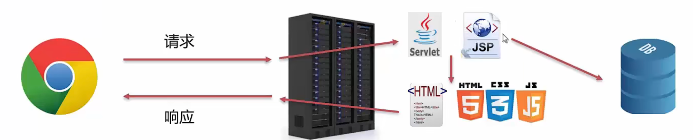

# JavaWeb

## 是什么

Web：全球广域网，也称为万维网，能够通过浏览器访问的网站

JavaWeb：用Java技术来解决相关Web互联网领域的技术栈

## B/S架构

B/S架构：浏览器/服务器架构模式，它的特点是，客户端只需要浏览器，应用程序的逻辑和数据都存储在服务器端，浏览器只需要请求服务器，获取Web资源，服务器把Web资源发送给浏览器即可

B/S架构好处：易于维护升级，服务端升级后，客户端无需任何部署就可以使用到最新的版本

静态资源：HTML、CSS、JavaScript、图片等。负责页面展现

动态资源：Servlet、JSP等。负责逻辑处理

数据库：负责存储数据

HTTP请求：浏览器请求服务器，一个协议，一种通信规则

Web服务器：负责解析HTTP协议，解析请求数据，并发送响应数据

## 技术栈

Day1：HTTP、Tomcat、Servlet

Day2：Request、Response

Day3：JSP、会话技术（Cookie、Session）

Day4：Fliter（过滤器）、Listener（监听器）

Day5：Ajax、Vue、ElementUI

Day6：综合案例