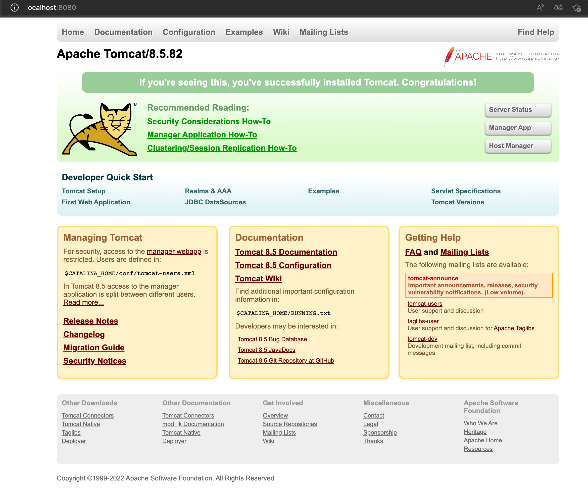

# HTTP

## 是什么

概念：HyperText Transfer Protocol 超文本传输协议 规定了浏览器和服务器之间数据传输的规则


## 协议特点

1. 基于TCP协议：面向连接、安全

2. 基于请求-响应模型的：一次请求对应一次响应

3. HTTP协议是无状态的协议：对于事务处理没有记忆能力。每次请求-响应都是独立的

   缺点：多次请求之间不能共享数据

   优点：速度快


## 请求数据的格式


1. 请求行：请求数据的第一行。其中GET表示已请求方式，/表示请求资源路径，HTTP/1.1表示协议版本
2. 请求头：第二行开始，格式为key：value形式
3. 请求体：POST请求的最后一部分，存放请求参数

Get和Post的区别：

1. GET请求的请求参数在请求行中，没有请求体。POST请求的请求参数在请求体中
2. GET请求的请求参数大小有限制，而POST没有限制


## 常见的请求头


## 响应数据的格式


1. 响应行：响应数据的第一行。其中HTTP/1.1表示协议版本，200表示响应状态码，OK表示状态码描述
2. 响应头：第二行开始，格式为key：value形式
3. 响应体：最后一部分。存放响应数据


**常见HTTP响应头**


**常见状态码**


[HTTP 状态码 | 菜鸟教程 (runoob.com)](https://www.runoob.com/http/http-status-codes.html)


几个最需要的

200-OK

404-资源不存在（改资源就行）

500-赶紧去看代码，看看哪里有异常


# Apache Tomcat

## Web服务器

1. 封装HTTP协议操作，简化开发
2. 可以将Web项目部署到服务器中，对外提供网上浏览服务


## 简介

是Apache基金会一个核心项目，是一个开源免费的轻量级Web服务器，支持Servlet/JSP/少量JavaEE规范

JavaEE：Java Enterprise Edition，Java企业版，指Java企业级开发的技术规范总和。包含13项技术规范：JDBC、JNDI、EJB、RMI、JSP、Servelet、XML、JMS、Java IDL、JTS、JTA、JavaMail、JAF

Tomcat也被称为Web容器，Servlet容器。Servlet需要依赖于Tomcat才能运行

官网：tomcat.apache.org


## 基本使用


正常启动后 会出现




**配置**

修改启动端口号：conf/server.xml

里面的port

（HTTP协议的默认端口号为80，如果改为80则访问时url不用写端口号）


**可能出现的问题：**

端口号冲突：把占用的程序kill掉

JAVA_HOME配置错误：信息一闪而过


**项目部署**

将项目放到webapps文件夹下

一般项目会打包成war包，将war包放置进webapps文件夹，tomcat会自动解压


## IDEA创建Maven Web项目

1. 使用骨架

   


2. 不使用骨架


标识打包方式、补齐缺失的目录结构


## IDEA中使用Tomcat

1. 使用本地的Tomcat

   

   

   

   

2. Maven插件

   ```xml
   <build>
       <plugins>
           <!--Tomcat插件-->
           <plugin>
               <groupId>org.apache.tomcat.maven</groupId>
               <artifactId>tomcat7-maven-plugin</artifactId>
               <version>2.2</version>
               <configuration>
                   <port>80</port>
                   <path>/</path>
             	</configuration>
           </plugin>
       </plugins>
   </build>
   ```

   


# Servlet

是Java提供的一门动态web资源开发技术（不同用户访问看到的不一样）


## 快速入门

1. 创建Web项目，导入Servlet依赖坐标

   ```
       <dependencies>
           <dependency>
               <groupId>javax.servlet</groupId>
               <artifactId>javax.servlet-api</artifactId>
               <version>3.1.0</version>
               <scope>provided</scope>
           </dependency>
       </dependencies>
   ```

2. 创建：定义一个类，实现Servlet接口，并重写接口中所有方法，并在service方法中输入一句话

   ```java
   public class ServletDemo1 implements Servlet {
       @Override
       public void init(ServletConfig servletConfig) throws ServletException {
   
       }
   
       @Override
       public ServletConfig getServletConfig() {
           return null;
       }
   
       @Override
       public void service(ServletRequest servletRequest, ServletResponse servletResponse) throws ServletException, IOException {
           System.out.println("Servlet 被访问");
       }
   
       @Override
       public String getServletInfo() {
           return null;
       }
   
       @Override
       public void destroy() {
   
       }
   }
   ```

3. 配置：在类上使用@WebServlet注解，配置该Servlet的访问路径

   

4. 访问：启动Tomcat，浏览器输入URL访问该Servlet

   


## Servlet执行流程

由上述案例来看


http://localhost:8080/web-demo/demo1

这个地址

1. http://localhost:8080/

   访问到了Web服务器

2. /web-demo

   访问到了web-demo项目

3. /demo1

   访问到了类方法，Web服务器new一个Servlet对象，可以给客户端浏览器发回响应数据


**细节**

1. Servlet由web服务器创建，Servlet方法由web服务器调用
2. 我们定义的Servlet，必须实现Servlet接口并复写其方法，而Servlet接口中有service方法


## Servlet生命周期

对象的生命周期指一个对象从被创建到被销毁的整个过程


**Servlet运行在Servlet容器Web服务器中，其生命周期由容器来管理，分为4个阶段：**

1. 加载和实例化：

   默认情况下，当Servlet第一次访问时，由容器创建Servlet对象

   

   如何更改创建时机？：

   `@WebServlet(urlPatterns = "/demo", loadOnStartup=1)`

   其中loadOnStartUp参数: 负整数表示第一次被访问时创建Servlet对象。0或正整数表示服务器启动时创建Servlet对象，数字越小优先级越高。默认为-1

   

2. 初始化：

   在Servlet实例化后，容器将调用Servlet的`init()`方法初始化这个对象，完成一些如加载配置文件、创建链接等初始化的工作，该方法只调用一次

   

3. 请求处理：

   每次请求Servlet时，Servlet容器都会调用Servlet的`service()`方法对请求进行处理

   

4. 服务终止：

   当需要释放内存或者容器关闭时，容器就会调用Servlet实例的`destroy()`方法完成资源的释放。在destroy()方法调用之后，容器会释放这个Servlet实例，该实例随后会被Java的垃圾收集器所回收


**所有方法的调用时机和调用次数**

| 方法      | 作用     | 调用时机                                                     | 调用次数 |
| --------- | -------- | ------------------------------------------------------------ | -------- |
| init()    | 初始化   | 默认情况下，Servlet被第一次访问时调用一次(也取决于loadOnStartup) | 1        |
| service() | 提供服务 | 每一次Servlet被访问时，调用一次                              | n        |
| destroy() | 销毁方法 | 内存释放或服务器关闭时，Servlet对象会被销毁，会调用一次释放资源 | 1        |


## Servlet体系结构


我们将来开发B/S架构的web项目，都是针对HTTP协议，所以我们自定义Servlet，会继承HttpServlet

HttpServlet使用步骤：

1. 继承HttpServlet
2. 重写doGet和doPost方法

```java
@WebServlet("/demo4")
public class ServletDemo4 extends HttpServlet {
    @Override
    protected void doGet(HttpServletRequest req, HttpServletResponse resp) throws ServletException, IOException {
        // 接收到get请求会调用此
        System.out.println("get...");
    }

    @Override
    protected void doPost(HttpServletRequest req, HttpServletResponse resp) throws ServletException, IOException {
        // 接收到post请求会调用此
        System.out.println("post...");
    }
}
```


**为什么HTTP要根据get和post分为不同的方法？**

在原生的Servlet里，根据请求方式的不同，进行分别的处理（要类型转换，判断等）。为了简化这个步骤，HttpServlet都封装好了。可以看源码，7种不同的请求方法，分别封装成了doXXX方法


## Servlet urlPattern配置

Servlet想要被访问，必须设置其访问路径:urlPattern

1. 一个Servlet，可以配置多个urlPattern

   `@WebServlet(urlPatterns = {"/demo1", "/demo2"})`

2. urlPattern配置规则

   1. 精准匹配

      

   2. 目录匹配

      

   3. 扩展名匹配

      

   4. 任意匹配

      


当一个目录满足精准匹配和目录匹配，那么精准匹配优先级高些


## XML配置方式编写Servlet

如果不用注解的方法配置Servlet，使用XML方法编写

1. 编写Servlet类
2. 在web.xml中配置该Servlet

```xml
配置Servlet全类名
<servlet>
    <servlet-name>demo4</servlet-name>
    <servlet-class>com.chyl.web.ServletDemo4</servlet-class>
</servlet>

配置Servlet访问路径
<servlet-mapping>
    <servlet-name>demo4</servlet-name>
    <url-pattern>/demo4</url-pattern>
</servlet-mapping>
```

