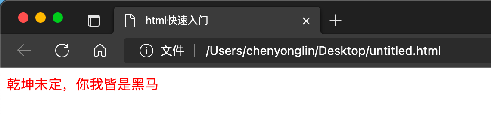
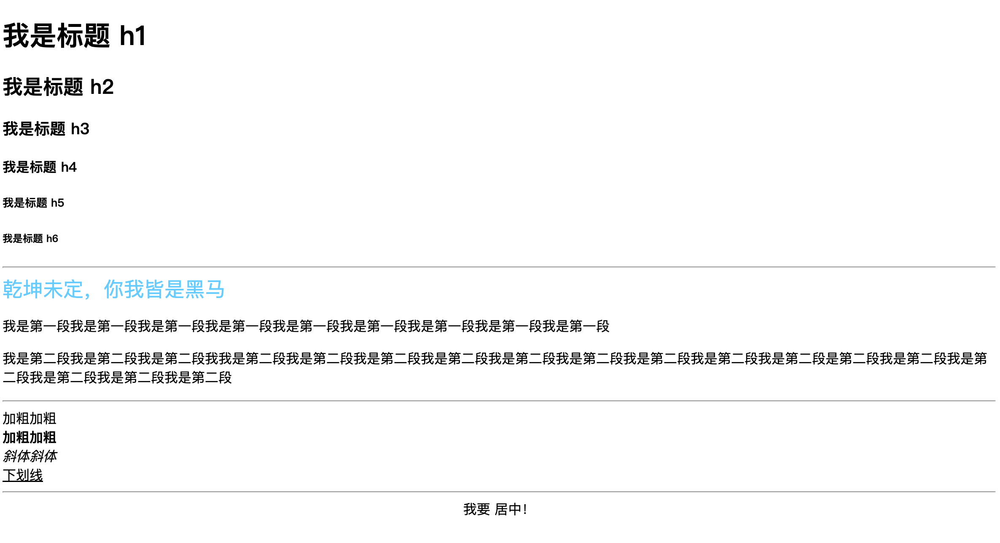
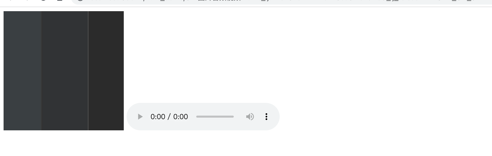
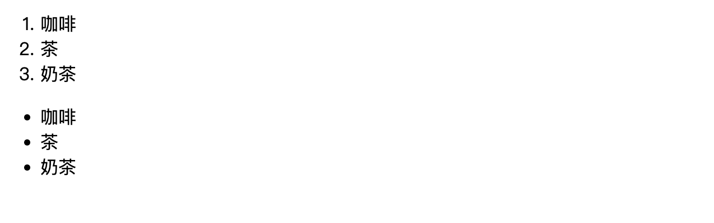
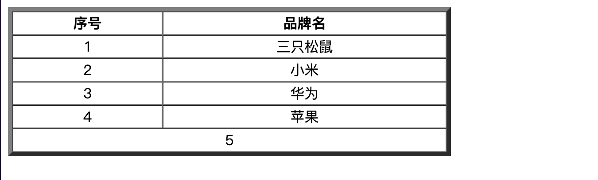
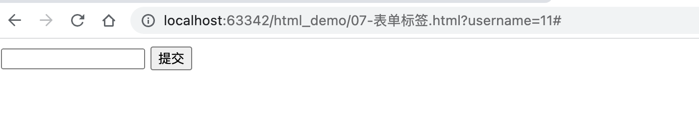

# 是什么

HTML 是一门语言，所有的网页都是用HTML 这门语言编写出来的
HTML(Hyper Text Markup Language)：超文本标记语言
超文本：超越了文本的限制，比普通文本更强大。除了文字信息，还可以定义图片、音频、视频等内容
标记语言：由标签构成的语言
HTML 运行在浏览器上，HTML 标签由浏览器来解析
HTML 标签都是预定义好的。例如：使用 ＜img>展示图片
W3C 标准：网页主要由三部分组成
	结构：HTML(不区分大小写，语法松散，单引双引都可以)
	表现：CSS
	行为：JavaScript


## 结构标签

| 标签     | 描述               |
| -------- | ------------------ |
| \<HTML>  | 定义HTML文档       |
| \<head>  | 定义关于文档的信息 |
| \<title> | 定义文档的标题     |
| \<body>  | 定义文档的主体     |


## 	

# 快速入门

title写标题

body写体结构

```html
<html>
  <head>
    <title> html快速入门 </title>
    
  </head>
  <body>
    <font color="red">乾坤未定，你我皆是黑马</font>
    
  </body>
</html>
```




# 基础标签


| 标签        | 描述                               |
| ----------- | ---------------------------------- |
| \<h1>-\<h6> | 定义标题，h1最大，h6最小           |
| \<font>     | 定义文本的字体、字体尺寸、字体颜色 |
| \<b>        | 定义粗体文本                       |
| \<i>        | 定义斜体文本                       |
| \<u>        | 定义文本下划线                     |
| \<center>   | 定义文本居中                       |
| \<p>        | 定义段落                           |
| \<br>       | 定义折行                           |
| \<hr>       | 定义水平线                         |


```xml
<!--html5的标识-->
<!DOCTYPE html>
<html lang="en">
<head>
    <!-- 页面的字符集 -->
    <meta charset="UTF-8">
    <title>Title</title>
</head>
<body>
    <h1> 我是标题 h1 </h1>
    <h2> 我是标题 h2 </h2>
    <h3> 我是标题 h3 </h3>
    <h4> 我是标题 h4 </h4>
    <h5> 我是标题 h5 </h5>
    <h6> 我是标题 h6 </h6>

    <hr>

    <font face="黑体" size="5" color="#66ccff">乾坤未定，你我皆是黑马</font>

    <p>我是第一段我是第一段我是第一段我是第一段我是第一段我是第一段我是第一段我是第一段我是第一段</p>
    <p>我是第二段我是第二段我是第二段我我是第二段我是第二段我是第二段我是第二段我是第二段我是第二段我是第二段我是第二段我是第二段是第二段我是第二段我是第二段我是第二段我是第二段我是第二段</p>

    <hr>
    加粗加粗<br>
    <b>加粗加粗</b><br>
    <i>斜体斜体</i><br>
    <u>下划线</u><br>

    <hr>
    <center> 我要 居中！</center>

</body>
</html>
```




# 图片、音频、视频标签

| 标签     | 描述     |
| -------- | -------- |
| \   | 定义图片 |
| \<audio> | 定义音频 |
| \<video> | 定义视频 |


Img:

​	src：指定资源路径

​	height：高度

​	width：宽度

audio：

​	src：指定资源路径

​	control：显示播放控件

video：

​	src：指定资源路径

​	control：显示播放控件


```html
<!DOCTYPE html>
<html lang="en">
<head>
    <meta charset="UTF-8">
    <title>Title</title>
</head>
<!--
尺寸单位：像素、占控件百分比
路径：除了本地，还可以放外链（相对路径或绝对路径）
-->
<body>
    
    <audio src="02.mp3" controls="controls"/>
    <video src="03.mp4" controls="controls"/>
</body>
</html>
```




# 超链接标签

| 标签 | 描述                             |
| ---- | -------------------------------- |
| \<a> | 定义超链接，用于链接到另一个资源 |


href：指定访问资源的URL

target：指定打开资源的方式

​	_self：默认值 在当前页面打开

​	_blank：在空白页面打开


```html
<!DOCTYPE html>
<html lang="en">
<head>
    <meta charset="UTF-8">
    <title>Title</title>
</head>
<body>
    <a href="https://www.baidu.com" target="_blank">点击我打开百度<a/>
</body>
</html>
```


# 列表标签

| 标签  | 描述         |
| ----- | ------------ |
| \<ol> | 定义有序列表 |
| \<ul> | 定义无序列表 |
| \<li> | 定义列表项   |

​	type：设置项目符号(不建议这么使用)


```html
<!DOCTYPE html>
<html lang="en">
<head>
    <meta charset="UTF-8">
    <title>Title</title>
</head>
<body>
    <ol>
        <li>咖啡</li>
        <li>茶</li>
        <li>奶茶</li>
    </ol>

    <ul>
        <li>咖啡</li>
        <li>茶</li>
        <li>奶茶</li>
    </ul>
</body>
</html>
```



# 表格标签

| 标签     | 描述           |
| -------- | -------------- |
| \<table> | 定义表格       |
| \<tr>    | 定义行         |
| \<td>    | 定义单元格     |
| \<th>    | 定义表头单元格 |

Table:

​	border：规定表格边框的宽度

​	width：规定表格的宽度

​	cellspacing：规定单元格之间的空白

tr：

​	align：定义表格行的内容对齐方式

td：

​	rowspan：规定单元格可横跨的行数

​	colspan：规定单元格可横跨的列数


```html
<!DOCTYPE html>
<html lang="en">
<head>
    <meta charset="UTF-8">
    <title>Title</title>
</head>
<body>
    <table border="5" width="500" cellspacing="0">
        <tr align="center">
            <th>序号</th>
            <th>品牌名</th>
        </tr>
        <tr align="center">
            <td>1</td>
            <td>三只松鼠</td>
        </tr>
        <tr align="center">
            <td>2</td>
            <td>小米</td>
        </tr>
        <tr align="center">
            <td>3</td>
            <td>华为</td>
        </tr>
        <tr align="center">
            <td>4</td>
            <td>苹果</td>
        </tr>
      	<tr align="center">
        	<td colspan="2">5</td>
        </tr>
    </table>
</body>
</html>
```





# 布局标签

| 标签    | 描述                                                         |
| ------- | ------------------------------------------------------------ |
| \<div>  | 定义HTML文档中的一个区域部分，经常与css一起使用，用来布局网页 |
| \<span> | 用于组合行内元素                                             |


# 表单标签

表单：在网页中主要负责数据采集功能，使用\<form>标签定义表单

表单项：不同类型的input元素、下拉列表、文本域等

| 标签        | 描述                                 |
| ----------- | ------------------------------------ |
| \<form>     | 定义表单                             |
| \<input>    | 定义表单项，通过type属性控制输入形式 |
| \<label>    | 为表单项定义标注                     |
| \<select>   | 定义下拉列表                         |
| \<option>   | 定义下拉列表的列表项                 |
| \<textarea> | 定义文本域                           |

form：

​	action：规定当提交表单时向何处发送表单数据，URL

​	method：规定用于发送表单数据的方式

​		get：浏览器会将数据附着在表单的action URL之后。但是URL长度有限制

​		post：浏览器会将数据放在http请求消息体中，大小无限制


```html
<!DOCTYPE html>
<html lang="en">
<head>
    <meta charset="UTF-8">
    <title>Title</title>
</head>
<!--#表示提交到当前url-->
<body>
    <form action="#" method="get">
<!--        表单数据想要提交，必须指定name属性-->
        <input type="text" name="username"/>
        <input type="submit"/>
    </form>
</body>
</html>
```


