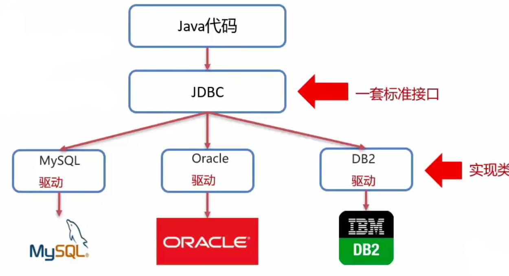

# JDBC简介

## 概念

JDBC就是使用Java语言操作关系型数据库的一套API

全称：Java DataBase Connectivity



## 本质

1. 官方（SUN公司）定义的一套操作所有关系型数据库的规则，即接口
2. 各个数据库厂商去实现这套接口，提供数据库驱动jar包
3. 我们可以使用这套接口JDBC 编程，真正执行的代码是驱动jar包中的实现类


## 好处

1. 各数据库厂商使用相同的接口，Java代码不需要针对不同的数据库进行开发
2. 可随时替换底层数据库，访问数据库的Java代码基本不变


## 快速入门

```java
import java.sql.*;

public class JDBCDemo {
    public static void main(String[] args) throws Exception {
        String url = "jdbc:mysql://hadoop102:3306/db01";
        String userName = "root";
        String passwd = "123456";

        //1. 注册驱动
        Class.forName("com.mysql.jdbc.Driver");

        //2. 获取链接
        Connection connection = DriverManager.getConnection(url, userName, passwd);

        //3. 编写语句
        String sql = "UPDATE goods SET price = 1234 where id = 11";

        //4. 获取执行sql的对象
        Statement statement = connection.createStatement();

        //5. 执行sql
        int r = statement.executeUpdate(sql);

        //6. 处理结果
        System.out.println(r);

        //7. 释放资源
        statement.close();
        connection.close();

    }
}

```

# API详解

## DriverManager

管理驱动

1. 注册驱动

   查看Driver的源码可知，在静态代码块中，就进行了驱动的注册，也就是在类加载时就执行了代码块。所以只需要用forName将对象导入内存即可

   ```java
   public class Driver extends NonRegisteringDriver implements java.sql.Driver {
       public Driver() throws SQLException {
       }
   
       static {
           try {
               DriverManager.registerDriver(new Driver());
           } catch (SQLException var1) {
               throw new RuntimeException("Can't register driver!");
           }
       }
   }
   ```

2. 获取数据库连接 getConnection

   **URL**

   ​	语法："jdbc:mysql://ip地址:端口号/数据库名称？参数键值对1, 参数键值对2..."

​			示例："jdbc:mysql://192.168.10.102:3306/db01"

​			如果连接的是本机的mysql服务器，并且msql服务默认端口为3306，则url可以简写为 "jdbc:mysql:///db01"

​			配置useSSL=false参数，禁用安全连接方式，解决警告提示 例如 "jdbc:mysql:///db01?useSSL=false"


## Connection

数据库连接对象

1. 获取SQL的对象

   1.1 普通执行SQL对象*

   ```
   Statement createStatement()
   ```

   1.2 预编译SQL的执行SQL对象，防止SQL注入*

   ```
   PreparedStatement prepareStatement(sql)
   ```

   1.3 执行存储过程的对象

   ```
   CallableStatement prepareCall(sql)
   ```

   

2. 管理事务

   2.1 Mysql事务管理

   ```
   开启事务:BEGIN;/START TRANSACTION;
   提交事务:COMMIT;
   回滚事务:ROLLBACK;
   
   MYSQL默认自动提交事务
   ```

   2.2 JDBC事务管理：Connection接口中定义了3个对应方法

   ```
   开启事务：setAutoCommit(boolean autoCommit): true为自动提交事务，false为手动提交事务，即为开启事务
   提交事务：commit()
   回滚事务：rollback()
   ```


案例：

```java
import java.sql.*;

public class JDBCDemo {
    public static void main(String[] args) throws Exception {
        String url = "jdbc:mysql://hadoop102:3306/db01?useSSL=false";
        String userName = "root";
        String passwd = "123456";

        //1. 注册驱动
        Class.forName("com.mysql.jdbc.Driver");

        //2. 获取链接
        Connection connection = DriverManager.getConnection(url, userName, passwd);

        //3. 编写语句
        String sql = "UPDATE goods SET price = i/0 where id = 11";

        //4. 获取执行sql的对象
        Statement statement = connection.createStatement();

        try {
            //开启事务
            connection.setAutoCommit(false);

            //5. 执行sql
            int r = statement.executeUpdate(sql);

            //6. 处理结果
            System.out.println(r);

            //提交事务
            connection.commit();
        }catch (Exception e){
            // 发生异常 回滚事务，回滚到开启事务前的状态
            connection.rollback();
        }

        //7. 释放资源
        statement.close();
        connection.close();

    }
}
```

​	

## Statement

作用：执行sql语句

1. 执行DML、DDL语句

   ```
   int executeUpdate(sql)
   ```

   返回值：DML语句影响的行数、DDL语句执行后，执行成功也可能返回0。一般来说不报异常就ok

   

2. 执行DQL语句

3. ```
   ResultSet executeQuery(sql)
   ```

   返回值：Result结果集对象


## ResultSet

获取查询结果

```
Boolean next()
```

1. 将光标从当前位置向前移动一行
2. 判断当前行是否为有效行

返回值：true 有效行 当前有数据 false 无效行，当前没有数据


获取数据

```
xxx getXXX
```

xxx：数据类型，比如int getInt(参数)， String getString(参数)

参数（重载）：

int：列的编号，**从1开始**

String：列的名称


如何使用

1. 游标向下移动一行，并判断该行是否有数据：next
2. 获取数据 getXXX

```
while(rs.next()){
	rs.getXxx(参数);
}
```


## PreparedStatement

1. 预编译SQL，性能更高

2. 防止SQL注入，将敏感字符转义

   

什么是SQL注入：通过操作输入来修改事先定义好的SQL语句，用以达到代码对服务器进行攻击的方法

可以对传入的参数先进行转义，不会与语法里的字符匹配从而避免SQL注入问题

**如何执行**

1. 获取PreparedStatement对象

   ```java
   //SQL语句中的参数值，使用？占位符替代
   String sql = "select * from user where username = ? and password = ?";
   //获取Connection对象获取，并传入sql语句
   PreparedStatement pstmt = conn.prepareStatement(sql);
   ```

2. 设置参数值

   ```
   PreparedStatement对象：setXXX(参数1，参数2)：给？赋值
   XXX，数据类型；如setInt(参数1，参数2)
   参数：
   	参数1：？的位置编号，从1开始
   	参数2：？的值
   ```

3. 执行SQL

   ```
   executeUpdate();/ executeQuery(); // 不需要再传递sql
   ```

   

**原理**

1. PreparedStatement 预编译开启：useServerPrepStmts = true;

   在连接url后面添加此参数

2. 配置MySQL执行日志

   ```
   log-output=FILE
   general-log=1
   general_log_file = "D:\mysql.log"
   slow-query-log=1
   slow-query_log_file = "D:\mysql_slow.log"
   long_query_time=2
   ```


SQL语句传递到MySQL中，一般会有三个过程

1. 检查SQL语法
2. 编译SQL -> 转换为可执行函数
3. 执行SQL

普通的SQL语句，会重复执行三个过程，会比较慢一些

预编译的SQL语句，前边的模版是固定的，所以检查和编译只会执行一次，之后只需要执行SQL就行了


# 数据库连接池

## 介绍

1. 数据库连接池是一个容器，负责分配，管理数据库连接
2. 它允许应用程序重复使用一个现有的数据库连接，而不是重新再建立一个
3. 释放空间时间超过最大空闲时间的数据库连接来避免因为没有释放数据库连接而引起的数据库连接遗漏
4. 好处：资源复用，提升响应速度，避免数据库连接遗漏


## 实现

标准接口：DataSource

官方SUN提供的数据库连接池标准接口，由第三方组织实现此借口

功能：获取连接

Connection getConnection()


常见的数据库连接池：DBCP C3P0 Druid

## Druid连接池

Druid连接池是阿里巴巴开源的数据库连接池项目

功能强大，性能优秀，是Java岁好的数据库连接池之一


**Maven依赖**

```xml
<dependency>
    <groupId>com.alibaba</groupId>
    <artifactId>druid</artifactId>
    <version>1.0.18</version>
</dependency>
```


**druid.properties**

```
driverClassName=com.mysql.jdbc.Driver
url="jdbc:mysql://hadoop102:3306/db01?useSSL=false&useServerPrepStmts=true"
username=root
password=123456
# 初始化连接数量
initialSize=5
# 最大连接数
maxActive=10
# 最大等待时间
maxWait=3000
```


## 案例

```java
public static void main(String[] args) throws Exception {
    //1. Maven导入jar包
    //2. 定义配置文件
    //3. 加载配置文件
    Properties prop = new Properties();
    FileInputStream fileInputStream = new FileInputStream("druid/druid.properties");
    prop.load(fileInputStream);
    //4. 获取连接池对象
    DataSource dataSource = DruidDataSourceFactory.createDataSource(prop);

  	//5. 获取Connection
    Connection connection = dataSource.getConnection();
```


# 总案例

```java
package pojo;

import com.alibaba.druid.pool.DruidDataSourceFactory;

import javax.sql.DataSource;
import java.io.FileInputStream;
import java.io.FileNotFoundException;
import java.io.IOException;
import java.sql.Connection;
import java.sql.PreparedStatement;
import java.sql.ResultSet;
import java.util.ArrayList;
import java.util.LinkedList;
import java.util.List;
import java.util.Properties;

public class BrandTest {
    public static void main(String[] args) throws Exception {
        testSelectAll();
    }

    public static void testSelectAll() throws Exception {
        //1. 获取Connection
        //3. 加载配置文件
        Properties prop = new Properties();
        prop.load(new FileInputStream("src/main/java/druid/druid.properties"));
        //4. 获取连接池对象
        DataSource dataSource = DruidDataSourceFactory.createDataSource(prop);
        //5. 获取数据库连接
        Connection connection = dataSource.getConnection();

        //2. 定义SQL
        String sql = "SELECT * FROM tb_brand";
        //3. 获取pstmt对象
        PreparedStatement pstmt = connection.prepareStatement(sql);

        //4. 设置参数

        //5. 执行SQL
        ResultSet resultSet = pstmt.executeQuery();

        //6. 处理结果
        List<Brand> brands = new ArrayList<>();
        while (resultSet.next()) {
            int id = resultSet.getInt("id");
            String brand_name = resultSet.getString("brand_name");
            int ordered = resultSet.getInt("ordered");
            String description = resultSet.getString("description");
            int status = resultSet.getInt("status");
            //封装对象
            Brand brand = new Brand();
            brand.setId(id);
            brand.setBrandName(brand_name);
            brand.setOrdered(ordered);
            brand.setDescription(description);
            brand.setStatus(status);

            brands.add(brand);
        }
        System.out.println(brands);

        resultSet.close();
        pstmt.close();
        connection.close();

    }
}
```

```java
package pojo;

/**
 * 实体类中，基本数据类型建议使用包装类，初始值为null 无含义
 */
public class Brand {
    private Integer id;
    private String brandName;
    private String companyName;
    private Integer ordered;
    private String description;
    private Integer status;

    @Override
    public String toString() {
        return "Company{" +
                "id=" + id +
                ", brandName='" + brandName + '\'' +
                ", companyName='" + companyName + '\'' +
                ", ordered=" + ordered +
                ", description='" + description + '\'' +
                ", status=" + status +
                '}';
    }

    public Integer getId() {
        return id;
    }

    public void setId(Integer id) {
        this.id = id;
    }

    public String getBrandName() {
        return brandName;
    }

    public void setBrandName(String brandName) {
        this.brandName = brandName;
    }

    public String getCompanyName() {
        return companyName;
    }

    public void setCompanyName(String companyName) {
        this.companyName = companyName;
    }

    public Integer getOrdered() {
        return ordered;
    }

    public void setOrdered(Integer ordered) {
        this.ordered = ordered;
    }

    public String getDescription() {
        return description;
    }

    public void setDescription(String description) {
        this.description = description;
    }

    public Integer getStatus() {
        return status;
    }

    public void setStatus(Integer status) {
        this.status = status;
    }
}
```
