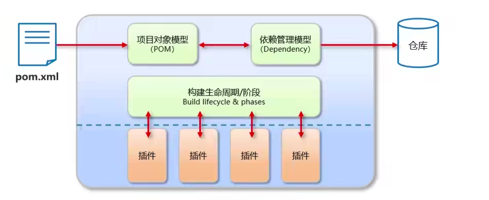
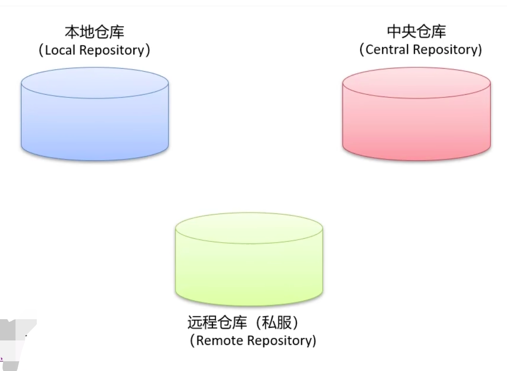
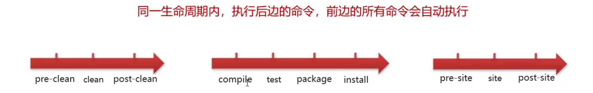
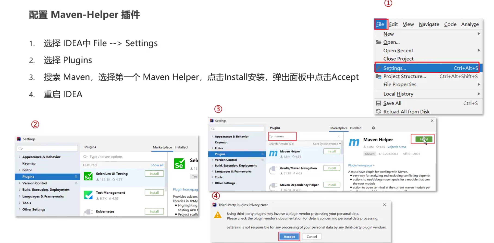
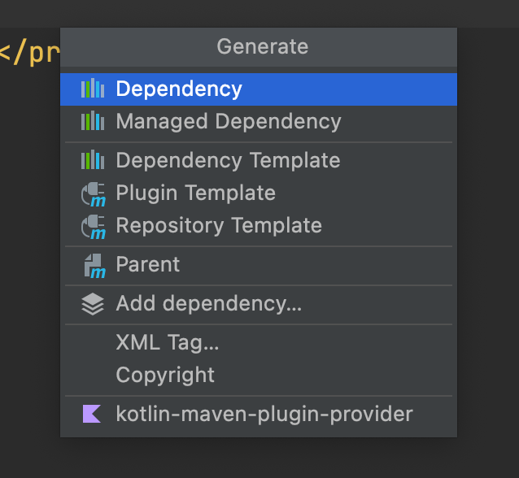

# Maven是什么

Apache Maven是一个项目管理和`构建工具`，它基于项目对象模型的概念，通过一小段描述信息来管理项目的构建、报告和文档

## 1. 提供了一套标准化的项目结构

所有IDE使用Maven构建的项目结构完全一样，所有IDE创建的Maven项目可以通用


## 2. 提供了一套标准化的构建流程

（编译，测试，打包，发布）

有一套简单的命令来完成项目的构建


## 3. 提供了一套依赖管理机制

管理你项目所以来的第三方资源（jar包，插件···）

Maven使用标准的坐标配置来管理各种依赖


## Maven目录结构

src文件夹：放Java代码

​		src/main : 源代码

​				src/main/java：源代码Java目录

​				src/main/resource：源代码配置文件目录

​				src/main/webapp：Web项目核心目录

​		src/test：测试代码

​				src/test/java：测试代码Java目录

​				src/test/resource：测试代码配置文件目录		

pom.xml：核心配置文件


## Maven模型



仓库： Maven通过唯一标识，从仓库找依赖的Jar包。如果pom配置文件写完，会引用仓库里的Jar包


## Maven仓库



1. 本地仓库：自己计算机上的目录
2. 中央仓库：由Maven团队维护的全球唯一的仓库 https://repo1.maven.org/maven2/
3. 远程仓库（私服）：一般由公司团队搭建的私有仓库

本地仓库-中央仓库：项目会从本地仓库找jar包，如果没有，则从中央仓库找，中央仓库找到自动下载到本地仓库，再引用本地仓库的（全程自动完成）

远程仓库：先找本地，再找远程，再找中央。 在中央找到会留副本在远程仓库和本地仓库。（也可以用私服提升访问速度）


# Maven安装配置

## 安装

1. 官网下载安装包，解压到某个目录下

2. 目录结构如下

   bin：二进制可执行文件

   boot：Maven自己用的类加载器框架（不用管

   conf：配置文件

   lib：Maven自己用的依赖jar包

3. 配置环境变量，将bin目录配置到系统的MAVEN_HOME环境变量

4. 在Terminal里输入 mvn -version 看到配置信息即安装成功


## 配置

打开conf/setting.xml

1. 修改本地仓库

\<localRespository> : 本地Maven仓库目录

2. 配置阿里云私服

```xml
<mirrors>
  <mirror>
  	<id>alimaven</id>
    <name>aliyun maven</name>
    <url>http://maven.aliyun.com/nexus/content/groups/public/</url>
    <mirrorOf>central</mirrorOf>
  </mirror>
</mirrors>
```


# Maven常用命令

| 命令    | 作用 |
| ------- | ---- |
| compile | 编译 |
| clean   | 清理 |
| test    | 测试 |
| package | 打包 |
| install | 安装 |

## 编译 compile

在maven工程根目录下 用Terminal执行

```
mvn compile
```

首次执行会先下载依赖和编译插件到本地仓库

编译完会放在target目录


## 清理 clean

```
mvn compile
```

首次执行会先下载清理插件到本地仓库

删除target目录


## 打包 package

```
mvn package
```

将字节码文件打成jar包到target目录下


## 测试 test

```
mvn test
```

自动执行test下测试用例的代码


## 安装 install

```
mvn install
```

将当前的项目安装到本地仓库去，本地仓库会多出这个的jar包


# Maven生命周期

Maven构建项目生命周期描述的是一次构建过程经历了多少个事件

Maven对项目构建的生命周期划分为3套

​	clean：清理工作

​	default：核心工作

​	site：产生报告，发布站点等




# IDEA配置Maven

## 配置环境

1. 选择IDEA的File -> Setting
2. 搜索 Maven
3. 设置IDEA使用本地安装的Maven，并修改配置文件路径


## Maven坐标

1. Maven中的坐标是资源的唯一标识

2. 使用坐标来定义项目或引入项目中需要的依赖


Maven坐标主要组成

```xml
<groupId>org.example</groupId>
<artifactId>reflact_</artifactId>
<version>1.0-SNAPSHOT</version>
```

groupID：组织的名称，一般是公司的域名等

artifactID：模块的ID

version：版本号（SNAPSHOT快照版本，表示还没编写完不是正式版）


## Maven小插件

Maven-Helper：更方便的执行Maven命令，还可以断点调试




# 依赖管理

## 使用坐标导入jar包

1. 在pom.xml中编写\<dependencies>标签
2. 在\<dependencies>标签中使用\<dependency>引入坐标
3. 定义坐标的groupID，artifactID，version
4. 点击刷新，进行生效

```xml
<?xml version="1.0" encoding="UTF-8"?>
<project xmlns="http://maven.apache.org/POM/4.0.0"
         xmlns:xsi="http://www.w3.org/2001/XMLSchema-instance"
         xsi:schemaLocation="http://maven.apache.org/POM/4.0.0 http://maven.apache.org/xsd/maven-4.0.0.xsd">
    <modelVersion>4.0.0</modelVersion>

    <!--当前项目的坐标-->
    <groupId>org.example</groupId>
    <artifactId>reflact_</artifactId>
    <version>1.0-SNAPSHOT</version>

    <properties>
        <maven.compiler.source>8</maven.compiler.source>
        <maven.compiler.target>8</maven.compiler.target>
    </properties>

    
    <dependencies>
      	<!--导入Mysql的驱动jar包-->
        <dependency>
            <groupId>mysql</groupId>
            <artifactId>mysql-connect-java</artifactId>
            <version>5.1.16</version>
        </dependency>
      
      <dependency>
            <groupId>com.alibaba</groupId>
            <artifactId>druid</artifactId>
            <version>1.1.12</version>
        </dependency>
      
    </dependencies>

</project>
```


快捷导入：右键 Generate



## 依赖范围

通过设置坐标的依赖范围，可以设置对应jar包的作用范围：编译环境、测试环境、运行环境等

```xml
<dependency>
      <groupId>mysql</groupId>
      <artifactId>mysql-connect-java</artifactId>
      <version>5.1.16</version>
  		<scope>test</scope>
  </dependency>
```

这样表示只有测试的时候才会导入此包

| 依赖范围 | 编译classPath | 测试classPath | 运行classpath | 例子                     |
| -------- | ------------- | ------------- | ------------- | ------------------------ |
| compile  | Y             | Y             | Y             | logback                  |
| test     | -             | Y             | -             | Junit                    |
| provided | Y             | Y             | -             | servlet-api              |
| runtime  | -             | Y             | Y             | jdbc驱动                 |
| system   | Y             | Y             | -             | 存储在本地的jar包        |
| import   |               |               |               | 引入DependencyManagement |


