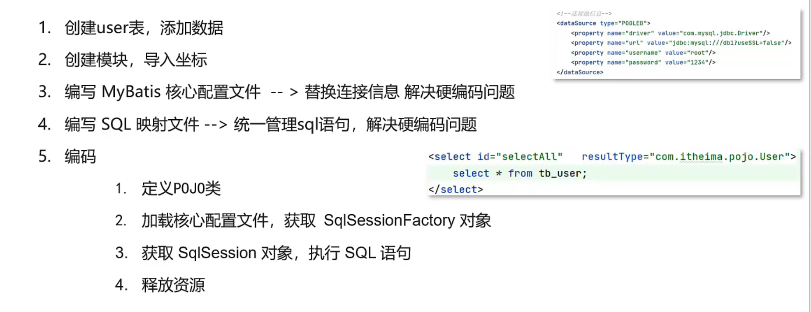

# 是什么

MyBatis是一款优秀的持久层框架，用于简化JDBC开发

MyBatis本来是Apache的一个开源项目iBatis，2010年这个项目由apache software foundation 迁移到了google code，命名为MyBatis。2013年11月迁移到github

## 持久层

1. 负责将数据保存到数据库的那一层代码
2. JavaEE三层架构：表现层、业务层、持久层

## 框架

框架就是一个半成品软件，是一套可重用的、通用的、软件基础代码模型

在框架的基础之上构建软件编写更加高效、规范、通用、可扩展

## JDBC的缺点

1. 硬编码

   将字符串信息写到代码里去了，并且代码很有可能会变动，这非常的不灵活，维护性差

   1. 注册驱动，获取连接

   2. SQL语句

      

2. 操作繁琐

   1. 手动设置参数

   2. 手动封装结果集

## MyBatis简化

1. 将硬编码的部分用配置文件设置
2. 操作繁琐的部分 自动完成

# 快速入门

# Mapper代理开发

# 核心配置文件

# 配置文件完成CRUD

# 注解完成CRUD

# 高级特性：动态SQL