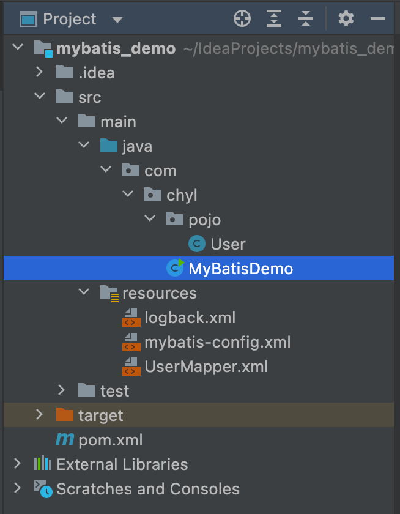
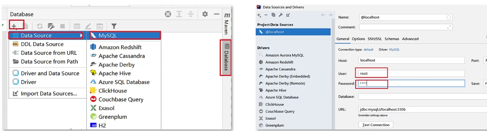
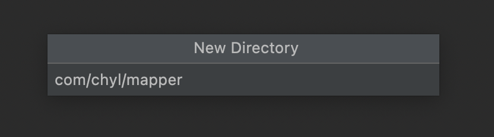
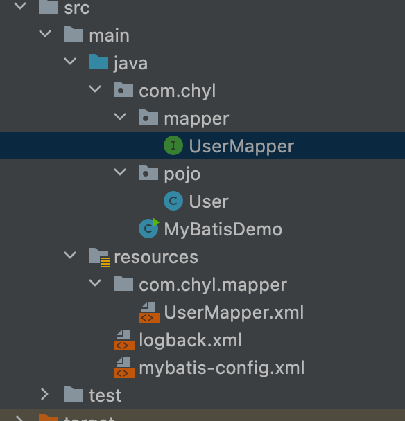
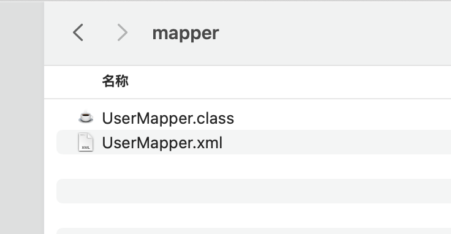
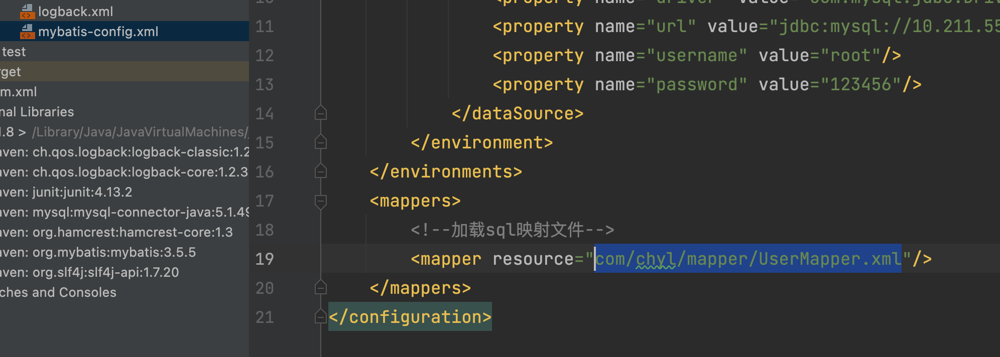
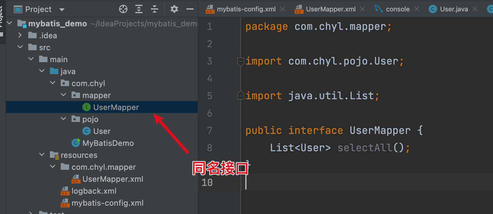
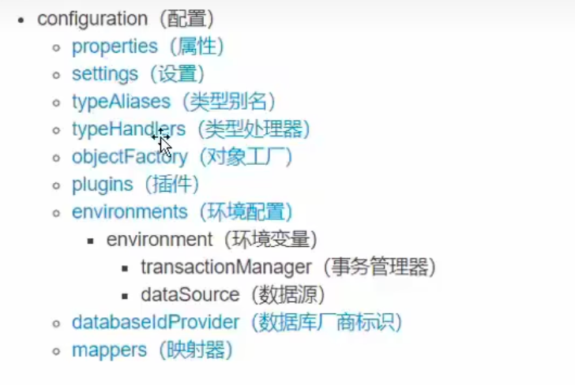
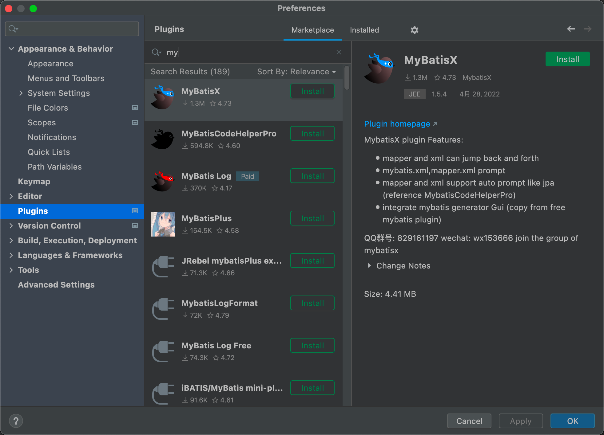

# 是什么

MyBatis是一款优秀的持久层框架，用于简化JDBC开发

MyBatis本来是Apache的一个开源项目iBatis，2010年这个项目由apache software foundation 迁移到了google code，命名为MyBatis。2013年11月迁移到github


## 持久层

1. 负责将数据保存到数据库的那一层代码
2. JavaEE三层架构：表现层、业务层、持久层


## 框架

框架就是一个半成品软件，是一套可重用的、通用的、软件基础代码模型

在框架的基础之上构建软件编写更加高效、规范、通用、可扩展


## JDBC的缺点

1. 硬编码

   将字符串信息写到代码里去了，并且代码很有可能会变动，这非常的不灵活，维护性差

   1. 注册驱动，获取连接

   2. SQL语句

      

2. 操作繁琐

   1. 手动设置参数

   2. 手动封装结果集


## MyBatis简化

1. 将硬编码的部分用配置文件设置
2. 操作繁琐的部分 自动完成


# 快速入门


mybatis文档：[mybatis – MyBatis 3 | 入门](https://mybatis.org/mybatis-3/zh/getting-started.html)

## 0 Maven

```xml
<?xml version="1.0" encoding="UTF-8"?>
<project xmlns="http://maven.apache.org/POM/4.0.0"
         xmlns:xsi="http://www.w3.org/2001/XMLSchema-instance"
         xsi:schemaLocation="http://maven.apache.org/POM/4.0.0 http://maven.apache.org/xsd/maven-4.0.0.xsd">
    <modelVersion>4.0.0</modelVersion>

    <groupId>org.example</groupId>
    <artifactId>mybatis_demo</artifactId>
    <version>1.0-SNAPSHOT</version>

    <properties>
        <maven.compiler.source>8</maven.compiler.source>
        <maven.compiler.target>8</maven.compiler.target>
    </properties>

    <dependencies>
        <dependency>
            <groupId>org.mybatis</groupId>
            <artifactId>mybatis</artifactId>
            <version>3.5.5</version>
        </dependency>

        <dependency>
            <groupId>mysql</groupId>
            <artifactId>mysql-connector-java</artifactId>
            <version>5.1.49</version>
        </dependency>

        <dependency>
            <groupId>junit</groupId>
            <artifactId>junit</artifactId>
            <version>4.13.2</version>
            <scope>test</scope>
        </dependency>

        <!-- 添加slf4j日志api -->
        <dependency>
            <groupId>org.slf4j</groupId>
            <artifactId>slf4j-api</artifactId>
            <version>1.7.20</version>
        </dependency>
        <!-- 添加logback-classic依赖 -->
        <dependency>
            <groupId>ch.qos.logback</groupId>
            <artifactId>logback-classic</artifactId>
            <version>1.2.3</version>
        </dependency>
        <!-- 添加logback-core依赖 -->
        <dependency>
            <groupId>ch.qos.logback</groupId>
            <artifactId>logback-core</artifactId>
            <version>1.2.3</version>
        </dependency>


    </dependencies>


</project>
```

## 1 编写config文件

编写config文件到resources文件夹下，命名为mybatis-config.xml，并且更改配置信息

```xml
<?xml version="1.0" encoding="UTF-8" ?>
<!DOCTYPE configuration
        PUBLIC "-//mybatis.org//DTD Config 3.0//EN"
        "https://mybatis.org/dtd/mybatis-3-config.dtd">
<configuration>
    <environments default="development">
        <environment id="development">
            <transactionManager type="JDBC"/>
            <dataSource type="POOLED">
                <property name="driver" value="com.mysql.jdbc.Driver"/>
                <property name="url" value="jdbc:mysql://10.211.55.102/mybatis?useSSL=false"/>
                <property name="username" value="root"/>
                <property name="password" value="123456"/>
            </dataSource>
        </environment>
    </environments>
    <mappers>
        <!--加载sql映射文件-->
        <mapper resource="UserMapper.xml"/>
    </mappers>
</configuration>
```

## 2 创建用户类

其他代码省略，注意这个类的字段要跟sql语句的查询名称要一致

```java
package com.chyl.pojo;

public class User {
    private Integer id;
    private String username;
    private String password;
    private Character gender;
    private String addr;
    }...
```

## 3 编写sql映射文件

UserMapper.xml

命名空间是调用这个语句id的时候的前缀，以便于区分

id就是此语句的id，resultType写能接收语句返回的类名全称，中间包语句

```xml
<?xml version="1.0" encoding="UTF-8" ?>
<!DOCTYPE mapper
        PUBLIC "-//mybatis.org//DTD Mapper 3.0//EN"
        "https://mybatis.org/dtd/mybatis-3-mapper.dtd">
<mapper namespace="test">
    <select id="selectAll" resultType="com.chyl.pojo.User">
        select * from tb_user
    </select>
</mapper>
```

## 4 编写主程序

```java
package com.chyl;

import com.chyl.pojo.User;
import org.apache.ibatis.io.Resources;
import org.apache.ibatis.session.SqlSession;
import org.apache.ibatis.session.SqlSessionFactory;
import org.apache.ibatis.session.SqlSessionFactoryBuilder;

import java.io.IOException;
import java.io.InputStream;
import java.util.List;

public class MyBatisDemo {
    public static void main(String[] args) throws IOException {
        //1. 加载mybatis的核心配置文件，获取SqlSessionFactory
        String resource = "mybatis-config.xml";
        InputStream inputStream = Resources.getResourceAsStream(resource);
        SqlSessionFactory sqlSessionFactory = new SqlSessionFactoryBuilder().build(inputStream);

        //2. 获取SqlSession对象，用它来执行sql
        SqlSession sqlSession = sqlSessionFactory.openSession();

        //3. 执行sql(前面要加上namespace）
        List<User> users = sqlSession.selectList("test.selectAll");
				
      	//4. 输出
        System.out.println(users);
				
      	//5. 关闭连接
        sqlSession.close();

    }
}
```

## 项目结构




# 解决Idea报错信息

产生原因：Idea和数据库没有建立连接，不识别表信息

解决方式 在Idea配置MySQL数据库连接



注意Driver的设置版本


# Mapper代理开发

## 概念

目的：解决原生方式中的硬编码问题

简化后期执行SQL

原版：

```sql
List<User> users = sqlSession.selectList("test.selectAll");
System.out.println(users);
```

代理：

```java
// 获取接口代理对象
UserMapper userMapper = sqlSession.getMapper(UserMapper.class);
// 执行方法，其实就是执行sql语句
List<User> users = userMapper.selectAll();
```


## 实操

1. 定义与SQL映射文件同名的Mapper接口，并且将Mapper接口和SQL映射文件放置在同一个目录下

   可以保持SQL映射文件还在Resources文件夹下：创建一样路径的包但是用斜杠分割

   

   编译后

   这样 虽然看起来是不同的路径，在target目录上但是实际上是一起的

   

   

   记得更改配置文件里的路径

   

2. 设置SQL映射文件的namespace属性为Mapper接口全限定名

   ```java
   <mapper namespace="com.chyl.mapper.UserMapper">
       <select id="selectAll" resultType="com.chyl.pojo.User">
           select * from tb_user;
       </select>
   </mapper>
   ```

3. 在Mapper接口中定义方法，方法名就是SQL映射文件中sql语句的id，并保持参数类型和返回值类型一致

   

4. 编码

   ```java
   package com.chyl;
   
   import com.chyl.mapper.UserMapper;
   import com.chyl.pojo.User;
   import org.apache.ibatis.io.Resources;
   import org.apache.ibatis.session.SqlSession;
   import org.apache.ibatis.session.SqlSessionFactory;
   import org.apache.ibatis.session.SqlSessionFactoryBuilder;
   
   import java.io.IOException;
   import java.io.InputStream;
   import java.util.List;
   
   // 代理开发
   public class MyBatisDemo2 {
       public static void main(String[] args) throws IOException {
           //1. 加载mybatis的核心配置文件，获取SqlSessionFactory
           String resource = "mybatis-config.xml";
           InputStream inputStream = Resources.getResourceAsStream(resource);
           SqlSessionFactory sqlSessionFactory = new SqlSessionFactoryBuilder().build(inputStream);
   
           //2. 获取SqlSession对象，用它来执行sql
           SqlSession sqlSession = sqlSessionFactory.openSession();
   
           //3.1 获取UserMapper接口代理对象
           UserMapper userMapper = sqlSession.getMapper(UserMapper.class);
   
           //3.2 调用响应sql方法
           List<User> users = userMapper.selectAll();
   
           System.out.println(users);
   
           //4. 释放资源
           sqlSession.close();
   
       }
   }
   ```

优势：首先不依赖于字符串字面值，会更安全一点，其次，如果IDE有代码补全功能，那么代码补全可以帮你快速选择到映射好的SQL语句

因为接口和映射文件都在同一个目录下且同名，所以会自动扫描 读取。

# 核心配置文件

mybatis-config.xml

1. 可以配置不同的服务器信息，通过id区分，只需要更改environment就可以了

```xml
<configuration>
    <environments default="development">
        <environment id="development">
            <transactionManager type="JDBC"/>
            <dataSource type="POOLED"> <!--数据库连接池-->
                <property name="driver" value="com.mysql.jdbc.Driver"/>
                <property name="url" value="jdbc:mysql://10.211.55.102/mybatis?useSSL=false"/>
                <property name="username" value="root"/>
                <property name="password" value="123456"/>
            </dataSource>
        </environment>

        <environment id="test">
            <transactionManager type="JDBC"/>
            <dataSource type="POOLED">
                <property name="driver" value="com.mysql.jdbc.Driver"/>
                <property name="url" value="jdbc:mysql://10.211.55.102/mybatis?useSSL=false"/>
                <property name="username" value="root"/>
                <property name="password" value="123456"/>
            </dataSource>
        </environment>
    </environments>
```

2. mappers（这个之前讲过了，就先不讲了）

   ```xml
   <mappers>
       <!--加载sql映射文件-->
       <mapper resource="com/chyl/mapper/UserMapper.xml"/>
   </mappers>
   ```

3. 别名

   这样在xml文件中，写包名就不需要写全名了，只需要写user或者User，不区分大小写

   ```xml
   <typeAliases>
     <package name="com.chyl.pojo.User"/>
   </typeAliases>
   ```

4. xml约束：这些标签有前后顺序

   


# 配置文件完成CRUD

## 案例

完成品牌数据的增删改查


## 准备环境

1. 数据库表tb_brand

2. 实体类Brand

3. 测试用例

4. 安装MyBatisX插件

   MyBatisX是一款基于IDEA的快速开发插件，为效率而生

   主要功能：1. XML和接口方法相互跳转   2. 根据接口方法生成statement（sql语句xml文件）

   


# 注解完成CRUD

# 高级特性：动态SQL