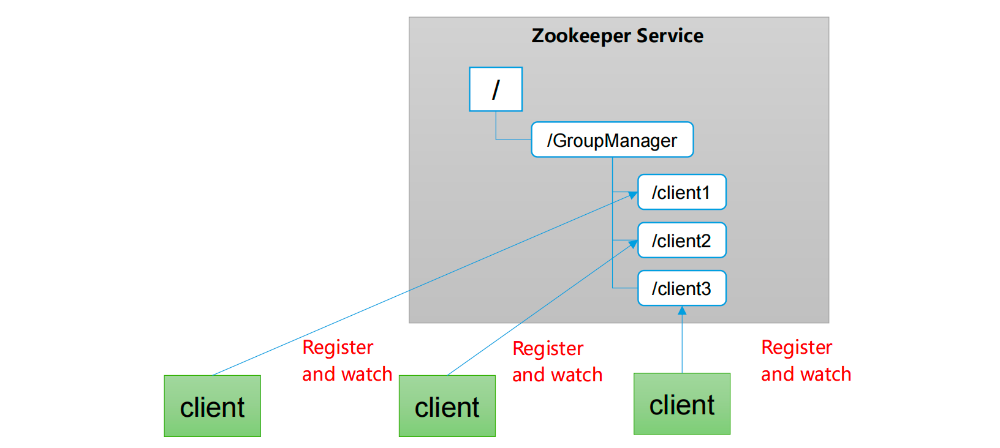

# Zookeeper入门

## 一句话介绍

zookeeper是一个开源的、分布式的。为分布式框架提供协调服务的Apache项目

## 工作机制

Zookeeper从设计模式角度来理解：是一个基于观察者模式设计的分布式服务管理框架

它负责存储和管理大家都关心的数据，然后接受观察者的注册

一旦这些数据发生变化，zk将会负责通知已经在zk上注册的那些观察者做出相应的反应

1.当服务端启动的时候，去注册信息（创建临时节点）

2.客户端获取当前在线的服务器列表，并且注册监听

3.如果服务端节点下线，zk集群会通知给客户端 下线事件的通知

4.客户端重新再去获取服务器列表，并且注册可用的节点并监听

**zk = 文件系统 + 通知机制**

## 特点

1.一个领导者 Leader 多个跟随者 Follower组成的集群

2.集群中 只有半数以上的节点存活，zk就可以正常服务，所以zk适合安装奇数台服务器

3.全局数据一致：每个Server保存相同的数据副本，客户端无论连接哪个服务端，数据都是一致的

4.更新请求顺序执行，来自同一个客户端的请求按照发送顺序执行

5.数据更新原子性，一次数据更新要么成功，要么失败

6.实时性，在一定时间内，客户端能读到最新数据

## 数据结构

zk数据模型的结构与Unix文件系统类似，整体上能看成一棵树，每个节点称作一个ZNode。每个Znode默认存储1MB的数据，每个ZNode能够通过路径唯一标识

## 应用场景

提供的服务包括：统一命名服务、统一配置管理、统一集群管理、服务器节点动态上下线、软负载均衡等。

### 统一命名服务

在分布式环境下，经常需要对应用/服务进行统一命名，便于识别。

例如：IP不容易记住，而域名容易记住。

### 统一配置管理

1）分布式环境下，配置文件同步非常常见。 

​	1）一般要求一个集群中，所有节点的配置信息是一致的，比如 Kafka 集群。 

​	2）对配置文件修改后，希望能够快速同步到各个节点上。 

2）配置管理可交由ZooKeeper实现。 

​	1）可将配置信息写入ZooKeeper上的一个Znode。

​	2）各个客户端服务器监听这个Znode。 

​	3）一 旦Znode中的数据被修改，ZooKeeper将通知各个客户端服务器。 

### 统一集群管理

1）分布式环境中，实时掌握每个节点的状态是必要的。 

​	1）可根据节点实时状态做出一些调整。 

2）ZooKeeper可以实现实时监控节点状态变化

​	1）可将节点信息写入ZooKeeper上的一个ZNode。 

​	2）监听这个ZNode可获取它的实时状态变化。

### 服务器动态上下线

### 软负载均衡

在Zookeeper中记录每台服务器的访问数，让访问数最少的服务器去处理最新的客户端请求

# 下载地址

https://zookeeper.apache.org/

教学用的是3.5.7版本

