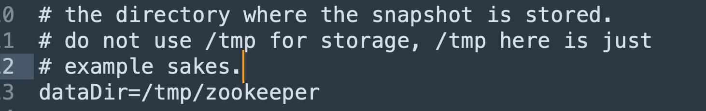

# 本地模式安装

测试环境下简单实用

## **安装前准备**

（1）安装 JDK

（2）拷贝 apache-zookeeper-3.5.7-bin.tar.gz 安装包到 Linux 系统下

（3）解压到指定目录

```
tar -zxvf apache-zookeeper-3.5.7-bin.tar.gz -C /opt/module/
```

（4）修改名称

```
mv apache-zookeeper-3.5.7-bin/ zookeeper-3.5.7
```


## **配置修改**

（1）将/opt/module/zookeeper-3.5.7/conf 这个路径下的 zoo_sample.cfg 修改为 zoo.cfg；

```
[atguigu@hadoop102 conf]$ mv zoo_sample.cfg zoo.cfg
```

（2）打开 zoo.cfg 文件，修改 dataDir 路径：

```
[atguigu@hadoop102 zookeeper-3.5.7]$ vim zoo.cfg
```

修改如下内容：

```
dataDir=/opt/module/zookeeper-3.5.7/zkData
```



默认配置在tmp目录下，linux会定期删除tmp目录下的文件

（3）在/opt/module/zookeeper-3.5.7/这个目录上创建 zkData 文件夹

```
[atguigu@hadoop102 zookeeper-3.5.7]$ mkdir zkData
```


## 操作zk

（1）启动 Zookeeper

```
[atguigu@hadoop102 zookeeper-3.5.7]$ bin/zkServer.sh start
```

（2）查看进程是否启动

```
[atguigu@hadoop102 zookeeper-3.5.7]$ jps
4020 Jps
4001 QuorumPeerMain
```

（3）查看状态

```
[atguigu@hadoop102 zookeeper-3.5.7]$ bin/zkServer.sh status
ZooKeeper JMX enabled by default
Using config: /opt/module/zookeeper-3.5.7/bin/../conf/zoo.cfg
Mode: standalone
```

（4）启动客户端

```
[atguigu@hadoop102 zookeeper-3.5.7]$ bin/zkCli.sh
```

（5）退出客户端：

```
[zk: localhost:2181(CONNECTED) 0] quit
```

（6）停止 Zookeeper

```
[atguigu@hadoop102 zookeeper-3.5.7]$ bin/zkServer.sh stop
```


# 配置文件解读

zoo.cfg

**1）tickTime = 2000**：通信心跳时间，Zookeeper服务器与客户端心跳时间，单位毫秒


**2）initLimit = 10**：LF初始通信时限

如果10次通信都失败了，则宣布连接失败


**3）syncLimit = 5**：LF同步通信时限

5次LF通信失败了，则从服务器中删除Follower


**4）dataDir**：保存Zookeeper中的数据

注意：默认的tmp目录，容易被Linux系统定期删除，所以一般不用默认的tmp目录。


5）**clientPort** = 2181：客户端连接端口，通常不做修改。


