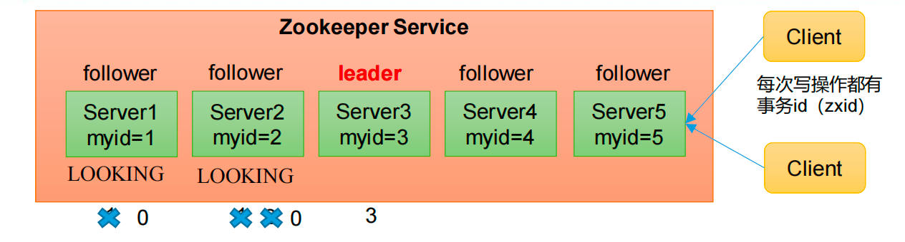

# 集群操作

## 集群安装

1.集群规划

在 hadoop102、hadoop103 和 hadoop104 三个节点上都部署 Zookeeper。


2.解压安装

（1）在 hadoop102 解压 Zookeeper 安装包到/opt/module/目录下

```
tar -zxvf apache-zookeeper-3.5.7-bin.tar.gz -C /opt/module/
```

（2）修改 apache-zookeeper-3.5.7-bin 名称为 zookeeper-3.5.7

```
mv apache-zookeeper-3.5.7-bin/ zookeeper-3.5.7
```


## 配置服务器编号

（1）在/opt/module/zookeeper-3.5.7/这个目录下创建 zkData

```
[atguigu@hadoop102 zookeeper-3.5.7]$ mkdir zkData
```

（2）在/opt/module/zookeeper-3.5.7/zkData 目录下创建一个 myid 的文件

```
[atguigu@hadoop102 zkData]$ vi myid
```

在文件中添加与 server 对应的编号（注意：上下不要有空行，左右不要有空格）

```
2
```

注意：添加 myid 文件，一定要在 Linux 里面创建，在 notepad++里面很可能乱码

（3）拷贝配置好的 zookeeper 到其他机器上

```
[atguigu@hadoop102 module ]$ xsync zookeeper-3.5.7
```

并分别在 hadoop103、hadoop104 上修改 myid 文件中内容为 3、4 


## 配置zoo.cgf

（1）重命名/opt/module/zookeeper-3.5.7/conf 这个目录下的 zoo_sample.cfg 为 zoo.cfg

```
[atguigu@hadoop102 conf]$ mv zoo_sample.cfg zoo.cfg
```


（2）打开 zoo.cfg 文件

```
[atguigu@hadoop102 conf]$ vim zoo.cfg
```

\#修改数据存储路径配置

```
dataDir=/opt/module/zookeeper-3.5.7/zkData
```

\#增加如下配置

```
#######################cluster##########################

server.2=hadoop102:2888:3888

server.3=hadoop103:2888:3888

server.4=hadoop104:2888:3888
```


**配置参数解读**

server.A=B:C:D。 

**A** 是一个数字，表示这个是第几号服务器；

集群模式下配置一个文件 myid，这个文件在 dataDir 目录下，这个文件里面有一个数据就是 A 的值，Zookeeper 启动时读取此文件，拿到里面的数据与 zoo.cfg 里面的配置信息比较从而判断到底是哪个 server。 

**B** 是这个服务器的地址；

**C** 是这个服务器 Follower 与集群中的 Leader 服务器交换信息的端口；

**D** 是万一集群中的 Leader 服务器挂了，需要一个端口来重新进行选举，选出一个新的

Leader，而这个端口就是用来执行选举时服务器相互通信的端口。


（4）同步 zoo.cfg 配置文件

```
[atguigu@hadoop102 conf]$ xsync zoo.cfg
```


## **集群操作**

分别启动Zookeeper

```
[atguigu@hadoop102 zookeeper-3.5.7]$ bin/zkServer.sh start 
[atguigu@hadoop103 zookeeper-3.5.7]$ bin/zkServer.sh start
[atguigu@hadoop104 zookeeper-3.5.7]$ bin/zkServer.sh start
```


查看状态

```
[atguigu@hadoop102 zookeeper-3.5.7]# bin/zkServer.sh status
JMX enabled by default
Using config: /opt/module/zookeeper-3.5.7/bin/../conf/zoo.cfg
Mode: follower

[atguigu@hadoop103 zookeeper-3.5.7]# bin/zkServer.sh status
JMX enabled by default
Using config: /opt/module/zookeeper-3.5.7/bin/../conf/zoo.cfg
Mode: leader

[atguigu@hadoop104 zookeeper-3.4.5]# bin/zkServer.sh status
JMX enabled by default
Using config: /opt/module/zookeeper-3.5.7/bin/../conf/zoo.cfg
Mode: follower
```


# 选举机制 *

## 第一次启动

假设一共有5台服务器



**1.服务器1启动**，发起一次选举，服务器1投自己一票

此时选票：

服务器1 1票

不够半数以上（3票，选举无法完成，服务器1保持Looking状态


**2.服务器2启动**，再发起一次选举，服务器2先投1票自己

此时服务器1发现自己的myid 比 推举的服务器2myid小，则更改选票推举服务器2

服务器1 0票

服务器2 2票

不够半数以上（3票，选举无法完成，服务器1和2保持Looking状态


**3.服务器3启动**，再发起一次选举，服务器3先投1票自己

此时服务器1和2发现自己的myid 比 推举的服务器3myid小，则更改选票推举服务器3

服务器1 0票

服务器2 0票

服务器3 3票

够半数以上（3票，选举完成

服务器1和2 为Follower

服务器3为Leading


**4.服务器4启动**，再发动一次选举，服务器4给自己一票

但是已经有了Leader

自动变成Follower


**4.服务器5启动**，再发动一次选举，服务器5给自己一票

但是已经有了Leader

自动变成Follower


**客户端**

客户端Client 每次写操作都有事务id（zxid）

SID：服务器ID，用来唯一标识一台Zookeeper集群中的机器，每台机器不能重复，和myid一致

ZXID：事务ID，ZXID是事务ID，用来标识每一次服务器状态的变更，某一时刻，集群中的每台机器ZXID值不一定完全一致，这和zk服务器对于客户端 “ 更新请求 ” 的处理逻辑有关

Epoch：每个Leader任期的代号。没有Leader时同一轮投票过程中的逻辑时钟值是相同的，每投完一次票这个数据就会增加


## 非第一次启动

**当ZK集群的一台服务器出现了以下情况之一，就会开始leader选举：**

1.服务器初始化启动

2.服务器运行期间无法和Leader保持连接


**而当一台机器进入Leader选举流程时，集群会处于一下两种状态**

### 集群中本来还有leader

已经存在leader情况，机器试图去选举leader，会被告知当前服务器leader的信息，对于该机器来说，仅仅需要和leader机器连接，并且同步状态即可


### 集群中确实没有leader

假设ZK由舞台服务器组成，SID分别为1、2、3、4、5 ZXID为8、8、8、7、7 并且此时SID为3的服务器是Leader。

某一时刻。3和5服务器出现故障，确实没有leader了，因此开始leader选举

此时投票权情况

> SID：服务器ID，用来唯一标识一台Zookeeper集群中的机器，每台机器不能重复，和myid一致
>
> ZXID：事务ID，ZXID是事务ID，用来标识每一次服务器状态的变更，某一时刻，集群中的每台机器ZXID值不一定完全一致，这和zk服务器对于客户端 “ 更新请求 ” 的处理逻辑有关
>
> Epoch：每个Leader任期的代号。没有Leader时同一轮投票过程中的逻辑时钟值是相同的，每投完一次票这个数据就会增加

服务器1 Eporch = 1	ZXID = 8	SID = 1

服务器2 Eporch = 1	ZXID = 8	SID = 2

服务器4 Eporch = 1	ZXID = 7	SID = 4

### 选举Leader原则

1.Eporch大的直接胜出

2.Eporch相同，事务id大的胜出

3.Eporch相同，事务id相同，服务器ID大的胜出


**此时服务器2胜出**


# 集群起停脚本

```shell
#!/bin/bash

case $1 in
"start"){
	for i in hadoop102 hadoop103 hadoop104
	do
		echo ----------zookeeper $i 启动----------
		ssh $i "/opt/module/zookeeper-3.5.7/bin/zkServer.sh start"
	done
}
;;
"stop"){
	for i in hadoop102 hadoop103 hadoop104
	do
		echo ----------zookeeper $i 停止----------
		ssh $i "/opt/module/zookeeper-3.5.7/bin/zkServer.sh stop"
	done
}
;;
"status"){
	for i in hadoop102 hadoop103 hadoop104
	do
		echo ----------zookeeper $i 状态----------
		ssh $i "/opt/module/zookeeper-3.5.7/bin/zkServer.sh status"
	done
}
;;
esac
```

