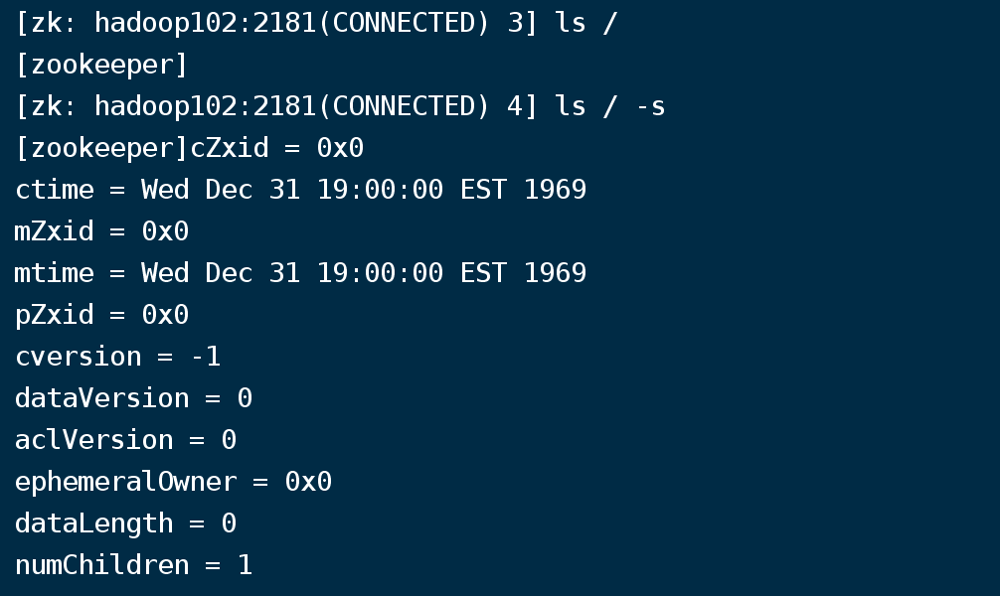
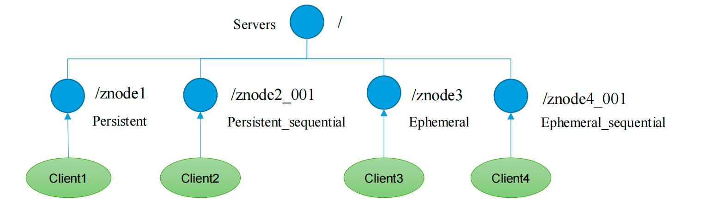
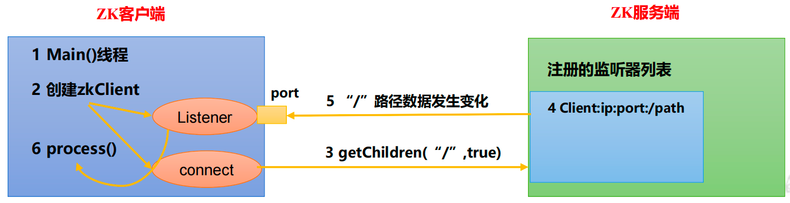
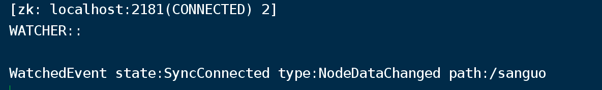
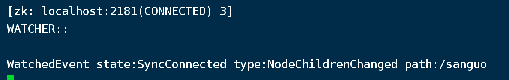

# 基础操作

## 远程连接

```
bin/zkCli.sh -server hadoop102:2181
```


## 显示所有操作

```
help
```


# 查看节点

## 查看当前znode中所包含的内容

```
ls /
```


## **查看当前节点详细数据**

```
ls / -s
```





ctime : znode被创建的毫秒数（时间戳

mzxid : znode最后更新的事物zxid

mtime：znode最后修改的毫秒数（时间戳

pZxid：znode最后更新的子节点

cversion：znode子节点变化号，znode子节点修改次数

dataversion：znode数据变化号

aclVersion：znode访问控制列表的变化号

ephemeralOwner：如果是临时节点，这个是znode拥有者的session id，如果不是临时节点则为0

dataLength：znode的数据长度

numChildren：znode子节点数量


# 节点类型

持久/短暂/有序号/无序号

持久（Persistent）：客户端和服务器端断开连接后，创建的节点不删除

短暂（Ephemeral）：客户端和服务器端断开连接后，创建的节点自己删除



（1）持久化目录节点

客户端与Zookeeper断开连接后，该节点依旧存在

（2）持久化顺序编号目录节点

客户端与Zookeeper断开连接后，该节点依旧存在，只是Zookeeper给该节点名称进行顺序编号

（3）临时目录节点

客户端与Zookeeper断开连接后，该节点被删除

（4）临时顺序编号目录节点

客户端与 Zookeeper 断开连接后 ， 该节点被删除 ， 只是Zookeeper给该节点名称进行顺序编号。


说明：创建znode时设置顺序标识，znode名称后会附加一个值，顺序号是一个单调递增的计数器，由父节点维护

注意：在分布式系统中，顺序号可以被用于为所有的事件进行全局排序，这样客户端可以通过顺序号推断事件的顺序


## 案例

创建持久节点（不带序号，只能存在一个）

```
create /sanguo "diaochan"
```

创建持久节点，双层路径

```
create /sanguo/shuguo 'liubei'
```

查看节点

```
ls /
```

查看持久节点，双层路径

```
ls  /sanguo
```

查看节点信息

```
get -s /sanguo
```

创建持久节点，带序号（可以再次创建，序号会网上递增）

```
create -s /sanguo/weiguo/zhangliao "zhangliao"
```

创建短暂节点

```
create -e /sanguo/wuguo "zhouyu"
```

创建短暂，带序号节点

```
create -e -s /sanguo/wuguo "zhouyu"
```

修改节点内容

```
set /sanguo/weiguo 'simayi'
```


# 监听器原理

## 监听原理详解

1.zk客户端首先要有一个main线程

2.main线程中创建zkClient，这时就会创建两个线程，一个负责网络连接通信 connect，一个负责监听listener

3.通过connect线程将组册的监听事件发送给zk

4.在zk的注册监听器列表中将注册的监听事件提那家到列表中

5.zk监听到有数据或路径变化，就会将这个消息发送给listener线程

6.listener线程内部调用了process()方法





## 常见的监听

1.监听节点数据的变化 get path [watch]

2.监听节点增删的变化 ls path [watch]


## 案例

### 节点值变化监听

在hadoop104中监控 sanguo

```
get -w /sanguo
```

此时内容为'diaochan'


在hadoop103中更改sanguo内容

```
set /sanguo 'xisi'
```

此时返回hadoop104 提示



在hadoop103再次更改

```
set /sanguo 'yangfeiyan'
```

返回hadoop104 无任何提示


**注意：在hadoop103再多次修改/sanguo的值，hadoop104上不会再收到监听。因为注册一次，只能监听一次。想再次监听，需要再次注册。**


### 节点的子节点变化监听

在hadoop104上 监听sanguo子节点

```
ls -w /sanguo
```

回到hadoop103增加子节点

```
create /sanguo/jin 'simayi'
```

回到hadoop104 发现提示



**注意：节点的路径变化，也是注册一次，生效一次。想多次生效，就需要多次注册。**


# 节点的删除与查看

删除单个节点

```
delete /sanguo/jin
```

删除节点和它的多个子节点

```
deleteall /sanguo
```

查看节点状态

```
stat /sanguo
```

