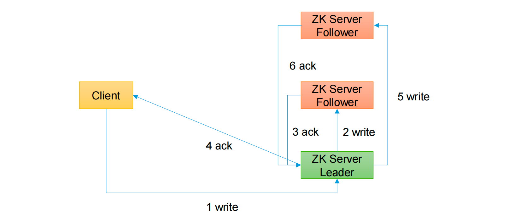
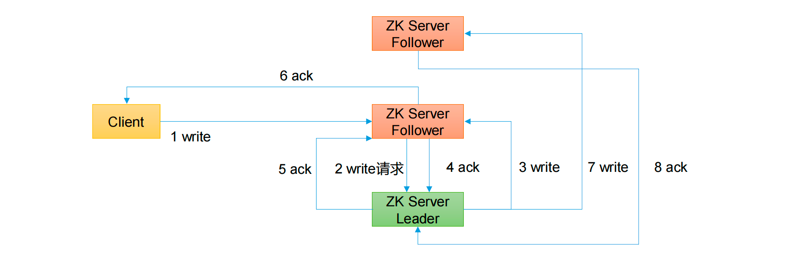

# 请求直接发送给Leader节点

**一句话总结：半数节点收到，客户端就可以润了**

1.Client写请求发送给Leader，写数据给Leader

2.Leader通知Follower，并写数据给Follower

3.Follower收完数据 发送ACK给leader，说明写完成

4.Leader发现超过半数节点都收到了数据，发送ACK给Client，说明写好了 （如果没超过半数继续写给其他Follower）

5.Leader给其他Follower写数据

6.其他服务器给ACK给Leader

# 请求直接发送给Follower节点

1.Client写请求发送给Follower

2.但是Follower没有写请求

3.Follow写请求转发给Leader

4.Leader写完毕，ACK给接受请求的Follower，并写一份数据给此Follower （如果没超过半数继续写给其他Follower）

5.超过半数集群写完，Leader给ACK接收Follower

6.接收FollowerACK给Client

7.Leader给其他Follower写数据

8.其他服务器给ACK给Leader

