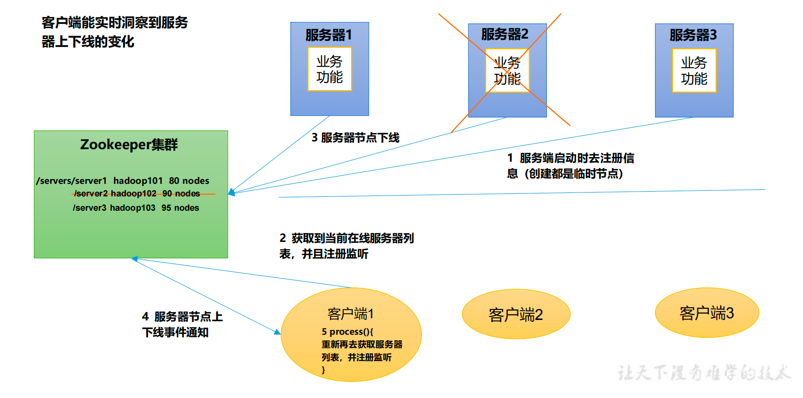
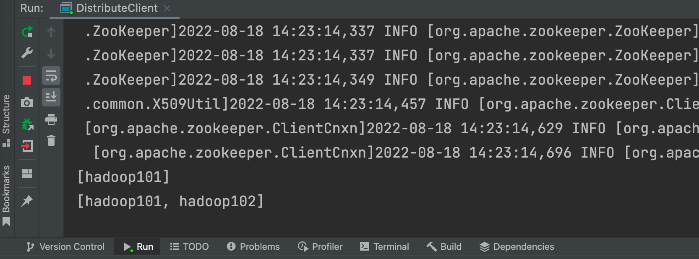
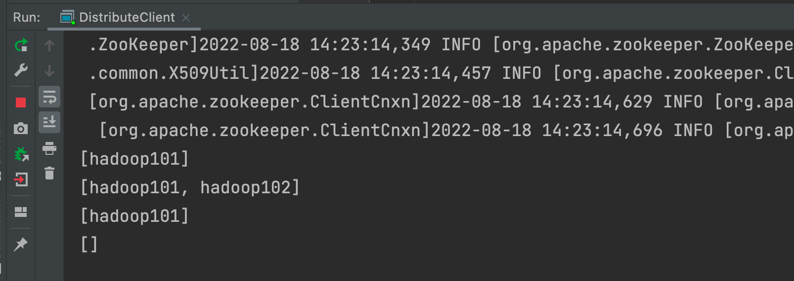
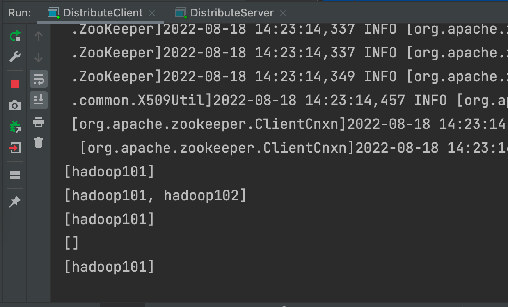
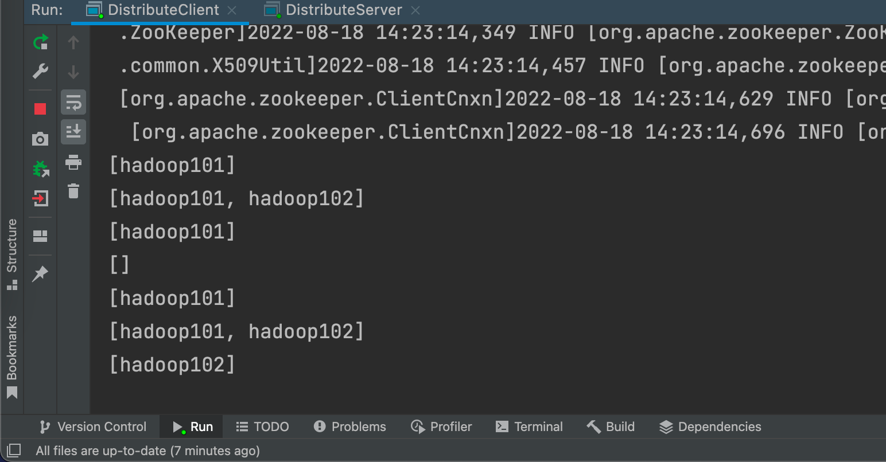

# 过程概览



1.如果服务器上线了会在Zookeeper集群里注册自己的信息

hadoop101：我已经链接了80个节点了

Hadoop102：我连接了90个节点了！

2.客户端获取当前在线的服务器列表，且注册监听

3.当服务器节点下线时，或者节点坏了

4.客户端能收到服务器节点上下线事件通知

5.客户端重新获取服务器列表，并注册监听


无论是服务器还是客户端（用户），本质上都是zookeeper服务器的客户端


# 具体实现

## 创建节点

```shell
ls /
create /servers 'servers'
```


## 写服务器代码

```Java
package com.atguigu.case1;

import org.apache.zookeeper.*;

import java.io.IOException;

import static java.lang.Thread.sleep;

public class DistributeServer {
    ZooKeeper zk;
    public static void main(String[] args) throws IOException, InterruptedException, KeeperException {

        DistributeServer server = new DistributeServer();
        // 1 获取zookeeper连接
        server.getConnect();

        // 2 注册服务器到zk集群
        server.regist(args[0]);

        // 3 启动业务逻辑 （睡觉）
        server.business();
    }

    private void business() throws InterruptedException {
        sleep(Long.MAX_VALUE);
    }

    private void regist(String hostname) throws InterruptedException, KeeperException {
        //createmode:临时且有序号
        zk.create("/servers/" +hostname , hostname.getBytes(), ZooDefs.Ids.OPEN_ACL_UNSAFE, CreateMode.EPHEMERAL_SEQUENTIAL);
        System.out.println(hostname + " is online!");
    }

    private void getConnect() throws IOException {
        String connectString = "hadoop102:2181,hadoop103:2181,hadoop104:2181";
        int sessionTime = 2000;
        zk = new ZooKeeper(connectString, sessionTime, new Watcher() {
            @Override
            public void process(WatchedEvent watchedEvent) {

            }
        });
    }
}

```


## 写客户端代码

```Java
package com.atguigu.case1;

import org.apache.zookeeper.KeeperException;
import org.apache.zookeeper.WatchedEvent;
import org.apache.zookeeper.Watcher;
import org.apache.zookeeper.ZooKeeper;

import java.io.IOException;
import java.util.ArrayList;
import java.util.List;

public class DistributeClient {
    String connectString = "hadoop102:2181,hadoop103:2181,hadoop104:2181";
    int sessionTimeout = 2000;
    ZooKeeper zk;
    public static void main(String[] args) throws IOException, InterruptedException, KeeperException {
        DistributeClient client = new DistributeClient();

        // 1 获取zk连接
        client.getConnect();

        // 2 监听 servers 下面子节点的增加和删除
        client.getServerList();

        // 3 业务逻辑（睡觉）
        client.business();
    }

    private void business() throws InterruptedException {
        Thread.sleep(Integer.MAX_VALUE);
    }

    private void getServerList() throws InterruptedException, KeeperException {
        List<String> children = zk.getChildren("/servers", true);

        ArrayList<String> servers = new ArrayList<>();
        for (String child : children){
            byte[] data = zk.getData("/servers/" + child, false, null);
            servers.add(new String(data));
        }
        System.out.println(servers);

    }

    private void getConnect() throws IOException {

         zk = new ZooKeeper(connectString, sessionTimeout, new Watcher() {
            @Override
            public void process(WatchedEvent watchedEvent) {
                try {
                    getServerList(); // 如果有服务端上下线，再次获取列表 并监听
                } catch (InterruptedException e) {
                    e.printStackTrace();
                } catch (KeeperException e) {
                    e.printStackTrace();
                }
            }
        });
    }
}
```


## 测试客户端代码

运行客户端代码，在zk客户端里测试，添加节点

```
create -e -s /servers/hadoop101 "hadoop101"
create -e -s /servers/hadoop102 "hadoop102"
```

发现 运行的客户端皆有输出




```
delete /servers/hadoop1020000000001
delete /servers/hadoop1010000000000
```




## 测试服务端代码

运行服务端代码，传入参数hadoop101 ，监控客户端信息



有注册信息，再次运行并传入参数hadoop102，下线Hadoop101


