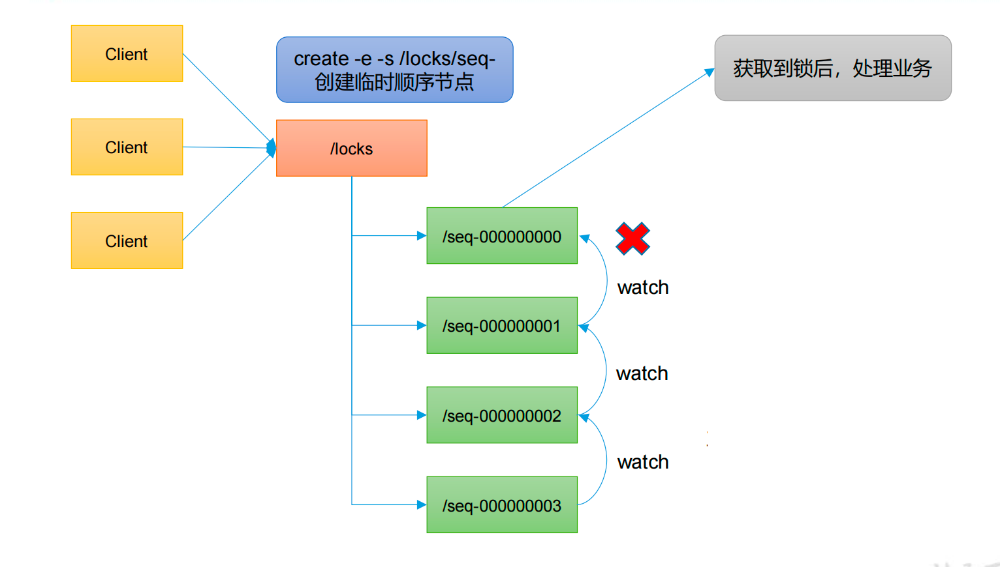

# 什么是分布式锁

比如说"进程 1"在使用该资源的时候，会先去获得锁，"进程 1"获得锁以后会对该资源保持独占，这样其他进程就无法访问该资源，"进程 1"用完该资源以后就将锁释放掉，让其他进程来获得锁，那么通过这个锁机制，我们就能保证了分布式系统中多个进程能够有序的访问该临界资源。

那么我们把这个分布式环境下的这个锁叫作分布式锁。


# 分布式锁案例分析



1.zk接到客户端请求后，在 locks节点下创建一个临时顺序节点

2.进入到顺序节点

判断自己是不是当前节点的下最小的节点：是，获取到锁；

不是，对前一个节点进行监听

3.一旦前一个节点释放

获取到锁，处理完业务后，delete节点释放掉锁，然后下面的节点将收到通知，重复第二步判断


# 代码

```Java
package com.atguigu.case2;

import org.apache.zookeeper.*;
import org.apache.zookeeper.data.Stat;

import java.io.IOException;
import java.util.Collections;
import java.util.List;
import java.util.concurrent.CountDownLatch;

public class DistributedLock {
    String connectString = "hadoop102:2181,hadoop103:2181,hadoop104:2181";
    int sessionTimeout = 2000;
    ZooKeeper zk;

    private CountDownLatch connectLatch = new CountDownLatch(1);
    private CountDownLatch waitLatch = new CountDownLatch(1);

    private String waitPath;
    private String currentNode = "";

    public DistributedLock() throws IOException, InterruptedException, KeeperException {
        // 获取连接
        zk = new ZooKeeper(connectString, sessionTimeout, new Watcher() {
            @Override
            public void process(WatchedEvent watchedEvent) {
                //监听到 前一个节点已经下线
                // connectLatch 如果连接上zk，可以释放
                if(watchedEvent.getState() == Event.KeeperState.SyncConnected){ //监听的状态 是连接
                    connectLatch.countDown(); //监听释放
                }

                //waitLatch 需要释放
                if(watchedEvent.getType()==Event.EventType.NodeDeleted && watchedEvent.getPath().equals(waitPath)){
                    waitLatch.countDown();
                }
            }
        });

        // 等待zk真正的连接上，代码健壮性
        connectLatch.await();

        // 判断根节点/locks是否存在
        Stat exists = zk.exists("/locks", false);
        if (exists == null) {
            zk.create("/locks", "locks".getBytes(), ZooDefs.Ids.OPEN_ACL_UNSAFE, CreateMode.PERSISTENT);
        }


    }

    //对zk加锁
    public void zklock() throws InterruptedException, KeeperException {
        //创建对应的临时 带序号 节点
        currentNode = zk.create("/locks/" + "seq-" , null, ZooDefs.Ids.OPEN_ACL_UNSAFE, CreateMode.EPHEMERAL_SEQUENTIAL);

        // 判断当前节点是否最小节点，如果是，获取到手，如果不是，监听前一个节点
        List<String> children = zk.getChildren("/locks", false);
        if (children.size()==1) {
            return;
        }else{
            Collections.sort(children);

            //获取节点名称
            String thisNode = currentNode.substring("/locks/".length());
            //通过 seq-00000000获取到该节点在children集合的位置
            int i = children.indexOf(thisNode);
            if (i == -1) {
                System.out.println("数据异常");
            }else if (i == 0){
                //就一个节点 可以获取锁了
                return;
            }else{
                //进行监听，前一个节点
                waitPath = "/locks/" + children.get(i - 1);
                zk.getData(waitPath, true, null);

                waitLatch.await(); //前一个节点已经下线

                return;

            }

        }

    }

    //解锁
    public void zkUnlock() throws InterruptedException, KeeperException {
        //删除节点
        zk.delete(currentNode, -1);

    }
}
```


# 测试代码

```Java
package com.atguigu.case2;

import org.apache.zookeeper.KeeperException;

import java.io.IOException;

public class DistributedLockTest {

    public static void main(String[] args) throws IOException, InterruptedException, KeeperException {
        final DistributedLock lock1 = new DistributedLock();
        final DistributedLock lock2 = new DistributedLock();

        new Thread(new Runnable() {
            @Override
            public void run() {
                try {
                    lock1.zklock();
                    System.out.println("线程1启动，获取到手");
                    Thread.sleep(5 * 1000);

                    lock1.zkUnlock();
                    System.out.println("线程1释放");

                } catch (InterruptedException e) {
                    e.printStackTrace();
                } catch (KeeperException e) {
                    e.printStackTrace();
                }
            }
        }).start();

        new Thread(new Runnable() {
            @Override
            public void run() {
                try {
                    lock2.zklock();
                    System.out.println("线程2启动，获取到手");
                    Thread.sleep(5 * 1000);

                    lock2.zkUnlock();
                    System.out.println("线程2释放");

                } catch (InterruptedException e) {
                    e.printStackTrace();
                } catch (KeeperException e) {
                    e.printStackTrace();
                }
            }
        }).start();
    }
}
```

# **Curator** 框架实现分布式锁

## 原生Java API问题

（1）会话连接是异步的，需要自己去处理。比如使用 CountDownLatch

（2）Watch 需要重复注册，不然就不能生效

（3）开发的复杂性还是比较高的

（4）不支持多节点删除和创建。需要自己去递归


**Curator** **是一个专门解决分布式锁的框架，解决了原生** **JavaAPI** **开发分布式遇到的问题。**

详情请查看官方文档：https://curator.apache.org/index.html


## 案例

1.添加依赖

```
<dependency>
    <groupId>org.apache.curator</groupId>
    <artifactId>curator-framework</artifactId>
    <version>4.3.0</version>
</dependency>
<dependency>
    <groupId>org.apache.curator</groupId>
    <artifactId>curator-recipes</artifactId>
    <version>4.3.0</version>
</dependency>
<dependency>
    <groupId>org.apache.curator</groupId>
    <artifactId>curator-client</artifactId>
    <version>4.3.0</version>
</dependency>
```


2.代码实现

```Java
package com.atguigu.case3;

import org.apache.curator.framework.CuratorFramework;
import org.apache.curator.framework.CuratorFrameworkFactory;
import org.apache.curator.framework.recipes.locks.InterProcessMutex;
import org.apache.curator.retry.ExponentialBackoffRetry;

public class CuratorLockTest {
    public static void main(String[] args) {
        //创建锁1
        InterProcessMutex lock1 = new InterProcessMutex(getCuratorFramework(), "/locks");

        //创建锁2
        InterProcessMutex lock2 = new InterProcessMutex(getCuratorFramework(), "/locks");

        new Thread(new Runnable() {
            @Override
            public void run() {


                try {
                    lock1.acquire();
                    System.out.println("线程1，获取到锁");

                    lock1.acquire();
                    System.out.println("线程1，再次获取到锁");

                    Thread.sleep(5*1000);

                    lock1.release();
                    System.out.println("线程1，释放锁");

                    lock1.release();
                    System.out.println("线程1，再次释放锁");

                } catch (Exception e) {
                    e.printStackTrace();
                }

            }
        }).start();

        new Thread(new Runnable() {
            @Override
            public void run() {


                try {
                    lock2.acquire();
                    System.out.println("线程2，获取到锁");

                    lock2.acquire();
                    System.out.println("线程2，再次获取到锁");

                    Thread.sleep(5*1000);

                    lock2.release();
                    System.out.println("线程2，释放锁");

                    lock2.release();
                    System.out.println("线程2，再次释放锁");

                } catch (Exception e) {
                    e.printStackTrace();
                }

            }
        }).start();
        
    }

    private static CuratorFramework getCuratorFramework() {
        ExponentialBackoffRetry policy = new ExponentialBackoffRetry(3000, 3);

        CuratorFramework client = CuratorFrameworkFactory.builder().connectString("hadoop102:2181,hadoop103:2181,hadoop104:2181")
                .connectionTimeoutMs(2000)
                .sessionTimeoutMs(2000)
                .retryPolicy(policy).build();//连接失败后 间隔多久进行重试

        client.start();

        System.out.println("zookeeper 启动成功");

        return client;
    }
}
```