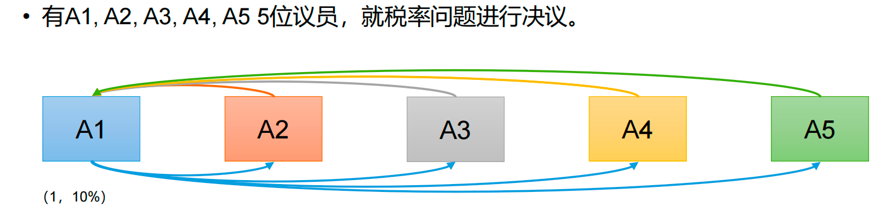
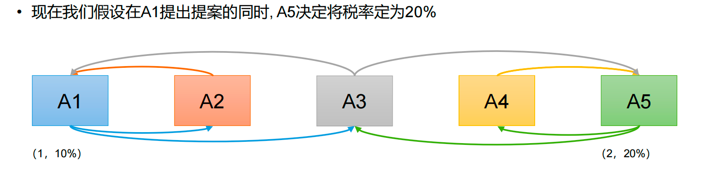
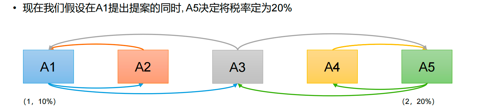

# 算法基础

Zookeeper是如何保证数据一致性的？

## 拜占庭将军问题

​		拜占庭将军问题是一个协议问题，拜占庭帝国军队的将军们必须全体一致的决定是否攻击某一支敌军。问题是这些将军在地理上是分隔开来的，并且将军中存在叛徒。叛徒可以任意行动以达到以下目标：**欺骗某些将军采取进攻行动**；**促成一个不是所有将军都同意的决定，如当将军们不希望进攻时促成进攻行动**；**或者迷惑某些将军，使他们无法做出决定**。如果叛徒达到了这些目的之一，则任何攻击行动的结果都是注定要失败的，只有完全达成一致的努力才能获得胜利。

# Paxos算法

## 简介

一种基于消息传递 且具有高度容错性的 一致性算法

解决了什么问题：

就是如何快速正确的 在一个分布式系统中对某个数据值达成一致，并且保证不论发生任何异常。都不会破坏整个系统的一致性。

哪些异常？

1.机器宕机

2.网络异常（延迟、重复、缺失）

## 算法描述

在一个Paxos系统中，首先将所有节点划分为Proposer（提议者），Acceptor（接受者），和Learner（学习者）

每个节点可以身兼数职

| 角色     | 作用               |
| -------- | ------------------ |
| Proposer | 提出一个议题       |
| Acceptor | 对一个议题进行投票 |
| Learner  | 执行对应命令       |

## 完整Paxos算法阶段

**Prepare阶段**

1.1 Proposer向多个Acceptor发出Propose请求Promise（承诺）

1.2 Acceptor针对Propose请求进行Promise

**Accept接受阶段**

2.1 Proposer收到多数Acceptor承诺的Promise后，向Acceptor发出Propose请求

2.2 Acceptor针对收到的Propose请求进行Accept处理

**Learn学习阶段**

3.1 proposer将决议发送给所有Learner

Prepare：Proposer生成全局唯一且递增的Proposal ID，向所有Acceptor发送Propose请求，这里无需携带提案内容，只携带Proposal ID即可

Promise：Acceptor接收到Propose请求后，做出2个承诺 1个应答：

不再接受Proposal ID小于等于 当前请求的Propose请求

不再接受Proposal ID小于 当前请求的Accept请求

不违背 以前做出的承诺下，回复已经Accept过的提案中Proposal ID最大的那个提案Value和Proposal ID，没有则返回空置

Propose：proposer收到多数Accetor的Promise应答后，从应答中选择Proposal ID最大的提案Value，作为本次要发起的提案，如果所有提案Value均为空值，则可以自己随意决定提案Value。然后携带当前Proposal ID，向所有Acceptor发送Propose请求

Accept：Acceptor收到Propose请求后，在不违背自己做出的承诺下，接受并持久化当前Proposal ID 和 提案Value

Learn：Proposer收到多数Acceptor的Accpet后，决议形成，将形成的决议发送给所有Learner

## 算法案例

### 案例1

• A1发起1号Proposal的Propose，等待Promise承诺； 

• A2-A5回应Promise； 

• A1在收到两份回复时就会发起税率10%的Proposal； 

• A2-A5回应Accept； 

• 通过Proposal，税率10%。 

### 案例2

A1，A5同时发起Propose（序号分别为1，2） 

• A2承诺A1，A4承诺A5，A3行为成为关键

• 情况1：A3先收到A1消息，承诺A1。 

• A1发起Proposal（1，10%），A2，A3接受。

• 之后A3又收到A5消息，回复A1：（1，10%），并承诺A5。（因为A5序号大） 

• A5发起Proposal（2，20%），A3，A4接受。之后A1，A5同时广播决议。

### 案例3

• A1，A5同时发起Propose（序号分别为1，2） 

• A2承诺A1，A4承诺A5，A3行为成为关键

• 情况2：A3先收到A1消息，承诺A1。之后立刻收到A5消息，承诺A5。 

• A1发起Proposal（1，10%），无足够响应，A1重新Propose （序号3），A3再次承诺A1。 

• A5发起Proposal（2，20%），无足够相应。A5重新Propose （序号4），A3再次承诺A5。 

• ……

​		造成这种情况的原因是系统中有一个以上的 Proposer，多个 Proposers 相互争夺 Acceptor，

造成迟迟无法达成一致的情况。针对这种情况，一种改进的 Paxos 算法被提出：从系统中选

出一个节点作为 Leader，**只有 Leader 能够发起提案**。这样，一次 Paxos 流程中只有一个

Proposer，不会出现活锁的情况，此时只会出现例子中第一种情况。

# ZAB算法

​		Zab 借鉴了 Paxos 算法，是特别为 Zookeeper 设计的支持崩溃恢复的原子广播协议。基于该协议，Zookeeper 设计为只有一台客户端（Leader）负责处理外部的写事务请求，然后Leader 客户端将数据同步到其他 Follower 节点。即 Zookeeper 只有一个 Leader 可以发起提案。

1.客户端发起了一个写操作

2.Leader服务器将客户端请求转换为事务Proposal提案，同时为每一个Proposal分配一个全局id，既zxid

3.Leader服务器为每个Follower服务器分配一个单独的队列，然后将需要广播的Proposal依次放到队列中去，并且根据FIFO策略进行消息发送

4.Follower接收到Proposal后，会首先将其以事务日志的方式写入本地磁盘中，写入成功后向Leader反馈一个ACK响应消息。

5.Leader接收到超过半数以上的Follower的ACK响应消息后，即认为消息发送成功，可以发送commit消息

6.Leader向所有Follower广播commit消息，同事自身也会完成事务提交，Follower接收到commit消息后，会将上一条事务提交